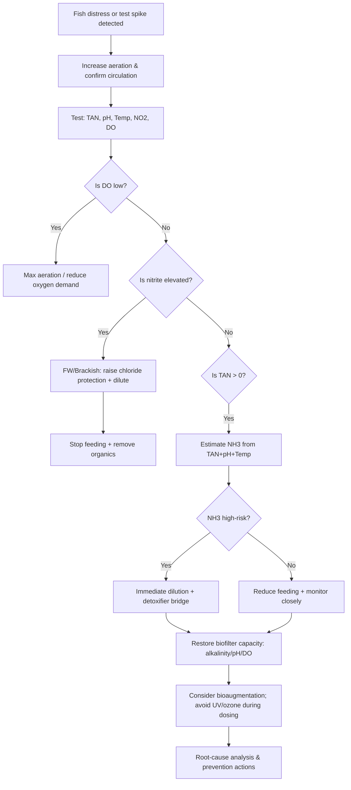
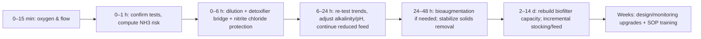

# Ammonia and Nitrite Emergency Runbook for Aquariums and Aquaculture Systems

## Executive Summary

Acute ammonia and nitrite spikes are **oxygen emergencies first, chemistry emergencies second**: fish and invertebrates often die from hypoxia (directly or functionally), while the biofilter simultaneously loses capacity as dissolved oxygen (DO), alkalinity, and stable flow are compromised. citeturn17view0turn20view0turn29view0

Ammonia risk is driven by **unionized ammonia (NH3)**, not “total ammonia” alone. Total ammonia nitrogen (TAN) is the combined NH3 + NH4+ pool; the **fraction as NH3 increases sharply with higher pH and temperature** and decreases slightly with salinity. NH3 is ~100× more toxic than NH4+. citeturn27view1turn26view3

Nitrite risk is driven by **methemoglobinemia (“brown blood disease”)**: nitrite enters via the gills and converts hemoglobin to methemoglobin, so fish can **gasp and suffocate even when measured DO is adequate**. Chloride (Cl⁻) competitively blocks nitrite uptake; emergency mitigation is therefore often **chloride dosing (salt) + dilution + restoring nitrification**. citeturn29view0turn11view0turn10view0

The quickest, broadly applicable stabilizers in the first 0–6 hours are:
1) **Maximize oxygenation and circulation**, 2) **stop feed and remove organics**, 3) **confirm the test result and calculate NH3 from TAN**, 4) **dilute (water change / exchange) and/or bind (detoxifier) ammonia**, 5) for nitrite **raise chloride-to-nitrite protection** (freshwater/brackish), and 6) **protect/restore biofilter capacity** (alkalinity, DO, inoculation, avoid microbicides). citeturn27view1turn17view0turn8view2turn29view0turn10view0

Species sensitivity varies widely; where numeric “limits” differ by species/life stage, this runbook marks them as **species-dependent** and uses conservative, widely cited triggers (e.g., NH3 ≥0.05 mg/L is tissue-damaging; nitrite toxicity can occur at ~0.10 mg/L; chloride protection ratios are commonly 6:1 to 10:1 Cl⁻:NO2⁻, with higher “insurance” chloride in some pond industries). citeturn27view1turn10view0turn29view0

## Rapid triage and diagnostics

### What to measure immediately

Measure these **in the same time window** (minutes, not hours), because the risk calculations depend on concurrent values:

- **Temperature (°C/°F)**
- **pH**
- **Dissolved oxygen (DO, mg/L)**
- **TAN (total ammonia, mg/L or ppm; ensure you know what your kit reports)**
- **Nitrite** (confirm whether reported as NO2⁻ or as NO2–N)
- **Alkalinity** (mg/L as CaCO3) if the system is recirculating or heavily buffered; in RAS, falling alkalinity is a common precursor to nitrification failure. citeturn27view1turn17view0turn20view0

In freshwater aquaponics guidance, **5 ppm (mg/L) DO or higher** is a common operational target, and low DO can halt nitrification, allowing ammonia to rise. citeturn20view0

### Units and “what your test kit actually means”

**ppm ≈ mg/L** for dilute aquarium/aquaculture waters (typical test-kit reporting). citeturn27view1turn22search27

**Ammonia**
- **TAN** = NH3 + NH4+ (often what aquarium kits measure). citeturn27view1turn20view0  
- Toxicity is dominated by **NH3**, whose fraction depends on pH and temperature (and to a lesser extent salinity). citeturn27view1turn26view3  
- Conversion for laboratory-style reporting:
  - If you have **NH3–N (mg/L as N)** and need **NH3 (mg/L)**: multiply by **17/14**. citeturn15search0turn26view3  
- Action-relevant trigger from aquaculture extension: **NH3 (UIA) > 0.05 mg/L** can cause tissue damage; around **2.0 mg/L** sensitive fish typically die (species-dependent). citeturn27view1

**Nitrite**
- Nitrite may be reported as:
  - **NO2⁻ (nitrite ion, mg/L)**, or
  - **NO2–N (nitrite as nitrogen, mg/L as N)** (common in water/wastewater labs).  
- Conversion:
  - **NO2⁻ (mg/L) = NO2–N (mg/L) × 3.29**. citeturn1search21

### Test-kit interpretation pitfalls (high-impact in emergencies)

**Ammonia test chemistry matters.** Two common methods are **Nessler** and **salicylate**. citeturn27view1  
Key failure modes:

- **Nessler method false highs** if formalin/formalin-containing products were used recently (24–72 h), and false highs with many ammonia-binding conditioners; it can also give false reactions in seawater. citeturn27view1  
- Nessler reagents can contain **mercury**, which may require hazardous disposal depending on jurisdiction. citeturn27view1  
- Some conditioners intentionally “bind” ammonia; this can make TAN still test positive even if toxicity is reduced—do not mistake this for “no improvement.” citeturn8view2turn27view1  
- Example manufacturer guidance: entity["company","Seachem Laboratories","aquarium products | GA, US"] notes that Nessler-based kits will not read properly when using their binder-type conditioner and that dosing can be repeated every 24–48 h with binding up to ~48 h. citeturn8view1turn8view2turn2view4

### Quick diagnostic differentiation: “gasping” is not enough

- **Nitrite poisoning**: fish may gasp even with adequate DO because oxygen transport is impaired (methemoglobin). citeturn29view0  
- **Ammonia intoxication**: early signs can include accelerated respiration and surface-seeking; severe cases progress to loss of balance and spasms (species-dependent). citeturn21search34turn27view1  
Because symptoms overlap, base decisions primarily on **measured TAN→NH3 and nitrite**, not behavior alone. citeturn27view1turn29view0

image_group{"layout":"carousel","aspect_ratio":"16:9","query":["nitrogen cycle diagram ammonia nitrite nitrate fish pond","brown blood disease nitrite fish hemoglobin diagram","unionized ammonia NH3 fraction pH temperature chart"],"num_per_query":1}

## Immediate response window

### Prioritized actions for the first 0–6 hours

These steps are ordered for maximum survival impact across **aquariums, RAS tanks, and intensive culture systems**.

**Restore oxygenation and flow (do this first)**
- Increase aeration/surface agitation; ensure pumps, air stones, blowers, diffusers, and venturis are functioning. Nitrification is aerobic; low DO both stresses animals and reduces biofilter conversion. citeturn27view0turn20view0turn17view0  
- If using chemical treatments (e.g., formalin), note that they can contribute to low DO in recirculating systems. citeturn17view0  

**Stop adding new nitrogen**
- Stop feeding immediately (or sharply reduce) until TAN/nitrite are stabilized; high feeding/organic load is a common driver of spikes. citeturn27view1turn29view0turn17view0  
- Remove dead fish, uneaten feed, and decaying biomass (plants, biofouling, mortalities) to reduce ongoing ammonia generation. citeturn29view0turn27view1  

**Confirm the reading (fast sanity check)**
- Re-test with correct method and fresh reagents; if using a conditioner/binder, assume possible TAN test interference (especially Nessler). citeturn27view1turn8view1turn8view2  
- For ammonia, immediately calculate or estimate **NH3** from TAN using pH and temperature (tables or calculator). This determines urgency and whether pH management matters. citeturn27view1turn26view3turn20view0  

**Dilute ammonia/nitrite (water change / exchange)**
- If your source water is free of ammonia/nitrite, water changes are one of the fastest real removals in small systems; extension guidance notes water changes can help in small systems. citeturn27view1  
- Use the dilution math in the “Dosing and worked examples” section to choose an evidence-based percentage rather than guessing.

**Bind/detoxify (short-term “bridge” measure)**
- Use a reputable ammonia/nitrite detoxifier to reduce acute toxicity while you correct the cause. Example label guidance: Seachem’s conditioner binds and can be re-dosed every 24–48 h, with up to 5× dosing for high ammonia/nitrite. citeturn8view1turn8view2  
- If using “binder” products, remember: they generally **do not remove** nitrogen; they buy time for the biofilter and dilution to work. citeturn8view2turn7view1turn28view0  

**If nitrite is elevated: dose chloride (freshwater/brackish)**
- Chloride competes with nitrite at the gills; multiple authoritative aquaculture references recommend chloride:nitrite protection ratios:
  - **3–6× chloride over nitrite** (as ions) as a treatment range in a veterinary extension context, and  
  - **≥10:1 chloride:nitrite** as an effective preventive ratio in catfish pond management, with some operations holding high chloride as “insurance.” citeturn11view0turn29view0turn10view0  
- For marine systems: nitrite toxicity is often less problematic because chloride is intrinsically high; treat the spike as a **biofilter failure indicator** rather than relying on “nitrite is harmless,” and prioritize water exchange and biofilter restoration. citeturn11view0turn29view0  

**Escalation option: supportive bath for severe nitrite stress**
- Some labels market methylene blue as a bath/support for nitrite-related intoxication and ammonia stress, but it is a **dye with compatibility constraints**; use only with strong justification and correct dosing. citeturn26view4turn7view0  

## Stabilization window

### Prioritized actions for 6–48 hours

**Maintain “life support” while the biofilter catches up**
- Keep aeration elevated and avoid any intentional oxygen-demand increases (e.g., overfeeding, heavy organic additions) until TAN and nitrite trend down. citeturn20view0turn27view0turn17view0  
- Re-dose detoxifier on its supported interval if ammonia/nitrite remain present (example label: every 24–48 h; binding up to ~48 h). citeturn8view2turn7view0  

**Restore biofilter chemistry: alkalinity and pH**
- In RAS, nitrification produces acid (H+) and consumes buffering; as alkalinity drops, ammonia/nitrite spikes become more likely because biofilter bacteria require bicarbonate/alkalinity. citeturn17view0turn27view0  
- A commonly cited working range for biofilter function in RAS guidance is:
  - pH ~ **7.2–8.2** (7–9 sometimes acceptable), and  
  - alkalinity **~100–180 mg/L as CaCO3** for good biofiltration. citeturn17view0  
- If alkalinity is low, add sodium bicarbonate in calculated doses (see examples) rather than “dumping”; rapid alkalinity jumps can stress sensitive species even if the biofilter benefits (species-dependent). citeturn17view0turn22search0  

**Re-seed nitrification if cycling capacity is compromised**
- New or disrupted biofilters can take **weeks** to mature in sufficient numbers; RAS guidance notes **3–8 weeks** depending on temperature and conditions. citeturn17view0turn27view1  
- Bioaugmentation options:
  - Seed with media from a healthy system (biosecurity permitting) or use commercial nitrifying bacterial products; RAS guidance explicitly lists both approaches. citeturn17view0  
- If dosing live bacteria, temporarily disable UV/ozone that can kill bacteria (example: stability-type bacterial additive guidance). citeturn24search6turn18search0  

**Mechanical solids control**
- Inefficient removal of solids (feces, uneaten feed, dead fish) contributes to protein breakdown to ammonia and can overwhelm the biofilter; improving solids capture is a medium-term stabilizer. citeturn17view0turn29view0  

## Recovery and recurrence prevention

### Remediation over 48 hours to weeks

**Root-cause analysis checklist (what failed)**
Most ammonia/nitrite emergencies cluster into a few failure modes:

- **Biofilter not fully established (“new system syndrome”)** or temperature too low for rapid nitrifier growth. citeturn17view0turn27view1  
- **Fish load/feed rate exceeded biofilter capacity**, especially after a stocking increase or feeding change. citeturn17view0turn29view0  
- **Alkalinity/pH drifted downward** in low-exchange systems, impairing nitrifiers and collapsing buffering, triggering spikes. citeturn17view0  
- **Filtration malfunction** (pump failure, clogged media, bypassed biofilter, poor aeration). citeturn29view0turn17view0  
- **Chemical/medication impacts**: some treatments can increase oxygen demand or disrupt filtration; dyes may also conflict with ammonia detox products. citeturn17view0turn7view0  

**Design and management changes that reduce recurrence**
- Build systems so units can be isolated: RAS guidance recommends designing so each tank/vat can be taken offline and run independently, enabling treatment without system-wide biofilter disruption. citeturn17view1  
- Implement a routine alkalinity/pH program: RAS guidance suggests alkalinity/pH measurement from weekly to monthly depending on density, plus partial water changes and/or sodium bicarbonate additions to prevent drift. citeturn17view0  
- In freshwater pond contexts with nitrite risk, chloride “insurance” is sometimes maintained at high baseline levels (species and operation dependent); management guidance notes both 10:1 ratios and “insurance” chloride practices. citeturn29view0turn10view0  
- Monitor nitrite seasonally or at higher frequency when risk is known (e.g., temperature swings); pond guidance recommends increased testing frequency during high-risk periods and daily checks during an incident. citeturn29view0  

## Treatment dosing and worked examples

### Core dilution math for water changes (applies to TAN, nitrite, nitrate)

Assuming replacement water has ~0 of the contaminant, after a single water change fraction **w** (e.g., 0.50 for 50%):
- **New concentration = Old × (1 − w)**

To hit a target concentration:
- **w = 1 − (Target / Current)**

This is basic mass balance; apply to TAN or nitrite once you have confirmed units (mg/L vs “as N”). citeturn27view1turn1search21  

**Worked example (dilution to reduce TAN or nitrite)**
- Current nitrite = 4 mg/L, target = 1 mg/L  
- Required change fraction: w = 1 − (1/4) = 0.75 → **75% water change**

Volumes:
- 10 L system → replace **7.5 L**
- 50 L system → replace **37.5 L**
- 500 L system → replace **375 L**

### Ammonia: converting TAN to toxic NH3 (NH3 fraction)

Use a table/calculator based on pH and temperature to estimate NH3 fraction (many extension guides adapt Emerson-style data). citeturn27view1turn20view0turn26view3

**Worked example (using percent NH3 concept)**
If TAN = 2.0 mg/L and the NH3 fraction is 10% (0.10) at your pH/temp, then:
- NH3 ≈ 2.0 × 0.10 = **0.20 mg/L NH3** (high-risk; above the 0.05 mg/L tissue damage trigger). citeturn27view1turn20view0

### Chloride (salt) dosing for nitrite emergencies

**Concept**
Maintain a protective chloride:nitrite ratio. Published recommendations vary by species and scenario, with commonly cited ranges:
- ~3–6× chloride over nitrite (as ions) in a veterinary extension context, and
- ≥10:1 chloride:nitrite in catfish pond guidance (plus high chloride as “insurance”). citeturn11view0turn29view0turn10view0  

**Unit harmonization**
If your kit reports **NO2–N**, convert to **NO2⁻** first (×3.29). citeturn1search21

**How much NaCl to add (closed tank math)**
1) Decide target chloride level:
- **Target Cl⁻ (mg/L) = Ratio × NO2⁻ (mg/L)**  
2) Determine additional chloride needed:
- **ΔCl⁻ = Target Cl⁻ − Current Cl⁻** (if negative, add none)
3) Convert chloride mass to NaCl mass:
- Chloride is ~60.7% of NaCl by weight, so  
  **NaCl mg/L ≈ ΔCl⁻ / 0.607**  

(For ponds, published formulas are often expressed directly in ppm chloride and pounds salt per acre-foot; those are pond-volume specific. citeturn29view0turn10view0)

**Worked example (freshwater tank)**
- Nitrite (NO2⁻) = 2.0 mg/L  
- Current chloride assumed low (≈0 mg/L for calculation)  
- Choose ratio 10:1 → Target Cl⁻ = 20 mg/L  
- ΔCl⁻ = 20 mg/L  
- NaCl mg/L ≈ 20 / 0.607 ≈ 33 mg/L NaCl

Mass to add:
- 10 L → 33 mg/L × 10 L = **0.33 g NaCl**
- 50 L → **1.65 g NaCl**
- 500 L → **16.5 g NaCl**

**Compatibility cautions**
- Some fish (and some freshwater groups) tolerate salt poorly; do a small-scale bioassay if uncertain, and avoid chloride-based “fixes” for systems dominated by salt-intolerant organisms (species unspecified). citeturn10view0  
- Marine systems already contain very high chloride; do not add salt as a nitrite “treatment” unless you have a specific brackish/marine protocol. Use water exchange and filtration correction instead. citeturn29view0turn10view0  

### Ammonia detoxifiers / conditioners: dosing math and cautions

The most defensible approach is:
- Dose strictly by label,  
- Treat binders as time-buyers (not removers), and  
- Account for test-kit interference. citeturn8view2turn7view0turn27view1  

**Worked dosing examples (by label rate)**

**Seachem-type binder conditioner (example: 5 mL per 200 L)**
- Standard dose = 5 mL / 200 L = 0.025 mL/L  
- Volumes:
  - 10 L → **0.25 mL**
  - 50 L → **1.25 mL**
  - 500 L → **12.5 mL**
- Label guidance includes: emergency up to 5× dosing for high ammonia/nitrite and re-dosing every 24–48 h with binding up to ~48 h. citeturn8view1turn8view2  

**Kordon-type ammonia remover (standard dose 5 mL per 10 gal ≈ 37.8 L)**
- Standard dose ≈ 0.132 mL/L  
- Volumes:
  - 10 L → **1.32 mL**
  - 50 L → **6.6 mL**
  - 500 L → **66 mL**
- Label guidance: a standard dose detoxifies ~1.0 mg/L ammonia (multiple doses for more). citeturn7view1  

**AmQuel Plus–type broad nitrogen detoxifier (standard dose 5 mL per 10 gal)**
- Same base volumetric dose ≈ 0.132 mL/L  
- Volumes (same as above): 10 L 1.32 mL; 50 L 6.6 mL; 500 L 66 mL  
- Compatibility constraints: do not combine with active therapeutic dyes such as methylene blue or malachite green (it can interfere with performance); also note Nessler test incompatibility and potential false oxygen readings with Winkler reagents per label. citeturn7view0  

**Ammo-Lock–type product**
- Example retailer-posted directions: 5 mL per 38 L, repeat every 2 days until ammonia not detected; after 7 days, partial water change + service biofilter + reduce feeding. citeturn28view0  

### Biofilter support dosing: alkalinity restoration (sodium bicarbonate)

In recirculating systems, alkalinity can fall as nitrification proceeds, and low alkalinity can contribute to ammonia/nitrite spikes because biofilter bacteria require bicarbonate/alkalinity. citeturn17view0

A commonly cited conversion for restoring alkalinity:
- **~1.68 mg/L sodium bicarbonate (NaHCO3) raises alkalinity by ~1 mg/L as CaCO3**. citeturn22search0

**Worked example**
Goal: raise alkalinity by **+50 mg/L as CaCO3**

Required NaHCO3:
- 50 mg/L × 1.68 = **84 mg/L NaHCO3**

Mass to add:
- 10 L → 0.084 g/L × 10 L = **0.84 g NaHCO3**
- 50 L → **4.2 g NaHCO3**
- 500 L → **42 g NaHCO3**

Operational note: RAS guidance suggests maintaining alkalinity in a range like 100–180 mg/L (as CaCO3) and pH around 7.2–8.2 for robust biofiltration; adjust slowly for sensitive livestock. citeturn17view0  

## Product comparison tables and operational pros/cons

### Detoxifier / emergency conditioner comparison

| Category | Example product type | Best use case | Pros | Key cons / failure modes | Label-linked notes |
|---|---|---|---|---|---|
| Ammonia/nitrite binder conditioner | “Binder” conditioners (e.g., Seachem-type) | First 0–48 h bridge while you dilute and restore nitrification | Can bind/detoxify; re-dose cadence described; does not acidify | Can confuse TAN test results (esp. Nessler); does not remove nitrogen | Re-dose 24–48 h; binding up to ~48 h; emergency up to 5× for high ammonia/nitrite; Nessler incompatibility cautioned citeturn8view1turn8view2turn2view4 |
| Ammonia detoxifier (lab-described capacity) | AmQuel-type | TAN spike where you need a quantifiable “per-dose” ammonia detox capacity | Standard dose described to detoxify ~1 mg/L ammonia; works in fresh/salt | pH affects reaction speed; still need root-cause fix | Standard dose 5 mL/10 gal; multiple doses for >1 mg/L ammonia citeturn7view1 |
| Broad nitrogen detoxifier with dye incompatibilities | AmQuel Plus–type | Systems with mixed nitrogen compounds where label permits | Label indicates detox of multiple nitrogen compounds; test-kit guidance included | Contraindicated with active dye medications; Nessler and Winkler incompatibilities | Standard dose 5 mL/10 gal; avoid combining with methylene blue and other dyes citeturn7view0 |
| Ammonia “lock” products | Ammo-Lock–type | Small systems with measurable ammonia while cycling stabilizes | Simple dosing; marketed as converting ammonia to non-toxic form until biofilter processes it | Still requires water changes/biofilter service if persistent | 5 mL/38 L; repeat every 2 days; escalate to water change + biofilter service if unresolved citeturn28view0 |

### Bacterial inoculants / bioaugmentation comparison

| Category | Example product | Water type | Typical dosing signal | High-value notes for emergencies |
|---|---|---:|---|---|
| Concentrated nitrifiers (freshwater) | Fritz TurboStart 700 | Freshwater | ~29 mL per ~151 L (label), up to 5×; keep refrigerated; remove chlorine/chloramine; UV off for days citeturn7view3turn26view5 | Good when you suspect nitrifier collapse or new biofilter; requires dechlorinated water and temporary UV shutdown citeturn7view3turn26view5 |
| Live nitrifiers (freshwater) | FritzZyme 7 | Freshwater | New systems: high dose; established systems: lower dose (label) citeturn7view4turn26view6 | Useful for “fortification” after cleaning/medicating or filter changes (label positioning) citeturn7view4 |
| Live nitrifiers | Dr. Tim’s One & Only | Freshwater or marine variants | Minimum dose 10 mL per 10 gal (label guidance) citeturn6search3 | Use when cycling time or nitrifier density is limiting; still manage TAN feed-in carefully |
| Mixed bacterial additive | Seachem Stability | Fresh + marine | Day 1: 5 mL/40 L; then 5 mL/80 L daily × 7 days; UV/ozone off during cycling citeturn18search0turn24search6 | Best when biofilter needs re-stabilization; requires disabling UV/ozone to avoid killing bacteria citeturn24search6 |

## Field tools: checklists and decision flowcharts

### Quick checklists for field use

**Two-minute triage (do immediately)**
- Verify water movement, aeration, DO trend. citeturn20view0turn17view0  
- Stop feeding; remove dead/decaying biomass. citeturn27view1turn29view0  
- Measure TAN + pH + temperature; compute NH3 risk. citeturn27view1turn26view3  
- Measure nitrite; if elevated, plan chloride protection (FW/brackish). citeturn29view0turn10view0  

**0–6 hours action checklist**
- Increase aeration and stabilize flow. citeturn27view0turn20view0  
- Dilute via calculated water change/exchange. citeturn27view1turn29view0  
- Dose detoxifier/binder by label to bridge toxicity. citeturn8view2turn28view0turn7view1  
- If nitrite: add chloride to meet protective ratio, unless salt-intolerant system. citeturn29view0turn10view0turn11view0  

**6–48 hours stabilization checklist**
- Re-dose binder per label interval if still elevated. citeturn8view2  
- Restore alkalinity/pH for nitrification; dose NaHCO3 in calculated increments if needed. citeturn17view0turn22search0  
- Add nitrifier inoculant if cycling capacity is limiting; disable UV/ozone during bacterial dosing windows. citeturn17view0turn24search6turn7view3  

### Mermaid decision tree

### Mermaid timeline (operations cadence)

