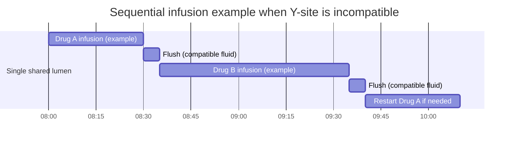

# Antibiotic Compatibility and Contraindications Matrix for Adult Systemic Therapy

## Executive summary

“Antibiotic compatibility” in practice spans three distinct risk domains that are often conflated: (a) **systemic drug–drug interactions** that change exposure or add toxicity (pharmacokinetic/pharmacodynamic), (b) **IV co-administration incompatibility** (physical precipitation or chemical degradation when drugs contact each other in a bag/syringe/Y-site/line), and (c) **intentional combination therapy** (synergy) that may be desirable clinically but still requires line-management and toxicity monitoring. Because IV compatibility is highly dependent on **concentration, diluent, temperature, and contact time**, compatibility findings can vary across studies and references; the safest operational assumption is to **avoid contact unless compatibility for the exact conditions is verified**. citeturn6search5turn7search2turn6search15

Across commonly used adult systemic antibiotics, the **highest-impact, evidence-supported “do-not-mix / do-not-co-infuse” scenarios** are:  
• **Aminoglycosides + many beta-lactams** in the same solution/line segment (chemical inactivation); explicitly flagged across multiple labels, with particular clinical relevance in severe renal impairment and in drug-level sampling artifacts. citeturn13search3turn7search0turn7search36  
• **Vancomycin + beta-lactams** (precipitation/physical incompatibility risk; risk increases with higher vancomycin concentration); labeling generally recommends separating/flush between administrations. citeturn7search2turn6search11  
• **Ceftriaxone + IV calcium-containing solutions**: contraindicated in neonates receiving IV calcium; for non-neonates, sequential administration may be allowed with thorough line flushing (per labeling). citeturn9search4turn9search12turn9search0  
• **Daptomycin + dextrose-containing diluents** (incompatible per labeling). citeturn9search3  

For **systemic co-prescribing**, the most clinically consequential antibiotic–antibiotic interactions are concentrated in a few patterns:  
• **Rifampin (and some rifamycin regimens)** lowering exposures of key companion antibiotics (notably **linezolid, moxifloxacin, doxycycline, TMP-SMX**, and **clarithromycin**), creating risk for under-treatment when those agents are backbone therapy. citeturn4search7turn4search8turn2search2turn17search1turn4search2  
• **Additive nephrotoxicity** with combined nephrotoxic antibiotics—especially **vancomycin + piperacillin/tazobactam** (consistently associated with higher AKI risk in meta-analyses) and **vancomycin + aminoglycosides** (toxicity concerns emphasized in endocarditis guidance). citeturn1search18turn1search22turn15view0  
• **Additive QT-prolongation risk** when **macrolides** and **fluoroquinolones** are used together, particularly in patients with baseline risk factors (electrolyte disturbances, structural heart disease, advanced age). citeturn3search12turn3search10turn8search2turn3search1  

A sortable, machine-readable dataset (CSV) reflecting the matrix fields used below is provided here:  
[Download the CSV](sandbox:/mnt/data/antibiotic_compatibility_contraindication_matrix_adult_systemic.csv)

## Scope and methods

**Scope.** This report covers **systemic antibiotics commonly used in adults** (IV and oral when relevant) across major classes the request specified (beta-lactams including carbapenems/monobactams, macrolides, fluoroquinolones, tetracyclines, aminoglycosides, glycopeptides, oxazolidinones, sulfonamides, lincosamides, polymyxins, nitroimidazoles, fosfomycin, daptomycin, rifamycins, and select others). “Systemic” excludes topical-only and most inhaled-only agents, except when an agent’s labeling provides systemic interaction or safety-critical compatibility constraints.

**What “comprehensive” means here.** A literal all-by-all pairwise matrix across all systemic antibiotics would be thousands of pairs, the vast majority of which are **“no known clinically meaningful interaction”** and/or **“compatibility not studied for your exact concentrations/diluents.”** Instead, this report is comprehensive in the clinically relevant sense: it captures (1) labeled contraindications/incompatibilities, (2) high-severity or high-frequency interaction patterns supported by primary studies/meta-analyses/guidelines, and (3) common high-risk co-administration scenarios in acute care. The matrix explicitly flags where evidence is **condition-dependent** or **conflicting**, which is common in IV compatibility science. citeturn6search5turn6search15turn6search11  

**Evidence hierarchy used.**  
• **Level 1 (Highest):** Regulatory prescribing information / product monographs; major society consensus guidelines. citeturn7search2turn4search7turn16search4turn15view0  
• **Level 2:** Systematic reviews/meta-analyses or RCTs with clinical outcomes. citeturn1search18turn5search8  
• **Level 3:** Human pharmacokinetic studies and PK/PD target-attainment analyses. citeturn17search1turn4search8turn2search2turn4search0  
• **Level 4:** Controlled in vitro compatibility / time-kill / pharmacodynamic models; case reports (used for uncertainty/gaps, not as sole basis for absolute rules). citeturn6search15turn12search24turn13search1  

**Severity scale in the matrix.**  
• **Contraindicated / Do not coadminister** (often population- or route-specific)  
• **Major (Avoid if possible)** – credible risk of treatment failure or serious toxicity  
• **Moderate (Use with monitoring/adjustments)** – clinically relevant in selected contexts  
• **Operational constraint** – therapy may be appropriate, but IV co-infusion is unsafe or unverified  
• **Uncertain / condition-dependent** – evidence varies by concentration, regimen, or population  

## Evidence-based compatibility and contraindication matrix

The table below is designed to be readable in-report (with citations). For sorting/filtering by class, severity, or interaction type, use the downloadable CSV.

| Drug pair | Interaction type | Mechanism | Clinical significance | Evidence level | Recommended action | Monitoring parameters | Special populations notes |
|---|---|---|---|---|---|---|---|
| Piperacillin/tazobactam + tobramycin (same Y-site) | Chemical incompatibility (IV co-administration) | Labeled as **not compatible** for Y-site co-administration; reflects beta-lactam–aminoglycoside inactivation risk with contact in the line. citeturn0search16 | Operational constraint (do not Y-site) | Level 1 | Use separate lumen/line, or stagger and flush between agents. citeturn0search16 | Aminoglycoside therapeutic drug monitoring (TDM) and renal function if combination therapy is used. citeturn16search2turn13search3 | In severe renal impairment, aminoglycoside activity loss and dosing complexity increase; emphasize TDM. citeturn13search3turn13search23 |
| Any aminoglycoside + any penicillin/cephalosporin in same bag/syringe | Chemical incompatibility (IV preparation) | Multiple labels and studies describe **mutual inactivation** with in vitro admixture; rate depends on concentration, time, temperature. citeturn13search3turn7search29turn7search36 | Operational constraint (do not mix) | Level 1–4 | Do not physically mix; administer separately; flush shared line between administrations. citeturn13search3turn7search10 | Aminoglycoside TDM; ensure accurate sampling/handling to avoid ex vivo inactivation artifacts. citeturn13search15turn16search2 | Labels emphasize clinical significance particularly in severe renal impairment; consider dose staggering by hours if feasible. citeturn13search3turn13search23 |
| Vancomycin + beta-lactam antibiotics (shared line contact) | Physical incompatibility (precipitation risk) | Prescribing info notes beta-lactam mixtures can be physically incompatible; precipitation risk rises with higher vancomycin concentrations; flushing between administrations recommended. citeturn7search2 | Operational constraint (avoid contact unless verified) | Level 1 | Prefer separate lumens; if sequential via same catheter, flush adequately between drugs. citeturn7search2 | Visual inspection for precipitation/line occlusion; standard therapeutic monitoring per drug. citeturn6search5 | In multi-infusion ICU settings, compatibility is concentration/diluent-specific—use a dedicated compatibility resource for the exact conditions. citeturn6search5turn6search11 |
| Vancomycin (10 mg/mL) + oxacillin (20 mg/mL) Y-site | Physical incompatibility (documented) | Simulated Y-site study found physical incompatibility at these concentrations. citeturn6search15 | Operational constraint (avoid Y-site at these conditions) | Level 4 | Use separate lumen, or adjust concentrations/diluents only if verified compatible; otherwise stagger and flush. citeturn6search15 | Monitor for precipitation/line occlusion. citeturn6search5 | Compatibility can change with concentration; do not generalize results across concentrations. citeturn6search15turn6search5 |
| Vancomycin (continuous infusion context) + multiple beta-lactams or moxifloxacin (contact in line) | Physical incompatibility (study-identified, condition-dependent) | Continuous-infusion compatibility work found major incompatibilities with several beta-lactams and with moxifloxacin under studied conditions. citeturn6search11 | Operational constraint (separate unless verified) | Level 4 | If co-administration needed, use separate line or verified compatibility conditions; otherwise stagger and flush. citeturn6search11 | Line patency/precipitation monitoring; ECG monitoring if QT-risk antibiotics are involved. citeturn3search1turn6search11 | Higher complexity in renal impairment (drug accumulation) and critical illness (multiple infusions). citeturn16search4 |
| Vancomycin + piperacillin/tazobactam (Y-site) | Compatibility evidence is mixed | Systematic review of Y-site data reports simultaneous administration may be supported **under specific concentrations/diluents**, but other reports describe visible precipitate unless conditions are controlled. citeturn6search28turn6search35turn6search7 | Uncertain / condition-dependent | Level 2–4 | Treat as “verify first”: use a compatibility database for exact concentrations/diluents; if unknown, separate lumens or stagger/flush. citeturn6search5turn6search35 | Monitor line for precipitate/occlusion; ensure no prolonged contact time if data only covers short intervals. citeturn6search5 | Avoid extrapolating across concentrations; precipitation risk increases with higher vancomycin concentration per labeling. citeturn7search2 |
| Daptomycin + dextrose-containing diluents (e.g., D5W) | Incompatibility (single-drug preparation) | Label states daptomycin is **not compatible** with dextrose-containing diluents. citeturn9search3 | Contraindicated as diluent (incompatibility) | Level 1 | Reconstitute/dilute using labeled compatible fluids (commonly 0.9% sodium chloride) and avoid dextrose diluents. citeturn9search3 | Routine daptomycin safety monitoring (CPK/CK), especially if renal impairment. citeturn16search3 | Renal impairment: label recommends more frequent renal function and CPK monitoring than weekly. citeturn16search3 |
| Daptomycin + certain elastomeric pumps (device interaction) | Container/system incompatibility | Label reports impurity leaching into solution from a specific pump system; advises against use. citeturn9search3 | Contraindicated for that system per labeling | Level 1 | Avoid labeled-incompatible infusion devices; confirm device compatibility in OPAT workflows. citeturn9search3 | N/A | OPAT and home infusion settings are highest risk for device-driven incompatibilities. citeturn9search3 |
| Ceftriaxone + IV calcium-containing solutions | Physical incompatibility with population-specific contraindication | Label describes ceftriaxone–calcium precipitation risk; neonatal deaths reported; contraindications and sequencing guidance depend on age group. citeturn9search4turn9search12turn9search0 | Contraindicated in neonates receiving IV calcium; avoid simultaneous Y-site all ages | Level 1–2 | Never co-administer simultaneously via Y-site; in non-neonates, sequential administration with line flush may be permissible; avoid entirely in neonates receiving or expected to receive IV calcium. citeturn9search4turn9search12 | Monitor for precipitation risk operationally; neonates: bilirubin and clinical monitoring if ceftriaxone used. citeturn9search24turn9search12 | This is primarily a **neonatal** contraindication; adult care typically uses sequential-with-flush if needed. citeturn9search4 |
| Rifampin + linezolid | Pharmacokinetic (reduced exposure) | Prescribing info reports decreased linezolid Cmax and AUC with rifampin; multiple clinical PK analyses show reduced concentrations/target attainment. citeturn4search7turn4search15turn1search35 | Major (risk of underexposure) | Level 1–3 | Avoid if alternatives exist; if required, consider linezolid serum concentration monitoring where available and closely monitor clinical response. citeturn4search7turn1search27 | Clinical response; linezolid levels (if available); CBC for cytopenias with prolonged therapy. citeturn4search7turn1search27 | Critically ill patients may be especially vulnerable to subtherapeutic exposure. citeturn1search35 |
| Rifampin + moxifloxacin | Pharmacokinetic (reduced exposure) | PK studies show reduced moxifloxacin exposure when combined with rifampin; subsequent analyses discuss dose adjustment strategies in TB/NTM contexts. citeturn4search8turn4search0 | Moderate to Major (indication-dependent) | Level 3 | If coadministration is necessary, consider specialist input; some regimens use higher moxifloxacin dosing to restore PK/PD targets, balanced against QT risk. citeturn4search0turn4search8 | Clinical response; ECG/QTc in at-risk patients; adverse effects. citeturn3search1turn4search0 | Additive QT risk if combined with macrolides or other QT-prolongers. citeturn3search12turn3search1 |
| Rifampin + doxycycline | Pharmacokinetic (reduced exposure) | PK data show rifampin reduces doxycycline plasma levels, with concern for failures/relapse in some settings; authoritative references flag the interaction. citeturn2search2turn2search34 | Moderate to Major (depends on indication and alternatives) | Level 3 | Avoid when doxycycline exposure is critical; otherwise monitor response and consider alternatives (e.g., non-rifampin regimen or alternative tetracycline if appropriate). citeturn2search2turn2search26 | Clinical response; relapse surveillance when relevant. citeturn2search2 | Pregnancy and pediatrics: tetracycline-class restrictions often further limit options. citeturn14search1turn14search13 |
| Rifampin + trimethoprim-sulfamethoxazole | Pharmacokinetic (reduced exposure) | Human PK study shows rifampin coadministration reduces TMP and SMX exposure (AUC reductions). citeturn17search1 | Moderate (risk depends on indication/dose) | Level 3 | Monitor for reduced clinical effect (especially prophylaxis or marginal dosing); consider regimen alternatives where feasible. citeturn17search1 | Clinical response; standard TMP-SMX safety labs (renal function, potassium) as appropriate to setting. | Pregnancy: labeling notes embryo-fetal toxicity signals and trimester-related cautions; benefit-risk individualized. citeturn14search22turn14search6 |
| Rifampin + clarithromycin | Pharmacokinetic (reduced clarithromycin exposure) | Clinical PK data in mycobacterial regimens show rifampin markedly reduces clarithromycin concentrations via induction pathways, risking suboptimal therapy when macrolide is backbone treatment. citeturn4search2turn4search33turn4search21 | Major (avoid if macrolide efficacy is essential) | Level 3 | Avoid combination when possible; consider alternative rifamycin strategy or macrolide choice depending on guideline and organism. citeturn4search21turn4search33 | Clinical response; hepatic labs (both agents); drug-level strategies if available in specialized care. citeturn4search33 | Hepatic impairment increases adverse event risk; careful regimen selection required. |
| Clarithromycin + rifabutin | Pharmacokinetic (increased rifabutin exposure) | Labels and PK literature describe increased rifabutin (and metabolite) exposure with clarithromycin coadministration and associated uveitis risk. citeturn0search30turn0search31turn4search10 | Major (monitor and dose-adjust) | Level 1–3 | If used, reduce rifabutin dose per authoritative guidance and monitor for uveitis/cytopenias; consider alternative regimens. citeturn4search17turn0search30 | Eye symptoms surveillance; CBC; liver enzymes. citeturn0search30turn4search17 | High interaction burden in patients on complex multi-drug regimens (e.g., HIV/NTM). citeturn4search17 |
| Macrolide (azithro/clarithro/erythro) + fluoroquinolone (esp. levo/moxi) | Pharmacodynamic (additive QT prolongation) | Both classes have QT warnings in product labeling; regulatory safety communication notes QT risks and emphasizes risk in predisposed patients. citeturn3search12turn3search10turn3search1turn8search2 | Moderate to Major (patient-dependent) | Level 1 | Avoid dual QT-prolonging antibiotics if alternatives exist; otherwise correct electrolytes and consider ECG monitoring in high-risk. citeturn8search2turn3search10 | Baseline QTc (high-risk); potassium/magnesium; review other QT-prolongers. citeturn3search10turn3search12 | Risk increases with older age, heart disease, hypokalemia/hypomagnesemia. citeturn8search2turn3search7 |
| Vancomycin + piperacillin/tazobactam (systemic therapy) | Pharmacodynamic (AKI risk) | Network meta-analyses and prior systematic reviews associate the combination with higher AKI risk than vancomycin with other beta-lactams. citeturn1search18turn1search22turn5search10 | Major (avoid if feasible) | Level 2 | Prefer alternatives when clinically appropriate; minimize overlap duration; apply AUC-guided vancomycin monitoring. citeturn1search18turn16search4 | Daily renal function in high-acuity; vancomycin AUC target 400–600 (serious MRSA). citeturn16search4turn16search0 | Baseline CKD, critical illness, and concomitant nephrotoxins increase risk. citeturn5search2turn1search18 |
| Vancomycin + aminoglycoside (e.g., gentamicin) | Pharmacodynamic (additive nephro/ototoxicity) | Endocarditis guidance cautions about increased nephro/ototoxicity with vancomycin–gentamicin and notes alternative regimens are often preferred. citeturn15view0 | Major (avoid unless compelling indication) | Level 1 | Avoid if alternatives exist; if required for specific indications, use shortest effective aminoglycoside course with intensive monitoring. citeturn15view0turn16search2 | Renal function; aminoglycoside levels; vancomycin AUC-based monitoring where feasible. citeturn16search4turn16search2 | Pregnancy: aminoglycosides can cross placenta; fetal ototoxicity concern is class-labeled (streptomycin strongest historical signal). citeturn14search3turn14search11 |
| Aminoglycoside + polymyxin (colistin/polymyxin B) | Pharmacodynamic (additive nephrotoxicity) | Polymyxin nephrotoxicity rates are high in meta-analyses; nephrotox risk increases with more concomitant nephrotoxins, including other nephrotoxic antibiotics. citeturn5search8turn13search14 | Major (avoid if possible) | Level 2 | Avoid dual nephrotoxic antibiotics if alternatives exist; if unavoidable, optimize dosing and monitor renal function closely. citeturn5search25turn5search8 | Renal function/urine output; consider more frequent checks in ICU. | Baseline renal dysfunction and hemodynamic instability markedly increase risk. citeturn5search25turn13search14 |
| Colistin + vancomycin | Pharmacodynamic (additive nephrotoxicity; signal) | Pharmacovigilance signal detection reports higher acute renal failure risk for colistin combinations including vancomycin; interpret as signal, not definitive causality. citeturn13search2turn5search8 | Major (avoid if possible) | Level 2–4 (signal + known toxicity) | Avoid if feasible; if required, treat as high-risk AKI combination with intensive renal monitoring and de-escalation as soon as possible. citeturn13search2turn5search25 | Frequent renal monitoring; review all nephrotoxins daily for deprescribing. | Particularly high risk in critically ill patients. citeturn13search14turn5search25 |
| Tetracycline-class (e.g., doxycycline) + penicillin-class (e.g., penicillin G) | Pharmacodynamic (potential antagonism in meningitis) | Historical clinical data in pneumococcal meningitis showed worse outcomes with penicillin plus aureomycin (a tetracycline) vs penicillin alone; authoritative references caution against combining doxycycline with penicillin for bactericidal-reliant infections. citeturn13search1turn2search34 | Major in meningitis/rapid-kill settings; otherwise uncertain | Level 3–4 (historical clinical study + reference guidance) | Avoid for bacterial meningitis and other settings where rapid bactericidal activity is essential; otherwise assess case-by-case. citeturn13search1turn2search34 | Clinical response; for meningitis, CSF sterilization/clinical trajectory. | Pregnancy: tetracyclines generally avoided later pregnancy due to tooth discoloration risk guidance; benefit-risk can differ in life-threatening infections. citeturn14search1turn14search13 |
| Ampicillin + ceftriaxone | Pharmacodynamic (intentional synergy) | Endocarditis guidance supports “double beta-lactam” as reasonable, including in renal impairment or ototoxicity-risk populations, as an alternative to aminoglycoside-containing regimens. citeturn15view1turn12search18 | Beneficial combination (not a contraindication) | Level 1–2 | Use in guideline-supported Enterococcus faecalis endocarditis scenarios; still respect ceftriaxone–calcium constraints in neonates and IV compatibility constraints operationally. citeturn15view1turn9search4 | Clinical response; renal function; CBC with prolonged beta-lactam courses when clinically indicated. | Often preferred when creatinine clearance is reduced or ototoxicity risk is high (per guideline). citeturn15view1 |

## Practical clinical recommendations and monitoring

**Operational rule for IV co-administration:** If two antibiotics must share a catheter, avoid “trial-and-error.” Confirm compatibility for the **exact concentrations, diluents, and contact time** (Y-site vs admixture vs syringe), because “compatible” can flip to “incompatible” with different concentrations. citeturn6search5turn6search15turn7search2 When compatibility is unverified or conflicting, default to: **separate lumen/line** → if unavailable, **sequential administration with adequate flushing** → if neither feasible, reassess regimen/line strategy. citeturn7search2turn0search16  

**Renal-toxicity risk management for nephrotoxic combinations:**  
Vancomycin-, aminoglycoside-, and polymyxin-associated AKI risk increases with patient factors and concomitant nephrotoxins; combinations such as vancomycin + piperacillin/tazobactam show higher AKI incidence in multiple analyses. citeturn1search18turn5search8turn5search2 In practice, the best-supported mitigation is to (1) minimize overlap duration, (2) avoid additional nephrotoxins when possible, and (3) implement **robust TDM** where available (vancomycin AUC; aminoglycoside levels) to avoid excessive exposure. citeturn16search4turn16search2turn16search25  

**Vancomycin monitoring:** For serious MRSA infections, consensus guidance recommends targeting an AUC/MIC of **400–600** (assuming MIC 1 mg/L) to balance efficacy and nephrotoxicity risk. citeturn16search4turn16search0 Meta-analyses comparing AUC-guided vs trough-only monitoring show lower nephrotoxicity risk with AUC-guided strategies. citeturn16search25turn16search5  

**Aminoglycoside monitoring:** Aminoglycosides require TDM when therapy extends beyond short courses; institutional protocols commonly use peak/trough targets (or AUC-based approaches) to reduce accumulation and toxicity while preserving efficacy. citeturn16search2turn16search10turn16search14 Clinically, this becomes non-negotiable when aminoglycosides are paired with other nephrotoxic antibiotics or in renal dysfunction. citeturn13search27turn15view0  

**QT-risk combinations:** When a macrolide and a fluoroquinolone are combined, the mechanism is primarily additive QT prolongation risk; product labeling and safety communications emphasize heightened risk in predisposed patients. citeturn3search12turn3search10turn8search2 Operationally, manage by correcting electrolytes, limiting other QT-prolongers, and obtaining ECG monitoring for high-risk patients rather than universal screening. citeturn3search7turn8search2  

**Rifamycin-driven underexposure risk:** Rifampin reduces exposures of linezolid, moxifloxacin, doxycycline, and TMP-SMX in human PK studies, and reduces clarithromycin exposure in mycobacterial therapy contexts; these interactions can matter most when the affected drug is a regimen “backbone.” citeturn4search7turn4search8turn2search2turn17search1turn4search33 When coadministration is unavoidable, the most evidence-aligned approach is close clinical monitoring (and TDM where feasible), rather than assuming standard doses remain effective. citeturn1search27turn4search0  

## IV compatibility workflows and administration timing

A pragmatic decision flow for antibiotic IV compatibility is below. It intentionally defaults to safety when evidence is missing or condition-dependent, consistent with compatibility reference guidance that absence of visible precipitation does not guarantee chemical stability. citeturn6search5  

```mermaid
flowchart TD
A[Need to administer Drug A and Drug B through the same catheter segment?] -->|No| Z[Use standard separate infusions per each drug's labeling]
A -->|Yes| B{Do you have verified compatibility data\nfor the exact concentrations, diluents,\nY-site vs admixture, temperature, and contact time?}
B -->|Yes: compatible under your exact conditions| C[Co-infuse via Y-site only as specified\nKeep contact time within studied window\nVisually monitor line]
B -->|No / conflicting / outside studied conditions| D[Do NOT allow contact in the line]
D --> E{Can you use a different lumen or separate IV line?}
E -->|Yes| F[Use separate lumen/line]
E -->|No| G[Sequential administration plan]
G --> H[Stop infusion of Drug A]
H --> I[Flush line with a compatible fluid per institutional policy]
I --> J[Administer Drug B]
J --> K[Flush line again]
K --> L[Restart Drug A (or next infusion)]
```

A timing example for sequential administration (when Y-site is incompatible or unverified) is shown below. Specific flush volumes and infusion durations must follow local policy and each product’s infusion instructions; the key safety principle is eliminating unverified contact time in the shared line.



image_group{"layout":"carousel","aspect_ratio":"16:9","query":["IV infusion Y-site connector close-up","intravenous catheter multi-lumen diagram","IV line flushing procedure nursing"],"num_per_query":1}

## Evidence gaps and primary-source reference roadmap

**Gaps and uncertainties that materially affect decision-making:**

1) **Concentration/diluent specificity is the rule, not the exception,** for IV compatibility. Even for iconic pairs (e.g., vancomycin + beta-lactams), labeling gives a precautionary general statement, while individual studies and systematic reviews show compatibility may vary by concentrations and vehicles. citeturn7search2turn6search11turn6search35  

2) **“No visible precipitate” does not guarantee chemical stability.** Compatibility references emphasize that physical appearance alone can miss chemical degradation, which is particularly relevant for beta-lactam–aminoglycoside inactivation and other time-dependent reactions. citeturn6search5turn7search36  

3) **Rifamycin interactions are regimen- and population-dependent.** Human PK studies show meaningful reductions for multiple antibiotics, but translation into clinical failure varies by organism, site of infection, dosing, and whether the companion drug is essential vs redundant. citeturn4search0turn17search1turn4search21  

4) **Some interaction signals are strong but causal mechanisms remain debated.** The vancomycin + piperacillin/tazobactam AKI signal is consistent across many observational datasets and meta-analyses, but debates persist about contributions from creatinine handling vs true injury across subpopulations, reinforcing the need for conservative monitoring and alternative beta-lactams when feasible. citeturn1search18turn6search7turn5search34  

**Primary/official sources to use when expanding or validating the matrix** (recommended practice is to consult at least one source from each category and reconcile differences):

- **Regulatory prescribing information / product monographs** (compatibilities, incompatibilities, contraindications, dilution/administration specifics): entity["organization","U.S. Food and Drug Administration","drug regulator, US"] labeling repositories and monographs are the most authoritative for labeled incompatibilities (e.g., vancomycin–beta-lactam line flushing, ceftriaxone–calcium constraints, daptomycin diluent incompatibility). citeturn7search2turn9search4turn9search3  
- **Major infectious diseases and pharmacotherapy guidelines** for combination therapy choices, synergy use-cases, and monitoring: entity["organization","Infectious Diseases Society of America","clinical guidelines, US"] and entity["organization","American Heart Association","cardiology society, US"] endocarditis guidance (for when aminoglycoside synergy is justified vs when double beta-lactam strategies are preferred). citeturn15view0turn15view1  
- **Vancomycin therapeutic monitoring consensus guidance** (AUC-based targets, nephrotoxicity mitigation): developed with entity["organization","American Society of Health-System Pharmacists","pharmacy org, US"] participation and hosted on guideline pages. citeturn16search4turn16search0  
- **Dedicated IV compatibility compendia and databases** (critical for line-management because primary studies are fragmented):  
  - Trissel-based compatibility tooling embedded in entity["company","Wolters Kluwer","health information publisher"] drug information platforms. citeturn8search0  
  - entity["company","Merative","clinical decision support company"] IV compatibility tools powered by Trissel-derived data and maintained with editorial processes. citeturn8search17turn8search1  
  - entity["organization","King Guide to Parenteral Admixtures","iv compatibility reference"] for Y-site/admixture compatibility matrices with frequent updates. citeturn6search10turn6search6  
- **Rifamycin-focused interaction guides** (high-yield for antibiotic–antibiotic PK interactions in TB/NTM care), including resources from entity["organization","University of California, San Francisco","university, San Francisco, CA, US"]–affiliated specialty centers. citeturn4search13turn17search12  
- **Public health guidance** relevant to special populations (pregnancy/pediatrics) and selected antibiotic interaction cautions: entity["organization","Centers for Disease Control and Prevention","public health agency, US"] guidance includes pregnancy-related contraindications for doxycycline in later pregnancy and notes on bactericidal interaction considerations in travel medicine contexts. citeturn14search1turn2search34  

**High-priority additions if you want to expand the matrix further (most cost-effective research targets):** (1) drug-specific Y-site compatibility for ICU “workhorse” antibiotics at typical concentrations (vancomycin continuous infusion, cefepime, meropenem, piperacillin/tazobactam, metronidazole), (2) rifamycin interactions with additional antibiotics used in NTM regimens (e.g., clofazimine, bedaquiline—if in scope), (3) special-population contraindications that change combination choices (e.g., neonatal ceftriaxone constraints; pregnancy restrictions; severe hepatic impairment with macrolides/rifamycins), and (4) reconciliation tables when compendia disagree, documenting conditions that explain discordance (concentration, vehicle, study duration, container material). citeturn6search5turn6search35turn9search12turn14search22