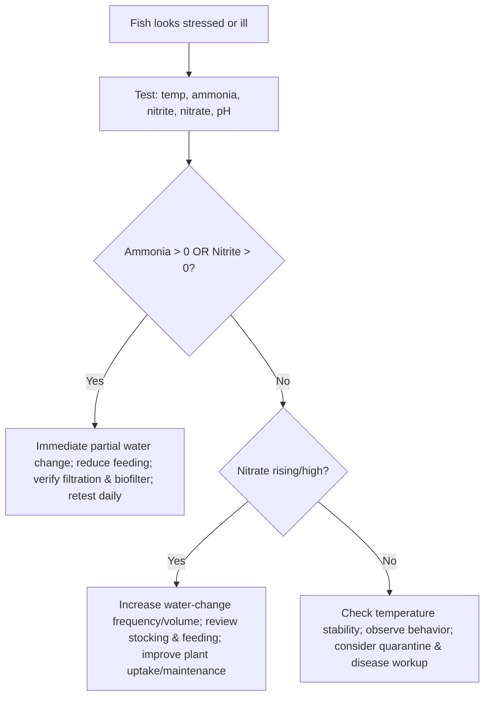

# Betta Care and Compatibility Profiles

## Executive summary

* **Best-practice baseline:** A single *Betta splendens* thrives in **warm, stable, clean water**; an adequately sized, heated, filtered aquarium; and a **high-protein, portion-controlled diet**. Across veterinary, aquarium-trade, and research husbandry references, the most consistent “non‑negotiables” are **zero detectable ammonia and nitrite**, **low nitrate**, warm temperatures with minimal fluctuation, and **environmental enrichment (plants/cover)**. citeturn12view0turn16view0turn14view1turn9search27turn4view0

* **Evidence-backed water targets (home aquarium):**
  * Temperature: typically **24–28 °C (76–82 °F)**; many husbandry guides emphasize **~24–28 °C** with minimal fluctuations; research husbandry often uses **28 °C** (notably for breeding physiology and consistency). citeturn14view1turn12view0turn9search27turn33view1  
  * pH / hardness: captive-bred fish tolerate a wide range, but stability is prioritized; one major trade guideline suggests **pH 6.0–8.0; GH 4–12 °dH; KH 3–10 °dKH**. citeturn12view0  
  * Nitrogen: **ammonia 0 mg/L, nitrite 0 mg/L**; nitrate commonly targeted **<20 mg/L** (or, per one trade guideline, **≤20 mg/L above baseline tap-water nitrate**). citeturn12view0turn15view1turn16view0

* **Tank size recommendations (why guidance differs):**
  * A veterinary teaching hospital explicitly advises **~5 gallons or larger** for typical home care (space + toxin dilution). citeturn9search27  
  * A UK labyrinth-fish association cites **5 liters as an absolute minimum** for long-term maintenance. citeturn14view1  
  * A trade guidance document recommends **≥20 liters for one male** and **≥60 liters for a group of females**. citeturn12view1turn12view0  
  * Research labs sometimes house adults in **sub‑2‑liter containers** *only when water quality is tightly controlled* (recirculating systems, dividers, monitoring). This does **not** translate cleanly to most home setups. citeturn33view1

* **Compatibility headline:** “Can” does not mean “should.” Bettas are selectively bred for aggression and remain territorial; mixing is mainly constrained by (a) **fin‑nipping risk**, (b) **betta aggression toward similar-looking / long-finned fish**, and (c) the **need for escape/cover**. Community success rates rise sharply with **≥20 gallons**, dense planting (line‑of‑sight breaks), and careful species choice. citeturn12view2turn14view1turn33view0turn4view0

* **Disease prevention is mostly husbandry:** Stressors (poor water quality, temperature swings, crowding/handling) strongly predispose fish to outbreaks; quarantine is widely recommended, with one veterinary reference stating **30 days minimum** for quarantine/biosecurity. citeturn16view2turn16view0turn21view0

## Evidence base and species context

This report prioritizes (in order): **veterinary references and veterinary schools**, **peer‑reviewed husbandry/behavior papers**, **major aquarium trade or specialist societies**, then **reputable hobbyist databases** used for cross-checking species ranges and community behavior. Core high-authority anchors used throughout include entity["book","Merck Veterinary Manual","online veterinary reference"] for water quality, disease, and quarantine; entity["organization","University of Illinois College of Veterinary Medicine","veterinary school advice"] for practical welfare guidance; entity["organization","Ornamental Aquatic Trade Association","ornamental fish trade uk"] and entity["organization","Anabantoid Association of Great Britain","labyrinth fish society uk"] for betta-specific captive guidelines; plus peer-reviewed welfare and behavior studies (e.g., environmental enrichment and group housing). citeturn16view0turn9search27turn12view0turn14view1turn33view0

### Biology that drives husbandry decisions
Bettas are anabantoids with a **labyrinth organ** that allows air breathing, a trait sometimes misused to justify undersized, unfiltered housing. Trade guidance explicitly notes that labyrinth breathing **does not reduce care needs** and still requires an appropriate aquarium with filtration and stable water quality. citeturn12view0turn13view0

Domesticated *Betta splendens* were selectively bred for **extreme aggression**; peer-reviewed work notes that aggressiveness remains a practical husbandry constraint even when fish are bred primarily for ornament. citeturn33view0 The welfare literature highlights several recurring risk factors in retail and hobby contexts: limited ability to escape during aggression, stress from prolonged visual contact between males, and lack of sheltering vegetation (environmental enrichment). citeturn4view0turn4view1turn13view1

## Water parameters and monitoring

### Target ranges and safety limits

**A practical, evidence-aligned target profile** (optimized for stability, not chasing “perfect numbers”) is summarized below. These values are built from aquarium-trade betta guidelines, veterinary water-quality reference ranges, and toxicity mechanisms described by environmental and veterinary sources. citeturn12view0turn15view1turn16view0turn30search1turn34view0

| Parameter | Target for routine care | Acceptable (if stable) | Action threshold (respond promptly) | Evidence notes |
|---|---:|---:|---:|---|
| Temperature | ~25–27 °C (78–81 °F) | 24–28 °C (76–82 °F) | Repeated swings or prolonged lows/highs | Multiple betta guidelines emphasize warm water with minimal fluctuation; research husbandry commonly maintains 28 °C for consistency and breeding physiology. citeturn14view1turn12view0turn33view1 |
| pH | ~6.5–7.5 | 6.0–8.0 | Rapid swings or chronically extreme values | Trade guidance provides 6.0–8.0; research husbandry stresses stability even when broader tolerance exists. citeturn12view0turn33view1 |
| General hardness (GH) | 4–12 °dH | broader possible | Chronic extremes + instability | Betta trade guideline specifies GH 4–12 °dH and KH 3–10 °dKH. citeturn12view0 |
| Ammonia (NH₃/NH₄⁺) | **0 mg/L** | — | **Any detectable** | Both trade betta guidance and veterinary references treat ammonia as “should be zero.” Higher pH and higher temperature increase ammonia toxicity. citeturn12view0turn16view0turn30search1 |
| Nitrite (NO₂⁻) | **0 mg/L** | — | **Any detectable** | Trade betta guidance: zero. Nitrite is taken up at gills in competition with chloride and disrupts oxygen transport (methemoglobin). citeturn12view0turn34view0 |
| Nitrate (NO₃⁻) | Keep low; often **<20 mg/L** | species/system dependent | Rising trend; persistently high | Veterinary reference range lists nitrate <20 mg/L; betta trade guidance frames nitrate as not exceeding 20 mg/L above baseline tap-water nitrate. Research reviews show nitrate can be toxic at sufficiently high levels (unit conventions matter: NO₃ vs NO₃‑N). citeturn15view1turn12view0turn30search2 |

### Why “stable and cycled” beats “perfect numbers”
Most acute household betta losses trace back to **nitrogen-cycle instability** (new tank syndrome) and temperature swings rather than slightly-off pH or hardness. Trade guidance describes “new tank syndrome” as ammonia/nitrite accumulation when nitrifying bacteria are insufficient; a veterinary fish-management reference similarly emphasizes that new tank syndrome commonly occurs in the first weeks and can involve toxic ammonia and/or nitrite elevations, and also notes that biofilters can take **weeks** to establish. citeturn12view1turn21view0

### Decision flowchart: responding to test results
The action logic below maps to veterinary and trade guidance emphasizing immediate response to ammonia/nitrite and broader stress reduction through stability. citeturn12view1turn16view0turn21view0turn34view0



## Tank size and setup

### What “minimum tank size” really means
A veterinary source explicitly advises that bettas **should not live in bowls** and are “ideally” kept in a **5‑gallon tank or larger**, emphasizing normal behavior and reduced toxin buildup. citeturn9search27 A specialist association guideline cites **5 liters** as an *absolute* minimum due to water stability challenges in smaller volumes. citeturn14view1 Trade guidance (OATA) recommends **≥20 liters for a single male** and **≥60 liters for a group of females**, with the explicit logic that larger aquaria stabilize temperature and water quality, and that **a filter is always essential** regardless of size. citeturn12view1turn12view0

Research husbandry demonstrates that adults can be housed in small containers **if** water quality is maintained at high consistency and visual stress is controlled using opaque dividers; however, that setup depends on infrastructure (recirculating systems, monitoring, controlled environments) not typical of home care. citeturn33view1turn13view1

### Setup priorities that reduce stress and aggression
Well-supported recommendations across sources include:
* **Heater + thermometer** for warm, stable temperature (minimizing daily fluctuation). citeturn14view1turn12view1turn12view0  
* **Gentle filtration / low current:** bettas come from slow-moving waters; cultivated long-finned forms can be weaker swimmers; trade and specialist guidance caution against excessive surface-water movement. citeturn14view1turn12view1  
* **Surface access:** leave a **small air gap** below covers to allow air breathing. citeturn12view1  
* **Cover and enrichment:** live plants (or safe artificial plants) and shelter reduce stress and provide escape; lack of sheltering vegetation is identified as a welfare concern. citeturn14view1turn4view0turn12view1  
* **Avoid sharp décor:** long fins are prone to tearing on rough/sharp edges. citeturn12view1  
* **Secure lid:** both specialist and research husbandry emphasize jump risk; lids must be secure. citeturn14view1turn33view1  

image_group{"layout":"carousel","aspect_ratio":"16:9","query":["planted betta aquarium with floating plants","betta fish low flow sponge filter aquarium","betta fish leaf hammock resting","betta aquarium hardscape caves smooth decor"],"num_per_query":1}

### Recommended setups by tank size

**Small (5–10 gal / ~19–38 L): “Solo-first”**
A 5–10 gallon aquarium is the strongest default for one betta because it aligns with veterinary welfare advice and trade guidance (≈20 L) while remaining manageable for filtration and heating. citeturn9search27turn12view1turn14view1  
Practical configuration:
* Filtration: sponge filter or baffled HOB (low flow). citeturn14view1turn12view1  
* Planting: at least some broad-leaf and/or floating cover; add hides that break sightlines. citeturn12view1turn4view0  
* Tankmates: generally **avoid fish tankmates** at this size; consider only robust invertebrates *if* parameters can meet their needs (see compatibility). citeturn12view1turn12view2  

**Medium (20–30 gal / ~76–114 L): “Community-capable”**
Trade and society guidance still considers 20 L appropriate for a single male, but once you add schooling fish and bottom dwellers, 20–30 gallons is where aggression management (space + line-of-sight breaks) becomes realistically achievable for many households. citeturn12view1turn12view2turn4view0  
Priorities:
* Dense planting + hardscape to create multiple zones.
* Add peaceful schooling fish **first**, betta **last**, to reduce territorial “ownership” behavior. This is an inference from territoriality and enrichment/escape principles discussed in welfare and behavior work. citeturn4view0turn33view0  

**Large (>30 gal / >114 L): “Highest margin of safety”**
Larger volumes buffer temperature and nitrogen swings and expand design options (multiple hiding areas, visual barriers). Because betta compatibility issues often stem from inability to escape aggression or fin nipping, extra space is a primary risk reducer. citeturn12view1turn4view0turn33view0  

## Diet and feeding schedules

### What bettas are adapted to eat
While some trade leaflets simplify bettas as “omnivorous,” peer-reviewed nutrition work in juvenile bettas and general husbandry sources describe bettas as functionally **carnivorous/insectivorous**, naturally consuming aquatic insects and larvae (e.g., mosquito larvae) and small invertebrates. citeturn6view0turn9search27turn29view0

A controlled feeding study on juvenile bettas estimated optimal crude protein requirements roughly in the **30–33% crude protein** range for growth metrics under its experimental conditions (isocaloric diets; three meals/day; 30 days). This is not a direct prescription for adult pet diets, but it supports the foundational point: bettas are **protein-forward** fish. citeturn6view0turn6view1

### Staple foods and supplements
Across major guidance documents:
* **Staple:** a high-quality betta pellet or flake formulated for carnivorous fish. citeturn12view2turn29view0turn14view1  
* **Supplements/treats:** frozen or live items such as **daphnia, bloodworm, tubifex** (fed sparingly). citeturn12view2turn9search27turn29view0  
* **Water-quality linkage:** overfeeding increases waste load and can quickly destabilize small systems; multiple sources emphasize feeding only what is consumed promptly and removing uneaten food. citeturn12view2turn29view0turn12view1  

### Evidence-aligned feeding schedule

**Adult betta in a cycled, heated aquarium**
* **Frequency:** typically **once daily** (many guidelines), or split into **two smaller feedings** for very active fish if water quality is consistently excellent. citeturn12view2turn29view0turn14view1  
* **Portion:** feed only what can be eaten in **~1–2 minutes** (some care sheets) or “within a few minutes” (trade leaflet); the exact minute count varies by source, but the shared principle is strict portion control and no leftovers. citeturn29view0turn12view2turn9search27  
* **Weekly rhythm:** consider 1–2 “lighter” feeding days rather than heavy fasting if your fish tends to bloat; explicit fasting prescriptions vary widely and are not strongly standardized in the cited authorities, so the safer evidence-aligned lever is **portion size + consistency**. citeturn29view0turn12view2turn16view0  

**Juveniles / conditioning for breeding**
Research and aquaculture contexts often use multiple meals/day for growth and conditioning (e.g., three meals/day in the juvenile protein study; twice daily feeding in an overland transport recovery study protocol). For typical pet owners, this level of feeding is only appropriate if filtration and testing are robust enough to prevent nitrogen spikes. citeturn6view0turn33view2  

## Health issues, prevention, and quarantine

### Prevention framework: stress is the common denominator
Veterinary references emphasize that **poor water quality is the most common cause** of environmentally induced disease and that temperature interactions matter (e.g., rising pH increases ammonia toxicity; inappropriate temperature can predispose to infections). citeturn16view0turn15view2turn30search1  
Bacterial disease guidance notes that outbreaks are frequently associated with stressors such as poor water quality, organic loading, handling/transport, and marked temperature changes; control focuses heavily on removing predisposing factors. citeturn16view2

### Common conditions in bettas: signs and first-line responses
The table below focuses on **syndromes** hobbyists commonly encounter. It is intentionally conservative (avoid dosing specifics; those vary by product, species sensitivity, and regulatory context). citeturn16view1turn16view2turn29view0turn12view2

| Condition / syndrome | Typical signs | Core response (evidence-aligned) | Notes |
|---|---|---|---|
| Ich / white spot (*Ichthyophthirius multifiliis*) | White spots; lethargy; clamped fins; irritation/flashing | **Quarantine**, confirm via exam if possible; treat promptly with proven protozoacides per veterinary guidance; clean nets/equipment (fomite control). citeturn16view1turn29view0 | Veterinary reference notes rapid/catastrophic potential and fomite transmission; temperature influences treatment interval. citeturn16view1 |
| Bacterial fin erosion / “fin rot,” ulcers | Frayed fins; reddening; open sores; decline in vigor | First fix: **water quality + stress reduction**; consider culture/sensitivity for valuable fish; quarantine to reduce spread. citeturn16view2turn29view0 | Veterinary guidance emphasizes predisposition from poor water quality/handling; antimicrobial selection ideally guided by sensitivity testing. citeturn16view2 |
| Columnaris (*Flavobacterium columnare*) | “Cottony” lesions, fin damage; can be acute | Quarantine; immediate husbandry correction; veterinary-directed treatment. citeturn16view2turn29view0 | Often progresses rapidly; water-quality conditions can predispose. citeturn16view2 |
| “Velvet” (often *Oodinium* spp.) | Gold/rust dusting; flashing; respiratory stress | Quarantine; treat with appropriate antiparasitics; reduce stressors. citeturn29view0turn16view1 | Many “velvet” discussions are inconsistent in hobby media; prioritize veterinary fish disease references. citeturn16view1 |
| Dropsy (symptom complex) | Swollen body; “pinecone” scales | Quarantine; evaluate water quality; veterinary assessment for underlying cause. citeturn29view0turn16view0 | “Dropsy” is not one disease; it can reflect systemic failure/infection. citeturn29view0 |
| Buoyancy/swim bladder issues | Floating, listing, sinking | Review feeding and constipation risk; check water quality; consider infection if persistent. citeturn29view0turn16view0 | Frequently husbandry-linked; avoid reflexively medicating without water testing. citeturn16view0 |
| Mycobacteriosis (“fish TB,” zoonotic risk) | Chronic wasting; ulcers; granulomas (often confirmed on necropsy) | Prevention: quarantine, avoid chronic stress; consult veterinary fish medicine; strong hygiene because of zoonotic potential. citeturn16view2turn21view0turn4view0 | Welfare review highlights mycobacteria prevalence as a key welfare concern in bettas. citeturn4view0 |

### Quarantine practices (strongly recommended)
A veterinary fish-management reference states that quarantine is strongly recommended even for pet fish, with **30 days minimum**, longer as needed; quarantine tanks should have separate dedicated equipment and be handled after all other tanks to reduce cross-contamination. citeturn21view0  
Trade guidance for home aquaria also emphasizes acclimation practices (temperature equalization; gradual mixing; avoid adding bag water) and consistent water testing after introduction. citeturn12view1

A practical, low-cost quarantine station aligned with veterinary biosecurity guidance is typically: a small heated tank, sponge filter seeded from a healthy system, and dedicated tools. citeturn21view0

## Compatibility, community setups, and aggression control

### Solitary vs community: risk trade-offs

**Solitary (single male betta)**
Pros: minimal aggression risk, easiest disease control, simplest feeding and monitoring.  
Cons: “Boredom” is better framed as lack of enrichment; without plants/cover, welfare literature flags enrichment deficits as a concern, and aggression displays can be triggered even by nearby males if sightlines exist. citeturn4view0turn13view1turn12view1

**Community (betta + other species)**
Pros: dynamic display, potential behavioral enrichment if stress is low and escape cover is abundant. citeturn33view0turn4view0  
Cons: higher probability of (a) fin nipping on betta, (b) betta attacking long-finned/similar fish, (c) chronic stress from social friction, and (d) disease introduction due to more livestock. Trade guidance explicitly notes that mixing bettas can be difficult: males may be targets of fin nipping, and males should be kept alone or with very placid tankmates. citeturn12view2turn14view1

### Aggression-reduction strategies with the strongest support

* **Block line of sight:** Dense planting and hardscape breaks reduce continual threat display and offer escape routes; both welfare analysis and trade guidance emphasize sheltering vegetation and line-of-sight management. citeturn4view0turn12view2  
* **Prevent visual contact between males:** Retail and husbandry guidance warns that males displaying at each other constantly experience physiological stress; use opaque dividers where needed. citeturn13view1turn33view1  
* **Choose “placid” companions and avoid fin nippers:** Trade and specialist guidance repeatedly highlights fin-nipping risk as a primary failure mode. citeturn12view2turn14view1  
* **Recognize individual variability:** Peer-reviewed work demonstrates environmental history (enrichment vs isolation timing) measurably changes aggression and stress physiology; a “gentle” betta today can become more reactive after stressors. citeturn33view0  

### Decision flowchart: selecting tankmates responsibly
This logic encodes the highest-consensus constraints: tank size, betta sex/temperament, fin nipping risk, and escape/cover. citeturn12view2turn14view1turn12view1turn33view0turn13view1

```mermaid
flowchart TD
A[Want tankmates?] --> B{Tank size}
B -->|5–10 gal| C[Prefer solo betta\nOptional: a hardy snail\nAvoid adding fish]
B -->|20–30 gal or larger| D{Betta sex}
D -->|Male| E{Are candidate fish long‑finned / fin‑nippers / aggressive?}
E -->|Yes| F[Not recommended]
E -->|No| G{Do candidates share warm-water needs (~24–28°C)?}
G -->|No| H[Conditional: only if temperature compromise is safe]
G -->|Yes| I[Add school/bottom fish first\nAdd betta last\nProvide dense cover]
D -->|Female / group plan| J[Higher complexity\nRequires heavy planting\nMonitor for aggression]
```

### Compatibility profiles table

**Status definitions**
* **Compatible:** commonly successful when tank size and aquascape meet species needs, with lower expected conflict.  
* **Conditional:** can work but has specific failure modes (predation, fin nipping, temperature mismatch, dietary competition) requiring mitigation and a backup plan.  
* **Not recommended:** conflict probability is high or consequences severe (injury/death, chronic stress, incompatible needs). citeturn12view2turn14view1turn4view0turn33view0

| Candidate species (common name) | Scientific name | Status | Rationale | Minimum tank size for mixed setup | Special precautions |
|---|---|---|---|---:|---|
| Zebra/nerite snail | *Neritina natalensis* | Conditional | Peaceful, but many care profiles prefer **alkaline/harder water** than typical betta targets, creating shell-health tradeoffs. citeturn26search17turn12view0 | 5 gal | If keeping pH near neutral/soft, provide calcium sources and monitor shell pitting; avoid copper meds. citeturn26search2turn26search17 |
| Mystery snail | *Pomacea diffusa* | Conditional | Often needs **higher pH and mineral hardness** for shell integrity; compatible temperamentally but parameter needs can conflict. citeturn26search2 | 5–10 gal | Prioritize GH/calcium; remove during salt/copper treatments; ensure lid (snails roam). citeturn26search2turn14view1 |
| Amano shrimp | *Caridina multidentata* | Conditional | Generally peaceful, but bettas are insectivorous/carnivorous and may prey on shrimp; parameters can overlap (broad tolerance). citeturn6view0turn32search10 | 10+ gal | Dense plants/moss; introduce shrimp first; expect some losses with predatory individuals. |
| Cherry shrimp | *Neocaridina davidi* | Conditional (high predation risk) | Smaller shrimp are more likely to be hunted; while shrimp tolerate broad parameters, predation is the main constraint. citeturn6view0turn32view3 | 10–20 gal | Heavy cover; avoid if shrimp are a priority; never assume “shrimp-safe” betta. |
| Harlequin rasbora | *Trigonostigma heteromorpha* | Compatible | Peaceful schooling fish with water ranges overlapping warm community conditions; typically avoids fin-nipping. citeturn22search0turn22search18 | 20 gal | Keep a proper school; add rasboras first, betta last. citeturn33view0turn12view2 |
| Chili rasbora | *Boraras brigittae* | Conditional | Very small; can be stressed in boisterous tanks and may be viewed as prey by some bettas; prefers softer/acidic water. citeturn23search0turn24search1turn33view0 | 20 gal | Best in heavily planted, calm tanks; avoid large/fast tankmates; have a backup nano tank. |
| Ember tetra | *Hyphessobrycon amandae* | Compatible | Very small, generally peaceful tetra with parameters compatible with warm planted communities; low fin-nip reputation relative to “nippy” species. citeturn24search0 | 20 gal | Keep a real school; provide cover; observe feeding competition. |
| Rummy-nose tetra | *Hemigrammus bleheri* | Conditional | Peaceful but best in larger groups and stable water; some sources emphasize sensitivity to poor conditions. citeturn25search10turn16view0 | 30+ gal | Needs strong water stability and schooling numbers; not ideal in small/variable tanks. |
| Cardinal tetra | *Paracheirodon axelrodi* | Conditional | Can share warm temps; wild-type ecology often favors softer/acidic water; stability is crucial. citeturn25search0turn25search4 | 30+ gal | Prefer mature tanks; aim for gentle flow and cover; quarantine carefully. citeturn21view0turn16view0 |
| Neon tetra | *Paracheirodon innesi* | Conditional | Often prefers cooler temps than common betta targets (many profiles list ~20–26 °C); can be mismatched if betta is kept hot. citeturn25search1turn25search17 | 20–30 gal | Keep betta temps moderate (not maximal); watch for chronic stress signs. citeturn16view0turn25search17 |
| Celestial pearl danio | *Danio margaritatus* | Conditional | Many profiles sit in mid‑20s °C and emphasize dense vegetation; can work, but these fish can be shy and temperature compromise may be needed. citeturn25search33turn25search3 | 20–30 gal | Subdued lighting, dense plants; avoid overly warm setups. |
| Pygmy corydoras | *Corydoras pygmaeus* | Conditional | Peaceful bottom-dweller; temperature ranges can overlap but often prefer slightly cooler mid‑20s °C; needs schooling and soft substrate. citeturn22search1turn22search13 | 20 gal | Keep in a group; use sand or smooth substrate; ensure oxygenation without strong current. citeturn15view2turn22search1 |
| Otocinclus catfish | *Otocinclus vittatus* | Conditional | Peaceful algae grazer but many profiles skew cooler (often ~20–25 °C) and otos do best in mature tanks with biofilm. citeturn23search3turn24search15turn21view0 | 20+ gal | Only add to established tanks; provide driftwood/biofilm; avoid starvation. citeturn21view0turn24search15 |
| Kuhli loach | *Pangio kuhlii* | Conditional | Peaceful, nocturnal; soft/acidic preference and needs hiding + group; can be compatible if tank is calm and well covered. citeturn23search2turn4view0 | 20–30 gal | Lots of hides; ensure food reaches bottom; avoid sharp gravel. citeturn23search2turn16view0 |
| Bristlenose pleco | *Ancistrus cf. cirrhosus* | Conditional | Generally community-compatible but larger bioload and space needs; parameters overlap broadly with tropical community tanks. citeturn26search1turn16view0 | 30+ gal | Provide driftwood and caves; ensure filtration can handle waste; watch betta harassment at feeding. citeturn26search1turn16view0 |
| Fancy guppy | *Poecilia reticulata* | Not recommended | Specialist guideline warns male bettas may attack other long‑finned fish such as male guppies; many care guides also caution against “similar-looking/flowing fins.” citeturn14view1turn29view0 | 30+ gal (still risky) | If attempted, prefer short-finned varieties and heavy cover; expect failures with aggressive bettas. |
| Tiger barb | *Puntigrus tetrazona* | Not recommended | Reputable profiles describe a fin‑biting reputation (especially when numbers/space are insufficient) and poor fit with long‑finned/anabantoid fish. citeturn35search0 | 40+ gal (still risky) | Even “well-managed” tiger barb setups commonly advise avoiding long-finned fish; bettas are a classic conflict case. citeturn35search0turn12view2 |
| Additional male betta | *Betta splendens* | Not recommended | Trade and society guidance: males should not be mixed; fighting can continue until severe injury or death; visual contact alone can be stressful. citeturn12view0turn12view2turn13view1turn14view1 | — | If maintaining multiple males in one system, use opaque dividers and separate equipment when possible. citeturn13view1turn33view1 |
| Honey gourami | *Trichogaster chuna* | Conditional | Generally peaceful, but shares surface/slow-water niche and may be intimidated or stressed; pairing two anabantoids increases behavioral uncertainty. citeturn35search3turn12view2 | 30+ gal | Only consider with abundant surface cover and escape structure; avoid if either fish shows persistent stress behaviors. citeturn33view0turn4view0 |

### Breeding basics overview
Breeding is optional and complex chiefly because it requires **controlled aggression management**. Trade guidance describes bubble-nest spawning, recommends **reducing flow** for nest integrity, and advises removing the female after spawning because the male defends the nest aggressively; it also notes that dedicated setups and specialist fry foods are needed for best results. citeturn12view2  
Research husbandry commonly maintains **28 °C** as ideal for bubble nest construction and ovarian development, and uses individual housing for males with opaque dividers to prevent continual aggressive display. citeturn33view1

## Common myths and what the evidence says

### Myth: “Bettas are happy in bowls/vases because they live in puddles”
**What evidence supports:** Bettas evolved to survive **low-oxygen** standing waters (e.g., floodplains, rice paddies) and can breathe air via a labyrinth organ. citeturn13view0turn12view0  
**What evidence refutes (for home care):** “Tolerance” is not “optimal welfare.” Veterinary welfare guidance explicitly discourages bowls and recommends larger tanks; welfare literature flags very small volumes (and lack of enrichment) as welfare risks; trade guidance emphasizes that small volumes fluctuate and deteriorate rapidly and that filtration and stable parameters are required. citeturn9search27turn4view0turn13view0turn12view1

### Myth: “Because bettas breathe air, they don’t need a filter”
Trade guidance directly addresses this misconception: labyrinth breathing does not reduce their need for an appropriate aquarium with filtration and good water quality. citeturn12view0turn12view1  
Veterinary references reinforce that water quality is central to disease prevention and that ammonia/nitrite toxicity and other water-quality failures are common killers. citeturn16view0turn15view2

### Myth: “Bettas don’t need heated water”
A specialist guideline calls this out explicitly: bettas originating from Southeast Asia require **warm temperatures (~24–28 °C)** with minimal fluctuations and are more prone to disease if kept too cold. citeturn14view1  
Other trade guidance provides similar ranges and stresses year-round temperature maintenance. citeturn12view1turn12view0

### Myth: “You can keep two male bettas together if the tank is big enough”
Both trade and society guidance are unequivocal that two males should not be mixed; fighting can persist until severe injury or death. In addition, even *seeing* each other continuously can be stressful. citeturn12view0turn14view1turn13view1  
Peer-reviewed welfare analysis adds that prolonged visual contact between males is a recognized welfare concern, and that limited ability to escape increases harm during aggression. citeturn4view0turn4view1

### Myth: “Female ‘sororities’ are easy”
Some trade guidance suggests females are calmer and can be kept in groups (often **≥4**) and notes that densely planted tanks that break line of sight are important; however, peer-reviewed work shows aggression levels are **strongly shaped by rearing environment and isolation timing**, and females can still be highly aggressive in some cases. citeturn12view0turn12view2turn33view0  
Bottom line: sororities are **high-management** projects with real welfare risks and should be attempted only with robust monitoring and a separation plan. citeturn33view0turn4view0