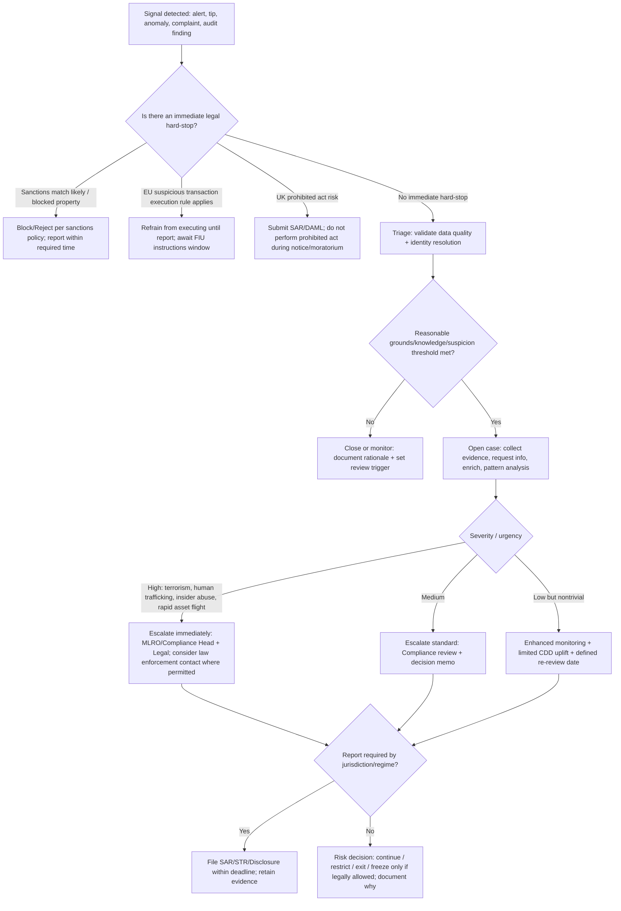
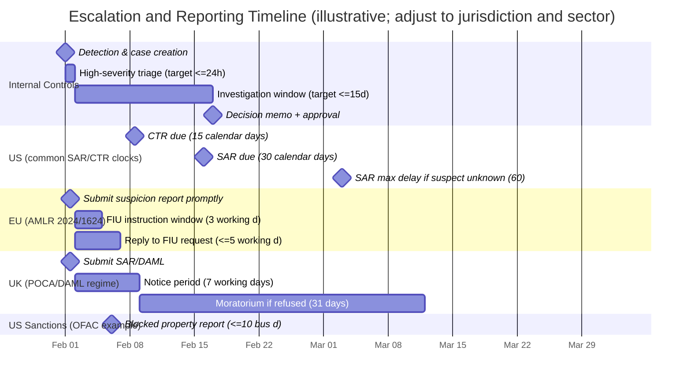

# CYA and Financial Crime Decision Guide with Safe Action Thresholds

## Executive Summary

This report builds a “safe action” decision guide that fuses two concepts that are often conflated in practice:

- **CYA** (“cover your ass”) as **risk-avoidance documentation and controls**: defensible decision-making, provable governance, and audit-ready records.
- **FC** as **financial crime** (AML/CFT, fraud, sanctions, bribery/corruption, and related reporting/controls).

Because “FC” is also commonly used as shorthand for **fraud/compliance** more broadly (beyond classic AML/CFT), the guide explicitly handles **both interpretations** and shows where the thresholds and escalation logic do (and do not) change. citeturn30view2turn35view2

The core finding is that “safe action thresholds” in FC contexts are rarely just “amount-based.” Modern regimes emphasize **risk-based judgment**, with **mandatory reporting triggers keyed to suspicion/knowledge**, plus a smaller set of **bright-line numeric thresholds** (e.g., cash reporting caps). Examples:

- **US (banking baseline):** Currency Transaction Reports for currency transactions **> $10,000**. citeturn4view1 Suspicious Activity Reports generally due **within 30 calendar days** of initial detection (extendable to **60** if no suspect is identified), with filing triggers that include measurable thresholds like **$5,000 / $25,000** depending on conditions and the institution type. citeturn5view2turn6view0turn22search13
- **EU (AMLR 2024/1624):** Suspicion reporting applies **regardless of amount**; obliged entities must respond to FIU requests **within 5 working days** (shortenable to **<24 hours**), and must generally refrain from executing suspicious transactions until reporting, with a **3 working day** “no contrary instructions” window. citeturn11view0turn11view1turn29view0 The AMLR also introduces a **Union-wide cap of €10,000** on cash payments for goods/services (with exceptions and ability for Member States to set lower limits). citeturn11view3turn5view3
- **UK (POCA/DAML + MLR 2017):** The key “safe” threshold for reporting is **suspicion**, interpreted in leading case law guidance as **“a possibility, which is more than fanciful,”** and it must be reported **“as soon as practicable.”** citeturn25search0turn19view0turn21view1 Where a “prohibited act” risk exists, the **DAML** timeline creates an operational “do-not-act” clock: **7 working day notice period** and (if refused) **31-day moratorium**. citeturn20view0turn21view2

Across jurisdictions and industries, “safe action” is best operationalized with:

- A **two-layer threshold model**:
  1) **Legal/regulatory minima** (hard deadlines, non-disclosure rules, retention periods, cash/reporting thresholds); and  
  2) **Internal control thresholds** (risk scores, alert severity, escalation rules, and “stop-the-line” triggers) designed to prevent late or missed reporting and to protect customers’ rights.
- A **documentation spine**: an audit trail that proves who decided what, when, with what facts, and why (including “why not” for non-escalation or non-reporting), aligned to record retention rules and confidentiality/tipping-off constraints. citeturn6view0turn29view0turn16view0turn38view0

The recommended operating standard is a **defensible, risk-based decision workflow** aligned with leading frameworks emphasizing effectiveness, measurement, and continuous improvement, including the prosecutor-facing evaluation criteria from the entity["organization","U.S. Department of Justice","criminal division, us"] and risk-based compliance principles in global AML standards (risk-based approach, targeted effectiveness). citeturn35view0turn8search2turn30view2

## Terminology and ambiguity

### CYA as a control objective

In regulated FC environments, “CYA” is most safely reframed as **accountability and provability**, not as defensive over-reporting or decision paralysis. A well-structured CYA layer has three measurable goals:

1) **Decision reproducibility:** an independent reviewer can reconstruct the facts and rationale. citeturn38view0turn29view0  
2) **Regulatory defensibility:** actions align to mandatory rules (deadlines, confidentiality, retention). citeturn6view0turn29view0turn16view0  
3) **Ethical legitimacy:** minimize unnecessary harm (privacy intrusion, discrimination, unjustified exits) while meeting reporting duties. citeturn29view0turn26search3turn24search2

### FC ambiguity: “financial crime” vs “fraud/compliance”

This guide treats FC in two overlapping ways:

- **FC-A (Financial crime / AML-CFT / sanctions / corruption / fraud):** customer/transaction monitoring, suspicious reporting, sanctions screening, and regulated recordkeeping. citeturn29view0turn6view0turn33view0  
- **FC-B (Fraud/compliance broadly):** includes healthcare billing fraud, privacy breaches, corporate misconduct, and internal control obligations that may not be called “financial crime” by all regulators but still require auditable escalation and reporting. citeturn35view2turn23search0turn23search3  

Operationally, FC-B generally uses the same *CYA spine* (investigation logs, decision memos, retention, audit trails) but adds domain-specific triggers (e.g., HIPAA breach notices, healthcare overpayment returns). citeturn23search0turn23search3turn2search13

## Legal and regulatory context across US, EU, UK

This section prioritizes thresholds that are (a) widely applicable, and (b) directly operationalizable.

### Comparative table of key mandatory thresholds

| Topic | US baseline (illustrative banking default) | EU baseline (AMLR 2024/1624) | UK baseline (POCA + MLR 2017) |
|---|---|---|---|
| Currency/cash bright-line reporting | Currency transactions **> $10,000** require a CTR. citeturn4view1 | **€10,000** Union-wide cap on cash payments for goods/services (with exceptions; Member States may set lower limits). citeturn11view3turn5view3 | Sectoral cash controls exist via UK AML framework; the core “regulated sector” trigger is suspicion rather than amount. citeturn25search0turn21view0 |
| Suspicion threshold | “Facts that may constitute a basis” for SAR filing; mandated confidentiality and retention. citeturn5view2turn6view0 | Suspicion reporting applies **regardless of amount**; “knows, suspects, or has reasonable grounds to suspect.” citeturn11view0turn10view1 | Suspicion threshold is low; guidance cites “more than fanciful possibility,” and must be reported “as soon as practicable.” citeturn25search0turn21view1 |
| Suspicious report filing deadline | SAR due **≤30 calendar days** from initial detection; extension to **≤60** if suspect unknown. citeturn5view2turn3search15 | Report “promptly”; respond to FIU info requests **≤5 working days** (shortenable to **<24h**). citeturn11view0turn11view1 | Disclosure required “as soon as practicable.” citeturn21view1 |
| “Do not proceed” transaction rule | Not a general uniform “must refrain” rule in all contexts; sanctions blocking is a separate regime with strict timelines. citeturn33view0turn7search6 | Must generally refrain from executing suspicious transactions until reporting; may proceed if no contrary instructions **within 3 working days**. citeturn11view1turn29view0 | If a prohibited act risk exists, seek DAML; notice period **7 working days**, and if refused a **31-day** moratorium applies. citeturn21view2turn20view0 |
| Record retention (AML core) | SAR and support docs retained **5 years**; strong confidentiality requirement (no disclosure of SAR existence). citeturn6view0 | Retention **5 years** from relationship end/transaction/refusal; deletion required after, with case-by-case extensions up to **+5 years**. citeturn29view0 | Record-keeping period **5 years**, with a “not required beyond 10 years” constraint and deletion obligations. citeturn16view0turn15view3 |
| Sanctions blocking reports | Reports on blocked property due **within 10 business days**; annual reporting also applies. citeturn33view0turn7search6 | Sanctions regimes are separate from AMLR, but AMLR includes risk controls for evasion and anonymity tools. citeturn29view0turn11view3 | UK sanctions regimes are separate from AML statutes; AML “tipping off” constraints remain. citeturn21view1turn25search0 |

### Key legal “safety rails” that shape decision thresholds

1) **Confidentiality / no tipping-off**  
In the US, SAR confidentiality is explicit: institutions must not disclose the SAR or information revealing its existence, and must decline subpoenas seeking SARs (with notice to FinCEN). citeturn6view0 EU AMLR similarly prohibits disclosing to customers or third parties that reporting/analysis is occurring. citeturn10view0turn11view1 UK law criminalizes “tipping off” in the regulated context, and professional guidance stresses avoiding prejudicing investigations. citeturn21view1turn8search17

2) **Safe harbor / liability protection for good-faith reporting**  
EU AMLR explicitly provides that good-faith disclosures to an FIU do not breach legal/contractual restrictions and do not create liability, even if the reporter is not precisely aware of the underlying crime. citeturn11view1 US law provides civil liability protection for suspicious activity reporting (often described as a safe harbor in supervisory materials). citeturn22search8turn22search14

3) **Risk-based rather than purely rules-based compliance**  
Modern compliance frameworks explicitly prefer risk-based calibration and discourage wholesale “de-risking” that avoids managing risk. citeturn26search3turn26search0turn8search2 This matters because “CYA-by-overreporting” can undermine system effectiveness and create ethical and operational costs. citeturn30view2turn26search3

## Decision framework and safe action thresholds

### The “two-layer thresholds” model

A defensible FC decision is safest when it crosses two gates:

**Gate one: legal minima (must-do).**  
Examples: file within statutory/regulatory deadlines; do not tip-off; meet record retention; comply with cash caps and sanctions reporting. citeturn6view0turn29view0turn33view0turn16view0

**Gate two: internal control thresholds (should-do).**  
These are calibrated to ensure Gate one is never missed, while minimizing unnecessary harm. Internal thresholds are where you put “CYA” into a principled, reviewable structure. citeturn35view2turn30view2turn38view0

### A practical decision tree with escalation and “stop-the-line” triggers



The decision tree is anchored in statutory “hard-stop” obligations (e.g., EU refraining rules; US sanctions blocking; UK DAML/timing) and in the core concept that suspicion triggers are generally **amount-independent** in EU/UK and frequently **pattern/risk-driven** in the US. citeturn11view1turn29view0turn33view0turn21view2turn10view1turn22search13

### Sample quantitative and qualitative “safe action” thresholds (internal controls)

These are **illustrative values** designed to be conservative enough to hit legal deadlines and consistent with risk-based principles; they must be calibrated to your sector, products, and jurisdictional footprint. Risk-based approaches explicitly expect tailoring to risk profile rather than a one-size-fits-all number. citeturn35view1turn8search2turn26search1turn13search10

| Control area | Threshold type | Suggested internal “safe action” threshold | Rationale (what it protects) |
|---|---|---|---|
| Alert triage SLA | Time | **≤24 hours** from alert creation to case triage for “high severity”; **≤72 hours** for standard | Conservatively supports tight external clocks (EU 3 working day instruction window; US 30-day SAR clock) and reduces “late discovery” disputes. citeturn11view1turn5view2turn3search15 |
| Evidence sufficiency to escalate to MLRO/Compliance lead | Qualitative checklist | Escalate when **(a) identity is sufficiently resolved**, and **(b) at least one high-risk typology indicator** + **inconsistency with known profile** | EU AMLR defines suspicion basis as grounded in customer characteristics, size/nature/methods/patterns, origin/destination/use of funds, consistency w/ CDD profile. citeturn11view0turn10view1 |
| Risk score (customer) | Numeric | 0–100 scale: **≥70 = High**, **≥85 = Critical** | Aligns with risk-based CDD requirements (enhanced scrutiny for higher risk) and creates consistent escalation. citeturn26search1turn8search2turn35view1 |
| Transaction anomaly score | Numeric | Z-score **≥3.0** (or equivalent ML anomaly probability **≥0.995**) triggers human review | Provides a defensible statistical basis for triage; must be paired with human judgment to avoid “defensive” over-reporting. citeturn30view2turn29view0 |
| “Stop-the-line” triggers | Qualitative + policy | Immediate escalation when: sanctions hit plausibility is high; credible insider abuse; imminent dissipation risk; credible predicate offences | Mirrors regimes that impose rapid action and reporting (e.g., OFAC 10 business days; bank SAR triggers include insider abuse). citeturn33view0turn22search13turn7search6 |
| “Defensive SAR” guardrail | Governance rule | If filing rationale is primarily “we cannot verify legitimacy,” require a **second-line review** + document why verification was not possible | Wolfsberg materials warn that lowering filing thresholds defensively can reduce usefulness to authorities and drive over-alerting; governance prevents unprincipled CYA. citeturn30view2turn30view1 |

### Jurisdiction-specific “hard threshold” patterns to encode in systems

Below are policy-enforceable rules that can be encoded as automated controls, then audited.

**US (illustrative, banking default):**

- CTR obligation: currency transactions **> $10,000** require filing. citeturn4view1  
- SAR timing: file **≤30 days** from initial detection; extension to **≤60 days** if suspect unknown. citeturn5view2turn3search15  
- SAR retention and confidentiality: retain SAR and supporting documentation **5 years** and do not disclose the SAR’s existence. citeturn6view0turn22search8  
- Sanctions blocking reports: initial blocked property reports due **within 10 business days**; annual reporting by a defined date (e.g., September 30 for June 30 holdings in OFAC rules). citeturn33view0turn7search6  

**EU (AMLR 2024/1624):**

- Suspicion reporting: report suspicious activities **regardless of amount**, and respond to FIU requests **≤5 working days** (shortenable to **<24h**). citeturn11view0turn11view1  
- Refrain rule: generally refrain from executing a suspicious transaction until reporting; may proceed if no contrary FIU instruction **within 3 working days**. citeturn11view1turn29view0  
- Record retention: retain AML documents/assessments **5 years**, delete after; extensions are bounded (case-by-case up to **+5 years**). citeturn29view0  
- Cash cap: cash payments for goods/services limited to **€10,000**, with defined exceptions and member-state flexibility. citeturn11view3turn5view3  

**UK (POCA + MLR 2017):**

- Suspicion reporting threshold: low; guidance cites the “more than fanciful possibility” test and emphasizes timeliness (“as soon as practicable”). citeturn25search0turn21view1  
- DAML timeline: notice period **7 working days**; if refused, moratorium period **31 days**. citeturn21view2turn20view0  
- Record keeping: keep CDD and transactional reconstruction records for **5 years**, with a “not required beyond 10 years” rule and deletion after expiry unless exceptions apply. citeturn16view0turn15view3  

## Escalation, documentation, and auditability standards

### Escalation triggers that are “safe” across regimes

A safe escalation design assumes that **delayed escalation is a more common failure mode than over-escalation**, but also recognizes ethical and operational harms of indiscriminate escalation.

A practical safe trigger set is:

- **Urgent escalation (same day):** sanctions-block plausibility, terrorism indicators, insider abuse, credible “asset flight” risk, large unexplained high-risk cash substitutions, repeated refusal/avoidance of CDD. citeturn22search13turn33view0turn11view0  
- **Standard escalation (≤3 working days):** suspicion threshold met but no immediate flight risk; pattern suggests layering/structuring; high-risk jurisdiction + opaque ownership + inconsistent profile. citeturn11view0turn26search1  
- **Watch escalation (scheduled):** anomalies explainable but recurring; tighten monitoring, schedule periodic review, and require documented “explainability.” citeturn30view2turn29view0  

### A defensible documentation standard (“CYA spine”)

A “CYA-grade” record is one that meets three simultaneous requirements:

1) **Regulatory retention and non-disclosure rules.**  
US SAR retention and confidentiality requirements and EU/UK retention + deletion constraints must be respected. citeturn6view0turn29view0turn16view0  

2) **Audit log completeness.**  
For system auditability, the entity["organization","National Institute of Standards and Technology (NIST)","us standards body"] SP 800-53 AU-3 control describes a widely adopted baseline for audit record content: event type, time, location, source, outcome, and associated identities. citeturn38view0  

3) **Decision rationale traceability (including “why not”).**  
Prosecutor-facing guidance emphasizes risk assessment, resourcing, and testing—plus being able to evidence that controls work in practice and evolve. citeturn35view0turn35view2  

### Recommended templates

#### Decision and escalation memo (one-page core + appendix)

```text
CYA/FC DECISION MEMO (v1)

Case ID:
Date opened:
Prepared by:
Approver(s) (name/role):

1) Trigger & scope
- Trigger source (alert / tip / audit / external request):
- Products/channels involved:
- Parties involved (customer, counterparty, beneficiary):

2) Facts established (timestamped)
- What happened (chronology):
- Amounts, instruments, jurisdictions:
- Supporting evidence index (see Appendix A):

3) Risk assessment
- Applicable regimes (AML/STR, sanctions, fraud, privacy, other):
- Customer risk rating (0–100) and rationale:
- Key risk indicators / typology markers:
- Consistency with customer profile:

4) Decision
- Action taken (monitor / restrict / refrain / exit / report / other):
- If reported: report type + filing date target:
- If not reported: explicit rationale + conditions that would change decision:

5) Controls and communications
- Internal escalations completed (who/when):
- External counsel engaged? (Y/N)
- Customer communication constraints (tipping-off / confidentiality):

6) Next review
- Re-review date:
- Monitoring changes:
- Data/model changes approved:
```

This template is designed to satisfy: (a) EU’s requirement to retain records of assessments even when they do **not** result in a suspicious report, (b) UK record-keeping periods, and (c) US SAR supporting documentation expectations. citeturn29view0turn16view0turn6view0turn22search9

#### Investigation log (audit-ready event trail)

```text
INVESTIGATION LOG (append-only)

Event timestamp | Actor | Action | Input source | Output/decision | Evidence link | Notes
--------------------------------------------------------------------------------------
YYYY-MM-DD HH:MM | analystA | triage | alert#123 | opened case | doc-idx-01 | ...
YYYY-MM-DD HH:MM | analystB | RFI sent | customer contact | pending | msg-idx-02 | ...
YYYY-MM-DD HH:MM | MLRO | escalation review | case file | approve STR | memo-v1 | ...
```

Append-only logging aligns with audit record integrity expectations and supports later “who knew what when” reconstructions. citeturn38view0turn29view0turn21view0

### Escalation timeline diagram with jurisdictional clocks



The specific clocks shown are grounded in the relevant rule texts (US SAR timing; EU FIU response deadlines and 3 working day instruction window; UK notice/moratorium periods; OFAC 10 business day reporting). citeturn5view2turn11view0turn11view1turn21view2turn33view0

## Industry-specific variations

This section highlights how the same CYA/FC “spine” is tuned by industry.

### Banking and credit institutions

Key characteristics: high regulatory density; mature suspicious monitoring; strong supervisory expectations for governance and measurement.

- **Threshold reality:** Banks live with both hard numeric thresholds (CTR/cash rules) and suspicion-driven reporting. citeturn4view1turn5view2  
- **Model governance:** Bank regulators treat monitoring systems as requiring risk management and validation appropriate to the system’s role; interagency guidance clarifies the relationship between model risk management principles and BSA/AML systems. citeturn31search0turn27search0turn27search1  
- **Effectiveness vs “defensive compliance”:** Industry guidance warns that purely defensive alerting/reporting can inflate volume without proportional investigative value. citeturn30view2turn30view1  

### Fintech and cryptoasset services

Key characteristics: fast product iteration; cross-border exposure; higher data/identity uncertainty; heavier dependence on automated decisions.

- **Risk factor emphasis:** EU supervisory guidance on risk factors expects firms to adjust CDD in line with identified risk and recognizes the factors list is not exhaustive. citeturn26search1turn26search4  
- **Automation constraints (EU):** AMLR permits automated/AI-supported decisions only with meaningful human intervention for decisions like relationship acceptance/termination and CDD intensity changes, plus customer explanation/challenge rights (subject to exceptions around STRs). citeturn11view2turn29view0  
- **CYA implication:** the documentation template must capture human override and explainability, not just the model output. citeturn30view1turn29view0  

### Healthcare compliance and healthcare fraud

Key characteristics: “fraud/compliance” thresholds often tie to mandatory repayment and breach notification timelines, not FIU regimes (though laundering risks can still exist).

Two hard, operational clocks that mirror FC-style escalation:

- **Overpayment return rule:** Overpayments must be reported and returned by the later of **60 days after identification** or the cost report due date. citeturn23search0  
- **HIPAA breach notifications:** Notification must be without unreasonable delay and **≤60 days** after discovery of a breach. citeturn23search3turn23search7  
- **CYA implication:** a healthcare “FC-B” decision tree should include “identify overpayment/breach?” as a top-level branch with its own filing clocks, while still tracking potential laundering typologies where payment flows are suspicious. citeturn23search0turn23search3  

### Corporate compliance (cross-industry)

Key characteristics: internal investigations, third-party risk, bribery/corruption, and fraud governance.

- Prosecutor-facing guidance evaluates whether compliance is well-designed, resourced, and works in practice, stressing risk assessment, periodic review, auditing/testing, and measurement. citeturn35view0turn35view2turn35view3  
- CYA implication: build a record that shows (a) the risk assessment exists, (b) controls are tested, and (c) decisions follow an empowered escalation path—not a “paper program.” citeturn35view0turn35view2  

### Law enforcement and public sector investigations

Key characteristics: legal thresholds are often **constitutional or statutory evidentiary standards**, not compliance thresholds.

- **US:** reasonable suspicion supports stop-and-frisk; probable cause is assessed under a totality-of-the-circumstances approach for warrants. citeturn24search0turn24search1  
- **UK:** stop/search powers typically require “reasonable grounds” for suspecting relevant items are present (statutory basis). citeturn24search3  

CYA implication: for coordination with law enforcement, internal documentation should distinguish (a) compliance suspicion thresholds (reporting triggers) from (b) law enforcement evidentiary thresholds (coercive actions), and preserve privileged/legal review boundaries.

## Case law and enforcement examples

### Case law shaping “threshold” meaning

- **UK suspicion threshold (reporting):** Professional guidance describes a low suspicion threshold based on *R v Da Silva* (“more than fanciful possibility”), reinforcing that “vague unease” is not enough but that suspicion is not a high evidentiary bar. citeturn25search0turn25search10  
- **US “willful blindness” and CTR compliance:** In *United States v. Bank of New England* (appellate opinion summary), the case is frequently cited in compliance discussions for how institutions can be held accountable for CTR compliance failures and knowledge aggregation concepts. citeturn7search3  

### Enforcement actions illustrating operational failure modes

- **SAR and CTR program failures:** entity["organization","Financial Crimes Enforcement Network (FinCEN)","us treasury bureau"] has public enforcement actions describing institutions that failed to maintain effective AML programs and failed to file large volumes of SARs/CTRs, with significant civil penalties. citeturn7search0  
- **Governance and remediation expectations:** FinCEN’s record penalty announcement against a major bank highlights the supervisory expectation of sustained remediation (including monitorship) as a response to systemic program breakdowns. citeturn7search1turn7search5  

These examples support a practical “safe action” rule: your internal thresholds must be designed to prevent **systemic non-filing** (backlogs, poor triage, weak governance), not merely to optimize individual case decisions.

## Implementation, monitoring metrics, and KPIs

### Implementation considerations

1) **Policy architecture (make thresholds explicit).**  
Encode legal minima as machine-checkable, testable rules (deadlines, retention clocks, confidentiality constraints). EU AMLR explicitly requires retaining even non-escalated assessment records and deleting personal data after the period, making lifecycle automation valuable. citeturn29view0turn16view0  

2) **Systems and data controls (auditability first).**  
Design event logging so that investigations have immutable, attributable evidence. NIST AU-3 provides a practical minimum schema for audit record content. citeturn38view0  

3) **Model governance proportionality.**  
Banks and many fintechs need model risk management appropriate to BSA/AML systems; regulators clarify that principles may apply without mandating a single rigid framework. citeturn31search0turn31search3  

4) **Effectiveness and ethical controls.**  
Industry guidance argues for measuring usefulness and effectiveness rather than only alert volumes, and warns that “defensive” filing may reduce value to authorities. citeturn30view2turn30view1  
An ethical control set should include bias testing, customer rights handling (where required), and de-risking governance consistent with risk-based standards rather than broad class exits. citeturn26search3turn24search2  

### Monitoring metrics and KPIs (with suggested targets)

The following KPIs are widely aligned with the “works in practice” evaluation lens and with AMLR operational clocks.

| KPI | Definition | Suggested target | Why it matters |
|---|---|---:|---|
| SAR/STR timeliness | % filed within required deadline | ≥99% | High-salience compliance failure mode; deadlines are explicit in several regimes. citeturn5view2turn11view0turn21view1 |
| FIU request response time (EU) | % responses within 5 working days | ≥98% | Explicit EU AMLR operational requirement; showability to supervisors. citeturn11view0 |
| High-severity triage SLA | % high severity alerts triaged ≤24h | ≥95% | Reduces late discovery disputes; supports “prompt” standards and refraining rules. citeturn11view1turn35view2 |
| Backlog age | Median days from alert → case closure | Trend downward | Backlog is an early warning indicator of systemic under-reporting risk. citeturn7search0turn7search1 |
| Monitoring precision / recall | Quality metrics for suspicious monitoring models | Track and improve | Wolfsberg guidance explicitly frames precision/recall and warns against metric fixation on volume. citeturn30view1turn30view2 |
| Audit log completeness | % cases with required audit fields populated | ≥99% | Supports after-the-fact defensibility and audit integrity. citeturn38view0turn29view0 |
| Control testing cadence | Documented periodic testing & review | At least annually (risk-based) | Prosecutor-facing guidance rewards continuous improvement and periodic testing. citeturn35view2turn35view3 |
| Data retention compliance | % data deleted/retained per retention rules | ≥99% | Required in EU AMLR and UK MLR retention/deletion structure; reduces privacy risk. citeturn29view0turn16view0 |

### A minimal “safe action threshold pack” to operationalize

If you need a shortest set of thresholds to deploy first (while still being rigorous), implement:

- A **jurisdiction clock engine** (US 15/30/60; EU 3/5 working days; UK 7/31; sanctions 10 business days) with automated reminders and lockouts for prohibited/disallowed actions. citeturn5view2turn11view0turn21view2turn33view0  
- A **severity rubric** that defines “immediate escalation” and prevents delay. citeturn22search13turn11view0  
- A **CYA record pack** (decision memo + append-only log + evidence index) with retention enforcement and confidentiality controls. citeturn6view0turn29view0turn38view0  
- An **effectiveness dashboard** that includes precision/recall and quality signals, not only alert counts. citeturn30view2turn30view1