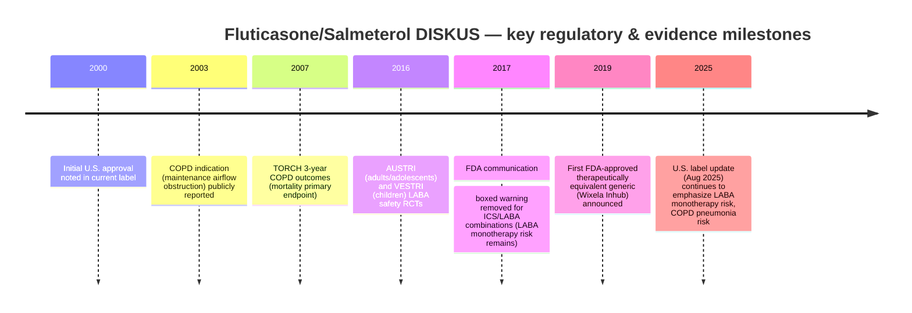

# Discus Advanced Care Deep Research Report

## Executive summary

Publicly accessible regulatory databases and the peer‑reviewed respiratory literature do not clearly identify a marketed inhaled drug named **“Discus Advanced Care.”** Because your requested deliverables (approved indications/ages, dosing, PK/PD, RCTs, and comparisons with inhaler therapies) imply a regulated inhaled medicine delivered via a “Discus/Diskus”-type device, this report analyzes the closest well‑defined match: **fluticasone propionate + salmeterol inhalation powder delivered in a DISKUS®/Accuhaler® dry‑powder inhaler** (marketed as **Advair Diskus** in the entity["country","United States","north america"] and as **Seretide Accuhaler/Diskus** in the entity["country","United Kingdom","europe"] and other markets). This combination has extensive official labeling and large RCT evidence in asthma and COPD. citeturn15view0turn10search2turn10search30

Key findings, oriented to clinician decision‑making:

- **Product & device**: Fixed‑dose inhaled corticosteroid/long‑acting β2‑agonist (ICS/LABA) dry‑powder inhaler, breath‑actuated; formulation contains **lactose monohydrate (with milk proteins)**. citeturn15view0turn16view2  
- **Indications & ages (U.S.)**: Twice‑daily maintenance treatment of **asthma (≥4 years)** and **COPD maintenance / exacerbation reduction** (approved COPD dose is **250/50 twice daily**). citeturn15view0turn16view2  
- **Asthma efficacy**: In 12‑week RCTs, combination therapy improved FEV₁ more than components or placebo (e.g., +0.51 L / +25% vs smaller gains on monotherapy/placebo) and reduced withdrawals for worsening asthma (e.g., 3% vs 11–49%). citeturn19view1  
- **Serious asthma safety**: Large safety RCTs (AUSTRI/VESTRI) found **no significant increase** in serious asthma‑related events for fluticasone+salmeterol vs fluticasone alone; exacerbations were reduced in adults/adolescents (HR ~0.79) and numerically reduced in children (HR ~0.86). These trials underpinned regulatory messaging that **LABA risk is primarily with LABA monotherapy**, not fixed ICS/LABA. citeturn21search0turn21search2turn22view0turn11search2  
- **COPD efficacy**: In replicate 12‑month trials, the 250/50 dose reduced annual moderate/severe COPD exacerbation rates by ~30% vs salmeterol; in a 3‑year survival study (TORCH), all‑cause mortality was numerically lower vs placebo but did **not** meet conventional statistical significance. citeturn22view0turn10search3  
- **Key safety trade‑off in COPD**: Increased pneumonia risk—e.g., 1‑year COPD trials: pneumonia 7% on 250/50 vs 3% on salmeterol; risk higher in older adults. citeturn20view1  
- **Comparative landscape**: Lower‑cost **generic fluticasone/salmeterol** options exist (e.g., Wixela Inhub and other generics), while once‑daily and triple‑therapy inhalers (e.g., Trelegy; Breztri) have different indications, dosing frequency, and higher typical cash prices. citeturn11search3turn24search24turn24search2turn24search3  

## Scope, assumptions, and regulatory status by region

### Assumptions used

1. “Discus Advanced Care” refers to a **DISKUS/Accuhaler‑type dry powder inhaler therapy** rather than a non‑drug product or non‑respiratory use of “Discus.”  
2. The most clinically relevant match is **fluticasone propionate/salmeterol** delivered via DISKUS (Advair Diskus / Seretide Diskus/Accuhaler), because it is the best‑documented DISKUS‑based therapy with extensive official labeling and RCT data. citeturn15view0turn10search2  

If you can share **active ingredients, strength(s), NDC/DIN, country, or a label photo**, the analysis can be narrowed to the exact product.

### Regulatory status snapshot

- **United States (FDA‑regulated labeling)**: Current professional labeling (updated Aug 8, 2025) describes asthma and COPD indications and dosing; initial U.S. approval dates back to 2000. citeturn16view5turn16view2  
- **European context**: The entity["organization","European Medicines Agency","eu medicines regulator"] maintains historical EU referral documentation for Seretide Diskus; UK SmPCs (e.g., Seretide Accuhaler) describe COPD indication constraints (e.g., FEV₁ threshold and repeated exacerbations) and dosing. citeturn10search30turn10search2  
- **Canada**: Product registration and official monograph access are provided via entity["organization","Health Canada","canada health regulator"] registries; Advair is listed as containing fluticasone propionate and salmeterol xinafoate. citeturn10search9turn10search13  

### Regulatory / evidence timeline (mermaid)



Rationale for timeline elements is supported by the current U.S. label, major RCT publications, and FDA safety communications. citeturn16view5turn10search3turn21search0turn21search2turn11search2turn11search3  

## Product description: formulation, mechanism, and device type

### Formulation and device type

The therapy analyzed here is an **inhaled dry powder formulation** contained in a **multidose DISKUS inhaler**. Each blister delivers a fixed dose of **fluticasone propionate (ICS)** and **salmeterol (LABA)**; the inactive ingredient is **lactose monohydrate**, which **contains milk proteins** (clinically relevant for hypersensitivity). citeturn15view0turn16view2  

The DISKUS is a **breath‑actuated** dry‑powder inhaler (DPI): drug delivery depends on the patient generating adequate inspiratory flow and maintaining correct handling steps (open → load dose → exhale away → inhale forcefully/deeply). citeturn8search10turn8search1turn15view0  

image_group{"layout":"carousel","aspect_ratio":"1:1","query":["Advair Diskus inhaler device photo","Wixela Inhub inhaler device photo","Trelegy Ellipta inhaler device photo","Symbicort inhaler metered dose inhaler photo"],"num_per_query":1}

### Mechanism of action and pharmacodynamics

- **Fluticasone propionate (ICS)** provides anti‑inflammatory effects in the airways, reducing airway inflammation that drives asthma and (in selected COPD phenotypes) exacerbations. citeturn15view0turn10search2  
- **Salmeterol (LABA)** produces prolonged bronchodilation (≈12 hours), helping to prevent bronchospasm and improve airflow. citeturn10search2turn10search6turn15view0  

The combination is intended for **maintenance** control; it is **not** for acute bronchospasm relief. citeturn15view0turn16view5  

## Approved indications, age groups, dosing regimens, and PK/PD

### Indications and age groups

**U.S. labeling (Advair Diskus)** indicates:  
- **Asthma**: twice‑daily treatment in patients **≥4 years**; intended for patients not adequately controlled on an ICS or whose disease warrants ICS/LABA initiation. citeturn15view0turn16view2  
- **COPD**: maintenance treatment of airflow obstruction and reduction of exacerbations; **250/50 twice daily** is the only approved COPD dosage in the U.S. label. citeturn15view0turn16view5turn15view0  

**UK SmPC example (Seretide Accuhaler)** explicitly constrains COPD use to symptomatic patients with **FEV₁ <60% predicted** and repeated exacerbations despite regular bronchodilator therapy. (This illustrates regional labeling nuance clinicians should verify locally.) citeturn10search2  

### Dosing regimens

**U.S. dosing (maintenance; not rescue):**  
- Age **≥12 years (asthma)**: 1 inhalation **twice daily** of 100/50, 250/50, or 500/50 based on severity; max 500/50 twice daily. citeturn15view0turn16view2  
- Age **4–11 years (asthma)**: 1 inhalation **100/50 twice daily**. citeturn15view0turn16view2  
- **COPD**: 1 inhalation **250/50 twice daily**. citeturn15view0turn16view2  

Standard counseling points in labeling include **mouth rinsing** after use (to reduce oropharyngeal candidiasis) and avoidance of **additional LABA**‑containing therapy. citeturn15view0turn16view5  

### Pharmacokinetics and clinically important interactions

The U.S. label describes systemic exposure and drug–drug interactions relevant to real‑world prescribing:

- **Salmeterol exposure**: steady‑state systemic exposure data (AUC) are reported; pediatric exposure can differ from adults in population PK analyses. citeturn20view4  
- **Strong CYP3A4 inhibitors**:
  - **Ritonavir + fluticasone** markedly increases fluticasone exposure and substantially reduces serum cortisol AUC (adrenal suppression signal). citeturn20view4  
  - **Ketoconazole + salmeterol** increased salmeterol exposure dramatically (reported ~16‑fold AUC increase), raising concern for systemic β‑agonist effects. citeturn20view4  

Clinical implication: avoid or use extreme caution with potent CYP3A4 inhibitors (especially in patients at risk for adrenal suppression or cardiovascular effects), consistent with label warnings. citeturn20view4turn16view2  

## Clinical efficacy evidence base

### Trial summary tables

#### Asthma: efficacy and LABA safety trials

| Study | Population | Design / comparator | Key endpoints | Results (effect sizes) |
|---|---|---|---|---|
| Trial 1 (Advair Diskus 100/50) | Asthma; previously on ICS or salmeterol; 12 weeks | Placebo‑controlled; compared with fluticasone 100, salmeterol 50, placebo | Withdrawal for worsening asthma; FEV₁; PEF; AQLQ | Withdrawal: **3%** vs 11% (FP) vs 35% (SAL) vs 49% (placebo). FEV₁ improvement: **+0.51 L (25%)** vs +0.28 L (FP) vs +0.11 L (SAL) vs +0.01 L (placebo). citeturn19view1turn20view2 |
| Trial 2 (Advair Diskus 250/50) | Asthma on ICS; 12 weeks | Placebo‑controlled; compared with FP 250, SAL 50, placebo | Withdrawal; FEV₁; PEF; AQLQ | FEV₁ improvement: **+0.48 L (23%)** vs +0.25 L (FP) vs +0.05 L (SAL) vs **−0.11 L** (placebo). Withdrawal: **4%** vs 22% (FP) vs 38% (SAL) vs 62% (placebo). citeturn19view1 |
| AUSTRI | Adolescents/adults with asthma | Fixed‑dose FP/SAL vs FP | Primary: serious asthma‑related events (death/intubation/hospitalization); efficacy secondary: severe exacerbations | “No significantly higher risk” of serious asthma events with FP/SAL vs FP (non‑inferiority design); severe exacerbations reduced. citeturn21search0turn22view0 |
| VESTRI | Children 4–11 with asthma | Fixed‑dose FP/SAL vs FP | Primary: serious asthma‑related events; efficacy secondary: severe exacerbations | Serious events similar; severe exacerbations HR **0.86** (95% CI 0.73–1.01) in published trial; label reports HR 1.29 (serious events, non‑inferiority) and exacerbation HR 0.86 (secondary). citeturn21search2turn22view0turn20view3 |

Interpretation: For asthma maintenance therapy, fixed‑dose fluticasone/salmeterol via DISKUS improves lung function and symptom‑related outcomes compared with components/placebo, and large prospective safety trials support that **serious asthma‑related risk is not increased** versus ICS alone when LABA is delivered **only in combination** (consistent with FDA’s class‑wide conclusions). citeturn19view1turn11search2turn22view0  

#### COPD: lung function, exacerbations, survival

| Study / evidence | Population | Comparator(s) | Key endpoints | Results (effect sizes) |
|---|---|---|---|---|
| 24‑week COPD lung‑function trials (label summary) | COPD with chronic bronchitis; mean pre‑BD FEV₁ ~41% predicted | FP, SAL, placebo | Predose & postdose FEV₁ | Predose endpoint FEV₁: **+165 mL (17%)** vs SAL +91 mL (9%) and placebo +1 mL (1%). Postdose endpoint FEV₁: **+281 mL (27%)** vs FP +147 mL (14%) and placebo +58 mL (6%). citeturn22view0 |
| Two replicate 12‑month exacerbation trials (250/50) | COPD; pre‑BD FEV₁ ~33% predicted; ≥1 moder/severe exacerbation prior year | 250/50 vs salmeterol; run‑in on 250/50 for 4 weeks | Annual rate of moderate/severe exacerbations; OCS‑treated exacerbations | Annual moderate/severe exacerbation rate reduced **~30.5%** and **~30.4%** vs salmeterol (both P<0.001). OCS‑treated exacerbations reduced **~39.7%** and **~34.3%** vs salmeterol (P<0.001). citeturn22view0 |
| TORCH (3‑year survival trial) | COPD; age 40–80; pre‑BD FEV₁ <60% predicted | FP/SAL 500/50 vs placebo vs components | Primary: all‑cause mortality; secondary: exacerbations, health status, spirometry | NEJM‑published TORCH: mortality not significantly reduced vs placebo; label reports all‑cause mortality **12.6% vs 15.2%** (combo vs placebo). citeturn10search3turn22view0 |

Interpretation: In COPD populations enriched for airflow limitation and exacerbation risk, fluticasone/salmeterol improves lung function and reduces exacerbations versus bronchodilator monotherapy, while mortality benefit is at most modest and did not meet statistical significance in TORCH. citeturn22view0turn10search3  

## Safety profile, adverse events, contraindications, and precautions

### Contraindications

U.S. labeling contraindicates use in:  
- **Primary treatment of status asthmaticus / acute episodes requiring intensive measures**. citeturn15view0  
- **Severe hypersensitivity to milk proteins** (lactose excipient contains milk proteins) or hypersensitivity to fluticasone propionate, salmeterol, or excipients. citeturn15view0turn16view2  

### Clinically important adverse events and precautions

**Local steroid effects**: Oropharyngeal candidiasis can occur; routine counseling includes mouth rinsing and monitoring. citeturn15view0turn16view5  

**COPD pneumonia risk (high‑impact safety signal)**:  
- In two replicate 1‑year COPD trials, pneumonia incidence was **7%** on 250/50 vs **3%** on salmeterol; risk higher in patients >65 years. citeturn20view1  
- In a 3‑year COPD trial, pneumonia incidence was higher in the combination group than placebo and higher in older participants. citeturn20view1  

**Systemic corticosteroid effects**: Risk of hypercorticism/adrenal suppression in susceptible individuals at high doses or with interacting drugs; taper systemic steroids cautiously when transitioning. citeturn15view0turn20view4  

**LABA safety framing**: FDA concluded that ICS/LABA combinations do **not** show a significant increase in serious asthma outcomes vs ICS alone, and removed the boxed warning from ICS/LABA combination labels; LABA monotherapy warnings remain relevant. citeturn11search2turn11search18turn15view0  

**Drug–drug interactions (CYP3A4 inhibitors)**: Significant interaction signals with ritonavir (fluticasone) and ketoconazole (salmeterol), supporting avoidance/caution and monitoring for systemic effects. citeturn20view4  

## Patient selection, adherence, and technique considerations

### Patient selection criteria

**Asthma (maintenance ICS/LABA via DISKUS)**  
Patients most aligned with labeling and evidence include those with persistent asthma **not adequately controlled on an ICS** or for whom severity warrants ICS/LABA initiation; once controlled, periodic reassessment and **step‑down** is advised in labeling to minimize exposure while maintaining control. citeturn16view5turn15view0  

**COPD (ICS/LABA role)**  
Label‑supported COPD use is best aligned to patients with:  
- Clinically confirmed COPD with airflow limitation (often moderate‑to‑severe), and  
- A history of exacerbations where ICS‑containing therapy is expected to reduce exacerbations, balanced against pneumonia risk. citeturn22view0turn20view1  

### Adherence and technique problems that commonly erode benefit

**Device‑dependent dose delivery**: DPIs require adequate inspiratory flow and correct sequencing (load dose, exhale away, inhale strongly/deeply). Technique errors (e.g., exhaling into the device, not inhaling forcefully enough, failing to hold device level) can reduce deposition and perceived effectiveness. citeturn8search1turn8search10  

**Regimen adherence**: Twice‑daily maintenance dosing is effective in trials and labeling, but real‑world adherence often declines with complex regimens; counseling should include linking use to daily routines and ensuring the patient has a separate rescue inhaler when indicated. citeturn15view0turn16view5  

### Practical flowchart for selecting and implementing DISKUS ICS/LABA

```mermaid
flowchart TD
  A[Confirm diagnosis] --> B{Asthma or COPD?}

  B -->|Asthma| C{Age >= 4 years?}
  C -->|No| C0[Not indicated in U.S. label; choose alternative] 
  C -->|Yes| D{Uncontrolled on low/med ICS or needs step-up?}
  D -->|No| D0[Continue ICS; reassess/step down if stable]
  D -->|Yes| E[Start/continue ICS-LABA maintenance (DISKUS) + ensure rescue SABA]
  E --> F[Teach technique + check inspiratory ability]
  F --> G[Reassess control, side effects, adherence; consider step-down when stable]

  B -->|COPD| H{Exacerbations + symptomatic burden?}
  H -->|No| H0[Prefer bronchodilator-focused regimen]
  H -->|Yes| I[Consider ICS-LABA if exacerbation reduction expected]
  I --> J[Assess pneumonia risk factors; counsel patient]
  J --> K[Monitor exacerbations, infections, technique, adherence]
```

This flow aligns with U.S. labeling for asthma/COPD and emphasizes technique and safety monitoring essential for DPIs and ICS exposure. citeturn15view0turn20view1turn8search10  

## Comparison with competing inhaler therapies and practical clinician recommendations

### Comparative table: features, evidence highlights, safety, and cost/availability

*Notes:* Costs below reflect **GoodRx cash price snapshots** (highly variable by pharmacy, region, and insurance). “Availability” refers to presence/absence of generics noted by GoodRx and FDA‑reported generic approvals. citeturn24search0turn24search24turn24search2turn24search3  

| Therapy (example brand) | Class | Device | Dosing frequency | Indications / ages (U.S. label) | Evidence highlights (from official labeling / major trials) | Key safety considerations | Cost & availability signals |
|---|---|---|---|---|---|---|---|
| Fluticasone propionate / salmeterol DISKUS (Advair Diskus and generics) | ICS/LABA | DPI (DISKUS‑type) | **BID** | Asthma ≥4; COPD maintenance/exacerbations (COPD dose 250/50 BID) citeturn15view0turn16view2 | Asthma: improved FEV₁ and reduced worsening withdrawals vs components/placebo. COPD: ~30% exacerbation reduction vs salmeterol; TORCH mortality not significantly improved. citeturn19view1turn22view0turn10search3 | COPD pneumonia risk increased; milk‑protein hypersensitivity contraindication; CYP3A4 interaction concerns. citeturn20view1turn20view4 | Brand prices vary; generics available (fluticasone/salmeterol as low as ~$64.50 in GoodRx examples). citeturn24search0turn24search24turn24search16 |
| Budesonide / formoterol (Symbicort + generics) | ICS/LABA | pMDI | **BID** | Asthma ≥6; COPD (adult) per labeling excerpts citeturn23search0turn23search4 | Widely used ICS/LABA alternative; dosing for pediatric asthma described in label excerpts. citeturn23search0 | ICS adverse effects; LABA monotherapy risk framing remains in patient materials; ensure correct MDI technique. citeturn23search4turn23search0 | GoodRx shows prices starting near ~$97 for some listings; generics (budesonide/formoterol; Breyna) noted. citeturn24search1turn24search9turn24search5 |
| Fluticasone furoate / vilanterol (Breo Ellipta) | ICS/LABA | DPI (ELLIPTA) | **Once daily** | COPD maintenance; asthma ≥5 citeturn23search3 | Once‑daily ICS/LABA alternative; pediatric asthma trial basis mentioned in labeling excerpt. citeturn23search3 | Similar ICS class issues; not for acute bronchospasm. citeturn23search3 | Often higher cash price than generic FP/SAL; GoodRx shows ongoing pricing variability. citeturn24search8turn24search16 |
| Fluticasone furoate / umeclidinium / vilanterol (Trelegy Ellipta) | ICS/LAMA/LABA | DPI (ELLIPTA) | **Once daily** | COPD maintenance; asthma ≥18 citeturn23search1 | Triple‑therapy option; labeling indicates COPD + adult asthma maintenance use. citeturn23search1 | ICS pneumonia risk considerations in COPD; anticholinergic adverse effects; not for acute symptoms. citeturn23search1turn11search1 | No generic alternatives noted on GoodRx; high typical cash prices (~$660+ in examples). citeturn24search2 |
| Budesonide / glycopyrrolate / formoterol (Breztri Aerosphere) | ICS/LAMA/LABA | pMDI | **BID** | COPD maintenance; **not for asthma** citeturn23search6turn23search10 | Labeling/medical info describe COPD maintenance use; clinical program reports lung function endpoints. citeturn23search10turn23search6 | COPD triple‑therapy risks: pneumonia (ICS), anticholinergic effects; not a rescue inhaler. citeturn23search6turn23search10 | No generic alternatives noted; GoodRx examples show ~$646+ starting prices. citeturn24search3 |

### Practical recommendations for clinicians

**Clarify the intended product and device early.** “DISKUS/Accuhaler” products exist across regions and strengths; ensure the patient is receiving the expected formulation/strength and understands it is **maintenance**, not rescue. citeturn15view0turn8search10  

**Asthma: reserve fixed ICS/LABA (like FP/SAL DISKUS) for step‑up therapy; step down when stable.** Labeling indicates it should be used for patients not controlled on an ICS, and reassessed periodically for possible step‑down. citeturn16view5turn15view0  

**COPD: weigh exacerbation benefit against pneumonia risk (especially in older adults).** The label documents higher pneumonia incidence in COPD trials, particularly in patients >65 years, while also showing substantial exacerbation reductions in high‑risk populations. citeturn20view1turn22view0  

**Avoid unsafe duplication and manage interactions.** Ensure the patient is not also prescribed another LABA‑containing product. Review concomitant CYP3A4 inhibitors (e.g., ritonavir, ketoconazole) that may meaningfully increase systemic exposure to one or both components. citeturn15view0turn20view4  

**Technique coaching is a core “efficacy multiplier.”** For DPIs, confirm the patient can generate adequate inspiratory effort and demonstrate correct steps; for MDIs, confirm actuation–inhalation coordination (or consider spacer‑compatible options when appropriate—note spacers are not used with DISKUS‑type DPIs). citeturn8search1turn8search10turn16view5  

**Cost‑sensitive prescribing: consider therapeutically equivalent generics when appropriate.** FDA‑recognized generic entry for fluticasone/salmeterol DISKUS‑equivalent products has been publicly announced, and GoodRx pricing suggests generics can be materially cheaper than branded inhalers; nonetheless, local formulary and device preference determine real access and adherence. citeturn11search3turn24search24turn24search0  

### Selected primary/official sources used (inline‑cited above)

- U.S. prescribing information for Advair Diskus via entity["organization","DailyMed","drug label database"] (updated Aug 8, 2025). citeturn16view5turn15view0  
- FDA drug safety communication on ICS/LABA boxed warning removal and serious asthma outcome trials. citeturn11search2turn11search18  
- AUSTRI and VESTRI RCTs in entity["organization","New England Journal of Medicine","medical journal"]. citeturn21search0turn21search2  
- TORCH COPD survival trial (NEJM). citeturn10search3  
- UK SmPC example for Seretide Accuhaler (regional indication nuance). citeturn10search2  
- Generic approval/availability and price benchmarks (GoodRx and public company/FDA communications). citeturn11search3turn24search24turn24search2turn24search3  
- Manufacturer and labeling sources for comparator therapies; entity["company","GlaxoSmithKline","pharma company"] and entity["company","AstraZeneca","pharma company"] product sites and DailyMed label excerpts. citeturn23search1turn23search6turn23search3turn23search0