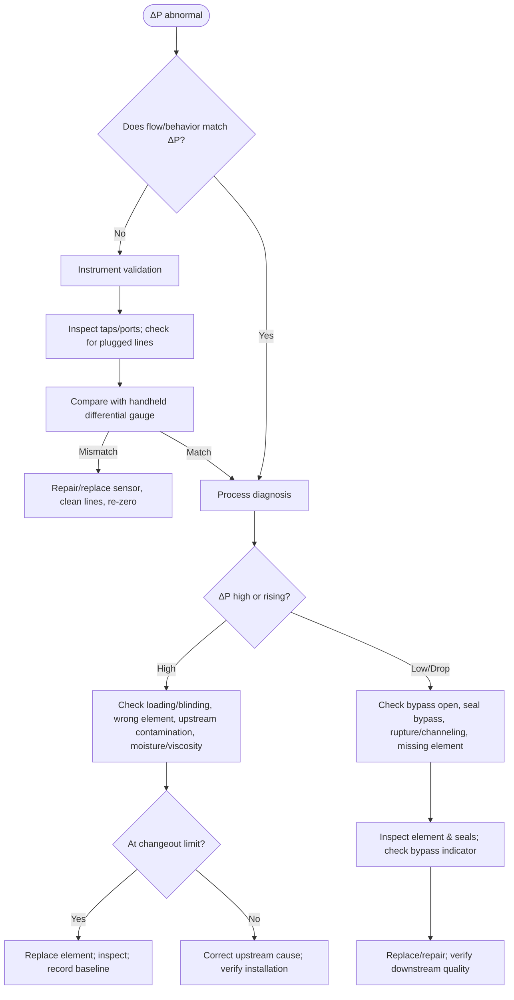
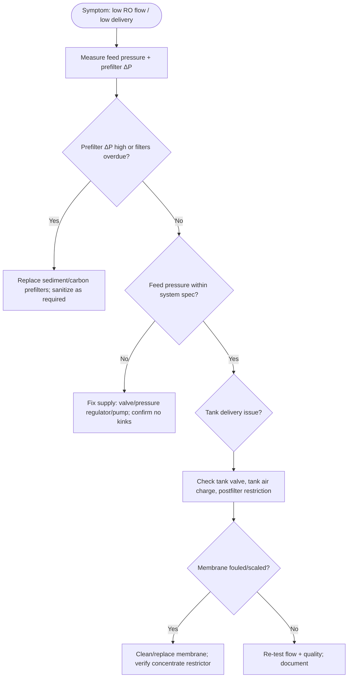

# Comprehensive Troubleshooting Decision Tree for Filters

## Executive summary

A “one-size-fits-all” filter troubleshooting approach fails because filters behave differently across fluids (air vs. liquids), driving forces (fans/pumps), and protection goals (equipment protection, product quality, health/safety). A comprehensive decision tree should therefore be **measurement-led** and **threshold-driven**, using a small set of high-signal observables to converge quickly on root causes:

- **Differential pressure (ΔP) across the filter** is the primary health indicator for most particulate filters, but it must be interpreted alongside **flow**, **fluid viscosity/temperature**, and **instrument validity** (false ΔP readings are common in dirty service, especially with plugged impulse lines). citeturn2search3turn3search18  
- **Bypass events** (intentional or inadvertent) can make filtration ineffective even when ΔP is “normal.” In hydraulic and lube systems, bypass opens when ΔP exceeds the bypass valve rating; some indicator designs actuate at ~80% of bypass cracking pressure (application-specific). citeturn2search2turn2search5turn2search38  
- For HVAC air filters, **manufacturer final resistance** is the governing changeout criterion; a common manufacturer recommendation is **max final ΔP ≈ 1.0 in. w.g. (≈250 Pa)** and/or **replace at ~2× initial ΔP**, but equipment static-pressure capability can force earlier replacement. citeturn6search0turn6search1turn6search7  
- For many bag/cartridge liquid filtration applications, practical operator guidance commonly uses **changeout around 15 psid** (with some bag guidance citing **20–25 psid** as a rule-of-thumb), emphasizing continuous headloss/flow recording. citeturn3search16turn3search23turn3search1  
- High-efficiency/critical air filtration (HEPA/ULPA) must be validated by **integrity/leak testing** using recognized test methods (e.g., cleanroom test methods and recommended practices), with field examples demonstrating pass/fail based on penetration and pressure-drop requirements. citeturn1search1turn1search2turn7view0  

The recommended decision-tree architecture is:

1) **Safety + system identification** (air vs. liquid; hazardous dust/chemicals; pressure/temperature hazards). citeturn4search0turn5search11  
2) **Instrument validity check** (ΔP gauge/sensor, impulse lines, taps, calibration). citeturn3search18  
3) **Symptom-based branching** (high ΔP, low ΔP, low flow, quality breakthrough, leaks/noise/vibration).  
4) **Targeted tests with explicit pass/fail criteria** anchored to standards, manufacturer limits, and baseline trending. citeturn2search3turn6search0turn3search16  
5) **Corrective action + verification** (post-fix ΔP/flow/quality confirmation; root-cause prevention loop).

## Filter types and operating contexts

“Filter” here includes devices intended to remove particulate, droplets/aerosols, or dissolved/adsorbed contaminants. The decision tree should begin by classifying the filtration context because it determines which measurements are decisive and which failure modes dominate.

### Common filter families to include by default

- **General ventilation / HVAC air filters** (panel/pleated, bag/pocket, V-bank; often rated by standardized test methods and classifications). citeturn6search19turn5search0  
- **High-efficiency air filters** (HEPA/ULPA, cleanroom and critical exhaust/supply). citeturn5search1turn1search1turn1search2  
- **Hydraulic fluid power filtration** (pressure/return/offline “kidney loop”; often specified by multipass efficiency and cleanliness targets). citeturn0search17turn0search23  
- **Lubricating oil filtration** (industrial lube systems and engine full-flow filters; tested by multi-pass particle counting methods and bypass testing). citeturn5search17turn5search29  
- **Water filtration**  
  - Point-of-use / point-of-entry treatment (typically performance-certified to drinking-water standards) citeturn1search3turn1search11  
  - Bag/cartridge filtration in small systems and plants (often headloss-triggered changeout guidance) citeturn3search16  
- **Industrial process filtration** (liquid bag/cartridge housings, lenticular modules; dust collectors/baghouses for air streams). citeturn3search23turn3search7  

image_group{"layout":"carousel","aspect_ratio":"16:9","query":["HVAC pleated air filter in air handler","HEPA filter in cleanroom housing","hydraulic return line filter assembly with differential pressure indicator","industrial liquid bag filter housing with pressure gauges","spin-on engine oil filter cutaway","reverse osmosis undersink prefilter housings"],"num_per_query":1}

### Operating variables to capture at the top of the decision tree

These variables determine how to interpret symptoms and set pass/fail thresholds:

- **Flow regime and driver**: fan curve vs. pump curve behavior affects whether restriction shows up as “low flow” or “high energy draw.” citeturn6search7turn2search3  
- **Fluid properties**: viscosity and temperature strongly affect clean ΔP in hydraulics/lube systems; cold starts can force bypass events. citeturn2search5turn2search2  
- **Contaminant type**: fibrous dust, sticky aerosols, moisture, or biological growth can cause rapid blinding or erratic ΔP. citeturn3search15turn6search7  
- **Risk class**: combustible dust (explosion hazard), toxic dusts, pathogens, corrosives—drives safety controls and containment requirements. citeturn5search11turn5search3turn4search6  
- **Performance target**: equipment protection (cleanliness code), indoor air quality, potable water quality, or product/process spec. citeturn0search23turn1search3turn6search16  

## Failure modes and symptom signatures

A cross-type failure taxonomy helps you build reusable decision-tree logic. The table below prioritizes failure modes that (a) are common across filter categories and (b) lead to distinct, measurable symptoms.

### Cross-type failure mode matrix (symptoms → tests → fixes)

| Failure mode | High-signal symptoms | Primary diagnostic tests | Pass/fail criteria (generic, then type-specific examples) | Corrective actions | Prevention controls |
|---|---|---|---|---|---|
| Progressive **loading / clogging / blinding** | Rising ΔP; falling flow; higher fan/pump work; in dust collectors ΔP rises outside historical band | Measure ΔP at rated/typical flow; trend vs. baseline | **Fail** when ΔP exceeds manufacturer “final resistance” / system limit; examples: HVAC pleats often capped at **~1.0 in. w.g.** and/or **~2× initial ΔP** citeturn6search0turn6search1; bag/cartridge liquid filters often changed at **~15 psid** guidance citeturn3search16; bag filters rule-of-thumb **20–25 psid** in some operating guidance citeturn3search23 | Replace element; correct upstream contamination source; verify correct size/media and proper seating | Install ΔP monitoring; add prefiltration; control moisture/dew point in baghouses citeturn3search15 |
| **Bypass open** (intentional) | Downstream quality worsens without proportional ΔP rise; indicator trips | Check bypass indicator/gauge; correlate with oil temperature/viscosity and flow | **Fail** if bypass open during normal operation; in hydraulics bypass opens when ΔP exceeds bypass rating citeturn2search2; standard assemblies often have bypass cracking pressure **~25–100 psi (1.7–6.9 bar)** citeturn2search5; some indicators designed to actuate at ~**80%** of bypass cracking pressure citeturn2search38 | Replace element; address cold-start viscosity (warm-up, correct oil grade, heater); verify indicator setpoint matches housing design | Use temperature-suppressed indicators where appropriate; condition oil cleanliness targets (particle counts) citeturn0search17turn1search8 |
| **Seal leakage / bypass around element** (unintended) | Contaminant breakthrough with “normal” ΔP; visible dust tracks/dirty downstream; in HVAC whistling or dirt streaks at frames | Visual inspection of gasket compression; smoke/trace tests (air); downstream particle/turbidity sampling (liquids) | **Fail** if downstream contamination increases without corresponding upstream load; for critical air, integrity testing is required by recognized methods citeturn1search1turn1search2 | Re-seat, replace gaskets/O-rings; correct housing clamp torque/alignment; repair rack/knife-edge seals | Use containment housings for hazardous dust; verify installation SOP and torque specs |
| **Media rupture / collapse / channeling** | Sudden ΔP drop (or erratic swings), sudden downstream contamination spike; in baghouses a sudden DP drop can indicate bag leak/rupture | Inspect element; differential signature check; particle counts upstream/downstream; bag leak detection where applicable | **Fail** if ΔP abruptly decreases and emissions/contamination rise; EPA provides guidance on bag leak detection monitoring approaches citeturn3search11; baghouse DP <~2 in. w.g. can be an alarm trigger (application-specific; use historical baseline) citeturn3search14 | Replace element; investigate pressure surges, moisture, chemical incompatibility; correct cleaning-cycle faults (baghouse) | Surge control; dew-point margin; correct media selection/compatibility citeturn3search15 |
| **Adsorber saturation / chemical breakthrough** (e.g., carbon) | Odor/taste returns; chlorine breakthrough; ΔP may be normal | Field chemistry strips/probes; compare effluent to influent | **Fail** when treated-water parameter exceeds target; certification standards define reduction claims and scope (use device listing and claim-specific endpoints) citeturn1search3turn1search11 | Replace media/cartridge; confirm correct flow/contact time | Use breakthrough monitoring; avoid exceeding rated flow/volume |
| **Instrument / sensing error** | ΔP reading inconsistent with observed flow/quality; sudden step-change after maintenance; noisy signal | Cross-check with handheld gauge; clean/repair impulse lines, taps, sensor | **Fail** if reference gauge disagrees after line cleaning; baghouse DP troubleshooting emphasizes cleaning/clearing lines then validating against handheld gauge citeturn3search18 | Repair/replace sensor; re-route lines; add purge/heat tracing where needed | Add instrument verification step to PM; document baseline after each changeout |

## Diagnostic tests and measurement procedures

This section defines the test “building blocks” your decision tree should call, including tools, how to measure, and how to set pass/fail criteria without assuming a specific filter model.

### Core measurement set used across most filter types

#### Differential pressure (ΔP) across filter

**Purpose:** Detect loading, confirm bypass threshold approach, verify post-fix restoration.

**Tools:** Magnehelic/differential manometer (air), ΔP transmitter with impulse lines, dual pressure gauges (liquids), or built-in differential indicators. citeturn6search10turn3search18  

**Procedure (generic):**
1) Identify taps immediately upstream and downstream of the filter **housing** (not across additional duct/pipe losses). citeturn2search3  
2) Verify impulse lines/taps are clear; for dusty service, blow-out/clean lines and re-check reading stability. citeturn3search18  
3) Measure ΔP at a known operating point (flow, fan speed, pump speed). Record temperature/viscosity for oils. citeturn2search5turn2search3  

**Pass/fail criteria setting method:**
- Primary: **manufacturer final resistance / changeout ΔP** (preferred). HVAC manufacturer examples commonly specify **max final ΔP ~1.0 in. w.g.** and/or **replace at ~2× initial ΔP** for pleated panel filters; some datasheets explicitly state these values. citeturn6search0turn6search1turn6search13  
- Secondary (if manufacturer value unavailable): **baseline-trend rule** (e.g., alarm on ΔP rate-of-rise, or ΔP reaching a facility-defined limit) aligned to system capability; ASHRAE guidance emphasizes replacing filters at final (maximum recommended) pressure drop and warns about offloading at very high dust loads. citeturn6search7  
- For hydraulic/lube: interpret ΔP using **ISO test characterization** (ΔP vs flow) concepts and consider fluid conditions; a dedicated standard exists for evaluating ΔP vs flow behavior of hydraulic filters. citeturn2search3  

#### Flow rate / delivery check

**Purpose:** Distinguish “filter restriction” from upstream/downstream restrictions, fan/pump performance issues, and bypass conditions.

**Tools:** Airflow hood, pitot traverse, anemometer (air); flowmeter, timed draw-down, pump curve data (liquid); RO permeate flow measurement (water). citeturn7view0turn3search33  

**Procedure:** Measure flow at a consistent operating state; correlate with ΔP and driver power.

**Pass/fail criteria:** Use design flow or minimum acceptable flow; if flow is low but ΔP is normal, the filter may not be the restriction (branch in decision tree).

#### Contamination / quality measurement (downstream effectiveness)

**Air (general ventilation):** Often indirect (IAQ metrics) unless performing leak tracing; in critical filtration, integrity testing is direct. citeturn1search1turn1search2  

**Hydraulic / lube oils:** Particle counting and cleanliness code reporting are widely used. The cleanliness code standard reports particle populations at **≥4, ≥6, ≥14 μm** size thresholds (reported as a three-number code). citeturn1search8turn1search20  

**Test tools:** Online or bottle-sample particle counter; sampling ports; lab oil analysis (complements field particle counts). citeturn0search30turn0search23  

**Pass/fail criteria:** Compare measured cleanliness code to component/system target; standards and manufacturer contamination guides support converting counts to code limits. citeturn0search23turn1search8  

**Water:** Use field strips/meters for chlorine, TDS, etc., based on what the filter claims to reduce; certification standards define scopes (aesthetic vs health effects vs RO system performance). citeturn1search3turn1search11  

### Type-specific test procedures (include in the decision tree as callable “subroutines”)

#### HVAC / general ventilation air filters

- **Replace-at-final-resistance logic:** Filters should be replaced when they reach their final (maximum recommended) pressure drop; very high dust loads can cause poor adhesion and particle offloading. citeturn6search7  
- **Typical manufacturer endpoints (examples to anchor your tree):** pleated panel filters commonly list **max final ΔP ~1.0 in. w.g.** and recommended final around **2× initial**; multiple manufacturer datasheets explicitly state this. citeturn6search0turn6search1turn6search13  
- **Energy tradeoff:** Running to final ΔP may maximize filter life but can increase energy costs; NAFA highlights this optimization tension. citeturn6search6  

#### High-efficiency air filters (HEPA/ULPA, cleanrooms)

- Recognized cleanroom test methods specify test suites for cleanrooms and controlled environments, including filter system performance tests. citeturn1search1turn1search37  
- Recommended practices exist specifically for HEPA/ULPA filters, framing performance and verification expectations between suppliers and users. citeturn1search2turn1search6  
- Field/peer-reviewed evidence shows alternate integrity testing methods (e.g., ultra-low aerosol challenge with particle counting) can reduce loading risk on certain media while still detecting leaks. citeturn8view0  

**Practical measurement outputs your tree should support:** upstream challenge concentration verification, scan pattern coverage, measured penetration %, and documented repairs/retests. citeturn7view0turn8view0  

#### Hydraulic filtration

- Multi-pass methods are standardized to evaluate filtration performance (efficiency, contaminant capacity, ΔP characteristics) for hydraulic filter elements. citeturn0search17turn0search10  
- ΔP vs flow evaluation is standardized for hydraulic filters; in practice, interpret ΔP with viscosity and flow context. citeturn2search3turn2search5  
- Bypass behavior is central: when ΔP exceeds bypass valve rating, flow can bypass the element and become unfiltered. citeturn2search2turn2search5  
- Differential pressure indicators are often specified in discrete settings (e.g., 1.2 bar, 2.5 bar, etc., depending on indicator model), and selection must match system design intent. citeturn2search0turn2search28  

#### Lubricating oil filtration (including engine full-flow filters)

- Standardized methods exist for full-flow oil filter efficiency testing with particle counting and contaminant retention capacity; these tests determine contaminant capacity, particulate removal characteristics, and ΔP under defined conditions. citeturn5search17turn5search2  
- Standard tests also address bypass valve characteristics in oil filters. citeturn5search29  

**Decision-tree implication:** In the field, you often cannot directly measure upstream/downstream particle counts across an engine filter; your tree should therefore treat “oil filter suspected” as a branch that relies more on **oil analysis, pressure indicators (if present), and teardown/inspection** rather than assuming live ΔP taps exist, unless the system is an industrial lube skid.

#### Water bag/cartridge filtration and RO prefiltration

- Operator training guidance for bag/cartridge filtration (drinking water context) commonly uses **pressure drop trigger** for replacement (example teaching point: change cartridge filters when headloss reaches ~15 psi) and emphasizes chart recording and backup filtration for critical pathogen-removal applications. citeturn3search16  
- For residential RO symptoms such as low flow, troubleshooting guidance consistently points to clogged prefilters, low supply pressure, tank issues, and postfilter restrictions as common causes; the decision tree should treat prefilter clogging as first-line. citeturn3search9turn3search33  

#### Industrial process liquid filtration (bag, cartridge, lenticular)

- Bag filter operating guidance often references clean ΔP design values (e.g., ~2–3 psid) and dirty/changeout points around **15 psid** in some manufacturer guidance; other product guidance uses **20–25 psid** as a rule-of-thumb for bag changeout. citeturn3search1turn3search23  
- Filter system sizing references may cite very low initial ΔP (e.g., ~0.5–1 psi) for certain water filter elements, reinforcing the importance of tracking ΔP rise rather than using a single universal number. citeturn3search8  

#### Dust collectors / baghouses (industrial air)

- EPA references describe baghouse/filters as a core control technology and provide monitoring approaches (e.g., bag leak detection guidance). citeturn3search7turn3search11  
- Field guidance and manufacturer resources commonly track an “acceptable” DP operating band and interpret deviations: high DP suggests overloading/cleaning failures; sudden DP drops suggest leaks/ruptures or measurement issues—your tree should demand an **instrument validation step** before declaring a bag failure. citeturn3search15turn3search18turn3search14  

## Decision tree and on-site flowcharts

### Decision tree diagram (Mermaid)

```mermaid
flowchart TD
  A([Start: Filter problem reported]) --> B{Safety & containment required?}
  B -->|Yes| B1[Apply energy control, depressurize/vent, PPE, containment]
  B -->|No| C[Identify: AIR vs LIQUID; filter role; last change; baseline]

  C --> D{Instrument data trustworthy? (ΔP/flow/quality)}
  D -->|No| D1[Verify taps/impulse lines; compare to handheld gauge; fix sensor]
  D1 --> C
  D -->|Yes| E{Primary symptom?}

  E -->|High ΔP or rising ΔP| F{Flow low AND ΔP high?}
  F -->|Yes| F1[Likely loading/blinding; check upstream contamination, moisture, viscosity]
  F1 --> F2{At/above changeout ΔP limit?}
  F2 -->|Yes| F3[Replace element; inspect for damage; record new baseline]
  F2 -->|No| F4[Check for incorrect element, wrong size, installation error, clogged prefilter]
  F -->|No| F5[Restriction may be elsewhere; check valves/dampers/coils/ducts/piping]

  E -->|Low/abnormally dropping ΔP| G{Quality/emissions worse?}
  G -->|Yes| G1[Suspect bypass open, seal bypass, rupture/channeling, missing element]
  G1 --> G2[Test: bypass indicator; inspect seals; integrity test if critical]
  G2 --> G3[Correct: reseat/replace seals; replace element; fix root cause]
  G -->|No| G4[Suspect sensor error or process change; re-verify instrumentation]

  E -->|Low flow but ΔP normal| H[Check pump/fan performance, clogged strainers, closed valves, downstream restrictions]
  H --> H1[Restore flow; re-check ΔP/quality]

  E -->|Contaminant breakthrough (particles/odor/taste)| I{ΔP elevated?}
  I -->|Yes| I1[Loading + possible bypass; replace element; check for offloading]
  I -->|No| I2[Seal leak or media failure; for adsorbers: saturation/breakthrough]
  I2 --> I3[Test downstream quality; verify correct media and rated flow/contact time]
  I3 --> I4[Replace/repair; add monitoring]

  E -->|External leak, noise, vibration| J[Inspect housing, gaskets, cracks; check pressure surges/cavitation]
  J --> J1[Repair/replace; verify pressure relief and operating envelope]

  F3 --> Z([Verify fix: ΔP normal, flow restored, quality meets target, document])
  G3 --> Z
  H1 --> Z
  I4 --> Z
  J1 --> Z
```

### On-site flowchart for differential pressure troubleshooting (instrument + process)

This procedure is intentionally generic so it can be applied to HVAC, baghouses, hydraulic skids, and liquid filter housings.



### On-site flowchart for RO / water “low production” complaints (prefilter-first logic)



## Preventive maintenance and safety

### Preventive maintenance practices that materially improve troubleshooting outcomes

1) **Baseline capture after every changeout**: record ΔP at a known flow, plus temperature/viscosity (oils), and a downstream quality metric where available. This converts troubleshooting from guesswork into deviation detection. citeturn2search3turn2search5turn3search16  

2) **Trend ΔP rather than relying on calendar intervals**: HVAC and industrial filtration guidance repeatedly treats ΔP as the primary life indicator; a fixed schedule is a fallback, not the primary control. citeturn6search7turn3search16turn3search23  

3) **Instrument verification on a defined cadence**: baghouse guidance shows how false readings occur from plugged lines and emphasizes cross-check against handheld gauges after line cleaning. Integrate this as PM, not just reactive troubleshooting. citeturn3search18  

4) **Upstream controls**: moisture control (dew point margin) and cleaning-cycle integrity in baghouses prevents chronic high ΔP and short filter life. citeturn3search15turn3search34  

5) **Hydraulic cleanliness management**: set a target cleanliness code and use sampling/particle counts plus offline filtration when needed; standards define reporting methods and multipass performance evaluation. citeturn1search8turn0search17turn2search26  

### Safety considerations to embed into the decision tree (not an afterthought)

- **Control hazardous energy before servicing**: lockout/tagout applies to servicing/maintenance where unexpected energization or release of stored energy could injure workers. citeturn4search0turn4search8  
- **Compressed air misuse**: OSHA restricts compressed air for cleaning unless reduced to <30 psi and used with effective chip guarding and PPE; incorporate this into impulse-line cleaning and dust removal procedures. citeturn4search1turn4search5turn4search34  
- **Combustible dust**: industrial dust collection systems can involve combustible dust hazards; OSHA combustible dust guidance references NFPA combustible dust standards and program elements. citeturn5search11turn5search3turn5search30  
- **Exposure control**: filter changeout can resuspend captured contaminants; select PPE based on hazard assessment and site conditions (EPA PPE guidance provides a general framework). citeturn4search12turn4search23  

## Validation examples and case-based walkthroughs

The purpose of validation is to prove that the decision tree (a) reaches correct diagnoses with minimal steps and (b) avoids common traps (especially false sensor readings and bypass conditions).

### Case pattern: hydraulic bypass masquerading as “clean filter”

**Scenario:** Downstream component wear increases; particle counts trend worse; ΔP seems modest.

**Tree path:** Low/normal ΔP + quality worse → check bypass indicator and temperature/viscosity context.

**Evidence basis:** Hydraulic filtration guidance explains ΔP port behavior and that when ΔP exceeds bypass valve rating the bypass opens and fluid can flow unfiltered. Standard assemblies commonly have bypass cracking pressures in a wide band (example cited range 25–100 psi). citeturn2search2turn2search5  

**Validation step:** After corrective action (replace element; address cold-start viscosity), confirm downstream cleanliness returns to target code format (reported as ≥4/≥6/≥14 μm code). citeturn1search8turn0search23  

### Case pattern: baghouse DP “failure” caused by plugged DP lines

**Scenario:** DP suddenly spikes, but airflow and emissions appear unchanged.

**Tree path:** Instrument validity check → clean/clear/verify impulse lines → compare to handheld DP gauge.

**Evidence basis:** Baghouse troubleshooting guidance explicitly provides a procedure: disconnect gauges/controllers, clean air lines, check DP with handheld gauge, then reconnect and compare readings to identify sensor/gauge faults. citeturn3search18  

**Validation step:** Only after ΔP is confirmed real does the tree proceed to cleaning system faults, moisture issues, or actual bag blockage/leak pathways. citeturn3search15turn3search34  

### Case pattern: HEPA-grade filter “still OK” by ΔP, but integrity degraded

**Scenario:** ΔP within limits; particulate control performance is questioned.

**Tree path:** Critical filtration branch → integrity/leak testing procedure.

**Evidence basis (field/technical example):** A NASA filter study reports penetration and pressure-drop testing of HEPA-grade elements, including an end-of-life pressure drop requirement and penetration results; all units met a stated pressure drop limit and overall efficiency requirement, and the study discusses leak testing approaches and standards context. citeturn7view0  

**Evidence basis (peer-reviewed/industry):** Pharmaceutical engineering work evaluates an alternate in-situ test method using an ultra-low aerosol challenge and particle counting to detect leaks in ePTFE HEPA filters while reducing loading risk relative to traditional photometer methods. citeturn8view0  

**Validation step:** A passing integrity test plus stable ΔP is considered “verified.” If integrity fails, the corrective action is reseal/repair or replace and re-test.

### Case pattern: RO low flow traced to prefilter restriction

**Scenario:** RO production slows to a trickle.

**Tree path:** RO flowchart → prefilters first → feed pressure → tank/postfilter → membrane.

**Evidence basis:** Residential RO troubleshooting guidance identifies clogged filters as a common cause of slow RO flow and provides stepwise isolation checks (e.g., assessing tank function and postfilter clogging). citeturn3search9turn3search33  

**Validation step:** After prefilter replacement, confirm restored flow and acceptable treated-water metric (TDS reduction claim depends on system/standard scope). citeturn1search11turn3search13  

## Assumptions, limitations, and primary sources

### Assumptions

- No specific filter model is assumed; thresholds are presented as **(a) method to set criteria** + **(b) representative anchors from authoritative manufacturer/operator guidance**. citeturn6search7turn3search16  
- “Pass/fail” is defined as **meeting the system’s performance target** (flow + quality/emissions) **without exceeding safety and equipment limits**, consistent with standards-based testing concepts for ΔP vs flow and filtration performance evaluation. citeturn2search3turn0search17turn5search17  

### Limitations

- Many formal standards are paywalled; where full text is not accessible, this report uses official scope/abstract pages plus manufacturer/operator documentation to define procedures and thresholds. citeturn0search17turn5search0turn5search17  
- Numerical thresholds (e.g., final ΔP) vary by media, depth, face velocity/flow, and housing design; therefore the decision tree should treat values like “1.0 in. w.g.” or “15 psid” as **common anchors**, not universal truths, unless they match your manufacturer/OEM requirements. citeturn6search0turn3search16turn3search23  
- This report focuses on troubleshooting logic and measurements; it does not replace site-specific engineering (e.g., explosive dust hazard analysis, code compliance engineering, or cleanroom certification protocols).

### Example checklists and measurement templates

**Universal on-site troubleshooting checklist (short form)**

| Step | Check | Result | Notes |
|---|---|---|---|
| Safety | Energy sources controlled; pressure relieved; PPE selected | ☐Pass ☐Fail | Align with LOTO and hazard assessment citeturn4search0turn4search12 |
| Identify | Air vs liquid; filter stage; last change; baseline ΔP | ☐Pass ☐Fail | Capture nameplate + element type |
| Instrument | ΔP taps/lines clear; handheld cross-check if needed | ☐Pass ☐Fail | Use DP-line cleaning verification citeturn3search18 |
| Measure | ΔP, flow, temperature/viscosity (oils), downstream quality metric | ☐Pass ☐Fail | Record operating state |
| Diagnose | Follow tree branch to root cause | ☐Pass ☐Fail | Avoid skipping bypass checks in hydraulics citeturn2search2 |
| Fix | Replace/repair; correct upstream cause; reinstall correctly | ☐Pass ☐Fail | Inspect seals and housing |
| Verify | ΔP restored; flow restored; quality meets target | ☐Pass ☐Fail | Document new baseline |

**ΔP / flow trending log template**

| Date/Time | System state (fan/pump speed, valve positions) | Flow | ΔP upstream | ΔP downstream | ΔP (calc) | Temp | Notes/action |
|---|---|---:|---:|---:|---:|---:|---|
|  |  |  |  |  |  |  |  |

**Hydraulic/lube cleanliness sample template (particle count reporting)**

| Date/Time | Sample point | Oil temp | Operating mode | Particle count method | Cleanliness code (3-number) | Target code | Pass/Fail | Notes |
|---|---|---:|---|---|---|---|---|---|
|  |  |  |  |  |  |  |  |  |

(Reporting format aligns to the cleanliness code approach that uses ≥4/≥6/≥14 µm thresholds.) citeturn1search8turn1search20  

**HVAC filter changeout record template (manufacturer-final-resistance aligned)**

| Filter location | Filter type/rating | Initial ΔP at rated flow | Current ΔP | Final ΔP limit | Replace now? | Installation notes |
|---|---|---:|---:|---:|---|---|
|  |  |  |  |  | ☐Yes ☐No |  |

(Use manufacturer limits; examples show 1.0 in. w.g cap and/or 2× initial.) citeturn6search0turn6search1turn6search7  

### Primary/official sources quick links (copy/paste)

```text
ISO standards (official pages):
https://www.iso.org/standard/77245.html   (hydraulic filters multipass method)
https://www.iso.org/standard/9629.html    (hydraulic filters ΔP vs flow evaluation)
https://www.iso.org/standard/57864.html   (air filters for general ventilation)
https://www.iso.org/standard/37261.html   (cleanroom test methods)
https://www.iso.org/standard/62763.html   (engine oil filter multipass efficiency)

ASHRAE (official PDFs used above):
https://www.ashrae.org/File%20Library/Technical%20Resources/COVID-19/52_2_2017_COVID-19_20200401.pdf
https://www.ashrae.org/file%20library/technical%20resources/covid-19/si_s16_ch29aircleanersforparticulates.pdf

OSHA (official standards):
https://www.osha.gov/laws-regs/regulations/standardnumber/1910/1910.147
https://www.osha.gov/laws-regs/regulations/standardnumber/1910/1910.242

NFPA (official standard development pages):
https://www.nfpa.org/codes-and-standards/nfpa-652-standard-development/652
https://www.nfpa.org/codes-and-standards/nfpa-654-standard-development/654

EPA (official documents used above):
https://www.epa.gov/sites/default/files/2020-07/documents/cs6ch1.pdf
https://www.epa.gov/system/files/documents/2025-01/fabric-filter-bag-leak-detection-guidance-9-1997.pdf

NSF (official consumer-facing standards overview and RO standard info):
https://www.nsf.org/consumer-resources/articles/standards-water-treatment-systems
https://www.nsf.org/knowledge-library/nsf-ansi-58-reverse-osmosis-drinking-water-treatment-systems
```