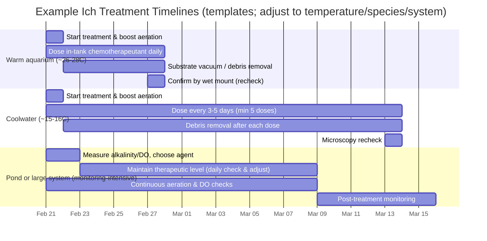

# Freshwater Ich Differential Diagnosis and Evidence-Based Treatment

## Executive summary

Freshwater Ich (white spot disease) in fish is caused by the ciliated protozoan *Ichthyophthirius multifiliis* and is difficult to control because **most of its lifecycle stages are protected from chemotherapeutants**; **only the free‑swimming infective stage (theront) is reliably susceptible to waterborne treatments**, so success depends on **repeated dosing timed to temperature** rather than “one big dose.” citeturn20view2turn10view0turn29view1

The most defensible field diagnostic approach is: **(1) suspect based on compatible clinical signs, but (2) confirm by wet‑mount microscopy** of skin mucus/fin and gill biopsies. Ich trophonts are typically large, ciliated, and often show a **horseshoe‑/C‑shaped macronucleus** with characteristic movement; gill-only disease can be severe with few/no visible spots, so gills must be checked. citeturn20view1turn10view0turn29view1

When parameters are unspecified (as here), treatment must be presented as **options bounded by constraints**. The largest “unknowns” that change therapy choice and dosing risk are: fish species and life stage (e.g., fry vs adults), presence of plants/invertebrates, system type (hobby tank vs public exhibit vs ponds/raceways/RAS), alkalinity and oxygen regime, water temperature, and whether fish are intended for human consumption. citeturn20view2turn10view1turn10view2turn29view1

Across contexts, evidence and guidelines converge on these **first-line controllable levers** (ordered by typical practicality and evidence in real systems):

- **Waterborne repeated chemotherapeutants:** formalin (especially in tanks) and copper (especially ponds; alkalinity‑dependent) are repeatedly cited as effective when dosed correctly and repeated at temperature‑appropriate intervals. citeturn20view2turn24view1turn10view0turn10view1turn29view1  
- **Salinity (salt) manipulation:** can be effective in some freshwater species and systems as a continuous bath, but is species- and plant/invertebrate‑limited and not universally curative; large reviews and field manuals support multi‑day to multi‑week regimens at ~1–5 g/L depending on context. citeturn18search20turn29view1turn10view1  
- **Temperature manipulation:** speeds Ich development (shortening the interval needed for repeated treatments) and may reduce outbreak duration, but is constrained by fish tolerance and oxygen; formalin toxicity increases with higher temperatures, requiring caution if combined. citeturn20view2turn29view1turn24view1

Several commonly discussed agents are **not primary Ich treatments** or are contraindicated in many settings: potassium permanganate is widely used for external infections but may be a poor choice for Ich because frequent treatments can be required while permanganate should not be used more than about weekly due to oxidative gill injury risk; hydrogen peroxide is an approved bath treatment for specific external bacterial/fungal diseases and some parasites, but is not typically the first-line therapy for Ich in freshwater; metronidazole treats intestinal protists (not Ich) and is described as not permitted in food fish (US context). citeturn26view1turn34view3turn10view3turn22search10turn10view1

Regulatory constraints are decisive for food fish: malachite green is **not permitted** for food fish in many jurisdictions due to carcinogenic/genotoxic concern and long‑lasting residues (e.g., conversion to leucomalachite green stored in tissue), whereas formalin and hydrogen peroxide have labeled aquaculture uses with **no required withdrawal time** in US references; copper sulfate and potassium permanganate are listed with **7‑day withdrawal** in a commonly used US veterinary reference table (verify locally). citeturn20view3turn20view5turn10view2turn24view0turn34view3

Primary laboratory methods beyond microscopy are available: multiple PCR/qPCR/ddPCR assays target ribosomal DNA regions and can detect Ich DNA from fish tissues or environmental water samples (eDNA), enabling earlier detection than waiting for heavy spotting, but availability is typically limited to diagnostic labs and research settings. citeturn6view0turn6view1turn6view3

## Etiology and lifecycle

### Causative agent and basic etiology  
Freshwater Ich is caused by *Ichthyophthirius multifiliis*, a ciliate protozoan that invades epithelial tissues of skin and gills. Clinical disease is driven by the parasite’s combination of epithelial damage and rapid population expansion, which can produce severe morbidity and high mortality. citeturn10view0turn20view1turn29view0

### Lifecycle stages and why treatment timing matters  
Across veterinary and aquaculture sources, the lifecycle is described as **direct** (no intermediate host) but **multi‑stage**, with major implications for control:

- **Trophont (feeding stage on fish):** embedded under epithelium; relatively protected from bath treatments. citeturn20view2turn29view1turn10view0  
- **Tomont (encysted reproductive stage off fish):** leaves fish, encysts on substrate/equipment, divides into many progeny within the cyst. citeturn20view2turn29view0turn10view0  
- **Theront (free‑swimming infective stage):** emerges from cyst and must find a host within a limited time; **this is the stage most susceptible to waterborne chemical treatments**, so repeated applications are required to “intercept” successive waves of emerging theronts. citeturn20view2turn10view0turn29view0

### Temperature dependence  
Temperature strongly controls how quickly Ich moves through stages and therefore sets the minimum treatment interval:

- At ~75–79°F (24–26°C), a commonly cited completion time is ~3–6 days and daily treatments are recommended, with at least 3–5 treatments as a minimum. citeturn20view2turn10view0  
- A field manual (silver perch aquaculture) reports lifecycle stages can be **<4 days at >24°C** and **>5 weeks at <7°C**, illustrating why coldwater outbreaks require longer treatment windows. citeturn29view0

## Clinical signs and pathology

### External and behavioral signs  
Typical ichthyophthiriasis signs include:

- **White spots/nodules** on skin and fins (often described as salt grains), plus irritation/“flashing,” increased mucus, anorexia, lethargy, and clamped fins. citeturn20view1turn10view0turn29view0  
- Severe cases may include ragged fins, skin breakdown, and secondary bacterial/fungal complications. citeturn20view1turn29view0

A critical clinical caveat is that **visible white spots are a late and insensitive sign**; by the time spots are easily seen, fish may already be severely compromised. citeturn20view1turn10view0

### Gill-dominant disease  
Gill-only or gill-dominant infestations can cause rapid mortality with few visible skin spots; gills may appear pale and swollen and fish may show respiratory distress. Because of this, relying only on “spots” leads to misdiagnosis and delayed control. citeturn20view1turn10view0

## Diagnostics and differential diagnosis

### Practical diagnostic methods

| Method | What it can and cannot tell you | Turnaround | Typical sensitivity | Notes and constraints |
|---|---|---:|---:|---|
| Visual exam (spots, flashing, respiratory distress) | Suggests Ich but **not confirmatory**; many diseases mimic “white dots.” | Immediate | Moderate/low | Gill-only infections can be missed; “spots” are late. citeturn20view1turn10view0 |
| Wet-mount microscopy (skin mucus/fin + gill biopsy) | **Confirmatory** when characteristic trophonts/theronts are seen; also reveals many differentials (ciliates, flagellates, flukes). | Minutes | High when done early with good sampling | Recommended by multiple guides; sample multiple sites (skin, fin, gill). citeturn20view1turn10view0turn29view1 |
| Histopathology | Confirms tissue invasion and pathology; useful when wet mounts are negative but suspicion remains. | Days | High (depends on sampling) | More common in labs/public aquaria/aquaculture than hobby settings. citeturn10view0turn22search32 |
| PCR/qPCR on tissue | Detects Ich DNA; useful for low-burden/early infections and confirmation when microscopy is equivocal. | 1–7 days | High (assay-dependent) | Multiple assays published targeting rDNA regions; typically lab-based. citeturn6view1turn6view3 |
| Environmental DNA (eDNA) PCR/qPCR/ddPCR on water | Detects parasite DNA in water; supports surveillance and early warning. | 1–7 days | High for detection (quantitation varies) | Demonstrated for Ich in environmental water monitoring; method depends on filtration/extraction and inhibitors. citeturn6view0turn6view3 |

### Wet-mount confirmation: what to look for  
Under a compound microscope, Ich is typically described as **large**, **round**, **ciliated**, often with a **horseshoe-shaped macronucleus**, and can show rotating or amoeboid-like movement. citeturn10view0turn29view1turn20view1

Sampling technique matters: extension guidance describes gently scraping mucus (ideally including spots) and clipping small gill/fin pieces, mounting each in clean, non-chlorinated water and examining promptly—because organisms may detach or become immotile if handled roughly or delayed. citeturn20view1turn29view1

image_group{"layout":"carousel","aspect_ratio":"1:1","query":["Ichthyophthirius multifiliis white spot freshwater fish close-up","Ichthyophthirius multifiliis trophont microscope horseshoe macronucleus","Piscinoodinium pillulare freshwater velvet gold dust appearance","Saprolegnia cotton wool disease fish lesion"],"num_per_query":1}

### Prioritized differential diagnosis list with distinguishing features and decision rules  
The list below is prioritized for the common presenting complaint: **“white spots / flashing / respiratory distress in a freshwater system.”** If salinity is brackish or marine, re-rank accordingly. citeturn20view1turn20view7turn10view0

| Differential | Why it looks similar | Distinguishing features | Quick decision rules |
|---|---|---|---|
| Marine ich (*Cryptocaryon irritans*) | White spot disease in marine fish; lifecycle terms overlap (trophont/tomont/theront). citeturn20view7 | Requires marine conditions; lifecycle timing differs and tomonts can have prolonged/variable development; management differs (e.g., long treatment windows). citeturn20view7turn10view0 | If salinity is marine, do **not** assume freshwater Ich; confirm organism on wet mount and treat per marine protocols. citeturn20view7turn10view0 |
| Velvet (marine *Amyloodinium* spp.) and freshwater “velvet” (*Piscinoodinium*) | Fine “dusting” can resemble tiny white spots; respiratory signs. citeturn2search25 | Typically a **very fine, uniform gold/brown dust** rather than discrete salt grains; often severe gill involvement early. (Marine velvet is a dinoflagellate; biology and treatments differ.) citeturn2search25turn10view0 | If fish are “dusty” more than “spotted,” prioritize gill wet mount; if dinoflagellates/velvet suspected, copper-based protocols differ and urgency is higher. citeturn2search25turn10view3 |
| Columnaris (*Flavobacterium columnare*) | Pale patches can be mistaken for “fungus” or ich; gill disease common. citeturn22search27turn23view0 | Lesions often **patchy/erosive**, “saddleback,” fin erosion; wet mounts show **long thin rods with gliding motion** and “haystacks.” citeturn23view0turn22search27 | If lesions are plaques/erosions rather than discrete nodules, do a lesion wet mount; if bacteria consistent with columnaris, parasite-only treatments won’t resolve the primary problem. citeturn23view0turn22search27 |
| Fungal/water mold infections (e.g., *Saprolegnia* spp.) | White/gray “cotton” on skin or eggs can be mistaken for external parasites. citeturn17search22turn17search0 | Growth is typically **fuzzy filamentous tufts** protruding from tissue; wet mounts show hyphae (water mold/oomycete). citeturn17search22turn17search3 | If the lesion is “cottony” and filamentous rather than pinpoint spots, prioritize fungal/water mold differential and assess for underlying injury/stressors. citeturn17search22turn17search0 |
| Bacterial gill disease (often associated with *Flavobacterium branchiophilum*) | Dominant signs are respiratory distress; may be mistaken for “gill ich.” citeturn22search32turn20view1 | Often linked to poor environmental conditions; diagnosis involves gill wet mounts/histology and culture/PCR in labs. citeturn22search32turn22search6 | If rapid opercular movement/piping dominates and spots are absent, do gill microscopy immediately; treat as gill disease while ruling in/out parasites. citeturn20view1turn22search32 |
| Parasitic flukes (Monogeneans: *Gyrodactylus*, *Dactylogyrus*) | Flashing, clamped fins, respiratory distress; may coexist with ich. citeturn20view6turn10view0 | Microscopy shows worms with hooks; treatments differ (praziquantel is preferred in ornamentals; hydrogen peroxide is used in some regulated aquaculture contexts). citeturn20view6turn25view3turn22search10 | If flukes are seen, add fluke-directed therapy; do not expect Ich chemotherapeutants alone to clear monogeneans. citeturn20view6turn10view0 |
| Costia / *Ichthyobodo* (often *Ichthyobodo necator*) | Excess mucus, flashing, respiratory distress; may look like “slime” rather than spots. citeturn10view0turn29view2 | Very small; may show “flickering flame” type movement; skin may appear steel-gray with copious mucus. citeturn10view0turn29view2 | If heavy mucus + tiny organisms on wet mount, treat for *Ichthyobodo*; note that single treatments may work better than for Ich because lifecycle differs. citeturn10view0turn29view2 |
| *Trichodina* spp. | Flashing and excess mucus; can be present as commensals but pathogenic at high loads. citeturn17search35turn27view3 | Wet mounts show **disc-shaped** ciliates with characteristic spinning; identification may require denticle pattern. citeturn17search35turn27view3 | If *Trichodina* numbers are high and water quality is poor, treat and correct environment; low counts may be incidental. citeturn17search35turn27view3 |

### Diagnostic decision tree (Mermaid)

```mermaid
flowchart TD
  A[Freshwater or low-salinity system with fish distress] --> B{Visible white lesions?}
  B -->|Pinpoint salt-grain nodules| C[Suspect Ich but do not confirm visually]
  B -->|Fine dust/velvet sheen| D[Consider velvet: Piscinoodinium (FW) / Amyloodinium (marine/brackish)]
  B -->|Cottony tufts| E[Consider water mold/fungal (e.g., Saprolegnia)]
  B -->|No obvious spots; respiratory distress| F[Consider gill-dominant disease: Ich, flukes, BGD, irritants]

  C --> G[Wet-mount microscopy: skin + fin + gill]
  D --> G
  E --> G
  F --> G

  G --> H{Large ciliate, cilia, horseshoe/C macronucleus?}
  H -->|Yes| I[Confirm Ichthyophthirius multifiliis]
  H -->|No| J{Disc-shaped spinning ciliate?}
  J -->|Yes| K[Trichodina spp.]
  J -->|No| L{Tiny flagellate / flickering flame; heavy mucus?}
  L -->|Yes| M[Ichthyobodo (Costia)]
  L -->|No| N{Worms with hooks/anchors?}
  N -->|Yes| O[Monogenean flukes]
  N -->|No| P{Long thin gliding rods / "haystacks"?}
  P -->|Yes| Q[Columnaris / external Flavobacterium]
  P -->|No| R[Escalate: histopath, culture, PCR/qPCR; check water quality toxins]

  I --> S[Start temperature-timed, repeated Ich protocol]
  K --> T[Trichodina-directed therapy + water quality correction]
  M --> U[Costia-directed therapy + sanitation/quarantine check]
  O --> V[Praziquantel or approved alternative per setting]
  Q --> W[External bacterial protocol (oxidizers) +/- antibiotics if systemic]
```

This flow reflects consensus steps described in extension/veterinary manuals: confirm by wet mount (multi-site), then branch by organism morphology and targeted therapy, escalating to lab testing when microscopy is equivocal. citeturn20view1turn10view0turn23view0turn20view6turn22search32

## Evidence-based treatment

### Core principles that determine success  
Any credible protocol must operationalize the following:

1. **Treat the water, not the spots.** Trophonts embedded under epithelium are relatively protected; treatments mainly target emerging theronts. citeturn20view2turn10view0turn29view0  
2. **Repeat treatments at an interval set by temperature.** At warmer temperatures, emergence is faster and spacing must be tighter (often daily in warm hobby tanks). citeturn20view2turn10view0  
3. **Reduce cyst burdens by removing organic debris and dead fish promptly** (tomonts can attach to debris; trophonts leave dead fish and proceed to reproduce). citeturn20view2turn10view0  
4. **Maximize oxygenation during treatment**, especially when gills are affected; several chemicals and temperature increases reduce dissolved oxygen margins. citeturn24view0turn24view1turn20view2turn29view1

### Treatment option comparison table  
Doses below assume careful volume measurement, aeration, and system-specific risk assessment. When fish are intended for human consumption, **use only approved/labeled products and follow local law**; withdrawal times vary across jurisdictions and product labels. citeturn10view2turn20view3turn24view0turn34view3

| Intervention | Evidence-supported role in Ich control | Typical dosing frameworks (examples) | Key water-chemistry constraints | Plants/invertebrates | Food fish status/withdrawal (US-referenced) |
|---|---|---|---|---|---|
| Temperature manipulation | Shortens lifecycle → allows faster “catching” of theronts; sometimes used as stand-alone adjunct in tanks. citeturn20view2turn29view1 | Example field manual: raise to ~30°C for ~10 days (species-dependent tolerance). citeturn29view1 | Higher temps reduce O₂ solubility; may increase chemical toxicity (notably formalin). citeturn24view1turn20view2 | Usually plant-tolerable within reason; invertebrates depend on species. | Not a drug; no withdrawal. |
| Salt (NaCl) | Can be effective as continuous bath in some systems/species; also reduces osmotic stress from epithelial damage. citeturn18search20turn10view1turn29view1 | Field manual example: 2–5 g/L continuous until controlled (may be up to ~20 days). citeturn29view1 | Raises conductivity; impacts nitrifiers at high doses; interacts with other treatments. citeturn10view1 | Often harmful to many freshwater plants and many invertebrates at therapeutic levels; compatibility is species-specific. | Salt is commonly treated as low regulatory concern in US aquaculture references. citeturn10view1 |
| Formalin (formaldehyde solution) | Frequently cited as effective against external protozoa; requires repetition timed to temperature. citeturn10view0turn20view2turn24view1 | Prolonged bath commonly 15–25 mg/L; short-term bath 250 mg/L for 30–60 min (reduce to 150 mg/L if >21°C per one extension guide). citeturn24view1turn24view2turn10view3 | Removes oxygen (example: each 5 mg/L formalin removes ~1 mg/L dissolved oxygen); toxicity increases with temperature; risk of paraformaldehyde if stored cold/precipitated. citeturn24view0turn24view1 | Often poorly tolerated by invertebrates; use in planted/invert displays is generally high-risk. | Listed as FDA-approved in US veterinary references with no withdrawal time. citeturn10view2turn24view0 |
| Malachite green (alone or with formalin) | Historically highly effective; combinations often outperform single agents; **major regulatory restrictions** for food fish. citeturn11view0turn20view3turn20view5 | Example labeled ornamental mix: 0.05 mg/L malachite green + 15 mg/L formalin dosed ~q24h (product label). citeturn19search2turn19search32 | Sorbs to organics; stains; toxicity margin depends on species and water conditions. citeturn19search19turn10view0 | High risk to invertebrates; often incompatible with planted/invert exhibits. | **Not permitted for food fish in many countries**; residues (leucomalachite green) can persist. citeturn20view3turn20view4turn20view5 |
| Copper sulfate | Common pond treatment; can be effective and economical but narrow safety margin; dosing depends on alkalinity. citeturn20view2turn10view1turn29view1 | Freshwater dosing rule: concentration (mg/L CuSO₄) ≈ total alkalinity/100; do not use if alkalinity <50 mg/L. citeturn20view2turn35view0turn10view1 | Strongly affected by total alkalinity; also algicidal—algal die-off can precipitate oxygen crashes. citeturn10view1turn20view2turn29view1 | **Toxic to many invertebrates and plants**; can disrupt biofilters and raise ammonia/nitrite post-treatment. citeturn10view3turn10view1 | Listed with 7‑day withdrawal in a US veterinary table; verify by jurisdiction/label. citeturn10view2turn10view1 |
| Potassium permanganate | Broad oxidizer for external infections; can damage gills; frequency limits make it a weaker Ich choice in some guides. citeturn26view1turn10view1 | Typical ornamental long-bath example: ~2 mg/L for ≥4 h (purple persists), but avoid >weekly; some use bioassays to find dose maintaining pink 4–8 h. citeturn26view1turn10view1 | Deactivated by organic load; higher doses needed in dirty systems; toxicity increases with repeated use and with higher salinity. citeturn26view1turn10view1 | Harmful to plants and invertebrates per extension guidance. citeturn26view0turn26view1 | Listed with 7‑day withdrawal in a US veterinary table; verify by jurisdiction/label. citeturn10view2turn10view1 |
| Hydrogen peroxide | Approved bath treatment for specific external bacterial/fungal diseases and some parasites; not typically first-line for Ich. citeturn34view3turn22search10turn25view1 | Example labeled uses include 50–100 mg/L for 60 min on alternate days × 3 for certain conditions; 0‑day withdrawal shown in USFWS guide. citeturn25view1turn22search10 | Degrades faster with light, heat, high pH, organics; toxicity is species- and dose-dependent; avoid mixing with other chemicals. citeturn34view3turn25view1 | Strong oxidizer; compatibility with sensitive invertebrates is often poor; plant effects vary. | No withdrawal required when used per labeling in a UF extension review; 0‑day shown in USFWS guide. citeturn34view3turn25view1turn10view2 |
| Praziquantel | **Not an Ich drug**; included because flukes are major differential; cornerstone for monogeneans in ornamentals. citeturn20view6turn10view3 | Example prolonged bath: 2–5 mg/L for 2–3 weeks (ornamental context) or other regimens; recheck 1–2 weeks post-treatment. citeturn20view6 | Poor water solubility; preparation errors can irritate gills; may degrade faster in established systems. citeturn20view6 | Generally safer than copper for plants/inverts but can still impact invertebrates; remove with carbon before discharge (public aquaria guidance). citeturn20view6turn10view3 | Not FDA-approved for fish; not permitted for food fish in US references. citeturn10view3turn20view6 |
| Metronidazole | **Not an Ich drug**; used for intestinal protists (e.g., *Spironucleus*). citeturn10view3turn9search16 | Example: ~7 mg/L daily × 5 days (bath) or 50 mg/kg in feed × 5 days (varies by guidance). citeturn10view3turn9search16 | Degrades/removed by water changes; not effective against external ciliates like Ich (clinical guidance). citeturn10view3 | Typically used in hospital tanks; plant/invert compatibility variable. | Not permitted in food fish in US reference. citeturn10view3 |
| Antibiotics | Not antiparasitic—used only for secondary bacterial disease (e.g., systemic columnaris, septicemias) when diagnosed. citeturn10view3turn22search27 | US table examples: florfenicol (15‑day withdrawal), oxytetracycline (21‑day), ormetoprim/sulfadimethoxine (variable). citeturn10view2turn22search34 | Bath antibiotics can disrupt biofilters; efficacy inconsistent; culture/susceptibility recommended. citeturn10view3turn23view0 | Many antibiotics are incompatible with invertebrates and can destabilize systems. | Strongly regulated; follow labeling/VFD/withdrawals. citeturn10view2turn22search34 |

### Stepwise treatment protocols by system type

#### Hobby aquaria  
Assumptions: system volume, fish species, and presence of plants/invertebrates are unspecified; therefore protocol is structured as a decision-based template.

**Step one: confirm and stabilize**
- Confirm by wet mount if possible (skin + gill). If microscopy is not available, treat as suspected Ich **only after ruling out obvious non-parasitic mimics** (cottony tufts, erosive plaques) as best you can. citeturn20view1turn23view0turn17search22  
- Increase aeration immediately (air stone/surface agitation), reduce feeding, and correct ammonia/nitrite/oxygen issues; fish with gill damage are less tolerant of treatments. citeturn20view1turn24view0turn10view3

**Step two: choose a primary in-tank therapy**
- If the tank contains plants/invertebrates you cannot move, avoid copper and many dye/aldehyde products due to toxicity risk; consider a **separate hospital tank** as the default approach. Copper is described as extremely toxic to invertebrates/plants and can disrupt nitrifying bacteria. citeturn10view3turn10view1  
- If using formalin: extension and veterinary references describe prolonged baths around **15–25 mg/L**, with vigorous aeration; short-term baths around **250 mg/L for 30–60 min** are also described but are higher-risk and require close supervision. citeturn24view1turn24view2turn10view3  
- If using a labeled formalin/malachite green ornamental product: follow the label precisely (example label concentration: **0.05 mg/L malachite green + 15 mg/L formalin** per dose). citeturn19search2turn19search32turn10view0  
- If using salt: a field manual for freshwater aquaculture describes continuous salt baths around **2–5 g/L** until controlled (may be ~20 days), but salt tolerance varies substantially by species. citeturn29view1turn18search20

**Step three: schedule repeats by temperature**
- At typical warm aquarium temperatures (>26°C), veterinary guidance notes Ich treatments should often be applied **daily** and may require **3–7 treatments**, with intervals driven by temperature. citeturn10view0turn20view2  
- Continue until mortality stops and clinical signs resolve; recheck by wet mount if feasible. citeturn20view2turn10view0

**Step four: environmental “de-burdening”**
- Vacuum substrate / remove debris after treatments where practical; tomonts may attach to organic material, so debris removal reduces reinfection pressure. citeturn20view2

#### Public aquaria  
Public aquaria priorities typically include animal collection diversity, biofilter integrity, staff safety, and effluent constraints; while specific institutional SOPs vary, the following steps align with veterinary guidance about chemical impacts and the biology of Ich.

- Prefer **quarantine/hospital system treatment** rather than dosing large mixed-species exhibits, because copper and other chemotherapeutants can be toxic to invertebrates/plants and can destabilize nitrifying bacteria for prolonged periods. citeturn10view3turn10view1  
- Use microscopy-based confirmation and track parasite burdens on serial gill/skin biopsies to judge whether intervals are adequately intercepting theronts. citeturn10view0turn20view2  
- Match chemotherapeutant choice to system: formalin is described as an effective bath treatment for external parasites but requires strong aeration due to oxygen consumption; temperature increases may necessitate formalin dose reduction. citeturn24view0turn24view1turn10view0  
- For effluent/discharge considerations, some public-aquaria guidance recommends carbon filtration for removal of certain drugs (e.g., praziquantel) before discharge; always comply with local discharge permits. citeturn10view3turn20view6

#### Aquaculture  
Aquaculture systems range from ponds to flow-through raceways to RAS; the guideposts below reflect extension manuals and veterinary references emphasizing alkalinity, oxygen, and regulatory constraints.

- **Ponds:** copper sulfate is commonly cited as a practical ich treatment when total alkalinity is adequate; dosing is based on total alkalinity (rule-of-thumb: total alkalinity/100 mg/L as the CuSO₄ concentration; avoid if <50 mg/L). citeturn20view2turn10view1turn35view0turn29view1  
- **Formalin in ponds:** discouraged in some extension guidance because formalin consumes oxygen and is algicidal, increasing risk of oxygen depletion, but pond use is described in some aquaculture manuals when aeration and monitoring are strong; fish health manuals emphasize continuous aeration and DO monitoring. citeturn24view0turn24view1turn29view1  
- **Raceways/RAS:** formalin and hydrogen peroxide calculations and flow-through vs static-bath approaches are detailed in US hatchery guidance; hydrogen peroxide is labeled for certain external diseases and shows 0-day withdrawal in that guide. citeturn25view0turn25view1turn22search10  
- Because parasite control depends on intercepting theronts, aquaculture manuals describing pond copper/formalin regimens emphasize monitoring concentrations and re-dosing as levels deplete—especially in systems with fish and organic loads. citeturn32view0turn29view1turn10view0

### Treatment schedule timeline examples (Mermaid)  
These are **templates** because fish species and system details are unspecified; they reflect temperature-timed repetition described by extension/veterinary sources rather than a single universal regimen. citeturn20view2turn10view0turn29view1



## Prevention, quarantine, and environmental management

### Quarantine and stocking control  
Quarantine is consistently recommended because infected survivors can act as reservoirs and because early signs may precede visible spots. citeturn20view2turn10view0turn29view1

A defensible quarantine framework (adapt to species/system constraints):

- **Duration:** commonly operationalized as several weeks to cover multiple temperature-dependent cycles; colder systems demand longer time windows. citeturn10view0turn29view0turn20view2  
- **Entry screening:** wet mounts on representative fish; monitor gills even if skin spots are absent. citeturn20view1turn10view0  
- **Prophylaxis:** some aquaculture manuals describe prophylactic salt baths (e.g., 2–5 g/L) for incoming fish, but this must be species-appropriate and is not universally tolerated. citeturn29view1

### Environmental management inside systems  
- **Remove dead fish quickly** to reduce parasite reproduction opportunities, since trophonts leave dead fish and proceed to reproduce off-host. citeturn20view2turn10view0  
- **Remove organic debris** (where feasible) because tomonts can attach to debris; do not splash/discard contaminated debris in ways that spread parasites to other systems. citeturn20view2  
- **Maintain high dissolved oxygen, especially during chemical treatment**: formalin consumes oxygen and can worsen risk when algae die off; copper is algicidal and can also precipitate oxygen depletion. citeturn24view0turn10view1turn29view1  
- **Equipment biosecurity:** manuals emphasize that tomonts can encyst on substrates and even equipment like nets; dedicated equipment, drying, and disinfection practices reduce spread between units. citeturn29view0turn20view2

## Uncertainties and evidence gaps

Controlled comparative trials of therapeutants for Ich in real-world, mixed-species systems are limited, and outcomes vary by fish species, parasite strain, temperature, and organic load; even within a single program, achieving and maintaining target concentrations can be challenging, prompting recommendations for frequent monitoring and adjustment in production settings. citeturn32view0turn20view2

Evidence for some frequently mentioned interventions is uneven:

- **Potassium permanganate** is broadly effective for certain external infections but is flagged in extension guidance as a poor choice for Ich outbreaks when frequent dosing would be needed, because overuse can burn gills and frequency is limited. citeturn26view1turn10view1  
- **Hydrogen peroxide** is well-characterized for labeled uses (external bacterial/fungal diseases, some parasites) and degrades rapidly under many conditions, but it is not consistently positioned as first-line Ich therapy in core Ich guidance. citeturn34view3turn20view2  
- **Metronidazole and antibiotics** are often discussed by hobbyists, yet veterinary references position metronidazole for intestinal protists and emphasize that antibiotics are for bacterial disease (often with regulatory and biofilter constraints), not primary Ich control. citeturn10view3turn10view2turn22search27

Finally, regulatory status is a moving target across countries and over time. Residue concerns around malachite green (including tissue persistence of leucomalachite green) and its carcinogenic/genotoxic characterization mean that “effective” does not equal “permissible,” especially for food fish. Always verify current local approvals, labels, and withdrawal requirements. citeturn20view3turn20view4turn20view5turn10view2