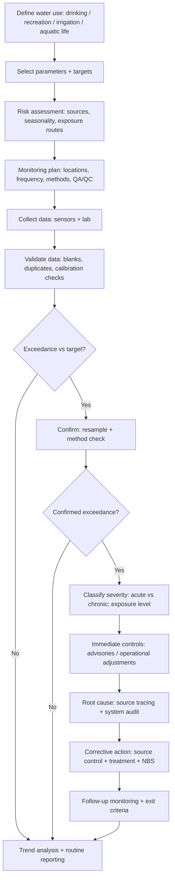
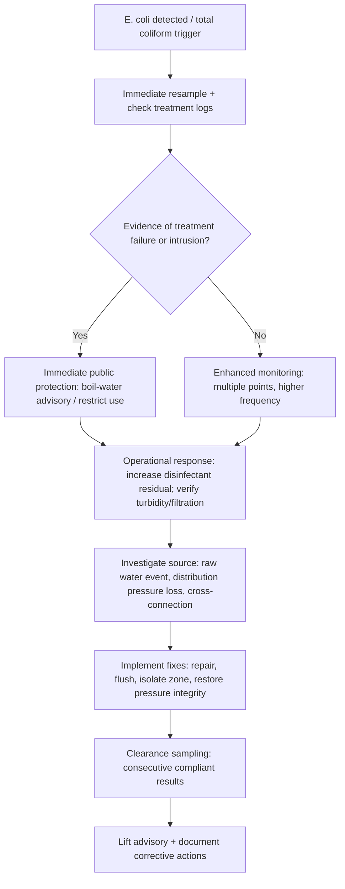
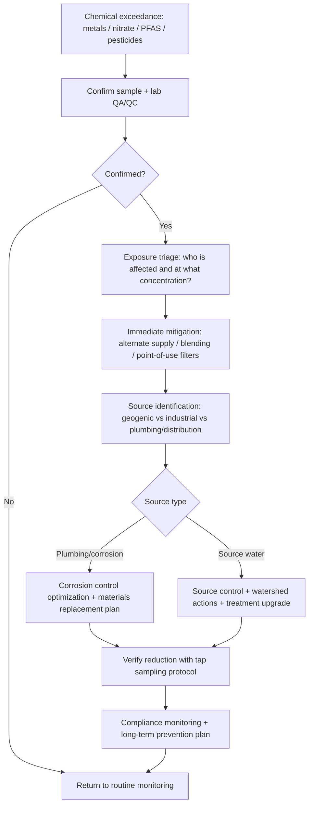

# Freshwater Parameter Targets and Corrective Actions

## Executive summary

Freshwater “targets” are not one universal number set. They are a **stack of use-specific criteria** (drinking, recreation, irrigation, aquatic life) plus **operational performance targets** tied to treatment processes (e.g., turbidity at disinfection, corrosion control pH, biological treatment performance). A single watershed can therefore be “compliant” for one use and “non‑compliant” for another on the same day. This report maps that stack using **WHO**, **US EPA**, **EU** directives, and at least two national frameworks—**entity["organization","Health Canada","national health dept, canada"]** and **entity["organization","National Health and Medical Research Council","australia health research council"]** (Australian Drinking Water Guidelines; ADWG). For aquatic life dissolved oxygen (DO), it also includes **entity["organization","Canadian Council of Ministers of the Environment","intergov env council, canada"]** guidance. citeturn20view0turn28view0turn9view0turn26search4

Across major regulators, **microbial safety in drinking water is essentially harmonized**: *E. coli* must be absent / not detectable in a 100 mL sample in WHO guidance and ADWG, and *E. coli* is treated as an acute public-health signal in US EPA’s Total Coliform Rule framework. citeturn13view0turn22search2turn16view0 The EU Drinking Water Directive also sets **0 per 100 mL** for *E. coli*. citeturn5view0

For **nitrate/nitrite**, thresholds are broadly aligned but differ in units: WHO uses **50 mg/L as nitrate (NO₃⁻)** and **3 mg/L as nitrite (NO₂⁻)**, US EPA uses **10 mg/L as nitrate‑N** and **1 mg/L as nitrite‑N**, and the EU sets **50 mg/L nitrate** and **0.50 mg/L nitrite** (as the ion, per the directive). citeturn1search1turn16view0turn5view2turn5view1 Canada’s MACs are **45 mg/L nitrate** and **3 mg/L nitrite**, and ADWG sets nitrate at **50 mg/L** (noting different sensitive groups). citeturn20view0turn22search0

For **turbidity**, agencies distinguish “aesthetic acceptability” from “pathogen protection.” WHO notes large systems should achieve ~**0.5 NTU before disinfection** (and often lower), the EU sets explicit operational targets for treated water at the supply plant (**≤0.3 NTU in 95% of samples and none >1 NTU**, with frequency scaling up to continuous monitoring), and US EPA filtration rules require **≤0.3 NTU in 95% of samples and ≤1 NTU at any time** for conventional/direct filtration. citeturn10view3turn6view5turn18search18 ADWG similarly calls for **<1 NTU at disinfection** and **≤5 NTU at the consumer tap** for aesthetics. citeturn22search3

For **heavy metals**, most drinking-water limits are within the same order of magnitude (µg/L), but lead is a notable divergence: WHO’s provisional value is **10 µg/L**, the EU is **10 µg/L** with a future **5 µg/L** implementation target (2036), Canada is **5 µg/L**, ADWG is **5 µg/L**, while US EPA regulates lead via a treatment technique with an **action level of 15 ppb** (as of the rule summary available January 2, 2026). citeturn11search0turn5view5turn27search0turn22search1turn17view0

For **PFAS**, numeric targets and regulatory status differ sharply and are evolving. EU parametric values include **“Sum of PFAS” 0.10 µg/L** and **“PFAS Total” 0.50 µg/L** for drinking water. citeturn7view4 Canada has a **precautionary objective of 30 ng/L** as the sum of 25 specified PFAS. citeturn25search3 US EPA finalized enforceable MCLs in 2024 (e.g., **PFOA 4 ppt**, **PFOS 4 ppt**, **PFHxS 10 ppt**, **PFNA 10 ppt**, **GenX 10 ppt**, plus a **Hazard Index** for mixtures), but by May 14, 2025 EPA stated it would keep PFOA/PFOS limits while intending to change timelines and reconsider parts of the rule for other PFAS—an important implementation constraint as of late 2025. citeturn28view0 WHO has worked on PFOS/PFOA values but (in the documents retrieved) frames **100 ng/L** as a provisional value that is *not* a health-based “safe level” and notes ongoing review. citeturn24search1

For **BOD/COD**, enforceable numeric “targets” typically sit in **wastewater effluent standards** and load controls rather than in drinking-water standards. US EPA’s federal secondary treatment regulation sets **BOD₅ 30 mg/L (30‑day average)** / **45 mg/L (7‑day)**, and **TSS 30/45 mg/L**, with **≥85% removal** requirements. citeturn26search2 Commonly cited EU Urban Waste Water Treatment Directive effluent benchmarks include **BOD₅ 25 mg/L O₂** and **COD 125 mg/L O₂** (plus TSS thresholds), with tighter nutrient controls in sensitive areas. citeturn26search19

Corrective actions are most reliably prioritized by a **risk chain**:

1) **Source control and watershed measures** (often the cheapest per unit risk reduction and the only durable option for many contaminants like nutrients and PFAS).  
2) **Treatment barriers matched to contaminant class** (physical removal for solids; oxidation/biological for organics; adsorption/membranes for trace organics; corrosion control for lead).  
3) **Operational resilience** (monitoring frequency, alarms, redundancy, and response playbooks).  

The decision matrix and flowcharts in later sections translate that into monitoring-to-action logic by parameter and by water use.

## Scope and how to interpret “targets”

### Water uses covered

This report evaluates parameter targets and corrective actions for four common freshwater uses:

- **Drinking water** (finished water at or near the consumer tap; emphasis on acute microbial risk and chronic chemical risk).  
- **Recreation** (bathing, swimming; emphasis on fecal indicators and bloom risk).  
- **Irrigation** (crop and soil constraints; salinity and pathogen risks; note that WHO/US EPA/EU drinking-water frameworks often do not publish irrigation-specific numbers).  
- **Aquatic life** (ecosystem protection; DO, pH, nutrients, metals, turbidity; note many regions delegate numeric thresholds to states/provinces or basin plans).

### Agencies and documents used

The following primary/official frameworks anchor numeric targets where available:

- WHO drinking-water guidance (4th edition with addenda and associated chemical fact sheets). citeturn10view0turn11search0turn12search0turn1search1  
- US EPA drinking-water regulations/standards (National Primary Drinking Water Regulations and related rule pages) and secondary (aesthetic) standards. citeturn16view0turn17view0turn18search4  
- EU Drinking Water Directive and Bathing Water Directive (plus wastewater directive references for BOD/COD context). citeturn2view0turn9view0turn26search19  
- Canada: **Health Canada** guideline technical documents (lead; nitrate/nitrite; chromium; cadmium; mercury; arsenic). citeturn27search0turn20view0turn21search0turn19search2turn21search1turn19search8  
- **Australia**: ADWG pages for key chemicals and microbial indicators (lead, nitrate, turbidity, metals, *E. coli*). citeturn22search1turn22search0turn22search3turn23search0turn23search1turn22search2  
- Aquatic life DO: CCME DO guidance (freshwater). citeturn26search4turn26search0  

### “Unspecified” as a deliberate output

Many frameworks **do not publish national numeric targets for some parameters** (especially temperature, BOD/COD in the ambient environment, pharmaceuticals, and many pesticide classes). Where a target is missing from one of the requested sources, this report states **unspecified** rather than inventing a number.

## Comparative target values across agencies

### Drinking-water targets and operational goals

The table below consolidates widely used drinking-water numeric targets (health-based where applicable; operational/aesthetic where noted). Units are shown as in the source (mg/L, µg/L, ng/L, NTU, CFU).

| Parameter (drinking water) | WHO | US EPA | EU | Canada (Health Canada) | Australia (ADWG) |
|---|---:|---:|---:|---:|---:|
| Temperature | Unspecified (no numeric guideline in GDWQ) | Unspecified | Unspecified | Unspecified | Unspecified |
| pH | Operational: optimum typically **6.5–8.5**; chlorine disinfection pH preferably **<8** (no health-based GV) citeturn14view3turn14view7 | Secondary (SMCL): **6.5–8.5** citeturn18search4 | Indicator: **6.5–9.5** citeturn6view0 | Operational: **7.0–10.5** citeturn21search2 | Unspecified (in sources retrieved for this report) |
| Dissolved oxygen (DO) | No health-based GV; high DO may increase corrosion risk (drinking context) citeturn14view1 | Unspecified | Unspecified | Unspecified | Unspecified |
| Turbidity (NTU) | Large supplies should achieve **≤0.5 NTU before disinfection** (avg often ≤0.2) citeturn10view3 | Filtration TT: **≤0.3 NTU in ≥95% of samples** and **≤1 NTU at all times** (conventional/direct filtration) citeturn18search18 | Operational at plant: **≤0.3 NTU in 95%** and **none >1 NTU** (monitoring frequency scales to continuous) citeturn6view5 | Unspecified (numeric turbidity target not retrieved in this run) | Disinfection: **<1 NTU desirable**; Aesthetic: **≤5 NTU** at tap citeturn22search3 |
| Conductivity | Unspecified | Unspecified | Indicator: **2500 µS/cm (20°C)** citeturn6view0 | Unspecified | Unspecified |
| Total dissolved solids (TDS) | Acceptability: <~**600 mg/L** generally “good,” >~**1000 mg/L** increasingly unpalatable citeturn15view3 | Secondary (SMCL): **500 mg/L** citeturn18search4 | Unspecified | Unspecified | Unspecified |
| Nitrate | **50 mg/L as NO₃⁻** (guideline value; infant risk focus) citeturn1search1 | MCL: **10 mg/L as N** citeturn16view0 | **50 mg/L** citeturn5view2 | MAC: **45 mg/L** (=10 mg/L nitrate‑N) citeturn20view0 | **50 mg/L as nitrate** (infant-protective) citeturn22search0 |
| Nitrite | **3 mg/L as NO₂⁻** citeturn1search1 | MCL: **1 mg/L as N** citeturn16view0 | **0.50 mg/L** citeturn5view1 | MAC: **3 mg/L** (=1 mg/L nitrite‑N) citeturn20view0 | Unspecified (numeric nitrite value not retrieved in this run) |
| *E. coli* | Must not be detectable in any **100 mL** sample (treated water) citeturn13view0 | Acute signal within Total Coliform Rule framework (numeric “0/100 mL” not expressed as a single MCL in the retrieved summary) citeturn16view0 | **0 per 100 mL** citeturn5view0 | Unspecified (explicit row not retrieved in this run) | Absent in **100 mL** citeturn22search2 |
| Lead (Pb) | Provisional GV: **10 µg/L** citeturn11search0 | Treatment technique; action level **15 ppb** citeturn17view0 | **10 µg/L** (future: **5 µg/L** by 2036) citeturn5view5 | MAC: **5 µg/L** (tap sample; ALARA framing) citeturn27search0turn27search3 | Health: **0.005 mg/L** (=5 µg/L) citeturn22search1 |
| Arsenic (As) | Provisional GV: **10 µg/L** citeturn11search1 | MCL: **0.010 mg/L** citeturn16view0 | **10 µg/L** citeturn5view0 | MAC: **10 µg/L** (draft proposing 5 µg/L exists) citeturn19search8turn19search1 | **0.01 mg/L** citeturn23search2 |
| Cadmium (Cd) | GV: **3 µg/L** citeturn11search2 | MCL: **0.005 mg/L** citeturn16view0 | **5 µg/L** citeturn5view4 | MAC: **7 µg/L** citeturn19search2 | **0.002 mg/L** citeturn23search0 |
| Mercury (Hg) | GV: **6 µg/L** for inorganic mercury citeturn12search0 | MCL: **0.002 mg/L** (inorganic) citeturn16view0 | **1 µg/L** citeturn5view6 | MAC: **1 µg/L** citeturn21search1 | **0.001 mg/L** total mercury citeturn23search1 |
| Chromium (Cr) | GV: **50 µg/L** (total chromium) citeturn12search15 | MCL: **0.1 mg/L** total chromium citeturn16view0 | **50 µg/L** citeturn5view3 | MAC: **50 µg/L** total chromium citeturn21search0 | Cr(VI) health: **0.05 mg/L**; test for Cr(VI) if total exceeds citeturn23search3 |
| Pesticides (drinking) | Compound-specific GVs; no single “total pesticides” GV (unspecified) | Compound-specific MCLs; no single “total pesticides” MCL (unspecified in retrieved summary) | **0.10 µg/L** each; **0.50 µg/L** total pesticides citeturn5view3turn7view1 | Unspecified | Unspecified |
| PFAS (drinking) | Provisional PFOS/PFOA value **100 ng/L** (explicitly framed as not a health-based “safe level” in WHO commentary responses) citeturn24search1 | 2024 MCLs: **PFOA 4 ppt**, **PFOS 4 ppt**, **PFHxS 10 ppt**, **PFNA 10 ppt**, **GenX 10 ppt**, plus Hazard Index for mixtures; 2025 notice indicates intent to keep PFOA/PFOS but reconsider other components and timelines citeturn28view0 | Sum of PFAS **0.10 µg/L**; PFAS Total **0.50 µg/L** citeturn7view4 | Objective: **30 ng/L** (sum of 25 PFAS) citeturn25search3 | Unspecified (PFAS values not retrieved from ADWG pages in this run) |
| Algal toxin: Microcystin‑LR | Guideline **1 µg/L** (drinking water) citeturn0search2 | Unspecified (numeric value not retrieved in this run) | **1.0 µg/L** citeturn7view7 | Unspecified | Unspecified |

**Interpretive note:** Where agencies publish both a health value and an operational/aesthetic value, **health protection should drive compliance decisions**, but operations (turbidity at disinfection; pH for corrosion control) often determines whether health values can be reliably met. citeturn6view5turn14view7turn17view0turn27search19

### Recreation and aquatic life targets (selected parameters)

| Parameter (recreation / aquatic life) | WHO | US EPA | EU | Canada (CCME aquatic life) | Australia/NZ |
|---|---:|---:|---:|---:|---:|
| *E. coli* (bathing water quality classes) | Unspecified (not retrieved here) | US EPA RWQC (numeric values referenced in search results; see note) citeturn0search3 | Inland waters: **500 / 1000 / 900 CFU/100 mL** (excellent/good/sufficient); Coastal: **250 / 500 / 500** citeturn9view0 | Unspecified | Unspecified |
| DO (aquatic life) | Unspecified | Unspecified | Unspecified | Freshwater: minimum DO varies by ecosystem type and life stage (e.g., warm-water early life **6 mg/L**, other **5.5 mg/L**; cold-water early life **9.5 mg/L**, other **6.5 mg/L**) citeturn26search4 | Unspecified (national trigger ranges are context-specific and not retrieved here) |

**Note on recreation criteria:** EU bathing values are explicitly standardized at EU level and tied to ISO reference methods. citeturn9view0 In the US, national recommended recreational criteria exist (RWQC), but state adoption and implementation details vary (state criteria not enumerated in this report due to scope). citeturn0search3

### BOD and COD as “control targets” in wastewater discharges

Because BOD and COD are primarily managed through **effluent limits and load allocations**, the most comparable cross-jurisdiction numeric “targets” come from wastewater regulation:

- US federal secondary treatment minimums: **BOD₅ 30 mg/L (30‑day avg)**, **45 mg/L (7‑day avg)**, and **≥85% removal**, with analogous limits for TSS. citeturn26search2  
- EU Urban Waste Water Treatment Directive benchmarks (as summarized in retrieved directive material): **BOD₅ 25 mg/L O₂** and **COD 125 mg/L O₂**, with TSS thresholds and tighter nutrient controls in sensitive/eutrophic areas. citeturn26search19  

## Monitoring frequency, methods, and detection limits

### Monitoring design principles (cross-applicable)

A rigorous monitoring program ties each parameter to:

1) **The decision that will be made** (public notice, treatment change, source intervention, shutdown).  
2) **The time scale of change** (seconds for pH/DO; hours-days for turbidity; weeks-months for chronic chemicals).  
3) **Method performance**: detection/quantification limits should be well below the target so that decisions are not dominated by analytical noise. This is explicitly discussed in guideline contexts for metals such as cadmium (ICP‑MS LOD example) and lead (measurability constraints). citeturn12search2turn27search3

### Illustrative monitoring frequencies anchored in official guidance

- **Turbidity**: The EU directive specifies plant monitoring at least **weekly/daily/continuous** depending on system production (m³/day), and requires meeting **0.3 NTU in 95%** of samples and **≤1 NTU** maximum. citeturn6view5  
- **Nitrate/nitrite**: Canada recommends routine monitoring in risk areas, and for distribution-system nitrification programs suggests **weekly** monitoring at key locations (entry points, reservoirs, dead ends), with private wells often tested **at least annually** in spring or fall in susceptible settings. citeturn20view0  
- **PFAS (US EPA rule)**: US EPA requires public water systems to complete initial monitoring by **2027**, then ongoing compliance monitoring, with corrective actions by **2029** under the 2024 final rule (noting the 2025 statement of intent to adjust parts of compliance timelines). citeturn28view0

In practice, monitoring frequency is often **higher than minimum legal requirements** for fast-changing parameters (temperature, pH, DO, turbidity) using continuous sensors, because the cost of additional data is low relative to the cost of missing an excursion.

### Methods and typical detection/quantification limits

The following table lists commonly used analytical approaches, with **detection limits noted where the requested sources explicitly provide them**; otherwise listed as **unspecified** due to method- and lab‑dependent variability.

| Parameter | Common monitoring method(s) | Typical reporting unit | Detection / determination limit (from cited sources) | Notes on method selection |
|---|---|---|---:|---|
| Temperature | In situ thermistor / logger; continuous SCADA | °C | Unspecified | Use continuous for stratified reservoirs and warm-season recreation risk; temperature affects oxygen solubility substantially (e.g., saturation decreases with warming). citeturn26search20 |
| pH | Inline pH electrode; grab sample verification | pH units | Unspecified | pH affects corrosion and disinfectant effectiveness; WHO notes optimum range varies but often ~6.5–8.5 and chlorine disinfection prefers pH <8. citeturn14view3turn14view7 |
| DO | Optical DO probe; Winkler titration for QA | mg/L, % sat | Unspecified | DO is highly dynamic and temperature dependent; lows may be episodic at night or under ice (continuous monitoring preferred where aquatic life is a use). citeturn26search20turn26search4 |
| BOD₅ | 5‑day incubation test (lab); surrogate: UV254, COD | mg/L O₂ | Unspecified | Slow turnaround; best for trend and compliance (wastewater), not real-time control. citeturn26search2turn26search19 |
| COD | Dichromate reflux (lab) | mg/L O₂ | Unspecified | Faster than BOD; better suited for process control; regulated in EU wastewater context. citeturn26search19 |
| Nitrate/nitrite | Ion chromatography; colorimetry; online analyzers in high-risk utilities | mg/L | Unspecified | Canada notes levels can be analyzed well below MACs and recommends higher-frequency monitoring during worst-case operations. citeturn20view0 |
| Turbidity | Nephelometric turbidity meter (inline + grab) | NTU | Unspecified | WHO notes detectability and operational relevance; regulatory limits often expressed as percentiles and maxima. citeturn10view3turn6view5turn18search18 |
| TSS | Gravimetric (filter + drying) | mg/L | Unspecified | Primary for effluent compliance (e.g., US/EU secondary treatment contexts). citeturn26search2turn26search19 |
| Conductivity / salinity | Conductivity cell (inline) | µS/cm; ppt | Unspecified | EU sets indicator parametric value 2500 µS/cm; useful as tracer for saline intrusion and industrial discharges. citeturn6view0 |
| Pb | ICP‑MS / ICP‑OES; corrosion control sampling protocols at tap | µg/L | Unspecified (PQL/measurability constraints noted) | Canada stresses tap sampling protocols; lead is often from premise plumbing and service lines, so distribution/tap sampling is critical. citeturn27search3turn17view0turn11search0 |
| Cd | ICP‑MS; AAS | µg/L | WHO cadmium fact sheet: **0.01 µg/L (ICP‑MS)**; **2 µg/L (flame AAS)** citeturn12search2 | Illustrates why ICP‑MS is preferred for trace compliance. |
| Hg | Cold vapor AAS; ICP‑MS (with appropriate prep) | µg/L | ADWG mercury page: limit of determination **0.0001 mg/L** (0.1 µg/L) citeturn23search1 | Mercury speciation matters (organic vs inorganic); many drinking standards refer to total mercury. citeturn23search1turn16view0turn12search0 |
| As, Cr | ICP‑MS; speciation methods for Cr(VI) where relevant | µg/L | Unspecified in retrieved method sources | Australia explicitly calls for Cr(VI) analysis if total chromium exceeds 0.05 mg/L guideline. citeturn23search3 |
| *E. coli* / coliforms | Membrane filtration; MPN; presence/absence kits | CFU/100 mL | Method-limited (often 1 CFU/100 mL for MF); unspecified in retrieved sources | WHO describes membrane filtration and alternative approaches; EU bathing directive sets ISO reference methods. citeturn13view1turn9view0 |
| Pesticides | GC‑MS/MS and LC‑MS/MS panels | ng/L–µg/L | Unspecified | EU sets very low parametric values (0.1 µg/L each), which generally requires sensitive and well-controlled analytical workflows. citeturn5view3turn7view1 |
| PFAS | LC‑MS/MS (targeted); isotope dilution; field blanks essential | ng/L (ppt) | Unspecified in retrieved sources (method-dependent) | WHO PFAS draft material references LC‑MS/MS analytical methods and staged achievability framing. citeturn24search6turn28view0 |
| Pharmaceuticals | Non-target screening (LC‑HRMS) + targeted panels | ng/L–µg/L | Unspecified | Most major drinking frameworks do not set compound-by-compound enforceable values; monitoring is typically risk-based. (Unspecified targets in retrieved sources.) |
| Algal toxins (microcystin) | ELISA screening + LC‑MS/MS confirm for congeners | µg/L | Unspecified | EU and WHO set **1 µg/L** microcystin‑LR in drinking water; monitoring is typically event-triggered (bloom risk). citeturn7view7turn0search2 |

## Corrective actions and a prioritized decision matrix

### Corrective-action “toolbox” mapped to contaminant classes

Corrective actions should be selected by **the most likely source pathway** and **the dominant removal mechanism** required. The categories below are intentionally broad so they can be applied in municipal systems, small systems, and watershed management programs.

**Engineering (infrastructure / unit processes)**  
Physical separation (sedimentation, filtration), aeration, activated carbon adsorption, ion exchange, membranes (NF/RO), advanced oxidation (AOP), biologically active filtration, and upgrades to wastewater treatment (secondary → tertiary nutrient removal). These are most effective when the contamination is persistent and predictable (e.g., chronic nitrate in groundwater, PFAS, metals). citeturn20view0turn28view0turn26search2

**Operational (controls / practice changes)**  
SCADA alarms, chemical dose optimization (coagulant, disinfectant, corrosion inhibitors), flushing, blending sources, reservoir destratification, and distribution nitrification management (e.g., limiting free ammonia). Operational measures are often the fastest to deploy and are repeatedly emphasized for nitrate/nitrite control in distribution. citeturn20view0turn27search19turn6view5

**Chemical (in-water chemistry manipulation)**  
pH/alkalinity adjustment (corrosion control and treatment performance), oxidation/reduction (e.g., convert nitrite to nitrate; manage iron/manganese), precipitation/coagulation for metals, chemical phosphorus precipitation in wastewater. pH is specifically recognized as central to corrosion and disinfection performance. citeturn14view7turn21search2turn17view0

**Biological (microbial transformations)**  
Denitrification (biological), nitrification control, BOD reduction via activated sludge or fixed-film processes, watershed bioremediation. Biological processes are central to BOD control (secondary treatment) and nitrate removal options cited in drinking-water contexts. citeturn20view0turn26search2

**Nature-based solutions (NBS)**  
Riparian buffers, constructed wetlands, retention basins, floodplain reconnection, agricultural best management practices (BMPs) to reduce sediment and nutrient runoff, and source-water protection programs. NBS are essential for turbidity/TSS and nutrient control in many catchments; they are also the only scalable option for reducing diffuse pollution (e.g., nutrients driving blooms). (Targets are often set via local watershed plans; many national drinking standards do not quantify NBS outcomes, so numeric “targets” are frequently unspecified at national level.)

### Parameter-specific exceedance impacts and corrective actions (condensed)

Below, each parameter is summarized with key impacts, then corrective options. “Unspecified” indicates missing numeric targets in one or more required frameworks.

**Temperature**  
Elevated temperature reduces oxygen solubility (e.g., saturation declines markedly from cold to warm conditions) and can amplify ecological stress, night-time hypoxia risk, and bloom risk. citeturn26search20 Corrective actions: (i) reservoir destratification / selective withdrawal, (ii) shading riparian restoration, (iii) reduce thermal pollution inputs; constraints include energy use, infrastructure limitations, and competing operational objectives (e.g., mixing can mobilize nutrients).

**pH**  
Out-of-range pH can reduce disinfection effectiveness and increase corrosion/leaching risk; WHO notes chlorine disinfection prefers pH <8 while overall optimum for systems is often ~6.5–8.5 depending on water and materials. citeturn14view3turn14view7 Aquatic ecosystems are stressed outside broader pH ranges (US EPA notes freshwater criteria range 6.5–9 and biological stress beyond). citeturn18search12 Corrective actions: adjust alkalinity/pH (lime, CO₂), optimize corrosion control, reduce industrial discharges; constraints include scaling vs corrosion tradeoffs and chemical handling.

**Dissolved oxygen (DO)**  
Low DO is a direct aquatic-life stressor. CCME provides minimum DO guidance by ecosystem and life stage (e.g., warm-water early life 6 mg/L; cold-water early life 9.5 mg/L). citeturn26search4 Corrective actions: (i) reduce oxygen-demanding loads (BOD, nutrients), (ii) aeration/oxygenation in critical habitats, (iii) flow management and habitat restoration; constraints include operating cost and the fact that aeration treats symptoms if loads continue.

**BOD and COD**  
High BOD/COD indicates elevated oxygen demand and organic loading; controlling discharges is a primary lever. US secondary treatment sets minimum effluent quality and removal requirements for BOD₅ and TSS. citeturn26search2 EU wastewater standards commonly reference BOD₅ 25 mg/L and COD 125 mg/L effluent benchmarks. citeturn26search19 Corrective actions: wastewater upgrades (secondary/tertiary), industrial pretreatment, stormwater capture; constraints include capital intensity and the need for reliable operations.

**Nutrients (nitrogen species and phosphorus)**  
Human health: nitrate/nitrite are linked to infant methemoglobinemia (“blue baby syndrome”), with standards set to protect infants. citeturn16view0turn20view0turn1search1 Health Canada additionally notes newer evidence on thyroid endpoints and cancer associations influencing risk management. citeturn20view0turn19search27 Ecological: nitrogen and phosphorus enrichment drives eutrophication and bloom risk, which can cascade into DO depletion and toxin risk (numeric nutrient targets are often local, hence frequently unspecified at national level in the sources retrieved). Corrective actions: source control (fertilizer timing/rates, manure management), wastewater nutrient removal, biological denitrification (drinking context) and blending, constructed wetlands; constraints: diffuse-source control is governance-heavy and slow; treatment can be energy- and waste-stream intensive.

**Turbidity / TSS**  
Turbidity impairs drinking-water acceptability and is operationally critical for pathogen control; WHO notes large supplies should achieve ≤0.5 NTU before disinfection. citeturn10view3 EU and US rules set explicit turbidity performance levels for filtered systems. citeturn6view5turn18search18 Corrective actions: upstream erosion control, optimized coagulation/flocculation, filtration integrity monitoring, and (for acute events) switching sources or using boil-water advisories if disinfection reliability is compromised; constraints include event-driven spikes and sludge handling.

**Conductivity / salinity**  
High conductivity can indicate saline intrusion, road salt, industrial discharges, and can impact taste/acceptability; EU sets an indicator value of 2500 µS/cm. citeturn6view0 WHO frames high TDS primarily as acceptability (palatability declines >1000 mg/L). citeturn15view3 Corrective actions: source substitution/blending, desalination (RO) where feasible, reduce salt inputs; constraints include concentrate disposal and cost.

**Heavy metals (Pb, Hg, Cd, As, Cr)**  
Health impacts vary by metal but include carcinogenicity (arsenic), neurodevelopmental impacts (lead), kidney toxicity (cadmium, mercury), and other systemic effects; agencies set low µg/L targets accordingly. citeturn19search4turn11search0turn19search2turn12search0turn12search15 Corrective actions are strongly source-pathway dependent:  
- **Corrosion control + service line replacement** is central for lead (US EPA and Health Canada both emphasize corrosion control, with lead often originating from plumbing/service lines). citeturn17view0turn27search19turn11search0  
- **Coagulation/precipitation/adsorption** for many metals; **GAC** is noted as effective for mercury removal in ADWG. citeturn23search1  
- **Membranes** (NF/RO) provide broad removal but generate brine and require skilled operations.

**Pathogens (*E. coli*, coliforms)**  
WHO requires *E. coli* not be detectable in any 100 mL sample of treated water. citeturn13view0 ADWG states the same and calls for immediate investigation and corrective action upon detection. citeturn22search2 EU bathing water classification uses *E. coli* and intestinal enterococci thresholds with ISO methods. citeturn9view0 Corrective actions: multi-barrier treatment (filtration + disinfection), distribution integrity (pressure, backflow control), boil-water advisories when warranted, and source-water protection; constraints include the possibility of pathogens even when indicators are absent (WHO warns against overreliance on *E. coli* alone). citeturn13view4

**Pesticides**  
EU uses a precautionary drinking-water stance (0.1 µg/L each pesticide; 0.5 µg/L total). citeturn5view3turn7view1 US EPA and WHO typically regulate pesticides compound-by-compound (single total target often unspecified). Corrective actions: watershed source control (application practices), activated carbon and advanced treatment for removal, and pesticide substitution programs; constraints include seasonal pulses and analytical panel selection.

**Emerging contaminants (PFAS, pharmaceuticals)**  
PFAS: EU, Canada, and US EPA now publish explicit drinking-water values (see table), though regulatory status and timelines differ and are evolving in the US implementation pathway. citeturn7view4turn25search3turn28view0 Treatment actions: GAC, ion exchange, and membranes; operational constraints include media changeout, waste disposal, and the need for upstream source control due to persistence. WHO documents acknowledge staged achievability and ongoing review on international guideline values. citeturn24search6turn24search1  
Pharmaceuticals: numeric targets are largely unspecified in the retrieved core drinking-water standards; corrective strategies therefore lean on (i) source control (pharmaceutical take-back, wastewater upgrades), (ii) advanced treatment (ozone, GAC, AOP), and (iii) targeted monitoring.

**Algal toxins (microcystins and others)**  
EU and WHO include **microcystin‑LR 1 µg/L** for drinking water, reflecting bloom-related risk. citeturn7view7turn0search2 Corrective actions: bloom prevention via nutrient control; in-treatment barriers include optimized coagulation (for cells), activated carbon (for dissolved toxins), and careful oxidant selection to avoid cell lysis releasing toxins; constraints include event-driven spikes and the need for raw-water surveillance.

### Decision matrix: prioritized corrective actions by parameter and water use

This matrix gives **top priority actions** (first-listed is usually the highest-leverage) by parameter and use. Because costs are highly site-specific and not consistently published as cross-parameter numeric ranges in the primary sources retrieved here, **costs are expressed qualitatively** (Low / Moderate / High / Very High). Where a parameter’s “target” is largely operational or locally set, risk management focuses on maintaining robustness and transparency.

| Parameter | Drinking water | Recreation | Irrigation | Aquatic life |
|---|---|---|---|---|
| Temperature | Source switching; reservoir controls; distribution management (Moderate–High) | Public advisories if linked to blooms/pathogens (Low) | Scheduling/irrigation timing to reduce plant stress (Low) | Riparian shading + flow management + thermal discharge control (Moderate–High) |
| pH | Corrosion control + pH/alkalinity adjustment (Moderate) citeturn27search19turn14view7 | Investigate industrial/urban inputs; advisories if extreme (Low–Moderate) | Soil/plant compatibility; blending (Low–Moderate) | Source control; buffering/habitat restoration (Moderate) citeturn18search12 |
| DO | Unspecified (drinking target); manage corrosion if very high (Low) citeturn14view1 | Close/limit activity if fish kills/hypoxia (Low) | Unspecified | Load reduction (nutrients/BOD) + aeration in hotspots + habitat restoration (Moderate–High) citeturn26search4 |
| BOD/COD | Treatment upgrades if driven by source contamination (Moderate–High) | Focus on source control and closures if odors/scums (Low) | Unspecified | Wastewater upgrades + industrial pretreatment + stormwater control (High) citeturn26search2turn26search19 |
| Nutrients (N, P) | Nitrate: blending / ion exchange / RO / denitrification; watershed control (Moderate–Very High) citeturn20view0 | Nutrient source control + bloom response plans (Moderate) | Salinity/nitrate management; avoid high-nitrate water for sensitive crops (Moderate) | Watershed nutrient reduction + wastewater nutrient removal + wetlands (High) |
| Turbidity/TSS | Coagulation/filtration optimization + upstream erosion control; boil-water triggers if treatment barriers compromised (Moderate) citeturn6view5turn18search18 | Manage runoff sources; near-term advisories after storm pulses (Low–Moderate) | Sediment control to prevent clogging/soil impacts (Moderate) | Erosion control + riparian buffers + sediment basins (Moderate–High) |
| Conductivity/salinity | Blending + investigate saline intrusion; RO in severe cases (Moderate–Very High) citeturn6view0 | Unspecified | Primary driver of irrigation impacts; blending and drainage management (Moderate) | Source control (road salt/industrial) + flow management (Moderate) |
| Metals (Pb, Hg, Cd, As, Cr) | Source identification; corrosion control (Pb); treatment (coagulation/adsorption/membranes) (Moderate–Very High) citeturn27search19turn23search1turn19search4 | Advisories if contamination sources active (Low) | Crop uptake considerations; blending/treatment (Moderate) | Source control + sediment management + site remediation (High) |
| Pathogens | Multi-barrier treatment + distribution integrity + rapid corrective action on *E. coli* detection (Moderate) citeturn13view0turn22search2 | Closure/advisory based on fecal indicators; post-storm event sampling (Low) citeturn9view0 | Use raw-water restrictions for food crops; apply withholding periods (Moderate) | Watershed sanitation + habitat management (Moderate) |
| Pesticides | Source control + GAC/AOP where necessary (Moderate–High) citeturn7view1 | Advisories if acute tox events suspected (Low–Moderate) | Reduce application/runoff; evaluate mixture risks (Moderate) | Integrated pest management + runoff reduction (Moderate–High) |
| PFAS | Source control + GAC/IX/RO; implement rule monitoring timelines (High–Very High) citeturn28view0turn25search3turn7view4 | Unspecified (usually not acute recreation driver) | Unspecified | Source control paramount (Very High) |
| Pharmaceuticals | Advanced wastewater/drinking treatment + monitoring (High) | Unspecified | Unspecified | Wastewater upgrades + source control (High) |
| Algal toxins | Raw-water surveillance + treatment optimization (cells vs dissolved toxins) + nutrient reduction (Moderate–High) citeturn7view7turn0search2 | Bloom advisories/closures + nutrient source control (Moderate) citeturn9view0 | Avoid bloom-affected sources; filtration where needed (Moderate) | Nutrient reduction + habitat restoration (High) |

## Monitoring-to-action workflows

