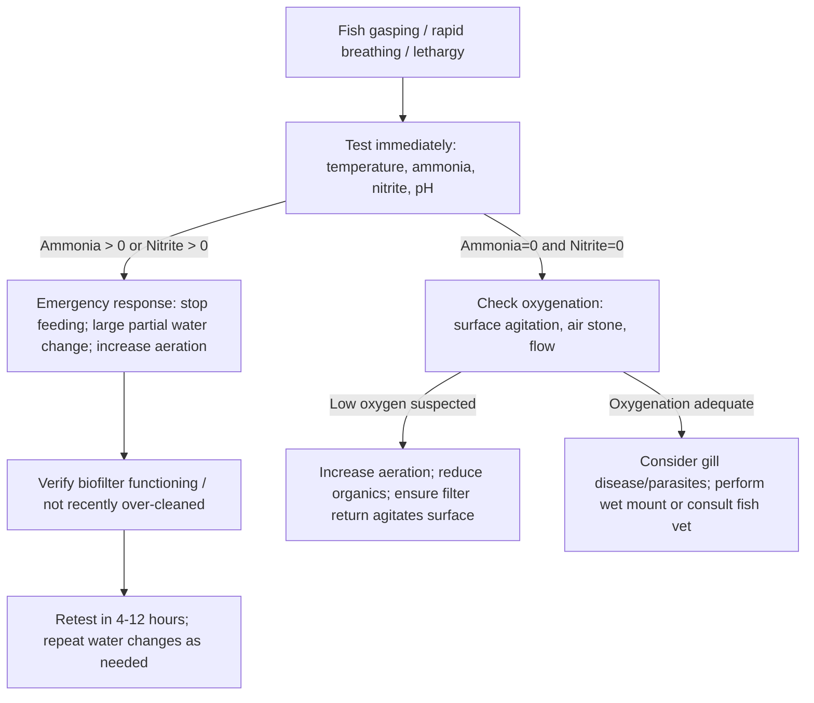

# Goldfish Care and Compatibility Profile

## Executive summary

Goldfish (*Carassius auratus*) are hardy but **high-biomass, high-waste** fish whose welfare outcomes are dominated by **space, biofiltration capacity, oxygenation, and nitrate management**—not “hardiness” alone. Welfare organizations and trade/aquaculture guidance converge on: **large volumes, efficient filtration + aeration, stable mid‑cool temperatures, and strict control of ammonia/nitrite**. citeturn5view0turn2view0turn22view0turn22view4

The most defensible water-quality targets are: **ammonia and nitrite effectively zero**, nitrate kept **as low as practical** (with multiple authorities recommending staying well below ~50 mg/L nitrate in routine husbandry), pH in the **neutral to slightly alkaline** range, and **moderate hardness/alkalinity** to stabilize pH and support nitrification. citeturn5view0turn2view0turn22view0turn26view0turn27view1

Feeding is a “double-edged lever”: it drives growth and enrichment but directly drives nitrogen waste. Controlled rations and frequent small meals maximize growth in juveniles under farming conditions, while pet goldfish generally benefit from **portion control**, **sinking/gel-based foods**, and high-fiber plant matter to reduce constipation/buoyancy problems and to limit waste. citeturn16view0turn19view0turn18view1turn2view0turn11search6

Disease management is mostly **preventable** husbandry: quarantine, stable water quality, and early diagnostic sampling. Several common syndromes (Ich/white spot, protozoan gill/skin parasites, columnaris-type bacterial dermatitis, and Aeromonas-associated ulcer/septicemia) have well-characterized signs and diagnostic approaches (skin/gill scrapes, wet mounts; culture and sensitivity for bacterial disease). citeturn11search1turn35view0turn35view7turn35view10turn11search11turn35view5

Compatibility is fundamentally constrained by **temperature mismatch** (goldfish are temperate/coolwater relative to most “tropical community fish”) and by **predation/fin damage** risks. Mixed-species tanks can work, but only with species that tolerate similar temperatures and robust filtration—and even then are often “conditional” rather than reliably compatible. citeturn5view0turn2view0turn10search15turn22view4turn22view0

## Goldfish types and implications for husbandry

Goldfish are domesticated cyprinids with substantial variety-driven differences in swimming efficiency and vulnerability. “Single-tail”/slender-bodied varieties (e.g., common/comet/shubunkin types) are typically stronger swimmers and can reach larger adult size; “fancy” varieties (e.g., oranda/ryukin types) are rounder-bodied, slower, and more prone to buoyancy and mechanical injury. citeturn10search15turn5view0turn2view0turn9search2

Several husbandry recommendations explicitly note that **non-fancy (single-tail) varieties often outgrow typical home aquaria and may be more appropriate for ponds**, whereas fancies are more often maintained indoors—still requiring large volumes. citeturn2view0turn5view0

Authoritative minimum tank-size guidance differs in exact liters/gallons (because “minimum” is a welfare threshold, not an optimal point), but converges directionally on: **bigger + longer footprint + strong filtration**. One practical by-variety benchmark (commonly cited in consumer guidance) is: **~140 L minimum for fancy goldfish** and **~180 L minimum for common goldfish**, with additional volume per extra fish. citeturn1view2turn2view0turn5view0

Goldfish are also **behaviorally enriched by structure** (plants/cover) and show strong preference for planted areas; controlled studies found goldfish spent the majority of time in planted areas versus bare areas and were motivated to access cover. citeturn8view1

## Habitat design, tank sizing, filtration, and water chemistry

### Tank sizing

A defensible way to present “authoritative” sizing is to show **converging minimums** from welfare/trade guidance and to explain why “minimum” scales poorly with adult biomass.

**Adult size and space reality.** Goldfish can reach large sizes and do not “grow to the size of the tank” in a healthy way; cramped systems increase chronic water-quality stress and blunt normal growth and longevity. citeturn10search15turn5view0turn9search2turn9search8

**Minimum volume anchors (compare-and-synthesize):**
- Trade guidance for adult goldfish in aquaria: **≥100 L for one adult**, plus **~50 L per additional**. citeturn2view0  
- Welfare guidance emphasizes minimum tank dimensions relative to adult body length and notes some varieties need larger, longer tanks. citeturn5view0turn1view1  
- A common by-variety consumer benchmark recommends **~140 L minimum for fancy** and **~180 L minimum for common**, with additional liters per extra fish. citeturn1view2  

**Rigorous practical recommendation (pet welfare–biased):** treat the above as *minimums*, then add margin for (a) adult body mass, (b) filtration headroom, and (c) nitrate control. In practice, mixed-species or heavy stocking should be planned as a **large-system problem** (often ≥200 L / ≥55 gal) even for “small” groups. citeturn5view0turn2view0turn22view4turn22view0

### Filtration and aeration specs

Goldfish require **efficient mechanical + biological filtration** and often supplemental aeration because they are heavy feeders and produce substantial waste. citeturn5view0turn10search3turn22view4

From aquaculture engineering guidance, the core constraint is nitrogen waste: fish excrete ammonia primarily across the gills; **about 2.2 lb of ammonia-nitrogen are produced per 100 lb of feed** in recirculating systems assumptions. citeturn22view0

**What the filter must do (functionally):**
- Capture and export solids (uneaten feed/feces) quickly because decomposition consumes oxygen and increases ammonia load. citeturn24view0turn25view0  
- Provide high surface area for nitrifying bacteria that oxidize ammonia → nitrite → nitrate (aerobic process requiring oxygen). citeturn22view4turn22view1  

**Biological filtration capacity (engineering lens):** SRAC component guidance reports representative **volumetric nitrification rates** (e.g., for certain biofilter types on the order of tens to hundreds of grams TAN per m³ media per day) and emphasizes that media type and design drive performance. citeturn25view0turn25view1

**Flow/turnover (aquarium practice lens):** A common baseline recommendation for circulation is ~**4× tank volume per hour**, with higher flow for high-bioload tanks. For goldfish, the “high-bioload” condition is typical; the practical upshot is to size filters with **substantial headroom** and manage outlet flow so fancies are not battered by current. citeturn9search26turn10search3turn10search15

### Water chemistry targets (with measurement notes)

**Key principle:** ammonia toxicity is driven by the un-ionized fraction (NH₃), which rises with pH and temperature; published tables show the **percentage of total ammonia present as NH₃** increases sharply as pH rises. citeturn22view0turn22view1

**Goldfish-oriented targets (pet welfare–biased synthesis):**

| Parameter | Target range | “Hard” limit / action threshold | Rationale |
|---|---:|---:|---|
| Temperature | ~20–24 °C (68–75 °F) for most indoor systems | Avoid rapid swings; extremes increase stress and can worsen disease dynamics | Welfare guidance lists ~20–24 °C and emphasizes stability; trade guidance allows broad tolerance but that is not the same as a welfare optimum. citeturn5view0turn2view0turn35view1 |
| pH | ~6.5–7.5 (often acceptable up to ~8 if stable) | Avoid instability (“pH crash”) | Welfare/trade guidance give broad pH windows; more important is stability and adequate alkalinity. citeturn5view0turn2view0turn22view0 |
| Total ammonia (TAN) | 0 (as close to non-detect as possible) | Action if measurable; especially urgent at higher pH/temp | Ammonia is principal nitrogen waste; NH₃ is highly toxic; un-ionized fraction rises with pH/temp. citeturn22view0turn22view4turn5view0turn2view0 |
| Un-ionized ammonia (NH₃‑N) | practical goal ≈0 | Chronic effects reported as low as ~0.02–0.07 mg/L NH₃‑N in warmwater fish | SRAC management guidance notes growth/tissue impacts at very low NH₃‑N; treat any persistent NH₃ as unacceptable. citeturn22view0 |
| Nitrite (NO₂⁻‑N) | 0 | Any detectable nitrite warrants action; lower oxygen increases danger | Nitrite causes methemoglobinemia (“brown blood”); chloride reduces uptake. citeturn27view1turn22view1turn5view0turn2view0 |
| Nitrate | “As low as practical”; many husbandry guides use <50 mg/L NO₃⁻ as an upper bound | If rising, increase water changes/export | Nitrate is less acutely toxic than ammonia/nitrite, but long-term effects can occur; review literature recommends low NO₃‑N for sensitive freshwater species; welfare guidance uses nitrate caps. citeturn26view0turn5view0turn2view0turn22view4 |
| Hardness (GH) | Moderate: ~5–19 °dH (≈90–340 mg/L as CaCO₃) | Avoid very soft/unstable systems | Trade guidance provides °dH range; alkalinity/hardness help stabilize pH and support biofiltration. citeturn2view0turn22view0 |
| Alkalinity (KH/alkalinity as CaCO₃) | Often ~50–100 mg/L+ as CaCO₃ | If pH unstable, raise alkalinity cautiously | SRAC guidance discusses maintaining alkalinity/hardness and shows pH–alkalinity management. citeturn22view0turn22view1 |

image_group{"layout":"carousel","aspect_ratio":"16:9","query":["aquarium nitrogen cycle diagram ammonia nitrite nitrate","goldfish fancy vs common body shape comparison","aquarium canister filter diagram biological media","goldfish planted aquarium enrichment"],"num_per_query":1}

## Feeding and nutrition management

### Core diet strategy

Goldfish are omnivores without a true stomach (physiological feature referred to in feeding studies), and diet composition strongly affects growth, waste output, and buoyancy/constipation risk. citeturn16view0turn19view0turn2view0turn10search15

A rigorous feeding plan should be built around:
- **A complete staple** (high-quality pellet/gel food) as the nutritional “base.” citeturn18view0turn18view1turn19view0  
- **Regular plant matter/fiber** (blanched greens, gel foods with plant content) to support gut motility; this is frequently used in practice to reduce buoyancy issues and aligns with veterinary guidance that diet and swallowed air can contribute to swim bladder disorders. citeturn11search6turn10search15  
- **Controlled treats** (e.g., frozen foods) as enrichment, not as a primary diet, because protein-heavy feeding increases nitrogen waste. citeturn22view0turn16view0  

### Feeding frequency and portions

Two realities must be held simultaneously: (1) frequent meals can improve juvenile growth efficiency under experimental culture conditions, and (2) overfeeding is a major driver of poor water quality in home aquaria.

**Juveniles (growth-optimized evidence):** In an 8‑week juvenile goldfish feeding trial, maximal growth/feed utilization was achieved around **3% body weight/day** delivered as **4 meals/day** (with poorer performance beyond that ration). citeturn16view0

**General protein guidance (evidence spread):**
- A controlled 60‑day feeding study found best growth/feed utilization in young goldfish at higher protein diet (~40–45% crude protein), feeding **twice daily at ~4% body weight** in that experiment. citeturn19view0  
- A regional aquaculture fact sheet (compiled from feeding trials) reports a **minimum dietary protein requirement ~29%** (aquaria context) for weight gain, with lipid and energy:protein balance also important. citeturn18view0turn18view1  

**Adult pets (welfare-optimized):** Trade and welfare guidance commonly emphasize **portion control**—feed only what is consumed quickly and avoid excess. citeturn2view0turn5view0

### Special needs by phenotype

**Fancy goldfish (buoyancy-prone):** Veterinary guidance notes that diet changes (including **switching to sinking/neutrally buoyant foods**) can help mild buoyancy disorders by reducing swallowed air and GI distension effects. citeturn11search6turn10search15

**High-waste risk management:** Because feed drives ammonia production, any sign of ammonia/nitrite requires immediate feeding reduction/cessation until the biofilter and water changes restore control. citeturn22view1turn22view4turn5view0

## Health, disease, and biosecurity

### Diagnostic mindset and first principles

Many “disease” presentations are actually **water-quality injuries** (ammonia burn, nitrite poisoning, hypoxia). A disciplined approach starts with immediate water testing and observation, then targeted diagnostics (wet mount, culture) as needed. citeturn5view0turn22view0turn27view1turn22view4

For bacterial disease, authoritative veterinary guidance emphasizes that diagnosis should be based on **culture/identification** and that **sensitivity testing** is recommended before antimicrobial use. citeturn11search11turn35view5turn35view6

### Common diseases and syndromes in goldfish

The table below focuses on what a keeper can reliably *observe* plus what a fish health professional can *confirm*.

| Condition (common) | Likely agent/type | Key signs | Predisposing causes | Diagnostics | Treatment approach (evidence-based core) | Prevention |
|---|---|---|---|---|---|---|
| Ich / White spot | *Ichthyophthirius multifiliis* (ciliated protozoan) | White “salt” spots; flashing/scratching; lethargy; gill-only cases; appetite loss | Introduction via new fish/plants/equipment; stress; temperature-dependent life cycle | Wet mount/skin scrape; characteristic rolling motion and C‑shaped macronucleus described in references | Treat must target free stages; guidance describes chemical options (e.g., formalin baths; salt in recirculating systems; copper sulfate/permanganate in some contexts) with strong safety cautions | Quarantine new fish; disinfect equipment; early detection | citeturn35view0turn35view1turn35view2turn35view3turn11search1 |
| Protozoan gill/skin parasites (e.g., *Trichodina*, *Ichthyobodo*) | Mixed protozoa | Lethargy, weight loss, flashing; gill irritation/swelling; respiratory stress | Crowding, high feeding → ammonia; degraded water quality | Wet mount microscopy; parasite morphology guidance available | Improve environment; references list formalin/copper/permanganate/salt as treatments in aquaculture contexts and emphasize professional guidance and legal status | Stocking control, quarantine, stable water parameters | citeturn35view10turn35view11turn22view0turn22view4 |
| Columnaris-type dermatitis (“saddleback,” mouth/gill lesions) | *Flavobacterium columnare* (bacterium) | Yellow-brown patches; “saddleback”; mouth/gill lesions; rapid progression at warm temps | Environmental stress; low oxygen; high ammonia/nitrite; crowding/handling | Wet mount from lesion (long thin rods with gliding “haystacks”); culture on specialized media; PCR noted | Improve water/oxygen; referenced treatments include oxidizers (e.g., permanganate in pond contexts) and medicated feed options in aquaculture, but early intervention is critical | Minimize stress and maintain water quality | citeturn35view7turn35view8turn35view9turn22view0turn22view1 |
| Aeromonas-associated ulcers/septicemia (“red sores,” hemorrhage, dropsy-like systemic signs) | Motile *Aeromonas* spp. complex | External hemorrhage/ulcers; systemic signs (lethargy, swelling, exophthalmia) | Often secondary to injury/stress; pathogen ubiquitous in aquatic environments; outbreaks can be severe | Culture/ID + sensitivity testing; evaluate stressors and water quality; emphasize good sample handling | Primary: correct stressors/water quality, manage parasites; antibiotics require professional oversight due to resistance and regulatory constraints | Biosecurity, minimize stress/injury; avoid indiscriminate antibiotics | citeturn35view4turn35view5turn35view6turn11search11turn33view0 |
| Buoyancy disorder (“swim bladder issues”) | Multifactorial (diet/GI, infection, anatomic in fancies) | Floating/sinking/rolling; difficulty maintaining normal posture | Diet (air swallowing, constipation), water-quality stress; phenotype susceptibility | Rule out water quality first; imaging (X‑ray) definitive in veterinary context | Veterinary guidance: adjust diet toward sinking/neutrally buoyant; manage water quality; treat infection only if evidence supports | Prevent constipation; avoid overfeeding; stable water | citeturn11search6turn10search15turn5view0 |
| Nitrite poisoning (“brown blood”) | Water-quality toxicosis | Gasping, lethargy, rapid decline; worsens with low oxygen | Immature/overloaded biofilter; crowding; sudden feeding increase | Nitrite testing; concept of methemoglobin formation well described | Immediate water changes; add chloride (salt) can reduce nitrite uptake; restore biofilter function | Avoid spikes via cycling/quarantine; don’t overfeed | citeturn27view1turn22view1turn22view4 |

### Treatment caution that matters in goldfish tanks

Many aquaculture treatment references include chemicals (formalin, copper sulfate, potassium permanganate) that carry **human safety** and **system safety** risks (biofilter disruption, oxygen depletion, toxicity to invertebrates), and some are described with regulatory limitations in food-fish contexts. Even when using commercial aquarium medications, the same hazard logic applies: treat the **system** (water + oxygen + biofilter) while treating the fish. citeturn35view2turn35view3turn35view9turn22view4

## Lifecycle, growth, and breeding basics

### Longevity and growth

Goldfish lifespan varies widely with environment. Government and welfare sources cite “typical” lifespans in the single digits under many conditions but document **maximums around ~30 years** under better conditions. citeturn9search8turn5view0turn9search2

Goldfish are capable of reaching large adult sizes; aquarium guidance commonly describes adult sizes around **15–20 cm for many fancies** and larger for single-tail types, with strong dependence on space, diet, and water quality. citeturn5view0turn2view0turn9search2

### Breeding basics (high-level)

Goldfish are oviparous, typically spawning adhesive eggs in plants/substrate. Spawning is influenced by season-like cues (temperature/photoperiod) and condition of broodstock. citeturn9search2turn2view2

Practical breeding guidance includes:
- Provide dense plants/spawning mops, as adults may eat eggs/fry. citeturn2view2  
- Use conditioning diets and stable water; breeding often follows warming into the low‑20s °C in managed setups. citeturn2view2turn35view1  
- Expect rapid egg/fry development once spawned, with early fry requiring appropriately sized foods and high water quality. citeturn2view2turn22view4  

(For rigorous breeding programs, offspring quality and deformity risk are strongly shaped by genetics and early developmental environment; detailed line-breeding guidance is beyond the scope of general welfare husbandry.) citeturn2view2turn5view0

### Enrichment and behavioral needs

Goldfish are social and show clear behavioral preferences for environmental complexity; controlled experiments found strong preference for plant cover (real or artificial) and measurable motivation to access enriched areas. citeturn8view1turn5view0

Practical enrichment that does not compromise welfare:
- Planting/structure that maintains swim space and does not trap fancies. citeturn8view1turn5view0  
- Foraging opportunities via varied foods (without overfeeding). citeturn16view0turn2view0  
- Gentle flow and high oxygenation; fancies often prefer calmer water despite needing robust filtration. citeturn10search15turn10search3  

## Compatibility matrix and mixed-species tank design

### Compatibility rules that actually drive outcomes

Goldfish compatibility is constrained by three dominant factors:
- **Thermal match:** most common “community aquarium fish” are tropical and do poorly at goldfish temperatures or force goldfish into chronic heat stress if warmed. citeturn5view0turn2view0  
- **Mouth size + omnivory:** goldfish will opportunistically eat small fish/invertebrates that fit. citeturn10search15turn2view0  
- **Waste load:** mixed tanks must be designed primarily around goldfish biomass and nitrogen handling. citeturn10search3turn22view0turn24view0turn22view4  

Welfare guidance explicitly notes only a narrow set of potential tank mates and stresses selecting species with the same parameters and minimizing stress. citeturn5view0turn2view0

### Compatibility matrix

**Ratings used:**
- **Compatible:** workable in principle when environmental parameters align and predation/fin damage risk is low.
- **Conditional:** feasible only with large volume, careful scaping/feeding strategy, and monitoring.
- **Incompatible:** temperature mismatch or high probability of predation/injury/disease problems.

> **Important:** Because “compatibility” is not a single biological property, many entries remain “conditional” even when parameters match. Where cited, the species is explicitly suggested in welfare/trade guidance; otherwise, ratings are conservative extrapolations from the constraints above. citeturn5view0turn2view0turn10search15turn22view0

| Common name | Scientific name | Rating | Key risks | Mixed-tank setup notes |
|---|---|---|---|---|
| Fancy goldfish | *Carassius auratus* (fancy morphs) | Compatible | None if similar size; buoyancy/fin damage in strong current | Prioritize calm flow, rounded decor, high oxygenation/filtration sized for biomass citeturn10search15turn10search3turn22view4 |
| Common/comet-type goldfish | *Carassius auratus* (single-tail morphs) | Conditional | Outcompete fancies; higher activity; can stress slower fish | Avoid mixing with fancies unless very large tank and feeding strategy prevents competition citeturn2view0turn5view0 |
| White Cloud Mountain Minnow | *Tanichthys albonubes* | Conditional | May be eaten if small; fast fish can outcompete | Only in large tanks with adult minnows, heavy planting/cover, and targeted feeding citeturn5view0turn8view1turn10search15 |
| Zebra danio | *Danio rerio* | Conditional | Speed/food competition; nipping in some setups | Works best with robust filtration and multiple feeding points citeturn5view0turn10search3turn24view0 |
| Gold medaka (Japanese rice fish) | *Oryzias latipes* | Conditional | Predation if small; competition | Prefer heavily planted zones; monitor feeding access citeturn5view0turn8view1turn10search15 |
| Murray River rainbowfish | *Melanotaenia fluviatilis* | Conditional | Size/behavior mismatch possible; requires ample swim space | Only in large aquaria with stable parameters and strong filtration citeturn5view0turn24view0turn10search3 |
| Dojo/Weather loach | *Misgurnus anguillicaudatus* | Conditional | Size/bioload increase; potential stress if crowded | Large footprint, many hides, strong aeration; treat as “more biomass” problem citeturn24view0turn10search3turn22view4 |
| Hillstream loach | *Sewellia lineolata* | Conditional | Requires high oxygen/flow zones; may conflict with fancy goldfish calm-water preference | Only if tank can provide a high-oxygen riffle zone plus calmer areas citeturn10search3turn10search15turn22view4 |
| Rosy red / fathead minnow | *Pimephales promelas* | Conditional | Predation risk; may introduce pathogens | Quarantine essential; large tank; avoid using feeder-origin fish citeturn5view0turn22view4 |
| Nerite snails | *Neritina* spp. | Conditional | Goldfish may harass; copper-based meds become risky | Provide hard surfaces, accept possible losses; avoid copper in mixed invertebrate systems citeturn35view2turn35view3 |
| Mystery/apple snail | *Pomacea* spp. | Conditional | Nipping at feelers; high waste | Bigger tanks only; watch for harassment and remove if needed citeturn10search3turn24view0 |
| Cherry shrimp | *Neocaridina davidi* | Incompatible | High predation likelihood | If attempted, treat as live food—generally not a stable mixed tank citeturn10search15 |
| Amano shrimp | *Caridina multidentata* | Incompatible | Predation/harassment; meds sensitivity | Not reliable with adult goldfish; avoid if fish health meds may be needed citeturn10search15turn35view2 |
| Crayfish (most species) | *Procambarus* spp. | Incompatible | Pinching/injury; predation both ways | Avoid—high injury risk, especially to slow fancies citeturn10search15 |
| Betta | *Betta splendens* | Incompatible | Temperature mismatch; fin damage risk | Not a goldfish tank mate citeturn5view0turn2view0 |
| Neon tetra | *Paracheirodon innesi* | Incompatible | Temperature mismatch; predation | High risk of being eaten and/or stressed citeturn5view0turn10search15 |
| Guppy | *Poecilia reticulata* | Incompatible | Temperature mismatch; fin nipping; predation of fry | Not recommended citeturn5view0turn10search15 |
| Corydoras catfish | *Corydoras* spp. | Incompatible | Temperature mismatch; substrate/medication conflicts | Not recommended for typical goldfish parameters citeturn5view0turn2view0 |
| Plecos (general) | *Ancistrus* spp. / Loricariidae | Conditional (often poor) | Parameter mismatch and injury risk in some setups; high waste | Only consider with proven temp match and ability to separate if issues arise citeturn24view0turn10search3 |

### Mixed-species tank setup requirements (if you do it anyway)

A mixed-species goldfish tank must be designed like a small recirculating system:
- **Oversized mechanical filtration + frequent export of solids** to prevent oxygen demand and ammonia generation from decomposition. citeturn24view0turn25view0  
- **Biofilter sized for peak feeding**, recognizing ammonia production scales with feed input. citeturn22view0turn22view4turn16view0  
- **Oxygenation redundancy** (surface agitation and/or air). citeturn10search3turn22view4  
- **Structured enrichment (plants/cover)** that supports subordinate fish while maintaining open swim space and safe decor for fancies. citeturn8view1turn5view0  

## Maintenance checklists and troubleshooting flowcharts

### Practical maintenance checklists

**Daily**
- Observe behavior (respiration rate, posture, feeding response, flashing, fin clamping) and remove uneaten food promptly to limit decomposition oxygen demand and ammonia generation. citeturn24view0turn35view0turn2view0  
- Check equipment function: filter flow, surface agitation/aeration. citeturn10search3turn22view4  

**Weekly**
- Test: ammonia, nitrite, nitrate, pH (and temperature log); act immediately on any ammonia/nitrite. citeturn5view0turn2view0turn22view0turn27view1  
- Perform partial water changes sized to nitrate trend (often ~25% weekly as a baseline welfare routine), while matching temperature and dechlorinating appropriately. citeturn5view0turn2view0  
- Vacuum detritus from substrate (goldfish systems accumulate solids rapidly). citeturn24view0turn10search3  

**Monthly**
- Inspect and service filtration: rinse mechanical media as needed using dechlorinated tank water (to preserve beneficial biofilm), and avoid over-cleaning biological media that supports nitrifiers. citeturn22view4turn5view0turn10search3  
- Reassess stocking vs growth; goldfish biomass increases over time and can overwhelm filters if plans are not updated. citeturn10search15turn5view0turn9search2  

### Troubleshooting flowcharts (Mermaid)

#### Fish gasping / rapid breathing / lethargy



(Underlying logic: ammonia is principal nitrogen waste, nitrite causes “brown blood,” both require immediate correction; oxygenation is critical because nitrification and fish respiration are oxygen-dependent.) citeturn22view0turn27view1turn22view4turn5view0

#### White spots / flashing / “salt on body”

```mermaid
flowchart TD
A[White spots and/or flashing] --> B[Check water quality first: ammonia, nitrite, temperature stability]
B -->|Poor water quality| C[Correct environment + reduce stressors; retest]
B -->|Water OK| D[Microscopy if possible: skin/gill scrape wet mount]
D -->|Ichthyophthirius seen / classic signs| E[Ich management: treat system for free-swimming stages; quarantine new fish; continue for full lifecycle interval]
D -->|Other protozoa (e.g., Trichodina/Ichthyobodo)| F[Targeted antiparasitic plan + environmental correction]
D -->|No parasites found| G[Consider non-parasitic irritation; reassess decor, aggression, water chemistry swings]
```

(Ich has a temperature-dependent lifecycle and can be difficult to treat once embedded; prompt identification and treating vulnerable stages is emphasized in fish-health guidance.) citeturn35view0turn35view1turn35view10turn11search1turn5view0

#### Buoyancy problems (floating/sinking/rolling)

```mermaid
flowchart TD
A[Buoyancy problem] --> B[Test water quality: ammonia, nitrite, nitrate, temperature]
B -->|Ammonia/Nitrite detectable| C[Correct water quality first; stop/reduce feeding; increase aeration]
B -->|Water OK| D[Review feeding: floating foods? overeating? constipation signs?]
D --> E[Short fast + switch to sinking/neutrally buoyant, easily digestible diet]
E --> F[Observe 24-72h]
F -->|Improving| G[Resume controlled feeding; emphasize fiber/portion control]
F -->|Not improving or worsening| H[Consider infection/anatomic issue; consult aquatic veterinarian (imaging/culture as appropriate)]
```

(This follows veterinary guidance that water quality is often overlooked and that sinking/neutrally buoyant diets can help mild cases by reducing swallowed air/GI effects.) citeturn11search6turn5view0turn10search15