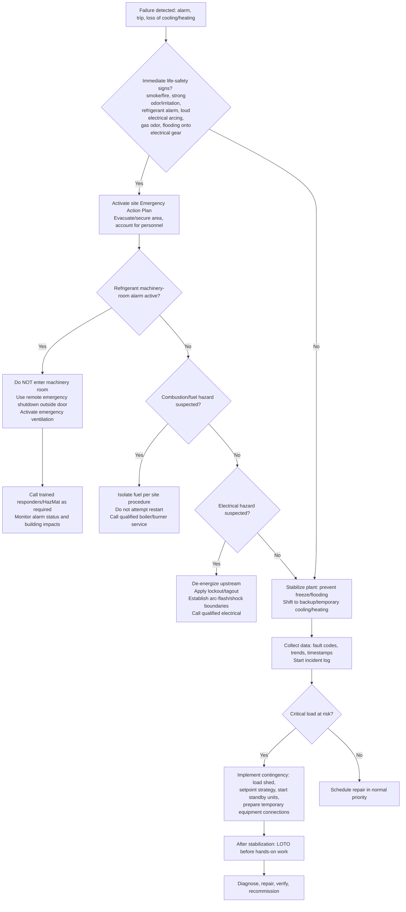

# Heater and Chiller Failure Emergency Protocol

## Executive summary

Heater/chiller failures become emergencies when they create (a) immediate life-safety risk (toxic/flammable refrigerant release, combustion/fuel hazards, electrical arc-flash/shock, asphyxiation, or uncontrolled pressure), (b) cascading facility risk (freeze damage, flooding, loss of critical ventilation/pressurization), or (c) regulatory-reportable events (serious injury/fatality, major accidental release, or threshold refrigerant leakage). A robust protocol therefore has two simultaneous tracks: **life safety and incident stabilization first**, then **equipment protection and continuity**—and it must be explicitly aligned to the governing safety standards, OSHA/EPA requirements, and the facility’s adopted mechanical/electrical/fire codes (jurisdiction unspecified). citeturn18view0turn17view0turn25view2turn19view0turn22view0

The most “load-bearing” code-driven requirements that directly shape emergency actions are: (1) **refrigerant detection + alarm + emergency ventilation** in refrigerating machinery rooms, with alarms annunciated inside and outside entrances and typically requiring manual reset; (2) **remote emergency shutoff** outside the machinery-room door for refrigerant compressors/pumps/automatic valves, and a separate control for ventilation; and (3) **restricted entry when the refrigerant alarm is active**, except by properly equipped and trained personnel. citeturn18view0turn17view0

Manufacturer emergency procedures converge on a consistent operator principle: **use the unit’s normal stop first to reduce mechanical stress unless a hazard demands immediate de-energization**, and always remember that a “STOP” command often **does not remove line voltage**—so isolation requires opening the upstream disconnect and applying lockout/tagout (LOTO) before hands-on work. citeturn20view3turn25view0turn25view1

For continuity, best practice is to pre-engineer “ride-through” options: staged redundancies (lead/lag or N+1 where justified), load shedding and setpoint strategy, and pre-installed connection points (valves, quick connects, electrical disconnect capacity) for temporary rental chillers/boilers. citeturn27view0turn28view0turn16view1

## Scope and assumptions

Facility type is **unspecified**, so this report is written as a **facility-agnostic baseline protocol** covering common equipment configurations:

- **Chillers**: mechanical compression (centrifugal, screw, reciprocating, magnetic-bearing) and associated condenser heat rejection (cooling tower/evaporative, air-cooled). citeturn28view0turn16view0  
- **Heating plant**: hydronic boilers/heaters (gas/oil/electric) and distribution (pumps, heat exchangers), and/or heat-pump heating modes where applicable. citeturn14search4turn14search2turn16view1  
- **Controls**: local chiller panels, starters/VFDs, and building automation/monitoring (BAS/BMS). citeturn21view0turn28view0  

Because jurisdiction is unspecified, “local building code” coverage is handled as: (a) **core model-code patterns** (e.g., International Mechanical Code-style machinery-room provisions) using a published chapter excerpt, and (b) **standards that model codes commonly reference** (notably the refrigeration safety standard). citeturn17view0turn18view0

Finally, refrigerant choice changes the emergency profile materially (toxicity/flammability classification; e.g., A1 vs A2L vs ammonia). Refrigerant safety group classifications are defined by the refrigerant designation/classification standard and are used in conjunction with the refrigeration safety standard. citeturn26view2turn18view0

## Standards, codes, and regulatory baseline

The table below maps the most consequential standards/regulations to the emergency protocol elements they *force* you to have (or strongly imply), independent of facility type.

| Authority / document | What it governs (emergency-relevant) | Protocol implications you should bake in |
|---|---|---|
| entity["organization","American Society of Heating, Refrigerating and Air-Conditioning Engineers","hvac standards org"] refrigeration safety standard (machinery rooms) | Machinery-room doors/egress; refrigerant detectors; alarm annunciation inside/outside entrances; ventilation design; remote emergency shutdown outside door; emergency guidance forbidding entry on alarm except trained/PPE personnel. citeturn18view0 | Your EOP must include: **do-not-enter rule on refrigerant alarm**, remote shutoff and ventilation controls, alarm interpretation, reentry criteria, and respiratory/PPE prerequisites. citeturn18view0 |
| Refrigerant designation/safety classification standard | Defines toxicity (A/B) and flammability (1/2L/2/3) classes and resulting safety groups (e.g., A1, A2L). citeturn26view2turn11search2 | Your hazard triage must branch on refrigerant class (asphyxiant vs toxic vs flammable risk) and use the assigned OEL/limits referenced by the refrigeration safety standard. citeturn18view0turn26view2 |
| Model mechanical-code machinery-room provisions (published chapter excerpt) | Ventilation rates (normal + emergency on detector actuation), discharge location, and **remote emergency shutoff** (break-glass / tamper-resistant cover) controlling compressors/pumps/automatic valves; auto shutoff at a vapor detector limit or **25% of LEL** (whichever is lower); separate “on-only” ventilation switch; restrictions on open flames in machinery rooms. citeturn17view0 | Formalize: emergency ventilation activation, remote shutoff location, signage, and “no ignition sources.” Include “auto shutoff threshold” concept (25% LEL) in your alarm-response logic where flammable refrigerants apply. citeturn17view0turn26view0 |
| entity["organization","Occupational Safety and Health Administration","us workplace safety agency"] emergency action plan rule | Requires a written EAP (with exceptions), procedures for reporting emergencies, evacuation, critical-operations duties, accounting for personnel, rescue/medical duties, and training/review triggers. citeturn25view2 | Your “protocol” is incomplete unless it is integrated into the site EAP: who calls, who evacuates, who stays for critical shutdown actions, and how muster/accountability works. citeturn25view2 |
| OSHA hazardous energy control (LOTO) rule + typical minimal procedure appendix | Requires an energy control program/procedures and provides a standard sequence (notify, identify energy, normal stop, isolate, apply locks, relieve stored energy, verify). citeturn25view1turn25view0 | Every post-failure diagnostic step that involves opening panels, touching conductors, valves, or rotating equipment must be gated behind LOTO. Include a LOTO checklist as a hard stop. citeturn25view0turn22view0 |
| OSHA electrical work-practices rule (de-energizing) | Live parts must be de-energized before work unless infeasible or introduces greater hazards; sets the expectation that energized work is the exception. citeturn24search2turn22view0 | Your protocol should default to “de-energize and verify absence of voltage” before invasive troubleshooting—especially after faults, smoke, water intrusion, or arc events. citeturn22view0turn24search2 |
| entity["organization","U.S. Environmental Protection Agency","us environmental agency"] refrigerant leak repair requirements (Clean Air Act Section 608 implementing rules) | For appliances with ≥50 lb full charge, sets trigger leak rates (IPR 30%, commercial refrigeration 20%, comfort cooling 10%); requires corrective action, verification tests, and retrofit/retirement plan if not corrected; special timelines (e.g., 120 days if industrial shutdown needed). citeturn19view0turn19view1 | Your recovery plan must include: leak-rate calculation logic, repair/verification workflow, retrofit/retire decision deadlines, and recordkeeping roles; and must distinguish ODS vs substitute refrigerants where applicable. citeturn19view0turn19view1turn24search33 |
| EPA Section 608 reporting (chronically leaking appliances) | Requires reporting to EPA by March 1 for appliances meeting the “125% of full charge in a calendar year” criterion (for covered refrigerants/equipment). citeturn24search1turn24search33 | Add a compliance trigger in your incident closeout checklist: “Did this event push us into chronic-leaker reporting?” citeturn24search1 |
| OSHA severe-injury/fatality reporting | Requires reporting fatalities within 8 hours and in-patient hospitalizations/amputations/eye loss within 24 hours (with timing rules). citeturn24search0turn24search4 | Include a regulatory notification decision node in the first-hour response and in the incident commander checklist. citeturn24search0 |
| Ammonia refrigeration (if applicable) — PSM/RMP | OSHA PSM applies at threshold quantities listed (ammonia commonly referenced at 10,000 lb), and EPA RMP uses 10,000 lb threshold for anhydrous ammonia; an EPA operator guide emphasizes RAGAGEP expectations and general duty considerations. citeturn10search5turn10search2turn10search14 | If ammonia is present, your “chiller failure protocol” must be treated as **process safety/hazmat**: detection, emergency response coordination, and compliance infrastructure (MOC, mechanical integrity, etc.). citeturn10search1turn10search26turn10search14 |
| entity["organization","National Fire Protection Association","fire safety codes org"] boiler/combustion safety signals | Boiler/combustion guidance indicates emergency shutdown (trip) should automatically initiate upon detection of serious combustion problems that could lead to unburned fuel accumulation or other hazardous situations. citeturn14search1 | For heating-plant emergencies: prioritize fuel isolation, purge/combustion safeties, and controlled shutdown logic; treat flame/combustion instability as a high-severity alarm. citeturn14search1 |
| Fuel gas code change/interpretation (emergency shutoff valves) | Requires an exterior shutoff valve to permit turning off gas supply to each building in an emergency; emergency shutoff valves must be plainly marked and locations posted as required by the AHJ. citeturn14search2 | Your heater failure plan should include **gas shutoff locations**, labeling, and responder guidance, plus an “outside-the-room” shutdown option where relevant. citeturn14search2 |
| entity["organization","Underwriters Laboratories","product safety certification org"] A2L-related equipment safety features (UL 60335-2-40 context) | For A2L refrigerants, describes integral refrigerant detection systems (RDS) designed to initiate mitigation actions within ~15 seconds at 25% LFL; installation must follow manufacturer instructions; sensor placement depends on orientation. citeturn26view0 | Operationally: treat A2L leak alarms as **time-sensitive**. Your protocol should include immediate ignition-source control, ventilation, and adherence to the manufacturer’s specified mitigation actions and sensor verification after service. citeturn26view0 |
| entity["organization","International Electrotechnical Commission","electrotechnical standards body"] appliance safety standard (IEC 60335-2-40 context) | Global appliance safety requirements (basis for many national adoptions) around refrigerant leak detection and mitigation approaches for flammable refrigerants (often implemented via UL harmonization in the U.S.). citeturn26view0turn11search4 | If your plant includes packaged heat pumps/AC with A2L, align your operator actions with the equipment’s certified mitigation sequence (do not “defeat” it during emergencies). citeturn26view0 |

**Key takeaway:** The “protocol” is not a generic checklist; it is a **code-and-hazard-class-driven decision process** anchored to (1) machinery-room detection/ventilation/shutdown, (2) energy isolation and electrical safety, (3) refrigerant emissions compliance, and (4) fuel/combustion safeties for heating equipment. citeturn18view0turn17view0turn25view1turn19view0turn14search1

## Failure modes and diagnostic checklists

### Common failure modes (grouped by hazard type)

The table below is designed for rapid triage: it links common failure modes to what matters first—**hazard severity and the “first safe check.”** The failure categories are consistent with chiller component aging and monitoring considerations documented in industry reliability guidance and O&M best-practice references. citeturn16view0turn28view0turn16view1

| Failure mode category | Typical triggers / symptoms | Immediate hazards | “First safe checks” (non-invasive) |
|---|---|---|
| Mechanical (compressor/drive/bearings) | abnormal noise/vibration, surge/unload oscillations, rising amperage, oil pressure alarms, repeated trips | rotating equipment hazards; secondary damage escalation | Trend last 1–24 hr: amps, oil pressure/temp, discharge/condensing temps; inspect trends/logs in controller/BMS before touching equipment. citeturn28view0turn16view0 |
| Electrical (starter/VFD/motor/power quality) | sudden trip, “ground fault,” “current imbalance,” overheating faults, nuisance trips; burnt smell | shock/arc flash; fire | Do not open panels until de-energized; verify fault codes; check upstream breaker status and visible signs (smoke/heat) from a safe distance. citeturn22view0turn21view0 |
| Controls/sensors/communications | implausible sensor values, loss of comms, safety inputs active, inability to start, repeated “inhibit” | can cause unsafe operation if bypassed | Confirm actual conditions with independent readings (handheld temp/pressure where safe), validate sensor plausibility, check for “auxiliary safety input” states. citeturn21view0turn28view0 |
| Refrigerant-side: leak / air ingress / relief event | refrigerant detector alarm, odor/irritation, purge run-time anomalies (low-pressure machines), sight-glass bubbles, loss of capacity, low suction pressure | asphyxiation; toxicity; flammability; environmental release | If machinery-room alarm is active: **do not enter** without trained/PPE; use remote shutdown + emergency ventilation; treat relief venting as a hazardous release scenario. citeturn18view0turn20view0turn17view0 |
| Water-side: low flow, fouling, tube failure, pump cavitation | high condenser pressure/temperature, high approach temps, differential pressure rise, freeze/low-temp alarms, water leaks | flooding; freeze rupture; secondary electrical hazards when water meets power | Verify pump status and proof-of-flow; check ΔP and temps; tube fouling can be inferred by rising barrel ΔP (e.g., +3–4 psi) and degraded heat transfer. citeturn17view0turn28view0turn16view1 |
| Heating/combustion (boiler/heater) | flame failure, combustion instability alarms, fuel pressure issues, high limit trips, abnormal exhaust/odor | fire/explosion; CO; fuel accumulation | Respect burner safeties; ensure emergency fuel shutoff is known and accessible; treat “serious combustion problems” as automatic trip conditions and a high-severity event. citeturn14search1turn14search2turn16view1 |

### Diagnostic checklists (staged: “operator-safe” then “technical-safe”)

**Stage A — Operator-safe checks (no panels opened, no confined entry, no bypassing safeties).** These align with the concept that modern chiller controls and safety controls shut equipment down to prevent damage and that operators should use controller data/alarms as the first diagnostic lens. citeturn28view0turn21view0

| Operator-safe check | What to record | Why it matters |
|---|---|---|
| Capture controller fault codes and timestamps | Alarm/fault name, trip time, any preceding warnings, number of repeats | Establishes event sequence and supports root cause and warranty/vendor communication. citeturn21view0turn20view3 |
| Snapshot key operating points (last good + at failure) | CHW leaving/entering temps, CW temps (if water-cooled), amps, oil pressure/temp, suction/discharge pressures (as available) | Many failure modes are distinguishable by the pattern in temperatures/pressures/amps before trip. citeturn28view0turn16view0 |
| Confirm auxiliary interlocks | flow proof inputs, remote contacts, emergency stop inputs | Loss of flow or emergency stop circuits legitimately force shutdown; don’t chase “machine problems” until interlocks are validated. citeturn6view2turn17view0 |
| Visual walkdown (safe distance) | unusual vibration/noise, oil leaks, water leaks, ice/frost patterns, odors | Helps detect water-side rupture, refrigerant leak indicators, or electrical overheating without exposure. citeturn20view0turn22view0 |
| Machinery-room alarm status | detector alarm state, ventilation state, entry signage, remote shutdown location | Determines whether entry is prohibited and whether emergency ventilation/shutdown must be actuated. citeturn18view0turn17view0 |

**Stage B — Technical-safe checks (after stabilization, de-energized, LOTO applied, hazards controlled).** Use the OSHA “typical minimal lockout procedure” sequence as the gating workflow: notify, identify energy, normal stop, isolate, lock, relieve stored energy, verify. citeturn25view0turn25view1

| Technical-safe check | Typical findings | Notes |
|---|---|---|
| Electrical integrity | loose contacts, corrosion, insulation damage, capacitor/VFD overheat evidence | Arc-flash guidance emphasizes hazards increase with poor maintenance/loose contacts; treat overheated components as potential ignition sources. citeturn22view0turn21view0 |
| Water-side mechanical integrity | strainer blockage, pump rotation, cavitation signs, tube leak evidence | Water O&M guidance highlights that fouling and water quality drive tube failure risk; trending ΔP is a practical indicator. citeturn28view0turn16view1 |
| Refrigerant-side integrity | leak check (no open flame), relief line integrity, purge indicators (where applicable) | Manufacturer safety guidance forbids open flame and requires relief discharge outdoors; evaluate purge behavior for air ingress/leaks in low-pressure machines. citeturn20view0turn6view2turn18view0 |

## Emergency response protocol

### Immediate response matrix (what to do in the first minutes)

This matrix is designed for **operators** (not service technicians) and assumes facility type is unknown. It is intentionally conservative where refrigerant alarms, electrical hazards, or combustion hazards exist.

| Scenario | First priority actions | Shutdown/isolation actions | Escalation trigger |
|---|---|---|---|
| Refrigerant detector alarm in machinery room (any refrigerant) | Treat as hazardous atmosphere: keep people out; follow “no entry on alarm” rule unless trained/PPE; activate EAP elements as needed. citeturn18view0turn25view2 | Use remote emergency shutdown and ventilation controls located outside the door (where required); ensure ventilation exhausts outdoors. citeturn18view0turn17view0 | If alarm persists or unknown source: call emergency responders/HazMat; do not reenter until safe and authorized. citeturn18view0turn25view2 |
| Chiller trip without leak alarm (mechanical/electrical trip) | Stabilize and protect equipment: prevent freeze/flooding; keep safe boundaries for electrical hazards. citeturn22view0turn16view1 | Use the unit STOP for orderly shutdown when safe; note STOP may not remove voltage—do not open panels until upstream disconnect is open and LOTO is applied. citeturn20view3turn25view0 | Escalate to qualified electrical/mechanical tech if repeated trips, smoke, burning smell, or VFD/motor faults. citeturn22view0turn21view0 |
| Water leak (water box, tube failure, pump seal) threatening electrical equipment | Prevent electrical contact + flooding spread; initiate EAP if needed. citeturn25view2turn22view0 | Isolate water source (valves), stop pumps as needed; de-energize affected electrical gear per electrical safe work practices. citeturn24search2turn25view0 | If water contacts energized equipment or there is arcing: treat as electrical emergency and request qualified response. citeturn22view0 |
| Heating plant combustion safety trip (boiler/heater) | Prevent fuel accumulation and unsafe restart; ensure occupant safety. citeturn14search1turn25view2 | Verify fuel shutoff capability; emergency shutoff valves should be marked and locations posted per AHJ. citeturn14search2 | If combustion instability, gas odor, or repeated flame failures: isolate fuel and summon qualified service/emergency response. citeturn14search1turn14search2 |
| A2L-equipped packaged equipment leak alarm (integral RDS) | Treat as flammable refrigerant mitigation event; avoid ignition sources; follow manufacturer instructions. citeturn26view0 | Expect mitigation within ~15 seconds at 25% LFL detection; do not defeat the mitigation sequence; ventilate per design. citeturn26view0turn17view0 | If mitigation fails or alarm persists: evacuate area and escalate as hazardous release. citeturn26view0turn25view2 |

### Emergency response and escalation flowchart (mermaid)



### Immediate operator actions (practical sequence)

This sequence is intentionally written so that it can be inserted into a site EOP, mapped to roles, and used in drills.

1. **Declare and classify the event (within minutes).**  
   Determine whether you are in one of these classes: (a) refrigerant alarm/release, (b) electrical event, (c) combustion/fuel event, (d) water leak/flooding, or (e) equipment trip without hazards. The first two classes normally control all other decisions. citeturn18view0turn22view0turn14search1turn17view0

2. **Initiate emergency action plan steps as appropriate.**  
   If evacuation or controlled shutdown duties are required, follow the EAP elements: reporting procedures, evacuation/exit routes, accounting for staff, and trained evacuation assistance. citeturn25view2

3. **If a refrigerant machinery-room alarm is active: do not enter.**  
   The refrigeration safety standard’s emergency guidance explicitly indicates that emergency procedures should forbid entry when the required refrigerant alarm is active except by trained persons with appropriate respiratory and protective equipment. citeturn18view0

4. **Use remote emergency shutdown and emergency ventilation controls (where provided).**  
   Remote controls for mechanical equipment shutdown and separate ventilation-fan controls are required outside machinery-room doors in the refrigeration safety standard, and model mechanical code language commonly requires a break-glass/tamper-resistant “off-only” emergency shutoff plus an “on-only” ventilation switch. citeturn18view0turn17view0

5. **If stopping a chiller without leak hazard: use the normal stop sequence first, unless immediate de-energization is required.**  
   Manufacturer procedures show normal “STOP” commands initiate controlled unloading/shutdown; in one centrifugal chiller manual, pressing STOP causes guide vanes to close and the compressor to shut off, with an option to terminate soft stop by pressing STOP twice. citeturn20view3

6. **Treat STOP as *not* an isolation step.**  
   Manufacturer safety notes emphasize that equipment may remain at line voltage when AC power is connected and that pressing STOP does not remove voltage. Therefore, do not open panels or touch conductors until upstream disconnect is open and LOTO is applied. citeturn20view3turn25view0turn24search2

7. **Protect the water-side from secondary damage (freeze/flood).**  
   Follow equipment-specific constraints; for example, one chiller manual cautions not to run the evaporator water pump longer than 30 minutes after the chiller is shut down (equipment-specific—verify for your unit). citeturn6view2

8. **Shift to standby/temporary capacity if critical conditions are threatened.**  
   A contingency planning guide for HVAC failures recommends pre-identifying critical equipment and portable replacements, and pre-installing piping/duct connections and electrical disconnects needed for temporary installation (e.g., adding access valves). citeturn27view0

### Temporary cooling/heating options (generic, facility-agnostic)

These are listed from “fastest to deploy” to “most capable,” and should be pre-decided in your contingency plan.

- **Operational load shedding and setpoint strategy:** raise chilled-water setpoint where feasible, reset condenser water targets within manufacturer limits, optimize water-side economizer/free cooling where present. citeturn28view0  
- **Start/sequence redundant installed equipment:** lead/lag alternates, standby chiller/boiler, redundant pumps/heat exchangers, cross-ties between loops (if designed). O&M best-practice guidance emphasizes using monitoring/metering and structured O&M management to improve reliability. citeturn16view1turn28view0  
- **Temporary/rental systems:** portable chillers/boilers/spot coolers, often enabled by pre-installed access valves/piping and adequate electrical disconnects noted in contingency planning guidance and case study. citeturn27view0  

## Communications, reporting, and templates

### Communication objectives (what “good” looks like)

A high-functioning communication plan does four things: (1) keeps people safe (clear evacuation/no-entry instructions), (2) preserves evidence and event chronology (fault codes, times), (3) accelerates restoration (right vendor on first call), and (4) satisfies mandatory reporting triggers (OSHA/EPA). citeturn25view2turn24search0turn19view0turn24search1

### Notification table (use as your call tree basis)

| Audience | Time target | Content to include | Governing driver |
|---|---:|---|---|
| Internal facilities/operations leadership | 0–15 min | Event class, affected areas, current status (cooling/heating loss), safety actions taken, initial ETA band for next update | EAP reporting + critical operations planning citeturn25view2 |
| EHS/safety officer | 0–15 min | Any release alarms, occupant exposure potential, PPE/entry restrictions, need for responders | Refrigeration emergency entry restrictions; hazard comm readiness citeturn18view0turn10search7 |
| Building occupants/tenants (if applicable) | 15–30 min | Clear behavioral instructions (avoid area, temperature expectations), continuity steps, next update time | EAP evacuation and communication intent citeturn25view2 |
| Service contractor/OEM | 15–60 min | Fault codes, trend snapshot, model/serial, event sequence, photos (safe), what’s already been tried | Manufacturer troubleshooting depends on fault history and safe handling citeturn21view0turn20view3 |
| Regulator: OSHA (if severe injury/fatality) | per rule | Fatality within 8 hours; inpatient hospitalization/amputation/eye loss within 24 hours | OSHA reporting rule citeturn24search0turn24search4 |
| Regulator: EPA (Section 608 triggers) | during closeout | If leak repair thresholds exceeded, follow repair/verification timelines; if chronically leaking, report by March 1 | EPA leak repair + reporting requirements citeturn19view0turn24search1turn24search33 |
| Local AHJ / fire department (as required) | event-driven | Refrigerant alarm events, flammable refrigerant risks, or combustion hazards may require coordination | Machinery-room emergency controls/signage and AHJ approvals citeturn18view0turn17view0turn14search2 |

### Ready-to-use templates

**Internal incident update (Slack/email) — short form**

Subject: HVAC Plant Alert — [Cooling/Heating] Impact as of [timestamp]

- What happened: [e.g., Chiller #2 tripped on alarm / Refrigerant detector alarm in machinery room / Boiler trip]  
- Safety status: [no entry / area isolated / evacuation initiated per EAP]  
- Current impact: [spaces affected, temps trending, critical loads at risk]  
- Actions underway: [remote shutdown/ventilation, switch to backup, contractor dispatched, LOTO initiated]  
- Next update: [time]  
- Point of contact: [role/name/phone]

(Align to EAP required elements: reporting procedures, critical operations steps, and accountability.) citeturn25view2

**External service escalation (OEM/contractor) — “first call” packet**

- Site/address and access instructions  
- Equipment: type (chiller/boiler), capacity, refrigerant, model/serial  
- Failure time + last known normal time  
- Fault codes/messages + number of repeats  
- Snapshot: CHW temps, CW temps, amps, oil pressure/temp, flow proof status  
- Safety constraints: refrigerant alarm status; LOTO status; confined space rules  
- Photos/video (safe distance)  
- Requested response: [diagnosis only / repair authorization threshold / rental bridging needed]

(Uses exactly the data manufacturers ask operators to respect—e.g., alarm messages and reset logic.) citeturn21view0turn20view3

**Regulatory trigger note (for EHS log)**

- OSHA reportability check: any fatality / inpatient hospitalization / amputation / eye loss? If yes, record notification time method. citeturn24search0turn24search4  
- EPA Section 608 check: refrigerant type (ODS vs substitute), full charge ≥50 lb?, leak rate threshold exceeded?, verification tests completed?, retrofit/retire plan needed?, chronic-leaker threshold and March 1 reporting? citeturn19view0turn19view1turn24search1turn24search33  

## Post-incident inspection, verification, and recovery steps

### Recovery principles (what must be true before restart)

A restart is justified only when **hazards are controlled** and the **failure cause is addressed**, not merely when alarms are cleared. Manufacturer documentation repeatedly frames restart eligibility as “after the reason for shutdown is determined and repaired,” with manual reset steps where applicable. citeturn21view0turn20view3

For refrigerant-related events, recovery also requires compliance actions: if leak thresholds are exceeded, you must complete repairs and conduct initial/follow-up verification tests; if repair is not successful, retrofit/retire planning may be triggered. citeturn19view0turn19view1

### Recovery checklist (structured)

| Phase | Required outputs | Evidence/artifacts |
|---|---|---|
| Stabilize | Area safe; alarms understood; equipment in a stable state (off/isolated/ventilated) | Incident log, controller screenshots, initial notification timestamps citeturn18view0turn25view2 |
| Isolate and make safe | De-energized and LOTO applied; stored energy relieved; electrical safe work condition established where needed | LOTO tags/locks record; verification of absence of voltage; work authorization citeturn25view0turn22view0turn24search2 |
| Diagnose and repair | Root cause identified; corrective action executed; no bypassed safeties | Work order details; replaced parts list; fault history citeturn21view0turn16view0 |
| Verify | For refrigerant leaks above thresholds: initial + follow-up verification tests; for combustion/hardware: safety interlocks verified | EPA verification test documentation (where applicable); inspection records citeturn19view1turn14search1 |
| Recommission | Controlled restart; operating envelope verified; trending enabled | New baseline log; post-start monitoring plan; operator sign-off citeturn28view0turn16view1turn20view3 |
| Closeout | Regulatory reporting completed if triggered; lessons learned captured; preventive actions assigned | OSHA/EPA checklists; corrective action report; updated SOPs citeturn24search0turn24search1turn25view2 |

### Recovery timeline (mermaid gantt)

```mermaid
gantt
  title Recovery timeline after heater/chiller failure (generic)
  dateFormat  HH:mm
  axisFormat  %H:%M

  section First hour
  Classify hazard, activate EAP if needed        :a1, 00:00, 00:10
  Remote shutdown/ventilation (if refrigerant)  :a2, 00:05, 00:20
  Capture alarms, trends, create incident log   :a3, 00:10, 00:40
  Implement continuity (backup/load shed)       :a4, 00:15, 00:45

  section Same day
  Apply LOTO, establish safe work conditions    :b1, 01:00, 01:30
  Diagnose (non-invasive then invasive)         :b2, 01:30, 03:00
  Repair/replace failed components              :b3, 03:00, 06:00
  Verification tests / interlock checks         :b4, 06:00, 08:00

  section Next days
  Recommission and trend key points             :c1, 08:00, 16:00
  Compliance documentation (EPA/OSHA as needed) :c2, 12:00, 24:00
  Root cause + corrective action plan           :c3, 16:00, 48:00
  Preventive actions and training refresh       :c4, 24:00, 72:00
```

## Preventive maintenance, resilience, spares, redundancy, and repair-vs-replace decision criteria

### Preventive maintenance and monitoring recommendations

A defensible preventive program combines: **daily/weekly operational logging**, **condition monitoring**, and **targeted maintenance** on known high-risk mechanisms (water-side fouling, refrigerant leakage/air ingress, electrical connection degradation). DOE O&M best-practice guidance emphasizes structured O&M management and metering/monitoring as foundational reliability tools. citeturn16view1turn16view0turn28view0

High-value, broadly applicable actions:

- **Daily/shift logs and trend baselines**: temperatures, pressures, flow, and motor amps are repeatedly cited as essential for troubleshooting and maintaining peak performance (and many modern controllers can store/transmit this). citeturn28view0turn21view0  
- **Water-side fouling control**: tube inspection/cleaning at least annually (or as operating constraints require); monitor condenser/evaporator barrel pressure drop—an increase of ~3–4 psi is cited as a practical indicator of scaling/fouling requiring tube cleaning; maintain water treatment programs. citeturn28view0turn15search7  
- **Refrigerant leak indicators**: for low-pressure machines, increased purge runtime can indicate air ingress/leak development; manufacturer maintenance guidance notes indicators such as frequent filter-drier changes suggesting significant leaks. citeturn6view2turn1search12turn28view0  
- **Oil analysis and lubricant management**: an OEM chiller manual recommends oil analysis after early operating period and then changing oil only if indicated, noting moisture/acid/wear metals as diagnostic signals. citeturn2view0turn16view0  
- **Electrical preventive work**: OSHA arc-flash guidance highlights that faulty equipment, inadequate maintenance, corrosion, worn insulation, and loose contacts increase arc-flash likelihood—supporting routine inspection/torque/thermography/vibration where appropriate. citeturn22view0turn16view1  
- **Refrigerant detection and mitigation integrity (A2L)**: UL guidance notes that integral refrigerant detection systems are part of equipment certification and rely on correct sensor placement and wiring, with mitigation expected quickly at 25% LFL; incorporate periodic verification and post-service checks. citeturn26view0turn26view1  

### Spare parts and “day-one readiness” kit (table)

Spare strategy should align with the most common downtime drivers: controls/electrical components, sensors, seals/valves, and water-side consumables; chiller component aging guidance explicitly includes monitoring/control devices and auxiliary components (purge units, lubricant pumps, valves) as core elements. citeturn16view0turn28view0

| Category | “Minimum practical” spares | Why these matter in emergencies |
|---|---|---|
| Controls & sensors | key temperature/pressure sensors, flow switches/proving devices, controller fuses, comm modules (site-specific) | A single failed sensor/interlock can hard-trip a plant; fast swap reduces downtime. citeturn28view0turn21view0 |
| Electrical | spare fuses, control power transformers (site-specific), contactors/relays, critical VFD components where feasible | Electrical faults can be high-consequence and slow to source; maintenance issues like loose contacts increase hazard and downtime. citeturn22view0turn21view0 |
| Refrigerant-side | filter-driers (where applicable), relief-device inspection schedule and replacements (per OEM), leak detection supplies (non-flame) | OEM guidance emphasizes regular relief inspection and replacement if corrosion/build-up is found; improper relief venting is prohibited. citeturn20view0turn18view0 |
| Water-side | pump seals, bearings/couplings (site-specific), strainer screens, gaskets for waterboxes | Water leaks and flow failures cascade quickly (flooding, freeze risk, electrical exposure). citeturn17view0turn16view1 |
| Safety & compliance | LOTO devices, calibrated gas/refrigerant detectors (as required), PPE appropriate to hazards and SDS | Entry and work are gated by PPE/training and hazard communication; SDS access must be immediate. citeturn18view0turn10search7turn25view1 |
| Temporary capacity readiness | pre-installed access valves/connection points; electrical disconnect capacity; hose kits where designed | Contingency planning guidance shows pre-installed access valves and connection readiness are key time savers for temporary systems. citeturn27view0 |

### Redundancy strategies (how to choose without knowing facility type)

Because facility type is unspecified, design the redundancy plan by **consequence of loss** and **time-to-damage**:

- If loss of cooling/heating can endanger life, revenue, or mission, contingency planning guidance recommends treating those assets as “critical equipment” and planning portable replacements, support services, and pre-installed connections. citeturn27view0  
- If the facility has machinery rooms and large refrigerant charge, code/standard-driven requirements (detection/ventilation/remote shutdown) are non-negotiable and should be treated as “safety redundancy,” not optional resilience. citeturn18view0turn17view0  

A practical decision rule is to define a **Maximum Allowable Outage Time (MAOT)** for each served function (comfort, process, life safety), then select redundancy/temporary measures that restore minimum viable performance inside that MAOT. Contingency planning sources explicitly recommend estimating downtime parameters in advance and comparing repair/replace time vs temporary equipment deployment time. citeturn27view0turn16view1

### Repair vs replacement decision criteria (table + scoring)

Use a structured, documented method so decisions are consistent and defensible. For life-cycle comparisons, federal life-cycle cost methodology guidance provides the framework for comparing alternatives beyond first cost (investment, operating, maintenance, disposal). citeturn15search3turn15search6turn16view0

**Decision criteria table (suggested scoring 1–5, higher = “replace” pressure)**

| Criterion | Score anchors (examples) | Primary drivers |
|---|---|---|
| Safety risk | 1: benign nuisance trips; 5: repeated hazardous releases/combustion hazards/electrical near-misses | Refrigeration machinery-room emergency guidance + electrical hazard principles citeturn18view0turn22view0 |
| Compliance burden | 1: no leak-rate triggers; 5: repeated threshold exceedances, chronic-leaker reporting risk, major documentation overhead | EPA trigger rates, verification tests, chronic-leaker reporting citeturn19view0turn19view1turn24search1turn24search33 |
| Reliability / recurrence | 1: single isolated failure; 5: repeated failures with escalating downtime | Aging mechanisms and monitoring emphasis citeturn16view0turn16view1 |
| Time-to-repair vs MAOT | 1: repair < MAOT; 5: lead time weeks-months, MAOT hours-days | Contingency planning explicitly recommends comparing repair time vs temporary deployment time citeturn27view0 |
| Parts/serviceability | 1: readily available; 5: obsolete controls/compressors, long lead items | Chiller component LCM guidance citeturn16view0 |
| Energy and operating cost | 1: modern high efficiency; 5: inefficient, high operating cost; replacement yields strong payback | FEMP purchasing and LCC methodology citeturn15search6turn15search3 |
| Strategic refrigerant risk | 1: stable refrigerant + low leakage; 5: high leakage, regulatory risk, transition pressure | Refrigerant management rules and leak-driven obligations citeturn19view0turn24search1 |

**Suggested decision threshold (practical):**  
- Total score **≥22/35** → default to *replace/major retrofit planning* unless there is a near-term temporary solution and a compelling constraint.  
- Total score **<22/35** → default to *repair* with preventive-action upgrades.

(Scoring approach is an implementation of life-cycle/asset management logic; the underlying requirement is that life-cycle cost methodology be applied when comparing alternatives, not that this exact threshold be used.) citeturn15search3turn15search6turn16view0

### Training and drills (minimum viable program)

Training is not optional: the EAP rule requires designation and training of employees to assist in safe, orderly evacuation and review of the plan when developed/roles change/plan changes. citeturn25view2  
LOTO compliance also depends on trained authorized employees and consistent procedures; OSHA provides a model minimal procedure and emphasizes controlling hazardous stored energy. citeturn25view0turn25view1

A minimal drill set that covers the highest-risk failure modes:

- **Refrigerant alarm drill (machinery room):** practice no-entry enforcement, remote shutdown actuation, emergency ventilation activation, and responder notification. citeturn18view0turn17view0  
- **Electrical event drill:** establish electrically safe work condition conceptually (who can open what, when), communication boundaries, and LOTO workflow. citeturn22view0turn25view0turn24search2  
- **Temporary capacity tabletop:** execute the contingency plan: identify critical equipment, confirm connection points, confirm contractor/rigging/electrical support lists, and validate the sequence to deploy temporary systems. citeturn27view0  

### Manufacturer emergency procedure patterns (examples from major OEM ecosystems)

While this report is not brand-specific, three widely deployed manufacturer ecosystems illustrate consistent design intent:

- **Trane-style centrifugal chiller procedures:** include clear normal shutdown steps (“press STOP”), pump management after shutdown, and maintenance practices (e.g., oil analysis programs and purge management in low-pressure systems). citeturn6view2turn2view0turn15search13  
- **Carrier-style centrifugal chiller procedures:** document safety prohibitions (do not vent relief devices indoors; no oxygen purge; no flame for leak detection), and describe STOP button behavior including controlled unloading and an immediate de-energize option by repeated STOP command; also explicitly warns that STOP does not remove line voltage. citeturn20view0turn20view3  
- **Johnson Controls/YORK-style control philosophy:** emphasizes “determine and repair the cause before restart,” with structured safety shutdown messages and manual reset (“Clear Faults”) logic; some faults maintain cooling fans/pumps for a timed period to prevent component overheating. citeturn21view0  

(These are **examples** of common procedural patterns; site procedures must still be validated against the specific installed model and the AHJ-adopted code set.) citeturn18view0turn17view0