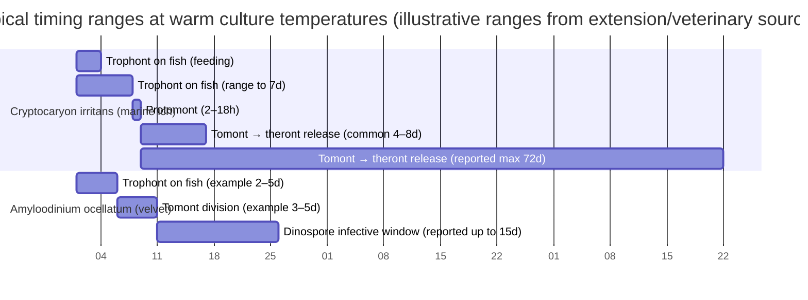

# Marine Ich vs Velvet Differential Diagnosis and Treatment Protocol

## Executive Summary

Marine ich (caused by *Cryptocaryon irritans*) and marine velvet (caused by *Amyloodinium ocellatum*) are both high-impact ectoparasitic diseases of marine and brackishwater fishes that can present with overlapping external signs (spots, mucus, lethargy, respiratory distress). The clinical consequence of misclassification is asymmetric: velvet typically progresses faster and is more likely to kill fish before confirmatory diagnostics or slow-acting control measures take effect, so an evidence-informed protocol should treat suspected cases as “velvet-until-proven-otherwise” when timelines and gill signs suggest it. citeturn14view0turn24view1turn8view0

The biologic reason both diseases are hard to eradicate in display systems is the same: key life stages are protected from many therapeutants (embedded trophonts on/in epithelium; encysted reproductive stages on the substrate), while only the free-swimming infective stages are reliably exposed. In *A. ocellatum*, authoritative aquaculture guidance emphasizes that only the dinospore stage is drug-susceptible and that trophonts and tomonts are resistant, forcing repeated or continuous exposure strategies. citeturn8view0turn14view0turn22view0

Microscopy (fresh wet mounts from skin/fin/gill) remains the fastest decisive test. *C. irritans* trophonts are ciliated and typically “roll/rotate slowly,” with broad size variability (tens to hundreds of microns), whereas *A. ocellatum* trophonts are pigmented (dark brown/golden), typically much smaller on average, and attach via an attachment plate/rhizoids; they can be obvious under low magnification in gill/skin scrapings when present. citeturn15view0turn14view0turn8view0

When molecular support is available, PCR/qPCR can (a) confirm ambiguous microscopy and (b) enable early/environmental detection: species-specific PCR for *C. irritans* has been reported to detect down to a single parasite using nested PCR, and a highly specific PCR for *A. ocellatum* reports detection down to a single cell from any life stage. qPCR/ddPCR approaches have been developed for seawater monitoring of *C. irritans* (including eDNA/ddPCR) and for *A. ocellatum* via seawater filtration plus qPCR. citeturn20view4turn20view5turn20view1turn21search0

Evidence-based therapeutics in common professional use cluster into a small set: copper (measured as free Cu²⁺ for ionic copper sulfate systems), chloroquine/hydroxychloroquine (commonly used in ornamental settings but legally restricted/not permitted for food fish in the US), and oxidizers/aldehydes (hydrogen peroxide, formalin) mainly as bath treatments or outbreak control adjuncts. For *C. irritans*, UF/IFAS guidance gives copper sulfate pentahydrate at 0.15–0.20 mg/L free Cu²⁺ for 3–6 weeks and chloroquine at 10 mg/L for 2–3+ weeks; hyposalinity (15 g/L) is explicitly strain- and temperature-dependent with documented failures at very low salinities for some strains. citeturn12view0turn22view0turn15view0

Reef tank/invertebrate safety is a dominant operational constraint: copper at therapeutic levels is lethal to most invertebrates and can disrupt biofilters; formalin and many other bath therapeutants are also incompatible with reef displays. Therefore, the practical differential protocol must integrate system triage (remove fish to hospital/quarantine) with disease identification, and include fishless (“fallow”) management of the display where eradication is the goal. citeturn22view0turn24view0turn12view0

Food-fish withdrawal times and legality depend on jurisdiction and labeled use. Examples from US-labeled products and veterinary references include: formalin products (e.g., Parasite‑S) list a zero-day withdrawal time; hydrogen peroxide 35% PEROX‑AID® is listed with zero-day preharvest withdrawal time; copper sulfate is described as unapproved but legally available with “regulatory action deferred” and a 7-day withdrawal time in a US-focused veterinary table; chloroquine is not approved/legally marketed for aquarium fish drug use and is not permitted in US food fish contexts in veterinary references. Where a parameter cannot be generalized across jurisdictions or is not on-label for the intended species/use-case, it is explicitly **unspecified** below. citeturn5search1turn19view1turn5search5turn5search3turn24view0

## Etiology and Life Cycles

### Marine ich (*Cryptocaryon irritans*)

*C. irritans* is a parasitic ciliate with a direct life cycle encompassing on-host and off-host stages: trophont (feeding stage embedded under epithelium), protomont (transition after leaving host), tomont (encysted reproductive stage on substrate), and theront (free-swimming infective stage). citeturn15view0turn12view0

Key time/dynamics parameters reported in UF/IFAS guidance (noting strain/temperature/salinity dependencies):
- Trophont feeding on fish: ~3–7 days. citeturn15view0  
- Protomont movement on substrate before encystment: ~2–18 hours; cyst hardening reported ~8–12 hours. citeturn15view0  
- Tomont development → theront release: highly variable; one cited study reports emergence over ~3–72 days with most released ~4–8 days after tomont formation, while other studies show narrower averages (e.g., ~5–12 days depending on strain/temperature). citeturn15view0turn12view0  
- Off-host persistence under adverse conditions: a cited strain’s trophonts and tomonts survived dormant for ~4–5 months at 12°C and later resumed development and infection when warmed, implying that “fallow” time requirements can lengthen substantially in colder conditions. citeturn15view0turn12view0  
- Theront infectivity declines quickly: markedly reduced by ~6–8 hours post-emergence, though noninfective theronts may remain motile up to ~48 hours. citeturn15view0

Therapeutic implication: most immersion treatments primarily target theronts (and possibly protomonts briefly), hence the need for multi-week continuous exposure or repeated treatments that span the longest plausible tomont-to-theront interval for the system conditions. citeturn12view0turn22view0

### Marine velvet (*Amyloodinium ocellatum*)

*A. ocellatum* is a parasitic dinoflagellate (often discussed as “velvet/rust/gold dust disease”) with a three-stage direct life cycle: trophont (attached feeding stage), tomont (encysted reproductive stage on substrate), and dinospore (free-swimming infective stage). citeturn8view0turn14view0turn24view1

Key time/dynamics parameters from extension/aquaculture sources (noting isolate and condition variability):
- A single trophont/tomont can produce up to ~256 infective dinospores. citeturn8view0turn14view0turn8view6  
- Life cycle completion can be rapid: SRAC guidance cites completion in as little as ~3–6 days at 20°C (referencing Paperna), and a UF fact sheet reports tomont division can be completed in ~3–5 days at 22–25°C. citeturn8view0turn14view0  
- Dinospores can remain infective for at least several days; one UF fact sheet reports “as long as 15 days” without a host, while SRAC cites ≥6 days (with infectivity dropping quickly after 24 hours) in its referenced literature. citeturn14view0turn8view0  
- Environmental tolerance can be broad: SRAC notes reported ranges (example values cited) down to ~12 ppt and up to ~50 ppt salinity, and roughly ~16–30°C temperature tolerance (isolate-dependent). citeturn8view0turn8view6  
- A core practical statement in SRAC is that **only** the dinospore stage is susceptible to drug treatment; trophonts and tomonts are resistant, so successful control requires repeated dosing or continuous exposure that “covers” successive waves of dinospores. citeturn8view0turn22view0

Therapeutic implication: velvet can amplify and re-infect quickly, so delays in diagnosis/treatment are more costly; effective strategies prioritize immediate reduction of parasite load on fish (e.g., dips/baths) plus sustained suppression of dinospores (e.g., copper/chloroquine) to prevent reinfection. citeturn8view0turn14view0turn22view0

### Life-cycle timing chart



Ranges reflect the variability explicitly described in UF/IFAS and other extension guidance for *C. irritans* (including reported long tomont-to-theront intervals) and for *A. ocellatum* (rapid cycling plus longer reported infective windows in some sources). citeturn15view0turn12view0turn14view0turn8view0

## Clinical Signs and Timeline

### Pattern recognition at the tank level

Both parasites can cause flashing, lethargy, anorexia, mucus changes, and respiratory distress; both may present with visible “spots,” but the *quality* of skin lesions and—critically—the *speed* of progression often diverge. citeturn12view0turn14view0turn24view1

Marine velvet is classically described as producing a fine “velvety/powdery” coating with a dull gold/brown sheen and may be first detected only when fish are already dying; gill involvement and rapid respiratory compromise are emphasized in veterinary and extension descriptions. citeturn14view0turn24view1turn8view0

Marine ich more commonly shows discrete white spots/nodules/patches and may wax and wane visually as trophonts leave the host; UF/IFAS explicitly warns that visible lesions can be absent if the infection is primarily in gills or if fish coloration masks them, so clinical appearance alone is insufficient. citeturn12view0turn15view0

### Comparative table of common presentation features

| Feature | Marine ich (*Cryptocaryon irritans*) | Marine velvet (*Amyloodinium ocellatum*) |
|---|---|---|
| Pathogen type | Ciliated protozoan (ciliate) | Dinoflagellate ectoparasite |
| Typical gross appearance | Discrete white spots/nodules/patches may be visible; sometimes only gills involved | Fine “dust/velvet” coating; dull gold/brown sheen possible; spots may be subtle |
| Common early clinical emphasis | Flashing, mucus changes; respiratory distress can occur (esp. gills) | Often rapid respiratory distress, anorexia, lethargy; deaths may be first sign |
| Progression speed (practical) | Often slower, with cyclic appearance; full cycle can be weeks depending on tomont timing | Often faster amplification/reinfection; can escalate to mortality rapidly in dense systems |
| Key life-cycle driver of persistence | Highly variable tomont-to-theront timing (reported up to many weeks); off-host survival under adverse conditions | Drug resistance of trophonts/tomonts; rapid production of many dinospores; dinospores can persist days–weeks depending on conditions |
| First-line decisive test | Wet-mount microscopy of skin/fin/gill | Wet-mount microscopy of skin/fin/gill |

This synthesis is derived primarily from UF/IFAS ich guidance and UF/SRAC/veterinary descriptions of velvet. citeturn15view0turn12view0turn14view0turn8view0turn24view1

## Microscopic and Diagnostic Tests

### Wet mounts and direct microscopy

Wet mounts are the fastest fork in the differential protocol because they allow direct visualization of the parasites on gill/skin tissues. UF/IFAS guidance for *C. irritans* and UF velvet guidance both specify gill, fin, and skin scrapings/biopsies as practical sample types for microscopy. citeturn15view0turn14view0turn12view0

**Sample collection methods (wet mount)**
- **Skin/fin scrape**: gently scrape mucus/scales (avoid deep injury) and mount in system water on a slide with coverslip. citeturn14view0turn15view0  
- **Gill biopsy/scrape**: collect a small gill filament sample (often from moribund or sedated fish in clinical settings; sedation details are not standardized in the cited sources, so sedation protocol is **unspecified** here) and mount in system water. citeturn14view0turn15view0  
- **Microscope settings**: low magnification (e.g., 40×) may detect *A. ocellatum* trophonts due to pigmentation; *C. irritans* trophonts are also visible but often evaluated across magnifications to confirm ciliation/rolling motion. citeturn14view0turn15view0turn24view1

**What you expect to see**
- *C. irritans* trophont: spherical to club/pear-shaped; cilia all over; characteristic slow “rolling/rotating” under epithelium; wide size range (reported ~48×27 µm up to ~452×360 µm). citeturn15view0  
- *A. ocellatum* trophont: pear-shaped to spherical; dark brown to golden pigmentation; mean size reported ~61×50 µm; attachment plate may be visible under light microscopy. citeturn14view0turn8view0  

image_group{"layout":"carousel","aspect_ratio":"1:1","query":["Cryptocaryon irritans trophont wet mount microscope image","Amyloodinium ocellatum trophont gill wet mount microscope image","marine ich Cryptocaryon irritans microscopy ciliate rolling","marine velvet Amyloodinium ocellatum trophont golden brown microscopy"],"num_per_query":1}

### Histology

Histology can confirm organism location (e.g., gill lamellae) and characterize tissue response, especially when wet mounts are negative or compromised. However, absence on histologic sections does not exclude infection when burdens are low or sampling misses focal infestations (an uncertainty explicitly noted in SRAC guidance for velvet). citeturn8view0turn14view0turn12view0

**Sample fixation method**
- Diagnostic tissue fixation is typically done in **10% neutral-buffered formalin (10% NBF)** for histology; UF formalin guidance emphasizes that 10% NBF is not the same product as “treatment formalin” and should not be used interchangeably. citeturn16view0  
- Exact tissue sampling panel (which gill arches/skin sites, minimum size, etc.) is **unspecified** in the cited extension sources and is typically lab-dependent.

### PCR and qPCR/ddPCR

Molecular diagnostics add specificity (distinguishing similar taxa) and enable early/environmental monitoring, but require defined sampling/processing pipelines and contamination control.

**Conventional/nested PCR**
- *C. irritans*: species-specific PCR and nested PCR targeting ITS rDNA were reported to detect as low as 45 pg of DNA by specific PCR and, with nested approach, detect a **single** *C. irritans* organism. Study methods included ethanol storage of ciliate samples and a simulated infected seawater protocol for detection. citeturn20view4  
- *A. ocellatum*: a species-specific PCR targeting rDNA region was reported to detect as little as a **single cell** from trophont, tomont, or dinospore stages; performance was reported in artificial and natural seawater and was not inhibited by gill tissue. citeturn20view5turn21search3  

**qPCR / ddPCR**
- *C. irritans* seawater qPCR: a PubMed-indexed study reports development of a dilution method to manage qPCR inhibitors and field application that aligned with observed disease status in a net-cage farm setting (specific filtration volumes and workflows are largely outside the abstract; therefore detailed sample volume and extraction steps are **unspecified** here). citeturn20view0  
- *C. irritans* eDNA ddPCR: an open-access study describes development of a ddPCR assay to detect *C. irritans* from water samples and positions it as an environmental monitoring tool. citeturn20view1  
- *A. ocellatum* seawater qPCR: a 2025 Aquaculture paper abstract describes suction filtration of seawater using a vacuum pump, adsorption of dinospores onto a cellulose acetate membrane, and assay detection down to ~8–10 cells per 300 mL with high specificity and repeatability; it also reports a protective buffer protecting DNA from degradation >96 h. citeturn21search0  

**LAMP**
- A LAMP assay for *A. ocellatum* (targeting SSU rDNA) was reported with a detection limit of 10 fg, capable of detecting single tomonts/trophonts, not inhibited by environmental water or gill sample inhibitors, and optimized at ~62°C for 25–30 minutes. citeturn20view3  

### Immunoassays

Antibody ELISAs have been developed in the research literature for both parasites (e.g., ELISA to detect antibody responses after exposure/immunization in fish). These assays are best interpreted as **exposure/immune response** tools rather than definitive “active infection” diagnostics without careful validation, because antibody presence may persist beyond infection and may vary with immune status. Routine commercial availability for aquarium/aquaculture clinical workflows is **unspecified**. citeturn6search0turn6search2

### Diagnostic test comparison table

| Diagnostic method | Sample type (practical) | Typical time-to-result | Strength in ich vs velvet differential | Key limitations |
|---|---|---|---|---|
| Wet mount microscopy | Skin/fin scrape; gill biopsy/scrape | Minutes | High: direct visualization with distinct morphology/pigmentation/ciliation | False negatives if low burden, poor sampling, or prior dips; requires microscope skill |
| Histology | Gill/skin tissues fixed in 10% NBF | Days (lab-dependent) | Moderate: confirms tissue invasion and pathology | Sampling bias; low burden can be missed |
| Species-specific PCR / nested PCR | Parasite/tissue DNA; (some assays also applied to water) | Hours–1 day | High specificity for confirmation | Requires lab; contamination control; sample prep affects sensitivity |
| qPCR / ddPCR (water monitoring) | Seawater filtration/extraction | Hours–1 day | High for early detection/monitoring; supports biosecurity | Requires validated workflows and inhibitor management |
| LAMP (velvet) | Water or gill DNA | <1 hour after extraction | Strong candidate for rapid velvet screening | Field validation and operational integration may be limited |
| ELISA (research) | Serum/mucus antibodies | Hours (lab) | Limited as acute differential tool | Reflects immune response/exposure; clinical cutoffs often system-specific |

This table reflects the capabilities and constraints described in extension/veterinary sources and primary diagnostic assay literature. citeturn15view0turn14view0turn16view0turn20view4turn20view5turn20view3turn20view1turn21search0turn6search0turn6search2

## Differential Diagnostic Criteria and Decision Tree

### Key distinguishing features used in practice

The most diagnostic discriminators, when integrated, are:
- **Speed and gill dominance**: velvet often presents with early severe respiratory distress and rapid mortality; ich is often slower and more cyclic in visible lesions. citeturn14view0turn12view0turn24view1  
- **Microscopy morphology**: ciliated rolling trophonts (ich) versus pigmented attachment-plate trophonts (velvet). citeturn15view0turn14view0  
- **Response to freshwater exposure**: UF/IFAS ich guidance notes that freshwater exposure up to 18 hours did not seem to affect ich trophonts on the host, implying that short freshwater dips are unreliable as an ich treatment; in velvet, freshwater dips are described as reducing trophonts on gills/skin but not eradicating infection because encysted stages remain protected. citeturn12view0turn13search6turn14view0  
- **System context**: velvet outbreaks are strongly associated with high-density/culture systems and may enter via contaminated source water or fish/food; ich similarly spreads within groups via free-swimming stages, and aerosolization between tanks is considered possible in heavily aerated systems in UF/IFAS guidance. citeturn14view0turn12view0  

### Diagnostic decision tree (mermaid)

```mermaid
flowchart TD
    A[Observe clinical pattern in marine/brackish fish] --> B{Rapid respiratory distress / sudden deaths?}
    B -->|Yes| C[Assume velvet risk high; start emergency supportive care and isolate fish]
    B -->|No / slower course| D[Ich more likely but still confirm]

    C --> E[Collect gill + skin/fin wet mounts immediately]
    D --> E[Collect skin/fin + gill wet mounts]

    E --> F{Microscopy finding}
    F -->|Pigmented golden-brown trophonts; attachment plate/rhizoids| G[Diagnose Amyloodinium (velvet)]
    F -->|Ciliated trophonts; slow rolling/rotating; larger size variability| H[Diagnose Cryptocaryon (marine ich)]
    F -->|Negative/ambiguous| I[Escalate diagnostics]

    I --> J{Resources available?}
    J -->|PCR/qPCR/LAMP available| K[Send gill/skin DNA; optionally filter water for qPCR/ddPCR monitoring]
    J -->|No molecular access| L[Repeat wet mounts; consider differentials (Brooklynella, Uronema, monogeneans, bacterial gill disease)]

    G --> M[Begin velvet protocol: immediate load reduction + sustained dinospore suppression]
    H --> N[Begin ich protocol: sustained theront suppression over full life cycle]
```

### Practical recommendation when uncertain

If microscopy is delayed or ambiguous and fish show fast progression with marked respiratory distress, a conservative and commonly adopted risk posture is to initiate velvet-appropriate stabilization and dinospore-suppression measures while pursuing confirmatory testing, because velvet’s high speed reduces the margin for waiting. This “treat as velvet until ruled out” posture is consistent with extension/veterinary emphasis that velvet is often first noticed as dying fish and that control is challenging with guarded prognosis once advanced. citeturn14view0turn24view1turn8view0

## Evidence-Based Treatment Protocols and Monitoring

### System triage and non-negotiable constraints

**Reef/invertebrate systems:** Copper is lethal to most invertebrates and is generally incompatible with reef displays; copper also can impair biofilters and requires intensive monitoring. Formalin can sharply reduce dissolved oxygen and has additional system-level risks; chloroquine/hydroxychloroquine considerations include legality and limited husbandry data in some veterinary guidance. For these reasons, evidence-based protocols usually require moving fish to a dedicated treatment system (hospital/quarantine) and managing the display separately (often fishless). citeturn22view0turn24view0turn16view0turn12view0

**Copper measurement is form-dependent:** UF/IFAS copper guidance stresses that the active form is free Cu²⁺ for copper sulfate (“bluestone”) and that numerous system factors (carbonates, substrates, pH shifts, organic load, live foods) alter measured free copper; therefore, dosing must be guided by appropriate testing at least twice daily during stabilization. citeturn22view0turn8view1turn12view0

### Core protocols for marine ich (*Cryptocaryon irritans*)

#### Copper (ionic copper sulfate systems; measured as free Cu²⁺)

UF/IFAS ich guidance and copper guidance converge on:
- **Target concentration:** 0.15–0.20 mg/L free Cu²⁺. citeturn12view0turn22view0turn8view1  
- **Ramp-up:** reach target gradually over ~2–3 days when feasible. citeturn12view0turn22view0turn8view1  
- **Duration:** minimum **3–6 weeks** for ich due to the prolonged and variable life cycle. citeturn12view0turn22view0  
- **Monitoring:** check free copper at least twice daily; adjust to maintain range. citeturn12view0turn22view0  
- **Key chemistry constraints:** carbonates (crushed coral, oyster shell, dolomite), bicarbonate, organic matter, and activated carbon can bind copper; decreases in pH can release previously bound copper and raise free Cu²⁺ (toxicity risk); increases in salinity can reduce copper adsorption and change concentrations. citeturn22view0turn8view1  

Species sensitivity is a major limiter: some fish are highly copper-sensitive and may die below therapeutic levels; invertebrates should be removed prior to copper treatment. citeturn22view0turn24view0

#### Chloroquine (prolonged bath)

UF/IFAS ich guidance describes:
- **Dose:** 10 mg/L chloroquine diphosphate as a prolonged bath. citeturn12view0  
- **Duration:** 2–3 weeks or more may be required; redose proportional to water changes. citeturn12view0  

Veterinary manual guidance notes mixed results in some use-cases and emphasizes that chloroquine is not permitted in US food fish contexts; separate from food-fish legality, the US regulator has issued warnings that chloroquine phosphate intended for aquarium fish is not approved/legally marketed as an animal drug. Where chloroquine procurement/purity and legal use are uncertain, the operational parameter set is **unspecified** and should be treated as jurisdiction-dependent. citeturn24view0turn5search3turn12view0

#### Hyposalinity

UF/IFAS ich guidance provides a strain-conditional protocol:
- **Example protocol:** maintain ~15 g/L (ppt) for 21–30 days, reducing salinity gradually by 5–10 g/L per day. citeturn12view0  
- **Important caveat:** hyposalinity effectiveness is inconsistent because strains differ; outbreaks have been reported at salinities as low as 5–10 g/L, and exposure to freshwater for up to 18 hours did not affect trophonts on the host in cited work. citeturn12view0  

Because of this variability, hyposalinity should be considered a **conditional** tool, best used only when (a) fish species tolerate it and (b) diagnostic/molecular/experience suggests strain susceptibility; otherwise its effectiveness is **unspecified**. citeturn12view0turn15view0

#### Formalin (adjunct/variable-success regimens)

UF/IFAS ich guidance notes formalin has been used with variable success and provides one suggested regimen (hyposalinity plus 25 mg/L formalin every other day for 4 weeks) while emphasizing system and species considerations and the oxygen-depleting property of formalin. citeturn12view0turn16view0

From UF formalin guidance for general parasite control:
- **Prolonged bath:** 12.5–25 mg/L (indefinite bath). citeturn16view0  
- **Short bath:** up to 250 mg/L for 30–60 minutes (requires close observation; move fish to clean water if distressed). citeturn16view0  
- **Monitoring constraint:** formalin can markedly reduce dissolved oxygen; vigorous aeration and DO monitoring are required; it can interfere with Nessler-type ammonia tests, so salicylate-based ammonia assays are recommended when formalin is present. citeturn16view0turn24view0  

### Core protocols for marine velvet (*Amyloodinium ocellatum*)

#### Copper (ionic copper sulfate systems; measured as free Cu²⁺)

Multiple authoritative sources describe copper as a common and often primary tool for velvet control in systems without invertebrates:
- **Target concentration:** 0.15–0.20 mg/L free Cu²⁺ (often cited for both *Amyloodinium* and *Cryptocaryon*). citeturn22view0turn8view1turn14view0  
- **Duration:** UF/IFAS copper guidance suggests **10–14 days** for *Amyloodinium*; an older UF velvet fact sheet describes maintaining ~0.2 mg/L for up to 3 weeks; both emphasize gradual ramping and repeated testing. citeturn22view0turn14view0  
- **Mechanistic limitation:** copper is effective primarily against free-swimming dinospores; trophonts on fish and tomonts in cysts are protected, requiring sustained exposure to prevent reinfection. citeturn22view0turn8view0  

#### Chloroquine / hydroxychloroquine (ornamental settings; legality constraints)

Veterinary guidance states chloroquine can be used against *Amyloodinium* as a prolonged bath at 10 mg/L and describes it as often effective in recirculating systems, but also notes limited data on intervals and husbandry effects and recommends weekly examination/biopsy to assess efficacy. citeturn24view0turn24view1

Controlled outbreak work in ornamental clownfish has compared treatments: copper sulfate (10 ppm) and hydroxychloroquine phosphate (10 ppm) delivered as 14-day continuous baths yielded higher survival than formalin or malachite green in that reported study context. Note that “ppm” in that paper is reported as treatment concentration in water; conversion to free Cu²⁺ equivalence and cross-product comparability is **unspecified** and should not be assumed equivalent to free Cu²⁺ targets used for copper sulfate dosing in marine systems. citeturn13search4turn22view0

Legality/food fish: veterinary guidance states chloroquine is not permitted in US food fish, and the US regulator has warned that chloroquine phosphate intended for aquarium fish is not approved/legally marketed for that use; therefore food-fish withdrawal time is **unspecified** (because use itself is not permitted/approved in that context). citeturn24view0turn5search3

#### Hydrogen peroxide (bath; species- and temperature-sensitive)

A controlled aquaculture trial series summarized in UF/IFAS hydrogen peroxide guidance reports:
- **Amyloodinium (lab tank trial):** 75–100 mg/L H₂O₂ for 30 minutes, once, in Pacific threadfin juveniles. citeturn17view0  
- **Amyloodinium (field tank trial):** 75 mg/L for 30 minutes; two treatments six days apart reduced trophonts to nondetectable levels in that setting. citeturn17view0  
- **Do not combine with other chemicals** (general rule given). citeturn17view0  
- **Temperature effect:** regulatory labeling language indicates finfish sensitivity to 35% PEROX‑AID® increases with increasing water temperature and suggests starting at the low end of regimens or reducing temperature; specific safe temperature thresholds for marine ornamental species in velvet treatment are **unspecified**. citeturn19view1  

Because peroxide tolerance varies markedly by species and exposure time (documented in the same UF/IFAS review), peroxide baths should be treated as requiring species-specific risk assessment and (where possible) small-scale bioassay before whole-population use. citeturn17view0

#### Formalin (bath; oxygen and handling hazards)

Virginia extension guidance lists formalin (25 mg/L) as an FDA-approved therapeutant option for food fish production against *A. ocellatum*, and UF formalin guidance provides dosing ranges and monitoring constraints (oxygen depletion, paraformaldehyde formation in cold storage, etc.). citeturn13search6turn16view0

Veterinary guidance notes formalin (usually 15–25 mg/L prolonged bath) is FDA approved as a parasiticide for finfish and penaeid shrimp, and stresses vigorous aeration (and that “treatment formalin” differs from 10% histology fixative). citeturn24view0turn16view0

#### Freshwater dips (supportive, not curative)

Virginia extension notes freshwater dips of ~3–5 minutes can reduce trophonts on gills/skin, but because encysted stages remain protected, dips alone are not complete therapy. citeturn13search6turn14view0

### Central treatment comparison table

| Intervention | Ich efficacy (evidence-aligned use) | Velvet efficacy (evidence-aligned use) | Typical dose & duration (from cited sources) | Pros / cons | Reef/invertebrate safety | Food fish / withdrawal notes |
|---|---|---|---|---|---|---|
| Copper sulfate (ionic; free Cu²⁺ target) | Core option | Core option | 0.15–0.20 mg/L free Cu²⁺; ich 3–6 weeks; velvet 10–14 days (often up to ~3 weeks in older guidance) | Effective against infective stages; requires frequent testing; toxic to sensitive fish; impacts biofilters | Not reef-safe; lethal to most inverts | Withdrawal: 7 days in a US veterinary table; regulatory status noted as unapproved but “regulatory action deferred” (jurisdiction-dependent) |
| Chelated copper | Conditional option | Conditional option | Dose **varies**; follow manufacturer; safety/efficacy more variable than copper sulfate in UF/IFAS ich guidance | Possibly easier stability; measurement complexities | Not reef-safe | Withdrawal **unspecified** (product- and jurisdiction-dependent) |
| Chloroquine / hydroxychloroquine | Core alternative in some systems | Core alternative in some systems | 10 mg/L prolonged bath; ich 2–3+ weeks; velvet: 10 mg/L indefinite bath described; intervals/husbandry effects partly “data-limited” | Often effective in recirculating systems; fewer water tests than copper; legal/purity constraints | Not reef-safe; impacts on algae/inverts noted in veterinary sources | Not permitted in US food fish; US regulator warns aquarium-fish chloroquine is unapproved |
| Hyposalinity | Conditional; strain-dependent | Generally doubtful | Ich: 15 g/L for 21–30 days (strain/temp-dependent); velvet: effectiveness doubted because organism flourishes in brackish water | No chemical residues; but fish tolerance limits, and failures documented | Reef tank salinity shift stresses inverts | Withdrawal not applicable |
| Formalin | Adjunct/variable | Adjunct/option | Prolonged bath 12.5–25 mg/L; short bath up to 250 mg/L for 30–60 min; ich combo regimen described as 25 mg/L every other day + hyposalinity for 4 weeks | Broad protozoan activity; major oxygen/personal safety constraints; test interference | Not reef-safe; oxygen depletion risks | Formalin labels list 0-day withdrawal; FDA-approved products exist |
| Hydrogen peroxide (baths) | Supportive/experimental for ich in marine context (primary ich dosing in marine is **unspecified** in cited sources) | Evidence-supported in at least one aquaculture species; used as bath | 75–100 mg/L for 30 min (trial); two 75 mg/L treatments 6 days apart (field) | Rapid reduction possible; strong oxidizer; species/temperature tolerance varies; avoid mixing chemicals | Not reef-safe at therapeutic bath levels | 35% PEROX‑AID® label lists 0-day withdrawal when used as labeled; marine velvet use may be extra-label → withdrawal **unspecified** |
| Freshwater dip | Not reliable (trophonts can persist) | Supportive (reduces trophonts) | 3–5 minutes (velvet guidance) | Fast, low-cost; stress risk; not curative | Not applicable | Withdrawal not applicable |

Table values are drawn from UF/IFAS ich/copper/formalin/peroxide guidance, Virginia extension velvet guidance, veterinary manual references, formal product labeling, and FDA notices. citeturn12view0turn22view0turn16view0turn17view0turn13search6turn24view0turn5search5turn5search3turn5search1turn19view2

### Drugs commonly mentioned but not primary therapies for ich/velvet

The user requested inclusion of praziquantel and metronidazole. These are widely used in fish medicine, but **not** as primary therapies for *C. irritans* or *A. ocellatum* based on the cited veterinary/extension sources:

- **Praziquantel**: Used for cestodes and external monogeneans; Merck veterinary guidance lists 5 mg/L prolonged bath for large marine aquaria and 35–125 mg/kg PO for up to 3 days, and states it is not permitted in US food fish. For ich/velvet differential workflows, praziquantel is best viewed as a “differential/coinfection” tool (e.g., if gill flukes are present), not an ich/velvet cure; ich/velvet-specific dosing is therefore **not applicable**. citeturn24view0turn24view1  
- **Metronidazole**: Used for intestinal protistans; Merck guidance lists ~7 mg/L daily for 5 days (bath) and 50 mg/kg PO for 5 days, and states it may not be used in US food fish. It is not presented as an ich/velvet therapy in the cited veterinary sources, so ich/velvet dosing is **not applicable**. citeturn24view0  

## Quarantine, Supportive Care, and Prevention

### Supportive care during outbreaks

Supportive care is primarily about correcting the physiologic consequences of gill damage and stress while definitive therapy targets infective stages:
- **Maximize oxygenation/aeration**, especially when using formalin (explicitly oxygen-depleting) or when fish show respiratory distress. citeturn16view0turn24view0  
- **Monitor ammonia/nitrite closely**: copper can impair nitrifying bacteria and cause prolonged ammonia/nitrite instability; formalin can interfere with Nessler-based ammonia tests, pushing preference for salicylate-based assays when formalin is present. citeturn24view0turn16view0turn22view0  
- **Reduce handling stress**: dips and transfers can help but can also stress fish; monitoring for distress and immediate removal to clean water during high-concentration baths is recommended in formalin guidance. citeturn16view0  

Detailed nutritional immunostimulant regimens, antibiotic choices for secondary bacterial infections, and species-specific sedation protocols are **unspecified** in the cited core sources and typically require case-by-case veterinary direction.

### Quarantine procedures

For velvet prevention, an older UF velvet fact sheet recommends quarantining all incoming fish for a minimum of **3 weeks** before introduction to an existing system, emphasizing avoidance as more effective than treatment. citeturn14view0

For ich, UF/IFAS guidance recommends quarantine and even sampling skin/fins/gills before, during, and after quarantine, noting that carriers can reseed outbreaks and that tomonts/trophonts are protected from many treatments. Because UF/IFAS reports life cycle duration ranges up to **6–11 weeks** and cites theront release up to 72 days in some reports, quarantine duration sufficient for “proof of absence” is inherently longer than many hobby practices; the exact minimum quarantine duration to guarantee absence under all conditions is therefore **unspecified** and should be built from local risk tolerance, system temperature, and diagnostic testing cadence. citeturn12view0turn15view0

### Fallow (fishless) management and disinfection

For ich, UF/IFAS describes that many control approaches target theronts and recommends prolonged treatment periods due to life-cycle duration variability; it also reports laboratory-effective disinfection conditions for tomonts/theronts (e.g., chlorine, benzalkonium chloride, heat, drying), supporting the principle that equipment/tanks can be disinfected and dried between uses to break cycles. citeturn12view0

For velvet, extension sources emphasize that tomonts are resistant and that dinospores can persist days to weeks without a host; prevention focuses on excluding the parasite via fish quarantine, food/water hygiene, and (in culture contexts) filtration/flushing/UV/ozone to reduce free stages. citeturn14view0turn13search6turn8view0

### Prevention strategies checklist (evidence-aligned)

A prevention program that is consistent across ich and velvet (and supported in the cited extension guidance) includes:
- **Quarantine** new fish before introduction; consider periodic wet-mount sampling in quarantine. citeturn12view0turn14view0  
- **Quarantine/hold invertebrates/substrate/live rock** that could harbor encysted stages (noting UF/IFAS explicitly lists invertebrates/substrate/materials as potential tomont carriers for ich). citeturn12view0  
- **Avoid introducing contaminated water or food items**; velvet guidance cites outbreaks traced to contaminated food and warns that natural seawater can introduce tomonts/dinospores. citeturn14view0turn12view0  
- **Use filtration/UV/ozone strategically** as reducers of free-swimming stages (not stand-alone cures), especially in high-density systems. citeturn13search6turn12view0  
- **Prevent cross-tank spread** via shared equipment and potentially aerosols in heavily aerated systems (ich guidance notes aerosolization is likely possible). citeturn12view0  

### Gaps and conflicting evidence with practical implications

Hyposalinity is the clearest example of conflicting/conditional evidence: UF/IFAS reports effective killing of tomonts for one strain after 48 hours at ≤15 g/L, but also reports outbreaks and successful propagation of strains at 5–10 g/L, making any blanket hyposalinity claim unreliable. Practically, this shifts hyposalinity from a “standard” to a “conditional” option that requires either strain inference or alternative definitive therapy. citeturn12view0

For chloroquine, veterinary sources describe strong efficacy in some recirculating systems but also explicitly note major data gaps on intervals and husbandry effects; on top of that, regulatory status limits use (especially for food fish) and purity/quality control can be problematic. Practically, chloroquine-based protocols should be treated as high-utility but governance-constrained tools where legal/purity/monitoring frameworks are present; otherwise parameters are **unspecified**. citeturn24view0turn5search3turn12view0

Hydrogen peroxide has credible efficacy data against *Amyloodinium* in at least one cultured species and has fish-to-fish variability in tolerance; practical use should therefore be species-validated and treated as an outbreak tool rather than a universal velvet standard without local validation. citeturn17view0turn13search6

## Sources and URLs

```text
UF/IFAS EDIS – Cryptocaryon irritans (FA164): https://ask.ifas.ufl.edu/publication/FA164
UF/IFAS EDIS – Use of Copper in Marine Aquaculture and Aquarium Systems (FA165): https://ask.ifas.ufl.edu/publication/FA165
UF/IFAS EDIS – Use of Formalin to Control Fish Parasites (VM061): https://ask.ifas.ufl.edu/publication/VM061
UF/IFAS EDIS – Use of Hydrogen Peroxide in Finfish Aquaculture (FA157): https://ask.ifas.ufl.edu/publication/FA157

SRAC Publication 4705 – Amyloodinium ocellatum: https://agrilife.org/fisheries/files/2013/09/SRAC-Publication-No.-4705-Amyloodinium-ocellatum-an-Important-Parasite-of-Cultured-Marine-Fish.pdf
UF Fact Sheet VM90 – Amyloodinium Infections of Marine Fish (Reed & Francis-Floyd): https://agrilife.org/fisheries/files/2013/09/Amyloodinium-Infections-of-Marine-Fish.pdf
Virginia Tech Extension – Getting Acquainted with Amyloodinium ocellatum: https://www.pubs.ext.vt.edu/600/600-200/600-200.html
Virginia Tech Extension PDF: https://www.pubs.ext.vt.edu/content/dam/pubs_ext_vt_edu/600/600-200/CNRE-39P.pdf

Merck Veterinary Manual – Management of Aquarium Fish: https://www.merckvetmanual.com/exotic-and-laboratory-animals/aquarium-fish/management-of-aquarium-fish
MSD Veterinary Manual – Parasitic Diseases of Fish: https://www.msdvetmanual.com/exotic-and-laboratory-animals/aquarium-fish/parasitic-diseases-of-fish
Merck Veterinary Manual – Drugs used in aquaculture in the US (table): https://www.merckvetmanual.com/multimedia/table/drugs-used-in-aquaculture-in-the-us-approval-status-and-withdrawal-times

FDA – Warning letters re: chloroquine phosphate (aquarium fish products): https://www.fda.gov/animal-veterinary/cvm-updates/fda-warns-two-firms-marketing-unapproved-chloroquine-phosphate-animal-drug-products
DailyMed – Parasite‑S (formaldehyde) label (withdrawal time): https://dailymed.nlm.nih.gov/dailymed/drugInfo.cfm?setid=09f72d18-221b-4468-90f6-65a2c8e5e294
DailyMed – 35% PEROX‑AID label (withdrawal periods): https://dailymed.nlm.nih.gov/dailymed/fda/fdaDrugXsl.cfm?setid=3ab3618a-f0b2-48f1-a7b4-b92ad4dcf742
eCFR – 35% PEROX‑AID (hydrogen peroxide) preharvest withdrawal time: https://www.ecfr.gov/current/title-21/chapter-I/subchapter-E/part-529

Chen et al. 2008 (PMC) – PCR assays for Cryptocaryon irritans: https://pmc.ncbi.nlm.nih.gov/articles/PMC2413092/
Levy et al. 2007 (PubMed) – PCR assay for Amyloodinium ocellatum: https://pubmed.ncbi.nlm.nih.gov/17330741/
Picón-Camacho et al. 2013 (PubMed) – LAMP assay for Amyloodinium ocellatum: https://pubmed.ncbi.nlm.nih.gov/23726415/
Tang et al. 2022 (PubMed) – qPCR detection of Cryptocaryon irritans in seawater: https://pubmed.ncbi.nlm.nih.gov/35176179/
Tsang et al. 2021 (MDPI) – ddPCR eDNA monitoring of Cryptocaryon irritans: https://www.mdpi.com/1424-2818/13/8/350
Zhuang et al. 2025 (ScienceDirect abstract) – qPCR detection of Amyloodinium ocellatum in seawater: https://www.sciencedirect.com/science/article/abs/pii/S004484862401113X

Bryant et al. 1999 (PubMed) – ELISA antibodies to Cryptocaryon irritans: https://pubmed.ncbi.nlm.nih.gov/10349549/
Smith et al. 1992 (PubMed) – ELISA antibodies to Amyloodinium ocellatum: https://pubmed.ncbi.nlm.nih.gov/1615625/
Dhayanithi et al. 2022 (PMC) – comparative treatments in clownfish amyloodiniosis: https://pmc.ncbi.nlm.nih.gov/articles/PMC9606147/
```