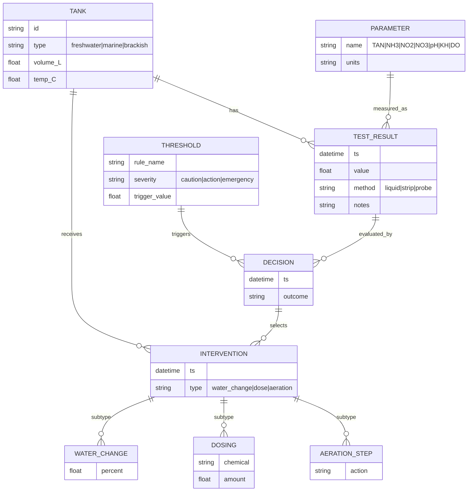

# New Tank Cycling SOPs With Fishless and Fish‑In Guardrails

## Executive summary

New-tank “cycling” is the controlled establishment of a biofilter community that oxidizes toxic nitrogen waste (ammonia → nitrite → nitrate). In aquaria, the dominant nitrifiers are often not the classic textbook pair (*Nitrosomonas europaea*/*Nitrobacter winogradskyi*); studies have found *Nitrospira*-like organisms as key nitrite oxidizers, ammonia‑oxidizing archaea in freshwater aquarium biofilters, and more recently “comammox” *Nitrospira* (complete ammonia oxidizers) as dominant in many home freshwater biofilters. citeturn26view0turn3search0turn3search4turn3search1

Fishless cycling is the preferred SOP in most situations because it separates biofilter growth from animal welfare risk: you feed the biofilter with a metered ammonia source and confirm performance with measurable “challenge” criteria before adding livestock. citeturn0search1turn0search5turn8view0turn4search2

Fish‑in cycling is a valid last‑resort method when animals must be housed immediately (e.g., emergency rehome), but it requires strict guardrails: frequent testing, conservative feeding/stocking, and rapid interventions (water changes, oxygenation, and—when appropriate—detox/mitigation steps) to prevent toxic exposure while nitrifiers establish. citeturn8view0turn4search2turn6search7turn25view0

For rigorous control, treat cycling as a monitoring-and-response system driven by numeric thresholds. Two core guardrails:
- **Ammonia:** toxicity depends strongly on pH and temperature because the more toxic **unionized ammonia (NH₃)** fraction rises sharply as pH increases. citeturn8view0turn15view1turn7search4  
- **Nitrite:** causes “brown blood disease” (methemoglobinemia) and is worsened by low dissolved oxygen; chloride ions competitively reduce nitrite uptake at the gills, so a chloride-to-nitrite ratio strategy (when measurable) is defensible. citeturn8view0turn25view0turn2search10turn2search6

A conservative, species‑agnostic completion criterion for either method is: **after a normal feeding event (fish‑in) or after an ammonia challenge dose (fishless), both ammonia and nitrite return to ~0 on your test method within ~24 hours, and nitrate is being produced.** Some sources note “0–0.25” thresholds as practical pass criteria in production systems. citeturn0search1turn2search0turn4search2turn8view0

## Biological fundamentals and parameter targets

### What “cycling” is biologically

Nitrification in closed aquatic systems is the aerobic oxidation of ammonia to nitrite and nitrite to nitrate on surfaces (filter media, substrate, hardscape). Biofilters exist specifically to provide a high‑surface‑area substrate for these communities. citeturn26view0turn23search6turn8view0

Peer‑reviewed aquarium work shows (a) *Nitrospira*-like bacteria can be principal nitrite oxidizers in freshwater aquaria, and (b) aquarium nitrification can be driven by multiple ammonia‑oxidizing guilds (AOB, AOA, and comammox *Nitrospira*), with comammox often dominant in home freshwater biofilters. citeturn26view0turn3search0turn3search1turn3search5

Key implication for SOP design: your goal is not to “add one magic bacterium,” but to **create stable environmental conditions** (oxygen, alkalinity, temperature, pH) and **provide controlled nitrogen input** so the biofilm community can develop predictable processing capacity. citeturn23search6turn1search9turn8view0turn26view0

### Parameter targets during cycling

These targets are intentionally written as **operational ranges**, not “one true number,” because the best settings depend on intended livestock (coldwater vs warmwater), planted vs unplanted tanks, and freshwater vs marine.

**Temperature**
- Nitrification is temperature sensitive; cycling typically proceeds faster in warmer conditions (within a safe range for the intended system). Aquaponics/aquaculture guidance describes an “ideal” cycling temperature band on the order of ~63–93°F (17–34°C) and notes faster bacterial activity at warmer temps; manufacturer guidance for live nitrifiers often cites ~77–86°F (25–30°C) as a “fastest work” range. citeturn23search6turn21search3turn21search1  
- If cycling fish‑in, set temperature to the **intended livestock** requirements first; you do not want to accelerate bacteria at the expense of animal stress. citeturn8view0turn24search4

**pH and alkalinity (KH)**
- The fraction of toxic unionized ammonia rises strongly with pH, so high pH increases ammonia hazard for fish. citeturn15view1turn8view0  
- Nitrification performance is commonly reported as most efficient in roughly neutral-to-alkaline ranges (often cited around ~7–8+), and nitrification can slow significantly or halt when pH becomes acidic (reports of major slowdown below ~6.0–6.5 are common in aquaculture literature and aquarium teaching materials). citeturn23search4turn8view0turn23search6  
- Nitrification **consumes alkalinity** (buffering capacity). Wastewater and operations guidance commonly state ~7.14 mg as CaCO₃ alkalinity consumed per 1 mg of ammonia‑N oxidized; inadequate alkalinity can allow pH to crash and stall nitrification. citeturn1search0turn1search9turn23search7

**Operational target for KH (as alkalinity)**
- For cycling robustness, many applied sources recommend keeping alkalinity “not low” (e.g., ≥50–100 mg/L as CaCO₃ in treatment contexts; aquarium/aquaculture teaching notes often recommend >100 mg/L as a stability target). citeturn1search9turn8view0  
- If you don’t measure alkalinity/KH, you are effectively cycling blind to one of the most common stall causes (pH crash). citeturn8view0turn1search9

**Dissolved oxygen (DO) / aeration**
- Nitrification is aerobic; DO is also critical to fish health. Aquaponics/aquaculture sources often cite an optimal nitrifier DO range on the order of ~4–8 mg/L and warn nitrification can struggle if DO drops below ~2 mg/L. citeturn23search6turn24search17turn24search4

**GH (general hardness)**
- GH is largely a livestock‑compatibility parameter (calcium/magnesium availability), and many aquaculture teaching notes emphasize it is species dependent and often less critical to nitrification than alkalinity/pH stability. citeturn8view0

### Converting “total ammonia” to toxic NH₃ for guardrails

Most aquarium tests report **total ammonia** (NH₃ + NH₄⁺). Toxicity for fish is driven mainly by NH₃, whose fraction increases with pH and temperature. EPA ammonia criteria documentation provides the speciation relationship (Henderson–Hasselbalch with temperature‑dependent pKa). citeturn15view1turn7search5

Using the EPA freshwater pKa relationship, the estimated NH₃ fraction at **25°C (77°F)** is approximately:

| pH | NH₃ fraction (of total ammonia) | Total ammonia that corresponds to NH₃ = 0.02 mg/L | Total ammonia that corresponds to NH₃ = 0.05 mg/L |
|---:|---:|---:|---:|
| 6.5 | 0.0018 | 11.13 mg/L | 27.84 mg/L |
| 7.0 | 0.0057 | 3.53 mg/L | 8.84 mg/L |
| 7.5 | 0.0177 | 1.13 mg/L | 2.83 mg/L |
| 8.0 | 0.0538 | 0.37 mg/L | 0.93 mg/L |
| 8.2 | 0.0827 | 0.24 mg/L | 0.60 mg/L |
| 8.5 | 0.1525 | 0.13 mg/L | 0.33 mg/L |
| 9.0 | 0.3627 | 0.06 mg/L | 0.14 mg/L |

These numbers illustrate why a “small” total ammonia reading can be much more dangerous in higher‑pH systems. citeturn15view1turn8view0turn7search4

## Fishless cycling SOP

### Scope and decision to use fishless

Use fishless cycling when you can delay livestock introduction until the biofilter is demonstrably capable. This method is standard because it avoids exposing fish to ammonia/nitrite spikes that can occur during biofilter establishment (often weeks). citeturn8view0turn4search2turn16view19turn26view0

### Required materials and equipment

Core equipment (tank-size dependent):
- Filtration with substantial bio-media surface area; nitrifiers colonize surfaces in biofilters/substrate rather than remaining free-floating. citeturn26view0turn23search6turn8view0  
- Heater/temperature control (if tropical/warmwater) and thermometer. citeturn23search6turn8view0  
- Aeration (air pump/stone) or strong surface agitation to maintain DO. citeturn24search17turn23search6turn24search4  
- Dechlorination capability for any tap water added (chlorine/chloramine can harm fish and can disrupt biofilters). citeturn4search3turn4search2

Chemicals/consumables:
- A measured ammonia source (often ammonium chloride solution) suitable for fishless dosing. citeturn0search1turn17search1  
- Water tests: ammonia, nitrite, nitrate, pH; strongly recommended: KH/alkalinity and temperature. citeturn13view1turn8view0turn1search9  
- Optional: live nitrifier inoculum (“bacteria in a bottle”) or seeded filter media from a proven disease‑free, stable system. Commercial seed products and protocols typically instruct turning off UV/ozone briefly to avoid killing the inoculum. citeturn0search1turn6search1

### Water parameter targets for fishless cycling

A practical set of operating targets:
- Temperature: **~77–86°F (25–30°C)** if no livestock is present and your equipment supports it; otherwise use the tank’s intended operating temp. citeturn21search3turn23search6  
- pH: keep within **~6.5–8.5** and avoid sustained drops below ~6.0–6.5 (risk of nitrification slowdown/stall). citeturn23search6turn8view0turn23search4  
- KH/alkalinity: keep alkalinity from getting “low” (commonly operationalized as ≥50–100 mg/L as CaCO₃ for stability in nitrifying systems; aquarium teaching notes often recommend >100 mg/L as a general stability target). citeturn1search9turn8view0  
- DO: maximize via aeration/surface agitation; nitrification struggles at low DO. citeturn24search17turn23search6

### Step-by-step fishless SOP

#### System setup and stabilization

1. **Assemble** tank, filter/bio-media, heater (if used), thermometer, and aeration. citeturn26view0turn24search17turn23search6  
2. **Fill and dechlorinate**. If using tap water, neutralize chlorine/chloramine before exposing any bio-media or inoculum. citeturn4search3  
3. **Run the system** (circulation + aeration) until temperature and pH stabilize (often same day). citeturn23search6turn8view0  
4. If using bottled nitrifiers or seeding: **turn off UV/ozone** for the period specified by the product/protocol (common guidance is to avoid sterilization while inoculum establishes). citeturn0search1turn6search1

#### Controlled ammonia feeding and monitoring loop

There are multiple valid dosing protocols; below is a conservative, widely used pattern consistent with established commercial fishless recipes:

5. **Dose ammonia to a target test-kit reading of ~2 ppm** on day 1 (many fishless recipes target roughly this magnitude and warn against excessive overdosing). citeturn0search1turn0search5  
6. **Test ammonia and nitrite** on a defined cadence (commonly every 2–3 days in fishless recipes; more frequent testing is acceptable if you want faster feedback). citeturn16search19turn0search1  
7. **Redose ammonia only when ammonia and nitrite are not high.** Example guardrail from a fishless cycling guide: avoid adding ammonia if ammonia or nitrite is above ~5 mg/L‑N to prevent problematic overdosing. citeturn0search5  
8. Expect the classical sequence: ammonia begins high then declines as ammonia oxidizers establish; nitrite appears and can spike; nitrate rises as the system matures. A peer‑reviewed aquarium study using ammonium chloride dosing showed ammonia dropping to undetectable levels by around day ~12, nitrite peaking later (around day ~22) and then falling toward ~0 as nitrite oxidation established, while nitrate accumulated. citeturn26view0

#### Completion criteria and pre‑stocking transition

9. **“Challenge test” (capacity verification):** Dose ammonia to your standard target (e.g., ~2 ppm). If the tank processes that dose to **~0 ammonia and ~0 nitrite within ~24 hours**, the biofilter is functionally ready for a typical initial stocking level. citeturn3search3turn0search1  
10. **Large water change to reduce nitrate** before adding livestock (fishless cycles often produce high nitrate). Many aquarium references recommend keeping nitrate low for fish health and general management; product manuals commonly recommend ≤40 ppm for freshwater aquaria. citeturn13view1turn4search2  
11. **Re‑dechlorinate**, match temperature, and then stock gradually (or at least avoid doubling bioload immediately) to prevent a capacity overshoot. citeturn4search2turn8view0

### Fishless workflow flowchart (Mermaid)

```mermaid
flowchart TD
  A[Start: build system] --> B[Fill + dechlorinate]
  B --> C[Stabilize temp/pH; run filter + aeration]
  C --> D{Using bottled/seeded nitrifiers?}
  D -- Yes --> E[Add inoculum; disable UV/ozone per instructions]
  D -- No --> F[Proceed without inoculum]
  E --> G[Dose ammonia to ~2 ppm (kit reading)]
  F --> G
  G --> H[Test NH3/NH4 and NO2 on cadence]
  H --> I{NH3 or NO2 very high?}
  I -- Yes --> J[Stop dosing; water change if needed; correct pH/KH]
  I -- No --> K{NH3 <~1 and NO2 <~1?}
  K -- Yes --> L[Redose ammonia (per protocol)]
  K -- No --> H
  L --> H
  H --> M{Challenge: dose ~2 ppm}
  M --> N{NH3=0 and NO2=0 within ~24h?}
  N -- No --> H
  N -- Yes --> O[Large water change to lower NO3]
  O --> P[Stock slowly; monitor]
```

## Fish‑in cycling SOP with safety guardrails

### When fish‑in cycling is appropriate

Fish‑in cycling should be treated as an exception process—used only when animals must be housed immediately. In classic aquarium education materials, ammonia and nitrite rise after fish introduction and cycling commonly takes weeks. citeturn4search2turn8view0

### Fish‑in required materials (in addition to basic equipment)

- Reliable ammonia/nitrite tests (daily early on). citeturn13view1turn8view0  
- Heat/aeration appropriate to species; avoid low oxygen because both ammonia/nitrite stress and nitrite toxicity are exacerbated when DO is low. citeturn25view0turn24search4turn8view0  
- High-volume dechlorinated water access (buckets/hose system) for frequent partial water changes. citeturn13view1turn8view0  
- Optional but common: detoxifying conditioner that claims ammonia/nitrite binding for up to ~48 hours, with strict awareness of testing interferences (see testing section). citeturn2search21turn1search19turn4search1  
- Optional nitrite mitigation: sodium chloride (pure, no harmful anti‑caking additives) when compatible with livestock/plants—used as an interim protective step, not as a substitute for removing nitrite. citeturn25view0turn8view0turn2search10

### Fish‑in stocking and feeding guardrails (volume/species dependent)

Because no tank volume or species is assumed, these are principle-based:
- **Understock and underfeed initially.** Lower nitrogen input reduces peak ammonia and nitrite while the biofilter grows. New aquarium guidance warns that adding too many fish at once or overfeeding can cause unsafe ammonia/nitrite (“new tank syndrome”). citeturn4search5turn4search2turn8view0  
- **Avoid sensitive species** during cycling when possible; many species have different tolerances to ammonia, nitrite, salt, and pH. citeturn8view0turn7search4turn7search10

### Numeric guardrails and intervention thresholds

#### Ammonia guardrails (report total ammonia and estimated NH₃)

Two ways to manage ammonia risk rigorously:

**A. Conservative “kit reading” thresholds (simple operations)**
- Target: **0.00 mg/L** total ammonia in an established tank; any detectable ammonia indicates a problem in many aquarium references and test manuals. citeturn13view1turn4search2  
- Fish‑in intervention thresholds (general community fish, neutral pH):  
  - **Caution:** ≥0.25 mg/L (increase monitoring; consider partial water change)  
  - **Action:** ≥0.50 mg/L (water change required; reduce feeding; add aeration)  
  - **Emergency:** ≥1.0 mg/L (large water change(s); consider temporary relocation; aggressive aeration)  
These are intentionally conservative because ammonia toxicity rises with pH and temperature, and many aquaculture sources recommend evaluating total ammonia in context of NH₃. citeturn15view1turn7search4turn8view0

**B. NH₃-based thresholds (more rigorous)**
- A widely used aquaculture rule of thumb is **NH₃ > 0.02 mg/L is potentially toxic**, varying by species; educational aquaculture materials also cite gill damage risk around **NH₃ > 0.05 mg/L**. citeturn7search4turn8view0  
- Compute NH₃ from total ammonia using pH and temperature (EPA provides the freshwater speciation relationship and temperature-dependent pKa). citeturn15view1turn7search5  
- Practical implication: at ~25°C and pH ~8.2, keeping total ammonia around **≤0.25 mg/L** aligns roughly with NH₃ ≈ 0.02 mg/L. citeturn15view1turn7search4turn8view0

#### Nitrite guardrails and chloride mitigation

- Goal: nitrite should be **~0** in established systems; even low nitrite can stress sensitive fish. citeturn8view0turn7search18  
- Aquaculture references give species-dependent “should not exceed” values (e.g., 0.10 mg/L for some species, higher for others), reinforcing that nitrite tolerance varies widely. citeturn7search10turn25view0  
- Chloride mitigation: multiple aquaculture references describe maintaining a chloride-to-nitrite ratio (e.g., ~6:1 or ~9–10:1) to reduce nitrite uptake at the gills, and note sodium chloride is ~60% chloride by mass. citeturn2search6turn2search10turn25view0  
- Nitrite toxicity often becomes more lethal when dissolved oxygen is low (e.g., <3 mg/L noted in pond guidance), so aeration is a co‑intervention, not optional. citeturn25view0turn24search17turn24search4

**Operational fish‑in nitrite thresholds (conservative)**
- **Caution:** ≥0.10 mg/L nitrite (increase monitoring; consider water change) citeturn7search18turn7search10  
- **Action:** ≥0.25 mg/L nitrite (partial water change; consider chloride mitigation where compatible; add aeration) citeturn8view0turn25view0turn2search6  
- **Emergency:** ≥0.50–1.0 mg/L nitrite (large water change(s), immediate aeration/oxygenation, chloride mitigation if compatible, potential relocation). citeturn7search10turn25view0turn24search17  

### Fish‑in intervention protocols

#### Partial water change protocol (numeric and repeatable)

Water changes are a first-line control because dilution directly reduces toxicants (ammonia, nitrite). Aquaculture teaching notes explicitly identify dilution (water exchanges) and biological filtration as the two main control methods during establishment. citeturn8view0turn13view1

**Sizing the water change**
- If concentration is **C** and you want **T**, and replacement water has ~0 concentration, then:  
  **Required fraction changed = 1 − (T / C)**  
  Example: ammonia 1.0 mg/L → target 0.25 mg/L ⇒ change 75%.

**Execution**
1. Prepare new water: match temperature; dechlorinate; avoid pH swings where possible. citeturn8view0turn4search3  
2. Vacuum detritus lightly if it is contributing to decay-driven ammonia. citeturn4search12turn13view1  
3. Change the calculated percentage. In emergencies, repeated daily changes may be required (test-kit guidance notes daily changes may be necessary in emergencies). citeturn13view1  
4. Re-test after mixing/settling and log results.

#### Emergency treatment options (with cautions)

**Increase aeration / oxygenation**
- DO is critical for fish and nitrifiers, and nitrite toxicity is worse under low oxygen conditions. citeturn25view0turn24search4turn24search17

**Ammonia/nitrite binders (time‑limited)**
- Some conditioners claim binding/detoxification lasting up to ~48 hours; this is commonly recommended by manufacturers for cycling emergencies. citeturn2search21turn4search1turn6search7  
- Testing caveat: some products interact with ammonia test chemistries. Manufacturer technical guidance warns Nessler-based kits can read “off scale,” and salicylate kits can show misleading readings unless read promptly. citeturn1search19turn4search1

**Chloride addition for nitrite**
- Sodium chloride is widely described in aquaculture guidance as protective against nitrite uptake; guidance emphasizes avoiding salts with toxic anti‑caking additives. citeturn25view0turn2search10turn8view0  
- Compatibility caveat: planted tanks and some invertebrates may be salt sensitive; if you use chloride mitigation, treat it as a temporary protective measure while you remove nitrite with water changes and biofiltration. citeturn8view0turn16search6

### Fish‑in workflow flowchart (Mermaid)

```mermaid
flowchart TD
  A[Start: fish must be housed now] --> B[Set up tank; fill + dechlorinate; match temp]
  B --> C[Add robust filtration + aeration]
  C --> D[Add minimal livestock; feed lightly]
  D --> E[Daily tests: NH3/TAN, NO2, pH, temp]
  E --> F{NH3/TAN above threshold OR NO2 above threshold?}
  F -- No --> G[Continue light feeding; re-test daily]
  F -- Yes --> H{Emergency level?}
  H -- No --> I[Partial water change; increase aeration; reduce feed]
  H -- Yes --> J[Large water change(s); consider temporary relocation; aggressive aeration]
  I --> K{NO2 elevated?}
  J --> K
  K -- Yes --> L[Consider chloride mitigation if compatible]
  K -- No --> M[Continue monitoring]
  L --> M
  M --> N{Criteria met for several days: NH3~0 and NO2~0; NO3 rising?}
  N -- No --> E
  N -- Yes --> O[Add livestock slowly; shift to weekly testing]
```

## Monitoring, testing, and decision systems

### Recommended test methods and kits (and what “accuracy” means in practice)

For cycling control, you need (at minimum): **ammonia, nitrite, nitrate, pH, temperature**; strongly recommended: **KH/alkalinity** for stall prevention. citeturn13view1turn1search9turn8view0

**Liquid-drop colorimetric kits vs test strips**
- A peer-reviewed aquaculture-focused evaluation compared several kit types to standard methods and found decision agreement was generally similar, but certain test strips performed worse for nitrate decision-making; the work concluded kits can be suitable if properly maintained and directions followed, with notable limitations for some nitrate strip products. citeturn5view0turn1search20  
- Practical implication: for cycling, nitrate strips are often the weakest link; favor liquid kits or higher-grade methods for nitrate benchmarking if you need rigor. citeturn5view0turn13view1

**Ammonia test chemistry**
- Common aquarium ammonia kits use salicylate chemistry and report “total ammonia” in ppm (mg/L). citeturn13view1turn9search1  
- If using a conditioner that binds ammonia, manufacturer technical guidance notes significant interaction with Nessler kits and potential misreads with salicylate kits unless readings are taken promptly. citeturn1search19turn4search1

**Nitrite and nitrate reporting units (avoid apples-to-oranges)**
- Some kits report nitrite‑nitrogen (NO₂‑N) or nitrate‑nitrogen (NO₃‑N) instead of nitrite (NO₂⁻) / nitrate (NO₃⁻). A widely distributed aquarium manual notes that NO₂‑N readings are ~3.3× lower than NO₂⁻, and NO₃‑N readings are ~4.4× lower than NO₃⁻. citeturn13view1  
- If you import thresholds from aquaculture papers (often in NO₂‑N or TAN as N), convert correctly before applying. citeturn7search2turn15view1turn13view1

### Monitoring frequency recommendations

A rigorous default cadence:

**Fishless**
- Ammonia + nitrite: every 2–3 days (or daily if you want faster feedback), consistent with common fishless cycling recipes. citeturn16search19turn0search1  
- pH + KH/alkalinity: at least weekly; immediately if cycling stalls or ammonia persists unexpectedly. citeturn1search9turn8view0  
- Nitrate: weekly; before stocking, verify nitrate and plan a pre‑stocking water change. citeturn13view1turn4search2

**Fish‑in**
- Ammonia + nitrite: daily until stable at ~0; this is stricter than many consumer manuals but is aligned with the risk profile of live animals during establishment. citeturn8view0turn4search2  
- pH and temperature: daily if ammonia is detectable (because NH₃ fraction changes with pH/temp). citeturn15view1turn8view0  
- Nitrate: weekly; use it as confirmation that nitrification is proceeding and as a driver for routine water changes. citeturn13view1turn4search12

### Daily and weekly task checklists

**Daily checklist (fish‑in)**
- Observe fish: respiration rate, surface gasping, lethargy (low DO and nitrite toxicity risk signals). citeturn25view0turn24search4  
- Test: total ammonia and nitrite; record with date/time. citeturn13view1turn8view0  
- If ammonia/nitrite above threshold: execute the water change protocol and increase aeration immediately. citeturn8view0turn13view1turn24search17  
- Feed minimally and remove uneaten food (reduce nitrogen input). citeturn4search5turn8view0  

**Daily checklist (fishless)**
- Verify equipment: filter flow, heater setpoint, aeration. citeturn23search6turn24search17  
- Test on schedule: ammonia and nitrite; log results and dosing. citeturn16search19turn0search1  
- Check pH if progress stalls; correct alkalinity if pH is dropping. citeturn1search9turn8view0  

**Weekly checklist (either method)**
- Test nitrate, pH, and alkalinity/KH; plan water changes to control nitrate and stabilize pH buffering. citeturn13view1turn8view0turn1search9  
- Inspect and gently rinse mechanical media (if needed) using dechlorinated water; avoid practices that sterilize bio-media. citeturn4search3turn26view0  

### Monitoring/response ER diagram (Mermaid)



## Comparison table and procurement costs

### Method comparison (no specific tank size assumed)

| Dimension | Fishless cycling | Fish‑in cycling |
|---|---|---|
| Primary goal | Build verified nitrification capacity before animals | Keep animals safe while nitrifiers establish |
| Nitrogen source | Metered ammonia input (often ammonium chloride) | Fish waste + food decay |
| Typical timeline | Often ~2–6+ weeks; can be shorter with seeding/inoculum; some studies show multi‑week establishment patterns | Often ~3–8 weeks in common aquarium guidance; can be longer depending on load and control effectiveness |
| Monitoring intensity | Moderate (every 2–3 days common) | High (daily ammonia/nitrite strongly recommended) |
| Primary risks | Overdosing ammonia; pH/KH crash stalling cycle | Animal exposure to NH₃/NO₂; oxygen stress; disease risk amplified by stress |
| Best use case | Planned setups; any time you can wait | Emergencies only; unavoidable immediate housing |

Timeline references: aquarium teaching notes and consumer aquarium guidance describe biofilters taking ~1–6 weeks (sometimes >8) and common cycling taking ~3–8 weeks. citeturn8view0turn4search2turn13view1

### Procurement list with approximate U.S. retail costs (examples)

Prices vary by size/brand and sales. The examples below are pulled from online listings and are meant as “order-of-magnitude” procurement guidance, not exact quotes.

- **Liquid master test kit (freshwater):** about **$25–$36** (example listings show ~$24.99 and ~$35.98). citeturn18search0turn18search1  
- **Ammonium chloride for fishless dosing:** about **$5–$6** for small bottles. citeturn17search1turn17search5  
- **Water conditioner (dechlorinator + binder claims):** about **$18–$21** for ~500 mL examples. citeturn19view0turn17search9  
- **Bacteria starter (example sizes):** about **$9** for ~250 mL of one product; about **$11** for 16 oz of another live nitrifier product listing. citeturn20view0turn18search0

If you need a “rigorous” upgrade path, add an alkalinity/KH kit or meter and (optionally) a more analytical ammonia approach (NH₃ estimation via pH/temp, or continuous monitors), recognizing hobbyist devices vary and may require validation against known standards. citeturn1search9turn15view1turn5view0

## Troubleshooting and FAQs

### Troubleshooting: common failure modes and corrective actions

**Problem: Cycle “stalls” (ammonia and/or nitrite won’t drop)**
- Check pH: nitrification slows dramatically in acidic conditions and may stop below ~6.0–6.5 in biofilter literature and aquarium teaching notes. citeturn23search4turn8view0  
- Check alkalinity/KH: nitrification consumes alkalinity; low buffering increases pH crash risk and stalls. citeturn1search9turn1search0turn8view0  
- Check temperature: nitrification is inhibited at lower temperatures in many treatment studies; cycling generally slows as temperature declines. citeturn21search1turn23search6  
- Check disinfectants: chlorine/chloramine exposure can disrupt biofilters and harm fish; always dechlorinate replacement water. citeturn4search3turn4search2  
- If fishless and levels are extremely high, stop dosing and consider partial water changes to bring ammonia/nitrite back into a manageable band; some fishless recipes explicitly warn against overdosing and set “do not add if >5 mg/L‑N” guardrails. citeturn0search5turn0search1

**Problem: Nitrite spike with fish showing stress**
- Immediate aeration: nitrite toxicity is strongly connected to impaired oxygen transport and is more lethal when DO is low. citeturn25view0turn8view0  
- Water changes: dilution is an explicit control method. citeturn8view0turn13view1  
- Consider chloride mitigation: aquaculture guidance supports chloride-to-nitrite ratio protection and identifies sodium chloride composition and practical chloride targets (e.g., ~60 mg/L chloride; ~10:1 chloride:nitrite in some pond guidance). citeturn25view0turn2search10turn2search6

**Problem: Conditioner use makes ammonia tests “weird”**
- If using an ammonia-binding conditioner, verify your ammonia test chemistry; manufacturer technical documentation warns Nessler kits can misread and salicylate kits can read falsely unless read quickly. citeturn1search19turn4search1

### FAQs

**How do I know cycling is complete if I’m not assuming tank size or fish type?**  
Use functional performance criteria: after a normal feeding (fish‑in) or a standard ammonia challenge dose (fishless), ammonia and nitrite return to ~0 rapidly (often operationalized as within ~24 hours), and nitrate is being produced as an end product. citeturn0search1turn4search2turn2search0

**Why do pH and KH matter so much during cycling?**  
Because (1) toxic NH₃ fraction rises with pH and temperature, raising fish risk at higher pH, and (2) nitrification consumes alkalinity and can drive pH down, which in turn slows nitrification—creating a feedback loop that can stall cycling. citeturn15view1turn1search9turn8view0

**Do bottled bacteria products “instantly cycle” a tank?**  
Some products claim immediate fish addition or very rapid cycling; peer‑reviewed aquarium microbiology shows complex nitrifier ecology and multi‑week establishment patterns in many conditions, so treat “instant cycle” as a claim that must be validated by testing under your specific tank’s pH/temperature/bioload. citeturn6search12turn6search11turn26view0turn3search1

**Is nitrate “safe” during cycling?**  
Nitrate is generally far less acutely toxic than ammonia or nitrite, but elevated nitrate is widely used as a management signal for accumulated waste and is commonly controlled via water changes; some consumer aquarium references recommend maintaining nitrate at ≤40 ppm in freshwater aquaria. citeturn13view1turn4search12