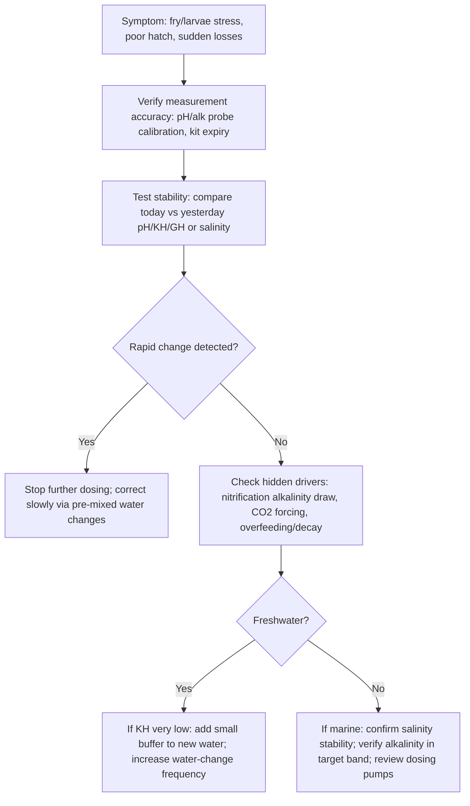
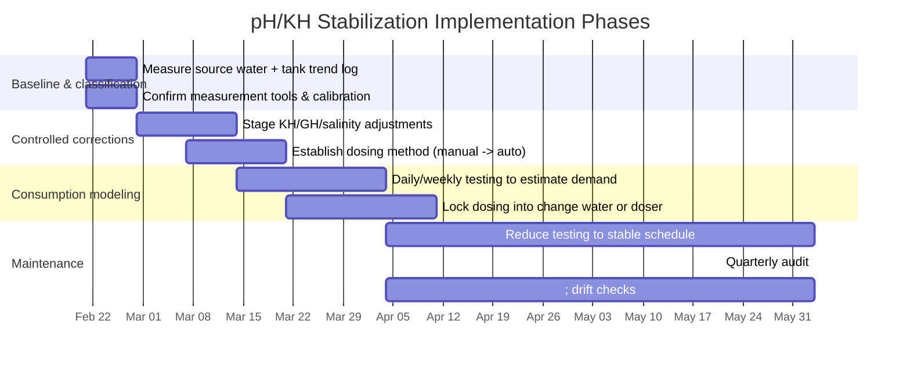

# pH and KH Stabilization Workflow for Aquariums

## Executive summary

Stabilizing aquarium pH is fundamentally an alkalinity management problem, not a “chase a target pH number” problem. In most freshwater systems, “KH” (carbonate hardness) is a practical proxy for carbonate alkalinity (mostly bicarbonate/carbonate) and therefore the main short‑term buffer against acids generated by biology and added inputs. Higher alkalinity generally increases resistance to pH change because more acid must be added to shift the carbonate system equilibria. citeturn10view1turn12search29turn4view1

pH stability is shaped by **(a)** the carbonate system (CO₂ ⇄ HCO₃⁻ ⇄ CO₃²⁻), **(b)** gas exchange with air (dissolved CO₂ drives pH down; degassing raises pH), **(c)** biological acid/base production (notably nitrification consuming alkalinity), and **(d)** ionic context (GH in freshwater; Ca/Mg and borate in seawater; salinity and temperature affect equilibria and measurements). citeturn15view1turn15view2turn13view0turn5view1turn12search3turn9view2

Four practical stabilization workflows are provided (freshwater planted, freshwater fish‑only, reef/saltwater, and breeding/fragile setups). Because **your source water is unspecified**, each workflow begins with a measurement-and-classification step (tap vs. RO/DI vs. blended), then gives dosing math that scales from your measured starting point. Any “target ranges” below are *operational ranges* (chosen for stability and compatibility), not universal biology requirements for every species. citeturn15view3turn24view0turn15view0turn18view5

## Chemistry foundations

### Core definitions and units you will actually use

**pH** is the negative log of hydrogen ion activity; it is logarithmic, so a 0.3 pH shift is roughly a 2× change in hydrogen ion activity. pH is also temperature‑dependent (both chemically and by electrode response), so comparisons must control for temperature and calibration. citeturn5view1turn4view5turn4view6

**Alkalinity** is an acid‑neutralizing capacity: operationally determined by titration with strong acid to a defined endpoint, capturing all relevant proton acceptors (not a single chemical). This is why “alkalinity” is a property and can include multiple species beyond bicarbonate/carbonate depending on water chemistry. citeturn4view1turn10view1turn3search5

**KH (carbonate hardness)** in aquarium practice approximates carbonate alkalinity and is usually reported in **dKH** (German degrees). A widely used conversion is:  
- **1 dKH ≈ 17.848 mg/L as CaCO₃**. citeturn2search6  
Also: **1 meq/L = 2.8 dKH** is a standard aquarium/alkalinity conversion used by manufacturers and testing systems. citeturn9view0turn9view4

**GH (general hardness)** is primarily the concentration of divalent cations—mostly Ca²⁺ and Mg²⁺—often expressed as mg/L as CaCO₃ or in degrees (dGH). It is routinely confused with alkalinity because both are commonly reported “as CaCO₃,” but they measure different things (cations vs. acid‑neutralizing capacity). citeturn15view3turn13view2turn12search0

### The carbonate system: why CO₂, KH/alkalinity, and pH are inseparable

The carbonate system in water is dominated by these equilibria (freshwater and seawater differ in constants and in additional buffers):  
CO₂(aq) + H₂O ⇄ H₂CO₃ ⇄ H⁺ + HCO₃⁻ ⇄ 2H⁺ + CO₃²⁻. citeturn15view1turn5view1turn4view1

Key operational consequences:

- **Adding CO₂ lowers pH** by producing carbonic acid and releasing H⁺. citeturn15view1turn13view2  
- **Higher alkalinity (KH) resists pH decline** because bicarbonate/carbonate neutralize incoming acid; low alkalinity water can experience large day–night pH swings and can reach biologically dangerous extremes under strong respiration/photosynthesis. citeturn15view2turn4view0turn3search0  
- In seawater, **>99% of dissolved inorganic carbon species are HCO₃⁻ and CO₃²⁻** at typical seawater pH; total alkalinity includes multiple contributors (including borate), and carbonate alkalinity is closely related to total alkalinity in many cases. citeturn5view1turn9view2turn12search3

image_group{"layout":"carousel","aspect_ratio":"16:9","query":["carbonate buffer system diagram CO2 bicarbonate carbonate","alkalinity titration aquarium test kit","pH electrode calibration buffers","kalkwasser drip setup reef aquarium"] ,"num_per_query":1}

### Temperature adds two layers of complexity

1) **Chemistry**: equilibrium constants and the distribution of CO₂ species shift with temperature; seawater pH shows systematic temperature effects in carbonate chemistry formulations (and pressure effects exist but are not relevant for aquariums). citeturn5view1turn12search26  

2) **Gas solubility**: CO₂ solubility decreases with increasing temperature (via Henry’s law behavior), so warming can reduce dissolved CO₂ at a given partial pressure, shifting pH upward *if all else is constant*. For accurate work, treat “CO₂ ↔ pH” as temperature‑conditioned. citeturn2search4turn2search8  

Additionally, **pH electrodes** require temperature awareness and correct calibration; buffer solutions and calibration practices (freshness, traceability, and storage) materially affect accuracy. citeturn4view5turn4view6

## How KH buffers pH and how it interacts with GH, CO₂, and biology

### KH (alkalinity) as “acid shock absorber”

Alkalinity is commonly described as buffering capacity: water with higher alkalinity experiences less pH change when acids (from respiration, nitrification, organic acids) are introduced. In practice, alkalinity is consumed when acids are produced, and replenished when bases are added or when processes generate alkalinity. citeturn10view1turn4view1turn12search3

In freshwater, bicarbonate/carbonate usually dominate alkalinity, but other constituents (ammonia species, organic matter, boric/phosphoric/silicic systems) can contribute meaningfully in some waters—this is why pH–KH–CO₂ charts can be misleading when non‑carbonate buffers or acids are present. citeturn12search29turn14search0turn15view2

### GH matters because calcium/magnesium change both biology and precipitation risk

GH is primarily Ca²⁺ and Mg²⁺. Beyond organism physiology, Ca²⁺ + CO₃²⁻ can precipitate as CaCO₃ when pH is high and carbonate is available. In pond/aquaculture systems, strong photosynthesis can drive pH above ~8.3 and promote limestone formation when calcium/magnesium and carbonate are present; the interaction between alkalinity and hardness strongly shapes whether high photosynthesis yields extreme pH. citeturn15view2turn15view3turn12search3

For reefs, the precipitation/dissolution of CaCO₃ is central to coral growth and also to “snowstorm” events when alkalinity/pH/calcium are overdosed—limewater (kalkwasser) is particularly prone to causing rapid precipitation if overdosed because of its very high pH and local spikes. citeturn5view5turn5view1turn4view3

### CO₂ and biological processes are constant “pH forcing functions”

**Daily CO₂ cycling**: respiration increases CO₂ (lowering pH) at night; photosynthesis removes CO₂ during the day (raising pH). This can produce large diurnal pH swings, especially in lower‑alkalinity water. citeturn15view1turn15view2turn3search4

**Nitrification consumes alkalinity**: converting ammonia to nitrate produces acid and uses buffering capacity. A widely used engineering rule is **7.14 mg alkalinity as CaCO₃ consumed per 1 mg of nitrogen nitrified**, and guidance commonly recommends maintaining residual alkalinity (e.g., 50–100 mg/L as CaCO₃) to stabilize system pH under nitrification load. citeturn13view0turn3search0

Operationally, if KH is slowly drifting down between water changes in a cycled tank, nitrification + acid inputs are a prime suspect. citeturn13view0turn15view3

## Workflow blueprints with dosing math, monitoring, and troubleshooting

### Shared prerequisites for all workflows when source water is unspecified

1) **Measure source water after aeration** (ideally 12–24 hours with circulation) to equilibrate CO₂ with air; record pH, KH/alkalinity, GH, temperature, and (for marine) conductivity/salinity. This reduces false interpretation from “fresh tap CO₂” or transient degassing effects. citeturn15view0turn2search4turn10view1  

2) Decide whether you are operating on:
- **Tap water** (variable mineral content; can shift seasonally),  
- **RO/DI water** (near‑zero alkalinity/hardness; must be remineralized for most livestock), or  
- **A blend** (common in planted and breeding setups). citeturn24view0turn9view3  

3) Adopt a **rate‑limit rule**: alkalinity changes should be staged, tested, and matched to livestock sensitivity. In reef systems, manufacturers explicitly warn not to exceed certain daily alkalinity adjustments and to verify pH/alkalinity before redosing. citeturn9view4turn9view1turn18view3  

4) Use **measurement systems you can keep accurate** (see test methods section). For pH probes, calibration quality and buffer freshness are not optional. citeturn4view5turn4view6  

---

### Freshwater planted tanks workflow

**Primary stabilization goal**: keep carbonate alkalinity high enough to prevent “crashes” and to dampen biological acid load, while managing CO₂ (injected or biological) as the dominant driver of pH swings. In planted tanks, a stable *CO₂ regime* usually matters more than chasing a single pH value. citeturn15view1turn14search10turn14search0turn12search29

**Operational target ranges (start points; adjust for species and planting style)**  
- pH: accept *intentional* day pH swing if CO₂ is injected; focus on preventing extremes and abrupt shifts. Diurnal pH changes of a few tenths are common under CO₂ management. citeturn14search10turn15view2  
- KH (carbonate alkalinity): **~3–6 dKH (≈1–2 meq/L)** as a common planted baseline; lower KH regimes exist but require tighter control and higher risk tolerance. citeturn24view0turn15view2  
- GH: often matched roughly to KH in planted guidance; **~3–6 dH** is a common operational range for many planted communities, with species exceptions (shrimp, livebearers, etc.). citeturn24view0turn15view3  

**Recommended compounds/products (and when to choose them)**  
- **Sodium bicarbonate (NaHCO₃)** for raising KH with modest pH rise (“gentler” alkalinity increase). citeturn13view2turn15view3turn14search10  
- **Sodium carbonate (Na₂CO₃; soda ash)** for raising alkalinity with a stronger pH push; useful when you need both alkalinity and higher pH, but higher precipitation/pH‑spike risk. citeturn13view2turn15view2  
- **Non‑phosphate buffer systems** (planted‑oriented) such as **Alkaline Buffer™** and **Acid Buffer™** from entity["company","Seachem Laboratories","aquarium supply maker"] when you want manufacturer‑defined dosing and non‑phosphate chemistry; their documentation explicitly frames this pair for planted aquariums and warns that phosphate buffers can be “very strong” but may promote algae in planted contexts. citeturn9view0turn17search1turn17search22  
- **GH remineralization**: a mineral blend like **Equilibrium™** (formulated for RO/DI or mineral‑deficient water) when GH is low; it is explicitly dosed by GH increase and is intended for water changes/new water, not top‑off. citeturn24view0turn9view3  

**Dosing calculations (KH and GH) with examples**

**Key conversions and formulas (freshwater)**  
- 1 dKH ≈ 17.848 mg/L as CaCO₃. citeturn2search6  
- From water‑chemistry dosing factors:  
  - NaHCO₃ adds **+0.60 mg/L as CaCO₃ per 1 mg/L NaHCO₃** (so it is alkalinity-effective but pH‑mild). citeturn13view2  
  - Na₂CO₃ adds **+0.90 mg/L as CaCO₃ per 1 mg/L Na₂CO₃** (more alkalinity per mass and stronger pH effect). citeturn13view2  

Therefore, to raise KH by **ΔdKH** in **V liters**:  
- **NaHCO₃ grams ≈ 0.02975 × V × ΔdKH** citeturn13view2turn2search6  
- **Na₂CO₃ grams ≈ 0.01983 × V × ΔdKH** citeturn13view2turn2search6  

**Example (planted, unknown source water):**  
Tank volume = 200 L. Measured KH = 1 dKH. Target KH = 4 dKH. So ΔdKH = 3.  
- Using NaHCO₃: grams ≈ 0.02975 × 200 × 3 ≈ **17.9 g** total, staged over several days with testing. citeturn13view2turn15view2  
If CO₂ injection is used, re-check pH behavior after KH adjustment; CO₂/pH relationships assume carbonate alkalinity dominates and can be distorted by other acids/buffers. citeturn12search29turn14search0  

**Manufacturer dosing examples (planted buffer pair):**  
- Alkaline Buffer™: **6 g per 80 L daily** until desired pH is reached; this dose raises alkalinity by about **1 meq/L (2.8 dKH)**. citeturn9view0turn17search8  
- Acid Buffer™: **2 g per 80 L daily** until desired pH is reached; this dose lowers alkalinity by about **0.2 meq/L (0.6 dKH)**, and is described as converting carbonate alkalinity to available CO₂ as it lowers pH. citeturn17search1turn17search19  

**GH dosing example (RO/DI or low GH):**  
Equilibrium™: **16 g per 80 L raises GH by 1 meq/L (3 dH)**, dosed into *new water* during setup/water changes; guidance suggests many plants do well around **3–6 dH**, with KH often similar. citeturn24view0  

**Monitoring schedule and test methods (planted)**  
- Daily (initial stabilization period): pH morning vs evening (or continuous probe), observe fish respiration and plant pearling patterns; if injecting CO₂, track pH drop consistency rather than absolute pH. citeturn14search10turn4view6  
- Weekly: KH and GH (drop titration), nitrate (as proxy for nitrification load), and a quick check of source water KH seasonal drift if using tap. citeturn13view0turn15view3  
- Monthly: pH probe recalibration (or per drift), and review trend logs. Probe calibration quality (fresh buffers, appropriate storage solution) is critical. citeturn4view5turn4view6  

**Safety and compatibility notes (planted)**  
- Low alkalinity water is more vulnerable to sharp pH shifts; extreme pH swings (too low from CO₂/respiration or too high from intense photosynthesis) are documented risks in low alkalinity systems. citeturn15view2turn3search0turn3search32  
- When using pH–KH–CO₂ charts, treat them as *approximate* and only valid when carbonate alkalinity dominates and other buffers/acids are minimal; direct CO₂ methods are preferred when accuracy matters. citeturn15view2turn14search0turn12search29  

**Troubleshooting flowchart (planted)**

```mermaid
flowchart TD
A[Symptom: pH swings / drifting] --> B[Test KH (dKH) & note CO2 use]
B -->|KH < 2 dKH| C[Raise KH gradually (NaHCO3 or buffer) + re-test daily]
B -->|KH 2-6 dKH| D[Check CO2 regime & gas exchange]
D --> E{CO2 injected?}
E -->|Yes| F[Check pH drop consistency + fish stress]
F -->|Drop inconsistent| G[Fix regulator/needle valve/leaks; stabilize injection & circulation]
F -->|Drop consistent but fish stressed| H[Reduce CO2; increase surface agitation at night]
E -->|No| I[Check bioload, organic decay, and nitrification trend]
I -->|KH falling over weeks| J[Buffer consumption likely; adjust KH in new water + feeding/maintenance]
D --> K{Using other buffers/active soil/tannins?}
K -->|Yes| L[pH-KH-CO2 charts unreliable; measure CO2 directly (drop checker) & rely on KH trend]
K -->|No| M[Expect modest diurnal swing; focus on preventing extremes]
```

---

### Freshwater fish-only tanks workflow

**Primary stabilization goal**: maintain sufficient alkalinity to resist acidification from nitrification and organic load, while keeping GH aligned with fish physiology and (if breeding is not the goal) prioritizing *stability over “perfect” numbers*. citeturn15view3turn13view0turn10view2

**Operational target ranges (fish-only, broadly applicable)**  
- pH: many freshwater fish tolerate a broad range, but rapid shifts are harmful; a commonly cited operational range is roughly **6.0–9.0** with adequate buffering. citeturn10view2turn10view1  
- Alkalinity / KH: aquaculture guidance often targets **~75–200 mg/L as CaCO₃** to support stable conditions (≈ **4–11 dKH**), while noting that low alkalinity water exhibits larger daily pH swings. citeturn4view0turn15view2turn3search0  
- GH: species‑dependent; hardness is primarily Ca/Mg and is important physiologically; hardness measurement and calcium availability also influence stress and ion balance. citeturn15view3turn13view2turn12search1  

**Recommended compounds/products**  
- NaHCO₃ for low KH/pH‑crash prevention (predictable alkalinity increase). citeturn13view2turn15view3  
- Calcium carbonate sources (e.g., limestone/coral rubble) can raise alkalinity/hardness through dissolution under CO₂, but are less precise than direct bicarbonate/carbonate dosing; use when slow, passive adjustment is acceptable. citeturn4view0turn15view2turn12search3  
- For RO/DI or very soft water: mineral restoration products warn that total lack of minerals can produce osmotic stress and even rapid death in mineral‑adapted species; mineral restoration should be part of the plan. citeturn9view3turn24view0  

**Dosing calculations (KH maintenance under nitrification)**  
Because nitrification consumes alkalinity, fish-only tanks often need *ongoing alkalinity replacement* if source water is soft, stocking is heavy, or feeding is high. The engineering relationship **7.14 mg/L as CaCO₃ per mg N** nitrified explains why KH can steadily fall in established systems. citeturn13view0turn15view3  

A practical maintenance method (works regardless of exact nitrification rate):  
1) Measure KH immediately after a water change.  
2) Measure KH again at day 7 (or day 14).  
3) The difference is your alkalinity consumption. Dose your replacement water to offset that difference, rather than dosing the tank reactively. citeturn13view0turn10view1  

**Example (fish-only, tap unknown):**  
Tank 150 L. KH after water change = 6 dKH. KH after 7 days = 4.5 dKH. Consumption = 1.5 dKH/week.  
To replace weekly using NaHCO₃ in *new water*: grams ≈ 0.02975 × 150 × 1.5 ≈ **6.7 g per week**, dissolved in the change water. citeturn13view2turn2search6  

**Monitoring schedule and test methods (fish-only)**  
- Weekly: KH, pH, ammonia and nitrite (especially after stocking/feeding changes). High pH increases the toxicity fraction of ammonia (NH₃ vs NH₄⁺), making “raise pH aggressively” risky in tanks with measurable ammonia. citeturn4view0turn15view3  
- Monthly: GH and trend review; if using a pH probe, monthly calibration is a minimum baseline, with proper buffer handling. citeturn4view5turn4view6  

**Safety and compatibility notes (fish-only)**  
- Using strong bases (e.g., hydrated lime) can rapidly raise pH and is specifically cautioned against in waters with high ammonia because elevated pH increases ammonia toxicity; aeration can reduce excess CO₂ with less chemical risk. citeturn4view0turn15view0  

**Troubleshooting flowchart (fish-only)**

```mermaid
flowchart TD
A[Symptom: pH slowly dropping over weeks] --> B[Test KH/alkalinity trend]
B -->|KH trending down| C[Assume alkalinity consumption: nitrification/acid load]
C --> D[Increase KH in change water (NaHCO3 dosing math) + reduce overfeeding]
B -->|KH stable but pH changing| E[Check CO2/degassing: surface agitation, room CO2, aeration]
A --> F[Symptom: sudden pH crash] --> G[Test KH immediately]
G -->|KH very low| H[Emergency: raise KH in small staged additions; verify ammonia]
G -->|KH not low| I[Investigate contaminants/overdosed acids; confirm pH test accuracy]
I --> J[Recalibrate pH meter / replace expired kits]
```

---

### Reef and saltwater tanks workflow

**Primary stabilization goal**: achieve *stable alkalinity (total alkalinity/KH proxy), stable salinity, and stable pH* while meeting calcification demand (corals, coralline algae, other calcifiers). Reef chemistry is a coupled Ca–alkalinity system: you can’t manage alkalinity sustainably without considering calcium and precipitation risk. citeturn18view3turn5view5turn12search3

**Operational targets (reef)**  
- Salinity: natural seawater is commonly treated as ~**35 ppt**, with reef aquarium practice often targeting **35 ppt ≈ specific gravity 1.0264 at 25°C**; conductivity reference **~53 mS/cm** is also used. citeturn18view5turn16search20turn16search23  
- pH: natural seawater pH commonly cited around **8.25–8.30**, and many marine biology contexts operate in **~7.8–8.4**. citeturn9view1turn4view3turn5view1  
- Alkalinity: many reef references aim **~8–12 dKH** with emphasis on daily consistency; some manufacturer guidance frames reef alkalinity broadly as **~8–17 dKH (3–6 meq/L)** while warning against excessive alkalinity. citeturn18view3turn9view1turn9view4  

**Recommended compounds/schemes**  
- **Two‑part dosing**: alkalinity part commonly as sodium carbonate (soda ash) or sodium bicarbonate solution; calcium part as calcium chloride solution. This is a standard reef maintenance scheme. citeturn18view3turn8search6turn5view5  
- **Kalkwasser (limewater; Ca(OH)₂)**: adds both calcium and alkalinity; strong pH effect and overdose precipitation risk; often delivered via slow drip or top‑off. Ca(OH)₂ has limited solubility (~1 g per 630 mL at 25°C), which sets a ceiling on concentration. citeturn5view5turn18view0turn12search3  
- **Calcium carbonate/CO₂ reactor**: dissolves CaCO₃ media by lowering pH with added CO₂, returning calcium and bicarbonate alkalinity. citeturn5view5turn5view1turn4view3  
- **Commercial reef buffers**: blended carbonate/bicarbonate systems (often including borate in marine buffers) designed to stabilize pH around reef targets and reduce overshoot risk. In saltwater, total alkalinity includes carbonate, bicarbonate, and borate; blending buffers shifts system pK behavior. citeturn9view2turn9view1turn5view1  

**Dosing calculations (reef alkalinity) with examples**

**Option A: Direct solids for alkalinity correction (DIY; alkalinity only)**  
Using the same alkalinity factors:  
- Na₂CO₃ grams ≈ 0.01983 × V(L) × ΔdKH (stronger pH push). citeturn13view2turn2search6  
- NaHCO₃ grams ≈ 0.02975 × V(L) × ΔdKH (smaller pH push). citeturn13view2turn2search6  

**Example:** Reef volume 300 L. Alkalinity is 7.0 dKH; target is 8.5 dKH; ΔdKH = 1.5.  
- Soda ash: 0.01983 × 300 × 1.5 ≈ **8.9 g**, dissolved and dosed slowly. citeturn13view2turn5view5  

**Option B: Commercial concentrated alkalinity (liquid) with explicit meq content**  
A reef carbonate product documents **4,000 meq/L** and “each mL contains a minimum of 4 meq of alkalinity,” and even provides a dosing formula: **m = v·a / 4** (m in mL; v in liters; a in meq/L). citeturn9view4turn9view4  

**Example:** Same 300 L reef; need +1.5 dKH. Convert: 1 meq/L = 2.8 dKH, so Δmeq/L ≈ 1.5 / 2.8 ≈ 0.536.  
m ≈ 300 × 0.536 / 4 ≈ **40 mL** (dose in stages; verify alkalinity and pH). citeturn9view4turn9view1  

**Option C: Kalkwasser capacity math (top‑off approach)**  
At 25°C, solubility ~1 g/630 mL → ~1.59 g/L Ca(OH)₂. citeturn18view0  
Each mole of Ca(OH)₂ provides 2 equivalents of alkalinity, so a saturated limewater is on the order of ~43 meq/L alkalinity (order‑of‑magnitude; depends on preparation and CO₂ exposure). Using this, dosing **1 L** of saturated kalkwasser into a **100 L** system increases alkalinity by roughly **~0.43 meq/L (~1.2 dKH)**. citeturn18view0turn5view5  

**Monitoring schedule and test methods (reef)**  
- Startup/new dosing regimen: test alkalinity daily until consumption is predictable; then reduce to weekly or as required—this testing‑intensive “ramp‑in” is standard reef practice guidance. citeturn18view3turn9view1  
- Salinity: check very regularly; marine guidance emphasizes that even small changes can stress fish and that corrections should be gradual. Calibrate instruments using a 35.00 ppt reference solution (NIST‑traceable options exist). citeturn18view5turn18view6  
- pH probes: use fresh calibration buffers; recommended calibration ranges include slope and offset checks, and both buffer freshness and CO₂ contamination of high‑pH buffers are explicitly documented issues. citeturn4view5turn4view6  

**Safety and compatibility notes (reef)**  
- All calcium/alkalinity additives can cause abiotic CaCO₃ precipitation if overdosed; limewater is especially prone to “snowstorm” precipitation due to high pH and local spikes (including lime solids), though many events are not permanently harmful. citeturn5view5  
- If you cannot reach acceptable pH without pushing alkalinity very high, investigate ionic balance and CO₂ forcing rather than continuing to increase buffer indefinitely; manufacturers warn about ionic imbalance, precipitation/cloudiness, and alkalinity ceilings. citeturn9view1turn9view2  

**Troubleshooting flowchart (reef)**

```mermaid
flowchart TD
A[Symptom: pH low / unstable or alkalinity drifting] --> B[Test: alkalinity dKH, pH (calibrated), salinity]
B --> C{Alkalinity low?}
C -->|Yes| D[Correct alkalinity in staged dosing; re-test after mixing]
C -->|No| E{pH low despite normal alkalinity?}
E -->|Yes| F[Suspect CO2 forcing & gas exchange; increase aeration / fresh-air intake]
E -->|No| G{Alkalinity swings daily?}
G -->|Yes| H[Check dosing pump accuracy, precipitation events, and testing method]
H --> I[Reduce single-dose size; spread over day; verify Ca/Mg and avoid local spikes]
B --> J{Salinity drifting?}
J -->|Yes| K[Fix ATO/evaporation control; calibrate with 35 ppt reference]
```

---

### Breeding and fragile-species setups workflow

**Primary stabilization goal**: minimize *any* rapid chemistry change—especially in alkalinity, GH/TDS, salinity (for marine), and temperature—because eggs, larvae, fry, and delicate invertebrates have narrower tolerances and less homeostatic capacity. Mineral and buffering choices must avoid overshoot, and mixing water should be “engineered” before it touches the animals. citeturn9view3turn4view3turn13view0

Because the category includes both freshwater and marine fragile systems, the workflow is split into a “softwater breeding” pattern and a “marine larval/calcifier” pattern.

**Pattern A: Softwater freshwater breeding (discus, wild tetras, some shrimp, etc.)**  
- Use RO/DI or blended water to achieve low, controlled mineral content; mineral absence can cause osmotic stress in mineral‑adapted species, so “pure RO forever” is not automatically safe. citeturn9view3turn24view0  
- Use a GH remineralizer calculated into new water; avoid dosing minerals into the tank except for controlled corrections. citeturn24view0  
- Keep KH low but nonzero when stability is needed; accept that very low KH makes pH more vulnerable to biological acids and CO₂ changes. citeturn15view2turn3search32  

**Operational targets (softwater breeding; must be species‑specific)**  
- KH: often **0–2 dKH** depending on species goals; if nitrification load is present, consider maintaining a small but measurable KH in the system or using frequent water changes with buffered new water. citeturn13view0turn15view2  
- GH: set by breeding target (often low–moderate), but keep it consistent and measured; GH reflects Ca/Mg availability and affects physiology and egg fertility in some contexts. citeturn15view3turn24view0  

**Dosing example (softwater breeding using a GH product)**  
Equilibrium™ provides explicit dosing: 16 g per 80 L raises GH by 1 meq/L (3 dH), dosed into new water; it also warns not to use it for evaporated water replacement. citeturn24view0  

**Pattern B: Marine breeding / fragile calcifiers (larval shellfish, coral frags, etc.)**  
Shellfish hatchery guidance emphasizes that carbonate chemistry controls shell formation: inadequate pH/alkalinity can cause larval shell deformities and poor survival, recommending **pH 7.8–8.4 (optimal ~8.2)** and **alkalinity 150–180 mg/L** to mimic seawater chemistry. citeturn4view3turn12search3  

**Operational targets (marine fragile/calcifier)**  
- Salinity: typically maintain near natural seawater (35 ppt) with high stability; do not allow daily drift via evaporation; calibrate measurements. citeturn18view5turn18view6  
- Alkalinity: maintain within a stable reef-appropriate range rather than maximizing; stability is emphasized over “perfect” values. citeturn18view3turn9view1  

**Monitoring schedule (breeding/fragile)**  
- Measure key parameters at every batch‑water preparation and immediately before use (pH, KH/alkalinity, GH/TDS or Ca/Mg as relevant, temperature; salinity for marine). citeturn24view0turn4view3turn18view6  
- During critical stages (spawn → hatch → first feeding): tighten monitoring to daily (or continuous where possible) and prioritize *trend stability*, not single-point testing. citeturn18view3turn13view0  

**Safety and compatibility notes (breeding/fragile)**  
- Avoid aggressive pH manipulation; many chemical “pH adjusters” function by consuming or converting buffering systems, which can destabilize pH if not paired with a clear alkalinity plan. citeturn4view1turn12search29turn17search19  
- Use gradual changes for salinity corrections; calibration solutions and temperature reference matter. citeturn18view5turn18view6  

**Troubleshooting flowchart (breeding/fragile)**



## Buffer products, test methods, cost estimates, and dosing formulas

### Buffer/alkalinity tools comparison table

Costs below are **example retail prices observed in Feb 2026** from the cited listings; treat them as order‑of‑magnitude planning numbers that vary by region, package size, and purity grade. citeturn20view5turn18view2turn6search0turn23view0turn20view3turn20view6  

| Tool / compound | What it mainly changes | Fast? | Pros | Cons / risks | Dosing formula (most useful) | Rough cost to raise **100 L** by **1 dKH** |
|---|---|---:|---|---|---|---:|
| Sodium bicarbonate (NaHCO₃; “baking soda”) | ↑ alkalinity/KH; modest pH rise | Yes | Predictable; widely available; “gentler” pH shift per alkalinity added | Adds sodium; still can overshoot if dumped in; does not add GH | g ≈ **0.02975 × V(L) × ΔdKH** citeturn13view2turn2search6 | ~\$0.01 (example 1 lb for \$1.47) citeturn20view5 |
| Sodium carbonate (Na₂CO₃; “soda ash”) | ↑ alkalinity/KH with stronger pH push | Yes | More alkalinity per gram than NaHCO₃; useful when pH is low | Higher pH spike risk; precipitation risk (esp. with Ca) | g ≈ **0.01983 × V × ΔdKH** citeturn13view2turn2search6 | ~\$0.01–\$0.02 (example 5 lb for \$16.96) citeturn18view2 |
| Calcium hydroxide (Ca(OH)₂; kalk/pickling lime) | ↑ alkalinity + adds Ca; raises pH strongly | Yes (if dosed correctly) | Supplies Ca + alkalinity; effective via ATO | Overdose → CaCO₃ “snowstorm”; very high pH solution; solubility-limited | Solubility sets max concentration (~1 g/630 mL at 25°C) citeturn18view0 | ~\$0.03 per 1 dKH equivalent *in theory* (example 1 lb for \$9.99) citeturn23view0turn5view5 |
| Planted non‑phosphate buffer (Alkaline Buffer™) | ↑ KH + targets pH 7.2–8.5 | Yes | Clear instructions; designed for planted; non‑phosphate | Cost higher than bulk salts; still requires testing | 6 g/80 L raises ~1 meq/L (2.8 dKH) citeturn9view0 | ~\$0.09 (example 300 g for \$9.99) citeturn6search0turn9view0 |
| Reef carbonate concentrate (liquid, 4,000 meq/L class) | ↑ alkalinity (KH proxy) with defined meq dose | Yes | Dosing formula in meq/L; easy pump dosing | Higher $ per alkalinity delivered vs bulk salts | mL = v·a/4 (v L, a meq/L) citeturn9view4 | ~\$0.25 (example 250 mL for \$6.99) citeturn20view3turn9view4 |

### Test methods and instrumentation: what is reliable enough for stabilization work

**Alkalinity/KH and GH (titration):**  
- Alkalinity and hardness are classically measured by titration. Regulatory and engineering methods for hardness use EDTA titration chemistry; aquarium “drop kits” are simplified titrations. citeturn4view1turn12search8turn15view3  

**pH (colorimetric vs electrode):**  
- Electrodes can be highly effective but require calibration discipline. Guidance includes calibrating with fresh pH 4.01 and 7.00 buffers traceable to national standards, checking slope/offset ranges, and avoiding expired/low‑quality buffers. citeturn4view5turn4view6  
- High‑pH buffers are especially vulnerable to atmospheric CO₂ contamination after opening, with short recommended use windows for best accuracy. citeturn4view6turn4view5  

**CO₂ measurement:**  
- Using pH + alkalinity to infer CO₂ can have significant errors; aquaculture guidance explicitly notes error sources and prefers direct CO₂ chemical testing when accuracy is needed. citeturn15view2turn3search0  

**Salinity (reef):**  
- Refractometers/hydrometers/conductivity all work if calibrated; 35.00 ppt reference solutions standardized against calibrated conductivity systems are commercially available and explicitly described as traceable and temperature‑charted. citeturn18view6turn18view5  

## Implementation timeline, monitoring cadence, and standard flowcharts

### Implementation phases timeline (generic, adapt to any of the four workflows)



### Monitoring decision flowchart (applies to all setups)

```mermaid
flowchart TD
A[Start: weekly review] --> B[Record pH, KH/alk, GH or Ca/Mg, temperature, notes]
B --> C{Any parameter outside target band?}
C -->|No| D[Maintain routine; keep logs; calibrate instruments on schedule]
C -->|Yes| E[Identify direction & speed of change (trend)]
E --> F{Fast change (hours-days)?}
F -->|Yes| G[Pause automated dosing; confirm tests; correct in small stages]
F -->|No| H[Adjust new-water recipe or dosing rate; re-test after 24h mixing]
```

## Primary sources and links

### Selected high-authority sources used (why they matter)

- **Alkalinity as buffering capacity; titration-based definition** from entity["organization","U.S. Geological Survey","federal science agency"] and USGS Water-Supply Paper: foundational definitions and why alkalinity is a property, not a single chemical. citeturn10view1turn4view1  
- **Freshwater CO₂–pH–alkalinity–hardness interactions** from the SRAC aquaculture fact sheet: explicit equations, diurnal behavior, and practical cautions (pH, CO₂, ammonia toxicity). citeturn4view0turn15view1turn15view2turn15view3  
- **Nitrification alkalinity consumption rate** from entity["organization","Minnesota Pollution Control Agency","state environmental agency"] manual: quantitative alkalinity drawdown rule used in engineered biological systems (highly relevant to aquariums). citeturn13view0  
- **Ocean/reef alkalinity buffering and CaCO₃ dynamics** from peer-reviewed reviews and marine carbonate chemistry teaching materials (for the reef context). citeturn12search3turn5view1turn4view3  
- **Manufacturer dosing and safety notes** (buffers, GH restoration, reef alkalinity products) from entity["company","Seachem Laboratories","aquarium supply maker"] documentation. citeturn9view0turn17search1turn9view1turn9view4turn24view0  
- **Instrumentation best practices** (pH electrode calibration, buffer freshness, storage) from entity["company","Thermo Fisher Scientific","analytical instruments maker"] and entity["company","Hanna Instruments","analytical instruments maker"] guides. citeturn4view5turn4view6  
- **Salinity calibration** (35 ppt reference solutions and traceability language) from manufacturer documentation and reef practice guides. citeturn18view6turn18view5  
- **Chemical solubility constraint for kalkwasser** from entity["organization","National Center for Biotechnology Information","nih literature database"] monograph (Water Chemicals Codex excerpt). citeturn18view0  

### Source URLs (copyable)

```text
https://www.usgs.gov/water-science-school/science/alkalinity-and-water
https://pubs.usgs.gov/wsp/wsp2254/pdf/section4b.pdf
https://www.ncrac.org/files/inline-files/SRAC0464.pdf
https://www.pca.state.mn.us/sites/default/files/wq-wwtp8-21.pdf
https://pmc.ncbi.nlm.nih.gov/articles/PMC7391262/
https://www.soest.hawaii.edu/oceanography/courses/OCN623/Spring2012/CO2pH.pdf
https://www.seachem.com/alkaline-buffer.php
https://www.seachem.com/acid-buffer.php
https://www.seachem.com/equilibrium.php
https://www.seachem.com/reef-buffer.php
https://www.seachem.com/reef-carbonate.php
https://www.seachem.com/marine-buffer.php
https://reefs.com/magazine/chemistry-and-the-aquarium-how-to-select-a-calcium-and-alkalinity-supplementation-scheme/
https://pages.hannainst.com/hubfs/006-finished-content/pH_Guides/ph-electrode-maintenance-guide--hanna-instruments.pdf
https://documents.thermofisher.com/TFS-Assets/LPD/Product-Information/pH-Electrode-Maintenance-Cleaning-AN-PHELEMAINT-EN.pdf
https://hannainst.com/35-ppt-salinity-calibration-solution-sachets-hi70024p.html
https://www.ncbi.nlm.nih.gov/books/NBK216453/
https://dnr.wisconsin.gov/sites/default/files/topic/LabCert/Basics_Gen_Chem_2002.pdf
```