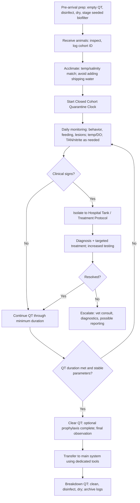
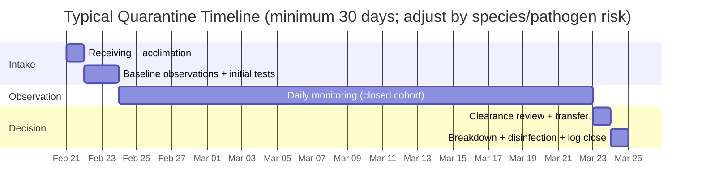

# Quarantine and Hospital Tank Setup SOP for Fish and Aquatic Animals

## Executive summary

A quarantine tank is a **separate, temporary holding system** used to isolate **new or potentially infected** aquatic animals from an established population to prevent inadvertent introduction or spread of infectious disease. citeturn32view0turn12search8 A hospital tank is an **isolation-and-treatment system** used for **clinically ill, injured, or actively treated** animals, optimized for observation, water quality stability, and safe medication delivery while minimizing risk to the main system. citeturn32view0turn33view0

Across public zoos/aquaria and veterinary guidance, a **~30-day minimum quarantine** is common, but **30–60 days** is recommended for “valuable pet fish” by the entity["book","Merck Veterinary Manual","online veterinary reference"], and quarantine must be restarted if additional animals are introduced mid-cycle. citeturn32view0turn12search8turn12search2 The practical implication is that quarantine must be treated as a **closed cohort** (“all-in / all-out”) with dedicated equipment and strict workflow.

Operational failure modes are dominated by:  
1) **Biosecurity breaches** (shared nets, splash/aerosol transfer, poor disinfection), citeturn32view0turn33view0turn7view1  
2) **Water quality instability** (“new tank syndrome,” TAN/nitrite spikes, oxygen shortfalls), citeturn33view0turn2view1turn15search5  
3) **Medication errors** (wrong volume, wrong concentration, incompatibilities, inadequate aeration, disruption of biofilter), citeturn33view0turn14search3turn31view0  
4) **Power or equipment failure** leading to dissolved oxygen (DO) collapse. citeturn15search36turn15search5

This report provides: rigorous definitions; stepwise SOPs for setup, water changes, and isolation; water quality targets with testing cadence and corrective actions; biosecurity/disinfection procedures with concentrations/contact times; treatment and dosing calculation methods; monitoring logs and emergency response; an equipment/budget checklist; and a risk-assessment framework. Species-specific parameters and facility scale were not provided; assumptions and decision points are explicitly stated in the next section.

## Purpose, scope, definitions, and assumptions

### Purpose

The purpose of quarantine and hospital tank SOPs is to:  
- Reduce the probability of introducing pathogens into established systems via incoming animals, water, or equipment. citeturn32view0turn33view0  
- Provide a controlled environment for early detection, observation, and treatment of disease while minimizing system-wide impact. citeturn32view0turn12search8  
- Maintain welfare by ensuring stable environmental conditions (water quality, oxygenation, temperature) during a high-stress period. citeturn7view0turn2view1turn15search5

### Scope

This SOP applies to **fish and other aquatic animals** housed in freshwater, brackish, or marine systems, including ornamental and institutional holdings. It covers **small single-tank** to **small multi-tank** quarantine/hospital operations, with notes on scaling. It includes containment, disinfection, and medication handling; it does not replace veterinary diagnosis, particularly for unusual mortality events or regulated/reportable pathogens. citeturn36view0turn34search2turn34search22

### Definitions

- **Quarantine (QT):** Keeping new or sick animals in a separate aquarium for a specific period before joining others; intended to prevent accidental introduction or spread of infectious disease to an established population. citeturn32view0  
- **Hospital tank (HT):** A dedicated isolation system used to **treat** or **stabilize** clinically affected animals (e.g., disease, injury, post-transport stress) where medication delivery and close observation are feasible without risking the display/production system. This operational distinction is consistent with veterinary guidance emphasizing isolation, easier treatment, and disinfection between uses. citeturn32view0turn33view0  
- **Closed cohort:** Once quarantine begins, **no new animals are added**; otherwise the quarantine clock resets. citeturn32view0  
- **TAN (Total Ammonia Nitrogen):** Combined NH₃ (unionized ammonia) + NH₄⁺ (ammonium). NH₃ is the more toxic fraction and increases with higher pH and temperature. citeturn2view1turn1search4turn0search12  
- **Biosecurity:** Practices that minimize risk of introducing and spreading infectious disease within and between facilities; includes animal management, pathogen management, and human/equipment management. citeturn7view0turn12search1

### Key assumptions (because species and facility size are unspecified)

1) **Primary assumption:** Mixed ornamental freshwater and/or marine fish are being quarantined, not food fish. Where food-fish regulations differ, this report flags the difference. citeturn26view0turn33view0  
2) **Temperature and chemistry:** Target temperature, salinity, pH, and hardness must match the species’ physiological range and the intended long-term system; general ranges provided are **defaults** and must be adjusted. citeturn33view0turn16search0  
3) **Facility scale:** Guidance is optimized for a “typical” quarantine/hospital station (10–40 gallons per tank equivalent) but includes scaling notes for multi-tank racks.

## System design and setup SOPs

### Tank selection and sizing SOP

**Design principle:** Quarantine/hospital tanks should be simple, controllable, easy to disinfect, and easy to observe, consistent with veterinary recommendations that quarantine systems be broken down and disinfected between uses and that separate nets/hoses be used. citeturn32view0turn33view0

**Sizing decision logic**
- **Minimum functional volume:** large enough to maintain stable water quality and allow normal posture/swimming; smaller volumes increase risk of rapid TAN/DO swings. citeturn33view0turn15search5  
- **Operational standardization:** for facilities, standardizing on 10/20/40-gallon footprints reduces procedural variability and dosing error risk (volume math, heater sizing, filter sizing). citeturn23view1turn25view2  
- **Marine vs freshwater:** marine quarantine often benefits from slightly larger volume due to narrower salinity/pH stability windows and the frequent use of copper-based protocols that can impair biofilters and require intensive monitoring. citeturn33view0

**Tank types**
- **Glass aquariums:** best visibility, predictable volume, easy cleaning.  
- **Food-safe tubs (HDPE/PP):** useful for large/temporary hospital capacity; must verify food-safe polymer and avoid prior chemical contamination (risk mitigation, not a guarantee). citeturn7view0turn36view0

### Filtration SOP (types, sizing, flow rates)

**Core requirement:** Provide **biological filtration** with a cycled medium whenever possible, using seeded sponge filters as a primary best practice.

- The veterinary manual describes setting up quarantine using an inexpensive tank with a **sponge filter**, aeration pump, and heater; and recommends seeding the sponge filter in an established disease-free system prior to use to inoculate nitrifying bacteria and reduce new-tank water quality issues. citeturn33view0  
- Newly established biofilters can take **weeks** to stabilize; “new tank syndrome” is characterized by elevated TAN/nitrite and associated morbidity/mortality. citeturn33view0

**Filter options comparison**

| Filter type | Best-fit QT/HT use | Strengths | Key limitations / risks |
|---|---|---|---|
| Air-driven sponge filter | Default QT/HT biofilter | Gentle flow, inexpensive, easy to disinfect/replace, can be seeded in advance citeturn33view0turn27search0 | Limited mechanical polishing; flow depends on air pump; can be overwhelmed at high bioload |
| Hang-on-back (HOB) power filter | QT for moderate bioload | Better mechanical capture; easy cartridge changes | Carbon/resins may remove some treatments if not removed; splashing can increase aerosol risk if poorly placed (mitigate with lid/flow control) citeturn32view0turn18view2 |
| Internal power filter | Small QT/HT | Compact; directional flow; can add sponge + floss | Less volume for bio-media; can stress weak fish if flow too strong |
| Canister filter | Larger QT/HT, stable biofiltration | High media volume; stable nitrification | Harder to disinfect fully; can become pathogen reservoir if moved between systems without sterilization citeturn7view1turn32view0 |
| Sump/wet-dry (dedicated to QT room) | Multi-tank QT rack | Shared filtration efficiency (if cohorts aligned) | Not appropriate if multiple cohorts at different quarantine stages (cross-contamination risk); requires strict cohort segregation citeturn32view0turn12search8 |

**Flow rate guidance (practical, cited heuristics)**
- For typical aquaria, a common recommendation is **~4× tank volume per hour turnover** as a baseline, adjusted for stocking/flow tolerance. citeturn13search2  
- In recirculating aquaculture systems (RAS), flow from culture tank to biofilter is often **~1–2 turnovers per hour**, depending on desired TAN and biofilter efficiency. citeturn13search5  

**QT/HT operational target (assumption-based):** For small quarantine/hospital tanks, design around **4–6×/hour** effective turnover (after head loss) unless the species requires low flow; prioritize oxygenation and waste capture over high current. This synthesizes aquarium turnover guidance with RAS biofilter flow principles and should be adjusted via observed stress and water quality trends. citeturn13search2turn13search5turn15search5

### Heating/cooling SOP

**Objectives:** Maintain stable temperature within the species’ range; reduce rapid swings; ensure safe treatment conditions.

- Temperature affects fish health broadly and is routinely monitored as part of critical maintenance. citeturn32view0turn2view1  
- For many marine/freshwater quarantine cases, “match the source system” is the safest default unless a disease-specific thermal protocol is prescribed by a veterinarian (species/pathogen dependent). citeturn7view0turn33view0

**SOP steps**
1) Install a thermostatic heater sized for tank volume and ambient room variation; use a secondary thermometer for verification. citeturn32view0turn28search24  
2) For temperature-sensitive operations, add a temperature controller (risk control: heater stuck “on”). (Risk rationale: thermal events are common in small volumes; general hazard control aligned with “disaster management plans” emphasis.) citeturn7view0turn15search36  
3) Cooling: if room temperature is high, use evaporation fans (freshwater) or a chiller for sensitive marine systems; ensure evaporation top-off uses dechlorinated freshwater and salinity is rechecked. citeturn32view0turn16search0

### Lighting SOP

Lighting in QT/HT serves inspection and husbandry rather than display.

- Provide a controllable photoperiod; avoid high intensity that increases stress and can amplify algae load.  
- Many maintenance schedules emphasize cleaning covers/trays and checking lighting at longer intervals; QT/HT lighting can be minimal as long as animals can be inspected. citeturn32view0

### Aeration and dissolved oxygen SOP

Maintaining DO is a primary life-support function; DO <5 mg/L is generally stressful to fish, and <3 mg/L is too low to support fish in many contexts. citeturn15search5turn2view1

**SOP**
1) Provide continuous aeration (air stone or sponge filter lift) sized to maintain surface agitation. citeturn15search36turn33view0  
2) Ensure redundancy: at minimum, keep a battery-powered backup air pump available for outages (emergency preparedness standard). citeturn15search36turn29search4  
3) During formalin or other oxygen-impacting treatments, **increase aeration** and monitor DO closely; formalin can significantly reduce DO. citeturn14search3turn33view0

### Substrate SOP (bare-bottom vs substrate)

For quarantine/hospital systems, **bare-bottom** is the default because it improves cleanability and observation of waste and uneaten food; it also reduces pathogen reservoirs in porous material. citeturn14search8turn14search36turn32view0

**Exception (species-welfare):** If a species requires substrate for stress reduction or feeding behavior, use a **removable, disinfectable** substrate surrogate (e.g., inert tray, tile) and treat it as contaminated equipment at breakdown. citeturn32view0turn7view1

### Hiding/cover SOP

Provide shelter to reduce stress while maintaining disinfectability:
- Use PVC sections, inert plastic shelters, or smooth ceramic items that can be disinfected. (Non-porous preference aligns with disinfection practicality.) citeturn32view0turn7view2turn17view2  
- Avoid porous wood/rock in QT/HT if disinfection between cohorts is required (biofilm shielding and disinfection difficulty are specifically highlighted). citeturn7view1turn32view0

### Isolation protocols SOP

**Core rule:** Separate animals, water, and equipment in ways that prevent “accidental transfer” of pathogens. citeturn32view0turn7view1

**SOP**
1) **Physical separation:** Place QT/HT away from display systems to reduce splash/aerosol transfer risk (especially when using air-driven devices). citeturn32view0turn7view1  
2) **Dedicated tools:** Assign nets, siphon hoses, buckets, specimen containers, towels, and thermometers to QT/HT only. citeturn33view0turn32view0  
3) **One-way workflow:** Always service healthy/established systems first, then quarantine, then hospital last; reverse order only if personnel change PPE and disinfect thoroughly. (Biosecurity “human management” and sanitation emphasis.) citeturn7view0turn12search1  
4) **No cross-return:** Filter media used in QT/HT is treated as contaminated; it must be disinfected or discarded, not moved back “clean” without sterilization. citeturn32view0turn7view2

### Water change procedure SOP

Veterinary maintenance guidance stresses dechlorination of new water and regular water changes and test-kit checks. citeturn32view0turn33view0

**Standard QT/HT water change SOP (static system)**
1) **Measure replacement water needs** (percentage and absolute volume).  
2) **Prepare replacement water** in a dedicated “clean” container: match temperature (±1°F/±0.5°C), match salinity for marine/brackish, dechlorinate, and (if needed) buffer to maintain alkalinity/pH stability. citeturn32view0turn16search0turn2view1  
3) **Stop heaters** briefly if water level may drop below safe submersion.  
4) **Siphon waste** from bare bottom and remove uneaten food; prioritize removal of feces and detritus (pathogen/organic load reduction). citeturn32view0turn7view1  
5) **Remove 10–30%** for routine QT; increase frequency/volume for hospital tanks under heavy feeding, high bioload, or medication that impacts biofilters (see corrective actions section). This escalation is justified by the rapid onset of TAN/nitrite problems in small systems and by the documented sensitivity of nitrifying bacteria to some antimicrobials. citeturn33view0turn2view1  
6) **Refill slowly** to reduce stress; verify final temperature/salinity. citeturn16search0turn32view0  
7) **Restart equipment**; confirm flow and aeration.  
8) **Log**: volume changed, parameters before/after, and observations. citeturn32view0turn36view1

image_group{"layout":"carousel","aspect_ratio":"16:9","query":["aquarium quarantine tank sponge filter setup","bare bottom hospital tank PVC hiding places","hang on back filter quarantine tank","aquarium air pump airstone quarantine tank"],"num_per_query":1}

## Water quality management SOPs

### Target parameters and ranges

Because species-specific needs were not provided, this section defines **(a) universal safety targets**, and **(b) default ranges** suitable for many freshwater and marine fish, anchored in veterinary reference ranges and environmental regulator guidance.

**Universal safety targets**
- **Ammonia (TAN):** target **0 mg/L detectable**; any detection in QT/HT is an action trigger because TAN spikes are central to “new tank syndrome.” citeturn33view0turn2view1  
- **Nitrite:** target **0 mg/L detectable**; nitrite causes physiologic hypoxia (“brown blood disease”). citeturn33view0turn15search13  
- **DO:** target **≥6 mg/L** preferred; **<5 mg/L** is generally stressful; **<3 mg/L** is often incompatible with fish support. citeturn15search5turn2view1

**Default reference ranges (must be adjusted to species/system)**
The following veterinary “normal reference ranges” for routine water quality analysis provide a baseline: freshwater pH ~6.8–7.6; saltwater pH ~7.8–8.3; DO >5 mg/L; nitrite <0.1 mg/L; nitrate <20 mg/L freshwater and <70 mg/L saltwater; alkalinity and hardness in moderate ranges. citeturn2view1turn2view0

For marine salinity, natural seawater averages ~35 ppt (commonly 33–37 ppt), which is a defensible default target for marine QT unless the species/system is intentionally lower salinity. citeturn16search0turn33view0

### Testing frequency and corrective actions table

**QT/HT testing cadence should be more frequent than “stable display tank” cadence** because quarantine systems are intentionally dynamic (new animals, variable feeding, frequent water changes, and often treatment). This is consistent with veterinary emphasis that water quality failures are central in early tank setups and during/after treatments that affect biofiltration. citeturn33view0turn31view0turn14search3

| Parameter | Operational target | Test frequency in QT/HT | Corrective actions (escalation order) | Scientific/clinical rationale |
|---|---:|---|---|---|
| Temperature | Species-dependent (match source/display) | Daily (and after water changes) | Verify heater calibration; add controller; insulate tank during outages; correct slowly | Routine maintenance includes checking temperature daily; stability is key. citeturn32view0turn15search36 |
| DO (mg/L) | ≥6 preferred; avoid <5 | Daily; continuous if possible during treatments | Increase aeration/surface turbulence; reduce feeding; reduce stocking density; emergency partial water change; backup air pump/generator | DO <5 mg/L is generally stressful; <3 mg/L too low to support fish. citeturn15search5turn15search36 |
| TAN (mg/L) | 0 (action if detectable) | Daily for first 7–14 days and during treatment; otherwise 2–3×/week | Immediate 25–50% water change; stop/reduce feeding 24–48h; add/upgrade seeded biofilter; check pH/temp (NH₃ fraction); consider moving animals to larger volume | Elevated TAN is a hallmark of “new tank syndrome” and can cause morbidity/mortality. citeturn33view0turn2view1turn1search4 |
| Nitrite (mg/L) | 0 (action if detectable) | Daily until stable | Water change; stop/reduce feeding; increase biofiltration; add chloride (salt) to reduce nitrite uptake; monitor for hypoxia signs | Nitrite converts hemoglobin to methemoglobin; chloride competes with nitrite at gills. citeturn15search13turn15search0turn33view0 |
| Nitrate (mg/L) | Keep low; default <20 FW, <70 SW | Weekly (or 2×/week if water changes minimal) | Increase water-change volume/frequency; reduce feeding; improve mechanical waste removal; verify biofilter performance | Veterinary reference ranges provide guidance; nitrate accumulates with nitrification. citeturn2view0turn33view0 |
| pH | Stable; default 6.8–7.6 FW; 7.8–8.3 SW | 2–3×/week; daily if treating or if TAN detected | Avoid rapid swings; adjust alkalinity buffering; match replacement water; investigate CO₂/organics | pH affects NH₃ toxicity fraction and treatment safety; reference ranges provided. citeturn2view0turn1search4 |
| Salinity (ppt / SG) | Marine default ~35 ppt unless specified | Daily during marine QT; after top-off/water changes | Verify refractometer calibration; correct gradually; control evaporation via lid/top-off | Natural seawater typically ~35 ppt; stability matters in small volumes. citeturn16search0turn32view0 |
| Alkalinity / hardness | Moderate, stable (system dependent) | Weekly (more often if pH unstable) | Add buffer (bicarbonate/carbonate) as needed; avoid overcorrection | Adequate alkalinity supports biofilter function; very low alkalinity can inhibit biofilter performance. citeturn33view0turn2view0 |

**Nitrite chloride dosing rule (operational):** Aquaculture references commonly recommend maintaining **chloride:nitrite** ratios on the order of **~3:1 to 6:1** (or higher in some species) to reduce nitrite toxicity; one veterinary diagnostic newsletter notes maintaining chloride at least 20 mg/L can prevent nitrite toxicosis and that chloride competes with nitrite uptake at gills. citeturn15search0turn33view0turn15search26

## Biosecurity measures and disinfection SOPs

### Biosecurity program components

Veterinary aquaculture guidance frames biosecurity around: sourcing/animal management, pathogen management (sanitation and disinfection), and human/equipment management (education, protocols). citeturn7view0turn12search1

For QT/HT, this translates to four enforceable controls:

1) **Controlled entry:** limit visitors; designate “QT/HT work zone.” citeturn7view0turn36view0  
2) **Dedicated equipment:** nets/hoses/buckets are not shared. citeturn33view0turn32view0  
3) **Validated disinfection:** correct concentration + sufficient contact time + organic matter removal. Organic debris and biofilms can shield pathogens from disinfection. citeturn7view1turn17view1  
4) **Cohort quarantine:** closed cohort; restart quarantine clock if new animals are introduced. citeturn32view0turn12search2

### PPE SOP

At minimum, use PPE when handling diseased animals, chemicals, or contaminated equipment:
- Nitrile gloves and eye protection for disinfectants and treatments (noting oxidizers and chlorine hazards). citeturn7view2turn17view1  
- Consider dedicated apron/outerwear for QT/HT tasks; do not move contaminated PPE into clean areas. citeturn36view1turn18view2

### Disinfection protocol SOP (cleaning → disinfection → neutralization)

**SOP**
1) **Remove animals (and organic debris).** For system-level disinfection, remove all animals and drain system; disinfection is not effective if organic matter remains. citeturn18view0turn7view2  
2) **Mechanical cleaning:** scrub surfaces; remove biofilms and debris. citeturn7view2turn17view1  
3) **Apply disinfectant at validated concentration** and keep surfaces wet for required contact time. citeturn17view2turn22view0turn18view0  
4) **Rinse and neutralize** where required (especially chlorine and quats). Residual toxicity is a documented hazard; use test kits where applicable. citeturn7view2turn17view1turn18view0  
5) **Dry completely** when feasible; drying is a useful adjunct but may not kill all life stages. citeturn17view0turn18view0

### Disinfectant comparison table (agents, concentrations, contact times)

The following table consolidates aquaculture/veterinary references and label instructions. Concentrations are expressed as active concentration in solution; always follow product label and verify compatibility with surfaces.

| Disinfectant class | Typical use concentration | Contact time | Strengths | Major limitations / notes |
|---|---:|---:|---|---|
| Chlorine (sodium/calcium hypochlorite) | 200 mg/L available chlorine (common) citeturn7view2turn17view1 | 1 hour at 200 mg/L (Merck) citeturn7view1 | Broad activity; widely available | Organic matter reduces effectiveness; corrosive; toxic residues must be neutralized/rinsed; avoid fumes near live fish. citeturn7view1turn17view1 |
| Chlorine for pipelines/footbaths (WOAH) | 50 mg/L chlorine (pipelines/footbath) citeturn18view0turn18view2 | ≥30 min for pipelines (WOAH) citeturn18view0 | Useful for system plumbing disinfection | Must neutralize before discharge; activated charcoal or thiosulfate used. citeturn18view0turn34search21 |
| Potassium peroxymonosulfate products (e.g., Virkon-type) | Often 1–2% (veterinary/aquaculture guidance) citeturn7view2turn17view2 | 10 min surfaces wet (label) citeturn22view2turn22view0 | Broad-spectrum, less corrosive than chlorine, good for nets/boots | Must follow label; do not apply directly to water (aquaculture label). citeturn22view0turn22view2 |
| Iodophors (povidone-iodine) | 200–250 mg/L iodine (WOAH equipment/footbath) citeturn18view0turn18view2 | ≥10 min citeturn18view0 | Useful in hatchery hygiene; buffered iodophors | Staining; reduced efficacy with organics; egg disinfection protocols are specific and do not prevent vertical transmission. citeturn20view0turn17view2 |
| Chlorhexidine | Often diluted from 2% products; 5–10 min citeturn17view2 | ≥5 min (MSU extension text) citeturn17view0 | Effective vs many bacteria/enveloped viruses; often used for footbaths | Less effective vs spores; activity reduced by extreme pH and some hard-water ions; surfaces must be clean. citeturn17view0turn17view2 |
| Quaternary ammonium compounds (QACs) | 250–500 mg/L benzalkonium (example) citeturn17view2 | 10–30 min citeturn17view2 | Good cleaning action; penetrates porous surfaces | Can leave residues toxic to fish; requires thorough rinse. citeturn17view0turn7view1 |
| Alcohol (60–90%) | 60–90% ethanol/isopropanol citeturn17view0turn17view2 | 10–30 min (general table) citeturn17view2 | Good for small tools/surfaces; effective when clean | Not ideal for heavy organic soil; flammability concerns. citeturn17view0turn17view2 |

**Neutralizing chlorine:** A common stoichiometric rule used in water testing guidance is ~**7 mg sodium thiosulfate per 1 mg chlorine**, and chlorine test kits are recommended to confirm residuals. citeturn34search21turn7view1

### Quarantine timelines SOP

**Baseline quarantine duration**
- Public zoo/aquarium practice commonly uses **≥30 days** minimum. citeturn12search8turn12search2  
- Veterinary guidance for valuable pet fish recommends **30–60 days**. citeturn32view0  

**SOP rule:** Define quarantine as a **closed cohort**:
- If a new animal is introduced, quarantine must restart. citeturn32view0  
- If signs of disease appear, quarantine shifts toward hospital isolation and/or treatment protocols and may require extension. citeturn32view0turn33view0

### Handling and transfer SOP (arrival → acclimation → QT entry)

1) **Receiving inspection:** check shipment water temperature, animal behavior, respiratory rate, external lesions/parasites.  
2) **Acclimation:** match temperature and (for marine) salinity/pH carefully to reduce osmotic shock; keep lighting dim. (General stress mitigation consistent with husbandry principles.) citeturn33view0turn32view0  
3) **QT entry:** move animal with dedicated net/container; do not pour shipping water into QT when avoidable (risk control; shipping water is a contamination vector). (Risk management inference consistent with pathogen management emphasis.) citeturn7view0turn32view0  
4) **Post-transfer hand hygiene and tool disinfection** before contacting any other systems. citeturn17view1turn7view0

### Waste disposal SOP

For routine and mass mortality events, guidance from the entity["organization","World Organisation for Animal Health","aquatic animal health standards"] emphasizes risk-based disposal, potential need for competent authority oversight in unusual mortalities, and separation/containment of waste during storage and transport. citeturn36view0turn36view1

**High-level SOP**
1) **Classify waste risk** (routine vs suspected infectious / mass mortality). citeturn36view0  
2) **Contain and secure:** leak-proof containers; isolate storage from bodies of water and aquaculture sites; prevent access by scavengers. citeturn35view0turn36view0  
3) **Dispose via approved methods** consistent with local law; options include rendering, incineration, sterilization, composting, burial, etc., with specified time/temperature practices for risk reduction in high-risk contexts. citeturn36view1turn36view2  
4) **Decontaminate vehicles/containers** leaving disposal sites. citeturn36view2  
5) **Notify authorities** when mortality is significant or disease-control killing is required. citeturn36view0turn34search2turn34search22

## Medication and treatment SOPs

### Treatment governance and legal guardrails

Many drugs used in fish are regulated; veterinary guidance notes that some drugs are approved for food fish, some are low regulatory concern, and others may be used by veterinarians under controlled conditions, with special concern for environmental contamination in outdoor systems. citeturn32view0turn33view0

For U.S. aquaculture feeds, the entity["organization","U.S. Food and Drug Administration","us federal food and drug regulator"] documents mandatory withdrawal times for certain medicated feeds and explicitly states that **extra-label use of medicated feed** containing certain drugs is **prohibited**. citeturn26view0turn26view1

**Operational implication:** A QT/HT SOP should include a “regulatory intent” field (ornamental vs food vs research), because it determines which products and records are required, especially for antimicrobials and medicated feeds. citeturn26view0turn33view0

### Bath vs systemic treatment SOP

Veterinary guidance distinguishes waterborne (bath/immersion) versus systemic (feed/injection) delivery:

- Immersion/bath is common for external parasites and some conditions; however, bath delivery of antimicrobials is generally **not recommended** due to limited/unknown efficacy and because antimicrobials can damage nitrifying bacteria in biofilters. citeturn33view0  
- Injection provides the most controlled antimicrobial dosing when veterinary handling is feasible. citeturn33view0

**SOP decision rule**
1) If the problem is primarily **external** (ectoparasites, external bacterial lesions), consider **bath/immersion** protocols and isolate treatment water from other systems. citeturn32view0turn33view0  
2) If the problem is **systemic** (sepsis, deep ulcers, internal protozoa), prioritize veterinary consultation and systemic therapy (medicated feed or injection), and treat QT/HT water quality as critical support. citeturn33view0turn32view0  
3) If treatment is likely to impair biofiltration (e.g., copper, antimicrobials), plan for increased testing and water-change capacity. citeturn33view0turn31view0

### Dosing calculations SOP (rigorous method)

Accurate dosing depends on accurate volume (including displacement) and product concentration.

**Core formulas**
- **Mass needed (mg)** = Dose (mg/L) × Volume (L)  
- **Volume of product (mL)** = Mass needed (mg) ÷ Concentration (mg/mL)  
- For products listed as **% active ingredient**, additional conversion is required; the entity["organization","U.S. Fish and Wildlife Service","us federal wildlife agency"] quick-reference guide provides worked examples using conversion factors, specific gravity adjustments, and flow-through dosing models. citeturn25view2turn23view1turn25view3

**Flow-through (metered) dosing** is fundamentally different from static bath dosing; examples are provided in the same guide for formalin, hydrogen peroxide, and chloramine-T. citeturn23view1turn25view3turn25view1

**Minimum required calculation controls**
1) Two-person verification for any medication with narrow therapeutic index (e.g., copper, formalin). (Risk control justified by known toxicity/oxygen impacts and daily monitoring requirements.) citeturn33view0turn14search3  
2) Record the version of the SOP and the product label source used. citeturn22view0turn26view0turn32view0  
3) Use calibrated measuring tools (graduated cylinder, scale) rather than “drops” except where veterinary guidance explicitly provides a conversion. citeturn33view0

### Medication option comparison (use, route, major hazards, key notes)

This table emphasizes commonly referenced QT/HT actives in veterinary/aquaculture sources, not an exhaustive formulary.

| Active / class | Typical QT/HT use | Route | Key contraindications / hazards | Notes on monitoring & system impacts |
|---|---|---|---|---|
| Formalin (37% formaldehyde solution) | External parasites; some fungal/parasite control (product-specific) citeturn33view0turn23view0 | Prolonged bath (veterinary: 15–25 mg/L) citeturn33view0 | Can significantly reduce dissolved oxygen; vigorous aeration required citeturn14search3turn33view0 | Monitor DO and TAN/nitrite; product labels warn about biofilter impacts in recirculating systems. citeturn14search17turn33view0 |
| Hydrogen peroxide (e.g., 35% PEROX-AID) | External bacterial/fungal control in specific approved uses citeturn25view2turn24view1 | Static bath or flow-through (examples provided) citeturn25view2turn25view3 | Species sensitivity; requires careful calculation and monitoring | Example calculations show use of %AI and specific gravity adjustments. citeturn25view2turn25view3 |
| Chloramine‑T (Halamid Aqua) | External bacteria (e.g., bacterial gill disease) in approved uses citeturn31view0 | Bath/flow-through | If used in recirculating systems, bypass biofilter during treatment and flushing citeturn31view0 | Requires careful dosing math; examples for static and flow-through provided. citeturn25view0turn25view1 |
| Copper (Cu²⁺ / chelated copper) | Marine ectoparasites (e.g., Cryptocaryon) in veterinary practice citeturn33view0 | Prolonged bath | Highly toxic to invertebrates/plants; can impair nitrifying bacteria; requires daily testing; dose depends on alkalinity chemistry citeturn33view0 | Veterinary guidance recommends maintaining Cu²⁺ in a narrow range and daily testing; expect ammonia/nitrite issues after treatment. citeturn33view0 |
| Salt (NaCl) | Osmoregulation support; nitrite toxicity mitigation; some external parasite support in specific protocols citeturn33view0turn15search0 | Bath or adjusted salinity | Not suitable for all species (species-specific); salinity changes must be controlled | Veterinary references note it as “low regulatory concern” with multiple uses and provide salinity manipulation examples. citeturn33view0turn15search0 |

### Withdrawal times SOP (food fish vs ornamental)

If animals may enter the food chain, withdrawal times and prohibitions matter:

- The FDA appendix documents **mandatory withdrawal times** for certain medicated feeds (example: florfenicol feed withdrawal of 15 days before harvest; specific values depend on drug and indication). citeturn26view0  
- Extra-label use of certain medicated feeds is explicitly prohibited. citeturn26view0turn26view1  
- Some bath treatments in approved contexts list **0-day withdrawal** in the aquaculture drug guide (product- and indication-specific). citeturn23view0turn31view0turn24view1  

**SOP rule:** Always document whether the cohort is **food fish** or **ornamental**. If food fish: use only approved products and comply with labeled withdrawal times and veterinary feed directive requirements where applicable. citeturn26view0turn26view1

### Recordkeeping SOP

Recordkeeping is repeatedly emphasized across quarantine and waste-handling guidance (traceability, auditing, and accountability). citeturn32view0turn36view1

**Minimum QT/HT record fields**
- Animal cohort ID, species, count, source, arrival date/time, and baseline observations. citeturn32view0turn12search8  
- Daily water quality log (temperature, DO if available, pH, TAN, nitrite; salinity for marine). citeturn32view0turn2view1  
- Medication log: product, lot number, dose calculation worksheet, administrator, start/stop times, adverse reactions, water changes, and disposal method. citeturn25view2turn22view0turn36view1  
- Disinfection log: agent, concentration, contact time, verification (e.g., chlorine test strip), and date of breakdown/disinfection. citeturn7view1turn17view2turn22view0  

## Monitoring, logs, maintenance, and emergency response

### Routine monitoring and maintenance schedules

Veterinary guidance provides a baseline “Essential Maintenance” cadence (daily checks; weekly cleaning; biweekly water changes and full parameter testing; periodic equipment service). citeturn32view0

**QT/HT adaptation (more intensive than baseline due to risk)**
- **Daily:** observe behavior/feeding, check temperature and equipment, remove uneaten food, spot-clean bottom, and (during early QT or treatment) test TAN/nitrite. citeturn32view0turn33view0  
- **Weekly:** service mechanical filtration, verify air delivery and flow, check nitrate, and review logs for trends. citeturn32view0turn2view0  
- **Between cohorts:** break down and disinfect QT systems; store dry. citeturn32view0turn33view0

### Quarantine workflow flowchart (mermaid)



### Quarantine timeline (mermaid)



### Emergency response SOPs and flowchart

**Emergency priorities (in order)**
1) Maintain **oxygenation** and **temperature stability** (life support). citeturn15search5turn15search36  
2) Prevent cross-contamination and movement of potentially infected animals/equipment. citeturn32view0turn7view0  
3) Stabilize water quality (TAN/nitrite) and document actions. citeturn33view0turn2view1  
4) Escalate to veterinary diagnostics and, for reportable diseases or significant mortality, notify relevant authorities (e.g., SVCV reporting to USDA APHIS is noted in fish health guidance). citeturn34search2turn34search22turn36view0

```mermaid
flowchart TD
  A[Emergency Detected] --> B{Power failure?}
  B -- Yes --> C[Start backup aeration: battery air pump/UPS/generator]
  C --> D[Insulate tank; stop feeding; monitor DO/temp]
  D --> E{Stabilized?}
  E -- No --> F[Reduce stocking density / move to larger volume / emergency water change]
  E -- Yes --> Z[Log incident + preventive upgrades]
  B -- No --> G{Water quality alarm (TAN/nitrite/DO/pH/salinity)?}
  G -- Yes --> H[Immediate partial water change + aeration + feeding pause]
  H --> I[Identify root cause: biofilter failure, overdose, dead organism, clog]
  I --> J[Correct root cause; increase testing frequency]
  J --> Z
  G -- No --> K{Mass mortality or severe outbreak signs?}
  K -- Yes --> L[Isolate cohort; stop movements; preserve samples]
  L --> M[Contact aquatic veterinarian/diagnostics; consider reportable pathogens]
  M --> N[Dispose of carcasses/waste via risk-based method]
  N --> Z
  K -- No --> Z
```

## Equipment, budgets, risk assessment, and references

### Equipment and consumables checklist

This checklist emphasizes redundancy, disinfection capability, and accurate testing/measurement—aligned with the dominant failure modes documented in veterinary references (water quality crashes, biosecurity failures, treatment side-effects). citeturn33view0turn32view0turn7view1

**Core life-support**
- Tank(s) or tubs + lid/cover  
- Heater + thermometer (optionally a controller) citeturn32view0turn28search24  
- Aeration: air pump, tubing, check valves, air stones; backup air pump citeturn15search36turn29search4  
- Filtration: sponge filters (plus spare sponges to seed) citeturn33view0turn27search0  
- Mechanical cleaning tools: siphon/gravel vac, dedicated buckets citeturn32view0turn29search9  

**Water quality testing**
- pH, ammonia, nitrite, nitrate test kit (liquid reagent preferred) citeturn32view0turn28search8  
- Marine: salinity measurement (refractometer or conductivity) citeturn16search0turn29search23  
- Optional (higher rigor): DO meter for sensitive systems citeturn28search1  

**Biosecurity and disinfection**
- Disinfectants (chlorine source and/or peroxymonosulfate product), measuring tools, neutralizer (sodium thiosulfate), test strips citeturn7view1turn22view0turn34search21  
- PPE: gloves, eye protection citeturn17view1turn7view2  

**Treatment support**
- Accurate dosing tools: gram scale, graduated cylinders/syringes  
- Dedicated “treatment bucket” for dips/baths (never used elsewhere)  
- Activated carbon for post-treatment removal where appropriate and for discharge-water handling in some veterinary protocols citeturn33view0  

### Estimated budgets (USD, examples as of early 2026)

Budgets are approximate and based on representative retail listings; prices vary by region and promotions.

| Build tier | Intended use | Typical components | Estimated cost |
|---|---|---|---:|
| Minimal QT/HT | Single small QT (10–20 gal) | Sponge filter (~$5–$8), heater (~$33), basic test kit (~$36), gravel vac (~$6–$9), basic tank often ~$35–$50 | ~$120–$220 citeturn27search0turn28search24turn28search8turn29search9turn28search7 |
| Standard QT/HT | More stable + redundancy | Minimal tier + backup air pump (~$20) + improved salinity tool for marine (~$36–$100) + disinfectant stocks (e.g., Virkon Aquatic 10 lb ~$145–$166) | ~$250–$550 citeturn29search4turn29search23turn27search14turn27search17 |
| High-control / small facility | Multi-tank / sensitive species | Standard tier + DO meter (~$700 list pricing examples) + dedicated UV (optional) + more test instrumentation | ~$900–$2,000+ citeturn28search17turn27search5turn15search5 |

### Reputable supplier examples (equipment, tests, disinfectants, aquaculture therapeutics)

The following are commonly used suppliers/manufacturers referenced in the pricing and label sources used in this report:

- entity["company","Petco","san diego, ca, us"] (tanks, API test kits in U.S. retail) citeturn28search7turn28search8  
- entity["company","Bulk Reef Supply","online aquarium retailer, us"] (filters, heaters, salinity tools, gravel vacs) citeturn27search0turn28search24turn29search23turn29search9  
- entity["company","Syndel","aquaculture therapeutics supplier"] (Halamid Aqua and related aquaculture products; neutralization guidance) citeturn27search6turn34search1  
- entity["company","Pentair Aquatic Eco-Systems","apopka, fl, us"] (aquaculture water treatment/testing and fish-health supplies) citeturn27search4  
- entity["company","Hanna Instruments","water quality instrumentation brand"] (DO meters and instrumentation examples) citeturn28search1turn28search17  

### Risk assessment and mitigation strategies

The table below uses a simple likelihood × impact framing tailored to QT/HT operations.

| Risk | Likelihood (typical QT/HT) | Impact | Primary mitigations (SOP controls) | Monitoring trigger |
|---|---|---|---|---|
| Pathogen introduction via new animals | High | High | 30–60 day quarantine; closed cohort; source screening where possible citeturn32view0turn12search8turn33view0 | Clinical signs; unexplained deaths |
| Cross-contamination via equipment | Medium–High | High | Dedicated nets/hoses; one-way workflow; validated disinfection citeturn33view0turn17view2turn32view0 | Any shared-tool event |
| TAN/nitrite spike (“new tank syndrome”) | High in small/new QT | High | Seeded biofilter; daily TAN/nitrite early; feeding control; water-change capacity citeturn33view0turn2view1 | TAN>0 or nitrite>0 |
| Oxygen depletion (esp. during treatment or outage) | Medium | High | Redundant aeration; backup air pump; treat DO as life-support citeturn15search5turn15search36turn14search3 | DO <5 mg/L / gasping |
| Medication dosing error | Medium | High | Standard tank volumes; calculation worksheet; two-person check; calibrated tools citeturn25view2turn23view1turn33view0 | Any deviation from plan |
| Biofilter disruption from treatments | Medium | Medium–High | Enhanced testing during/after treatment; bypass/flush biofilter where required; planned water changes citeturn31view0turn33view0turn14search17 | Rising TAN/nitrite |
| Mass mortality event | Low–Medium | Very High | Isolation; stop movements; authority/vet notification; risk-based carcass disposal citeturn36view0turn36view2turn34search2 | Multiple deaths in 24h |

### References (primary/official prioritized)

Primary/official and veterinary reference sources used heavily in this report:
- Merck Veterinary Manual (fish routine care, quarantine definition and duration; QT system sanitation; maintenance schedule; aquarium fish management, parasiticide/chemotherapy guidance). citeturn32view0turn33view0turn7view1  
- World Organisation for Animal Health (WOAH) Aquatic Animal Health Code/Manual (disinfection methods, egg disinfection protocol, aquatic animal waste handling and disposal). citeturn18view0turn20view0turn36view0turn36view2  
- U.S. Food and Drug Administration (approved aquaculture drugs appendix: withdrawal times; extra-label medicated feed prohibitions). citeturn26view0turn26view1  
- U.S. Fish and Wildlife Service (approved aquaculture drug quick reference: dosing examples and cautions, including biofilter bypass guidance for chloramine‑T). citeturn31view0turn25view2turn23view1  
- U.S. Environmental Protection Agency DO indicator guidance (stress thresholds). citeturn15search5  
- National Oceanic and Atmospheric Administration seawater salinity reference. citeturn16search0  

Peer-reviewed / technical sources informing quarantine norms and physiology/toxicology:
- Survey of fish quarantine practices in public zoos and aquaria (minimum 30 days common). citeturn12search8turn12search2  
- Nitrite physiology and methemoglobinemia (mechanism and impacts). citeturn15search13turn15search6  
- Ammonia speciation/toxicity (NH₃ fraction dependence on pH/temperature). citeturn1search4turn0search12  
- Formalin oxygen depletion risk and mitigation (aeration requirement). citeturn14search3turn33view0