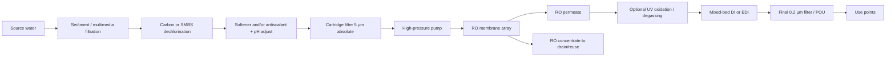

# RO/DI and Source-Water Quality SOP Deep Research Report

## Executive Summary

Reverse osmosis (RO) and deionization (DI) are complementary purification technologies that remove *different* contaminant classes with different failure modes and monitoring needs. RO is a pressure-driven membrane separation process that rejects most dissolved salts and many organics and microbes; modern RO commonly achieves ~95–99%+ dissolved-salt rejection depending on membrane type, feedwater chemistry, temperature, and system design. citeturn7search21turn20view0turn21view0 DI is an ion-exchange process that removes ionized/ionizable species by exchanging cations for H⁺ and anions for OH⁻; it can polish RO permeate to very low ionic levels (often reported as 18.2 MΩ·cm resistivity, the theoretical limit for pure water at 25 °C) when dissolved gases (notably CO₂) and trace ionic leakage are controlled. citeturn7search20turn10search22turn10search29

Combined RO/DI systems (often RO → UV/degassing → mixed-bed DI or EDI → final filtration) are the most common architecture when both high *ionic* purity and stable operation are required, because RO dramatically reduces the ion load and scaling/fouling burden that would otherwise consume DI resin rapidly, while DI (or EDI) “polishes” residual ions that RO may not fully remove (including weakly ionized species under some conditions). citeturn7search21turn7search20turn8search28

Feed/source water quality is the dominant determinant of RO/DI reliability. Primary manufacturer guidance for RO feedwater commonly sets maximum limits for particulate fouling (e.g., SDI₁₅ ≤ 5), turbidity (≤ 1 NTU), organics (TOC ≤ 3 mg/L), oil/grease (≤ 0.1 mg/L), free chlorine (≤ 0.1 mg/L at the membrane—often treated as “must be not detectable” in practice), and trace metals such as iron, manganese, and aluminum (~0.05 mg/L each in many guidelines). citeturn2view0turn21view0turn22view0 Silica management is a frequent design limiter: scaling risk depends strongly on temperature, pH, recovery, and the presence of trivalent metals (Al³⁺, Fe³⁺), which can precipitate silica even below its “normal” saturation behavior; frequent testing and conservative pretreatment triggers are therefore warranted when silica is elevated (e.g., evaluation recommended when feed silica > 20 mg/L in at least one primary pretreatment guidance document). citeturn11view3turn8search29

This report provides: (1) rigorous definitions and differences; (2) typical RO/DI architectures and flow diagrams; (3) performance metrics with target values for common laboratory/analytical and industrial categories (noting where end-use is unspecified); (4) source-water parameters and pretreatment trigger thresholds; (5) pretreatment selection logic (Mermaid flowchart), with pros/cons and practical sizing guidance; (6) monitoring methods, recommended instruments/test kits with accuracy specifications from manufacturer datasheets; (7) maintenance, regeneration, resin handling, waste, troubleshooting; and (8) SOP templates (operations, sampling, maintenance checklist, and logbook formats) aligned to primary standards and manufacturer manuals. citeturn6search0turn10search19turn5search2turn20view0turn21view0

## RO, DI, and RO/DI Definitions and Differences

### Reverse osmosis

RO applies pressure across a semipermeable membrane to force water to permeate while most dissolved solutes remain in the concentrate stream; “rejection” of dissolved salts is typically ~95–99%+ (dependent on membrane type, feed composition, temperature, and design). citeturn7search21turn20view0 RO also removes suspended solids and reduces microbial loads, but should not be treated as an absolute sterile barrier because real systems can have leaks, bypass, seal issues, and post-membrane contamination risks. citeturn7search25turn21view0

Key RO implications for SOP and monitoring:
- RO performance must be interpreted via *normalized* permeate flow, salt passage/rejection, and stage pressure drop, not raw readings (temperature and recovery shifts confound raw data). citeturn20view0turn23view1
- RO membranes can be damaged by oxidants (free chlorine and other oxidizers); dechlorination and confirmed “no detectable” oxidant at the membrane is a core control point. citeturn22view0turn21view0turn2view0

### Deionization

DI uses ion exchange resins to remove ions:
- Strong-acid cation resin exchanges cations (e.g., Ca²⁺, Na⁺) for H⁺.
- Strong-base anion resin exchanges anions (e.g., Cl⁻, SO₄²⁻) for OH⁻.
- Released H⁺ and OH⁻ combine to form water, lowering ionic conductivity. citeturn7search20turn8search11

Critical DI realities:
- DI does **not** reliably remove nonionic organics, particulates, or microbes; resin beds can become microbial reservoirs if not sanitized and protected. citeturn10search22turn5search0turn11view1
- Removal of weakly ionized species (notably reactive silica and CO₂-derived carbonic species) depends on resin type and operating conditions; strong-base anion resins are selected when removal of CO₂ and reactive silica is required, but colloidal silica is poorly removed by ion exchange (it is not strongly ionic). citeturn8search11turn8search15

### Why RO/DI combinations dominate

RO sharply reduces the ionic load on DI, extending resin life and stabilizing effluent quality; DI then polishes residual ions to meet high-resistivity targets. citeturn7search21turn7search20 This combination matters because even small CO₂ uptake from air can drop resistivity dramatically (e.g., ~10–15 ppb CO₂ can reduce 18.2 MΩ·cm water to ~10 MΩ·cm), so polishing design must also manage dissolved gases and post-treatment contamination. citeturn10search22turn8search28

### Comparison table

| Attribute | RO | DI (ion exchange) | Combined RO/DI |
|---|---|---|---|
| Primary removal mechanism | Membrane separation under pressure | Ion exchange (H⁺/OH⁻ cycles) | Bulk removal by RO + ionic polishing by DI/EDI |
| Removes dissolved salts/ions | High (typically 95–99%+ salt rejection) citeturn7search21 | Very high (to near theoretical resistivity when optimized) citeturn10search22turn7search20 | Highest practical ionic purity and stability citeturn7search21turn7search20 |
| Removes TOC/organics | Variable; many organics reduced but not all | Limited (nonionic organics pass) | RO lowers TOC load; UV/TOC control often added citeturn20view0turn10search11 |
| Microbial/endotoxin control | Reduces but not absolute; post-RO contamination possible | Can become microbial reservoir if unmanaged | Needs final barriers (UV/UF/0.2 µm) + sanitation citeturn5search0turn20view0turn10search11 |
| Oxidant sensitivity | Thin-film polyamide RO typically requires dechlorination | Resin less sensitive, but oxidants can degrade organics and support biofilm dynamics | Dechlorination is still mandatory for RO stage citeturn22view0turn21view0 |
| Waste stream | Concentrate (brine) generated | Regeneration waste (if regenerable) or spent cartridges | Both concentrate + DI regen/spent resin waste citeturn22view0turn8search11 |
| Typical “go/no-go” metric | Permeate conductivity / salt passage + ΔP | Effluent resistivity + silica leakage trend | Stage-by-stage conductivity/resistivity + TOC/microbes/silica as required citeturn20view0turn10search19turn11view3 |

## Typical System Components and Flow Diagrams

### Core RO/DI components and what each controls

- **Feed break tank / pressurized feed**: stabilizes supply, protects pump from short-cycling; must avoid stagnant storage for dechlorinated water where microbial growth can accelerate. citeturn22view0turn5search0  
- **Sediment/particulate prefiltration**: protects carbon beds, softeners, and membranes from fouling; often staged (coarse → fine). citeturn23view2  
- **Carbon (GAC/carbon block/catalytic carbon) or chemical dechlorination**: removes free chlorine (and often chloramines with proper design) to protect RO membranes; residual oxidant must be verified absent. citeturn22view0turn21view0  
- **Softener and/or antiscalant + pH adjustment**: controls scaling (CaCO₃, CaSO₄, silica, etc.) at target recovery; carbonate scaling control by acid alone requires negative LSI (or S&DSI in high TDS). citeturn12view1turn11view3  
- **Cartridge final prefilter (absolute-rated)**: DuPont guidance identifies an absolute pore size <10 µm as the minimum pretreatment for every RO system, with 5 µm absolute recommended as the last pretreatment step; differential pressure gauging is required to detect upset conditions. citeturn23view2turn20view0  
- **High-pressure pump (HPP)**: drives RO; start-up/shutdown ramp rates and avoiding water hammer matter for element protection. citeturn21view0  
- **RO membrane vessels/elements**: primary separation; require performance normalization and periodic cleaning. citeturn20view0turn23view1  
- **Polishing stage**: mixed-bed DI, EDI, or specialty resins; often paired with UV oxidation (TOC reduction) and final filtration for bacteria/particulates. citeturn7search20turn10search14  
- **Final filter / point-of-use (POU) filter (commonly 0.2 µm)**: controls particles and bacteria at delivery, especially where microbial limits matter. citeturn10search11turn4search7  

image_group{"layout":"carousel","aspect_ratio":"16:9","query":["reverse osmosis skid industrial components labeled","mixed bed deionization resin vessel system","RO DI lab water system diagram","cartridge filter housing differential pressure gauge typical"],"num_per_query":1}

### Typical flow diagrams (Mermaid)

**Basic RO → DI polishing architecture (generic)**



**DI-only (common where feed is already low TDS) — high risk of rapid exhaustion if feed TDS is moderate/high**

```mermaid
flowchart LR
  A[Source water] --> B[Sediment filtration]
  B --> C[Optional carbon (chlorine/organics)]
  C --> D[DI beds / mixed-bed cartridges]
  D --> E[Final filtration (0.2 µm if needed)]
  E --> F[Use points]
```

## Performance Metrics and Target Values by Application

### Measurement definitions (what the metrics actually mean)

- **Conductivity (µS/cm)** increases with ionic content; **resistivity (MΩ·cm)** is the reciprocal and is preferred at very low ionic levels. They are reciprocals by definition (resistivity = 1 / conductivity in consistent units). citeturn10search29turn10search22  
- **TOC** is a bulk measure of organic carbon; common methods are standardized in regulatory and consensus methods (e.g., ISO 8245 guidance; EPA method 9060A for TOC above ~1 mg/L; multiple ASTM TOC methods exist). citeturn9search1turn9search21turn9search8  
- **Bacterial counts** in water systems are commonly tracked by heterotrophic plate count (HPC) as a general indicator. citeturn9search2turn9search10  
- **Endotoxins** are measured in endotoxin units per volume (EU/mL); LAL-based methods are compendial, and regulatory expectations depend on end-use (e.g., WFI has specific endotoxin limits). citeturn19search2turn9search7turn9search3  
- **Silica** includes reactive (monomeric) and colloidal/polymeric forms; scaling and leakage control are major drivers in high-pressure boilers and microelectronics UPW. citeturn11view3turn8search11turn10search20  
- **Specific ionic species** (Na⁺, Cl⁻, SO₄²⁻, SiO₂, etc.) are application-dependent and often require ion chromatography (IC), ICP-MS, or specialized online analyzers in very high purity applications. citeturn10search19turn10search11turn21view0  

### Target-value table (note: end-use is unspecified unless stated)

Because you did not specify a single end-use, targets below are grouped by common categories and anchored to standards/guidance where publicly accessible.

| Application category (examples) | Conductivity / Resistivity target | TOC target | Microbial target | Endotoxin target | Silica / ionic species targets |
|---|---|---|---|---|---|
| High-purity analytical lab “Type I / ultrapure” (LC‑MS, ICP‑MS prep, critical rinsing) | Resistivity ~18.2 MΩ·cm @25 °C (≈0.055–0.056 µS/cm) citeturn10search14turn10search22 | Often <10 ppb; some systems advertise 1–5 ppb with UV oxidation citeturn10search14turn10search7 | Often <1 CFU/mL in guidance for ultrapure lab water citeturn10search11 | When required (e.g., electrophoresis/biological sensitivity), endotoxin targets can be very low (example guidance ~<0.005 EU/mL) citeturn10search11 | Application-specific; sensitive methods may require trace ions at low ppb/ppt levels citeturn10search11 |
| Clinical laboratory reagent water (CLRW) baseline | Resistivity >10 MΩ·cm (as dispensed) citeturn4search21 | Example CLRW guidance: organics <500 ppb citeturn4search10turn4search21 | Bacteria <10 CFU/mL citeturn4search21turn4search10 | Endotoxin commonly controlled if molecular/biological assays require it (not universal) citeturn10search11 | Assay-driven; no single universal ionic table in open CLRW summaries citeturn4search21 |
| Pharmaceutical Purified Water (PW) and Water for Injection (WFI) — compendial | Conductivity limit commonly stated as ≤1.3 µS/cm at 25 °C (USP) citeturn4search18turn5search2 | TOC ≤500 ppb (USP/Ph. Eur summarized in industry guides) citeturn4search18turn5search2 | Microbial action levels cited by USP FAQ: 100 CFU/mL (PW) and 10 CFU/100 mL (WFI) citeturn5search2 | WFI endotoxin limit 0.25 EU/mL citeturn19search2turn4search1 | In pharma, ionic spec is generally managed via compendial conductivity + system design; specific ion limits are application-dependent citeturn5search0turn5search2 |
| Microelectronics / semiconductor ultrapure water (ASTM electronics UPW guide) | Resistivity 18.1–18.2 MΩ·cm (type-dependent) citeturn10search19 | TOC targets down to 1–5 µg/L (ppb) depending on UPW type/linewidth citeturn10search19 | Very low; “no bacteria” is stated in some secondary summaries for the harshest types, and particle control is critical citeturn10search30turn10search19 | Endotoxin sometimes included in facility specs; varies by process node and risk model citeturn10search19 | Silica targets can be ≤0.5 µg/L for the most stringent categories; particle counts are explicitly specified in ASTM D5127 table excerpts citeturn10search19turn10search30 |
| High-pressure boiler / turbine make-up and steam-cycle protection (industrial/power) | Makeup specific conductivity can be extremely low (often ≤0.1 µS/cm cited as a design goal in power-industry commentary) citeturn10search36turn10search22 | TOC is controlled to reduce organic acids/corrosion issues; plant specs vary citeturn10search1 | Microbial control is usually secondary to corrosion/scale in hot cycles but still relevant for upstream systems citeturn5search0 | Not typically a primary boiler metric, unless downstream sterile/biological use exists citeturn19search2 | Silica in steam often targeted at ~10–20 ppb depending on turbine requirements; boiler/steam silica control is emphasized to prevent deposits citeturn10search8turn10search12turn10search20 |

## Source-Water Parameters and Pretreatment Trigger Thresholds

### Why each source-water parameter matters

- **TDS / ionic strength**: drives RO osmotic pressure (energy), permeate conductivity, and DI resin exhaustion rate; higher TDS often forces lower recovery or more aggressive antiscalant/softening design. citeturn7search21turn12view3  
- **Hardness + alkalinity**: primary CaCO₃ scaling drivers; carbonate scaling control by acid addition requires negative LSI (or S&DSI in high TDS seawater) in the concentrate stream. citeturn12view1turn12view3  
- **Free chlorine / chloramines / oxidants**: oxidize and damage many RO/NF membranes; dechlorination is required upstream of membranes; oxidant absence can be monitored by ORP downstream of chemical mixing with typical ORP thresholds used for shutdown logic. citeturn22view0turn21view0turn2view0  
- **Iron, manganese, aluminum**: cause fouling and—critically for silica—can catalyze precipitation and metal-silicate scaling, requiring tight control. citeturn11view3turn2view0  
- **Silica**: scaling and leakage risk; solubility and rejection depend on pH/temperature, recovery, and trivalent metals; evaluation is recommended when feed silica is elevated (example: >20 mg/L recommends evaluation in one pretreatment guidance). citeturn11view3turn8search29turn8search28  
- **Turbidity / SDI**: indicate particulate/colloidal fouling risk; SDI is a standard RO pretreatment control metric. citeturn2view0turn3search2turn23view1  
- **Organics (TOC/COD/AOC)**: contribute to membrane fouling and biofouling potential; some antiscalants can also support microbial growth if mishandled/diluted improperly. citeturn2view0turn11view1  
- **Microbial load / biofouling potential**: drives biofilm growth and ΔP rise; quantitative indicators such as Biofilm Formation Rate (BFR) can correlate with severe biofouling at high values and stable operation at very low values. citeturn19search6turn2view0  

### Thresholds that commonly trigger pretreatment (table)

The table below consolidates publicly available manufacturer guidance and commonly used control points. Values are not “universal law”; they are conservative triggers used to prevent rapid RO/DI degradation.

| Parameter | Typical trigger / maximum at RO feed (or design goal) | Why it triggers pretreatment | Common pretreatment response |
|---|---|---|---|
| SDI₁₅ (ASTM D4189 method) | ≤5 (one primary guideline); for some challenging sources, SDI ≤4 (peak 5) is cited as an operational context for surface/tertiary feeds citeturn2view0turn3search2turn23view1 | High SDI predicts particulate/colloidal plugging and ΔP increase | Coagulation/filtration, multimedia filtration, UF, finer cartridge filtration |
| Turbidity (NTU) | ≤1 NTU (general limit); for high-grade surface/tertiary, ≤0.05 (peak 0.1) cited in one operational table citeturn2view0turn23view1 | Turbidity drives fouling and filter burden | Clarification + multimedia filtration or UF; staged cartridges |
| TOC | ≤3 mg/L (one key feed guideline) citeturn2view0 | Organics drive RO fouling/biofouling and downstream TOC failures | Activated carbon, enhanced coagulation, UF, UV oxidation (post-RO), TOC monitoring |
| Oil/grease | ≤0.1 mg/L citeturn2view0 | Hydrophobic foulants irreversibly foul membranes | Oil-water separation, adsorption media, source control |
| Free chlorine at membrane | Must be removed upstream of RO; practical requirement often “not detectable” at membrane inlet; one guideline lists ≤0.1 mg/L as a maximum, but also warns cumulative exposure damages membranes citeturn21view0turn2view0turn22view0 | Oxidative membrane damage (loss of rejection/flux changes) | Carbon dechlorination or SMBS/SBS dosing with good mixing; ORP + DPD verification |
| ORP (post-dechlorination) | ORP shutdown logic thresholds (example: ~175–200 mV used in one manual excerpt as typical) citeturn22view0 | ORP can indicate oxidant breakthrough | Alarm/shutdown; confirm with chlorine tests; adjust carbon/SMBS |
| Iron (Fe²⁺/Fe³⁺) | ~0.05 mg/L max for both ferrous and ferric in one guideline citeturn2view0turn11view3 | Metal fouling and metal-silicate precipitation | Oxidation/filtration, greensand, media filters, chelation control, source isolation |
| Manganese | ~0.05 mg/L max citeturn2view0 | Metal fouling and catalyst behavior in silica polymerization | Oxidation/filtration, greensand, catalytic media |
| Aluminum | ~0.05 mg/L max; also highlighted as a strong precipitant for silicic acid in RO scaling guidance citeturn2view0turn11view3 | Triggers metal-silicate scaling even below silica “saturation” | Coagulant control, filtration, residual Al monitoring, alternative coagulants |
| Silica (feed) | If >20 mg/L, evaluate precipitation potential (example pretreatment note); also compute concentrate silica vs solubility as function of recovery/pH/temp citeturn8search29turn11view3 | Silica scale can be difficult to remove; risk rises at higher recovery | Lower recovery, pH adjustment, silica antiscalant, softening (lime-soda) where feasible |
| Carbonate scaling tendency | LSI (or S&DSI) in concentrate must be negative if controlling CaCO₃ scaling by acid alone citeturn12view1 | Positive saturation index predicts CaCO₃ precipitation | Acid dosing to target negative LSI, antiscalant, softening |
| Biofouling potential (optional advanced metric) | BFR values >100 pg/cm² ATP associated with severe biofouling; <1 pg/cm² ATP seen in stable operation without cleaning in cited work citeturn19search6 | Predicts biofilm ΔP and cleaning frequency | Improve pretreatment, reduce AOC, optimize chlorination strategy, sanitation, UF/biobarriers |

## Pretreatment Options, Pros/Cons, and Sizing Guidance

### Pretreatment selection logic (Mermaid flowchart)

```mermaid
flowchart TD
  A[Start: characterize source water] --> B{Oxidants present?\nfree chlorine/chloramine/ozone}
  B -- Yes --> B1[Add carbon or chemical dechlorination\n+ verify ND by DPD + ORP alarm]
  B -- No --> C{Particles/colloids high?\nSDI>5 or turbidity>1 NTU}
  B1 --> C
  C -- Yes --> C1[Clarification + multimedia or UF\n+ staged cartridges]
  C -- No --> D{Scaling potential high?\nLSI>=0 at target recovery\nor hardness/alkalinity high}
  C1 --> D
  D -- Yes --> D1[Softener and/or antiscalant + pH adjust\n(validate concentrate indices)]
  D -- No --> E{Metals high?\nFe/Mn/Al above limits}
  D1 --> E
  E -- Yes --> E1[Oxidize + filter or specialty media\ncontrol coagulant carryover]
  E -- No --> F{Silica risk?\nSiO2>20 mg/L or high recovery limit}
  E1 --> F
  F -- Yes --> F1[Lower recovery or adjust pH/temp\nsilica inhibitor or softening option]
  F -- No --> G{Organics high?\nTOC >3 mg/L or biofouling trend}
  F1 --> G
  G -- Yes --> G1[Carbon / enhanced coagulation / UF\npost-RO UV if needed]
  G -- No --> H[Proceed to RO\n(min 5 µm absolute cartridge)]
  G1 --> H
  H --> I[RO permeate polishing (DI/EDI)\n+ final filtration as required]
```

Threshold anchors used above are taken from primary RO feedwater and pretreatment guidance excerpts and RO pretreatment engineering recommendations, including SDI/turbidity/TOC/metals/oxidant limits and silica evaluation triggers. citeturn2view0turn23view1turn8search29turn12view1turn22view0turn23view2

### Pretreatment option matrix with practical sizing cues

**Sediment / multimedia filtration**
- Pros: robust solids handling; protects downstream cartridge filters; can reduce SDI and turbidity significantly. citeturn23view1turn21view0  
- Cons: requires backwash water and controls; performance degrades without proper backwash and media management. citeturn23view2  
- Sizing cues: target SDI and turbidity goals at RO feed; maintain headloss and backwash rates per media design; treat SDI excursions as investigation triggers. citeturn2view0turn23view1  

**Activated carbon (GAC / carbon block / catalytic carbon)**
- Pros: effective dechlorination; adsorbs some organics; widely used for RO pretreatment. citeturn22view0turn6search18  
- Cons: can become a microbial growth bed if not monitored/sanitized; dechlorinated water should not be stored in tanks per one RO pretreatment excerpt. citeturn22view0turn5search0  
- Sizing cues: design for contact time and breakthrough prevention; verify with free chlorine tests (DPD) and/or ORP shutdown logic; keep redundant carbon or duplex vessels where oxidant breakthrough is high risk. citeturn22view0turn16search3turn21view0  

**Chemical dechlorination (SMBS/SBS)**
- Pros: rapid; avoids large carbon beds; can be combined with carbon. citeturn22view0  
- Cons: requires dosing control and mixing; adds sulfate/bisulfite chemistry and can interact with metals/oxygen; solution shelf-life is concentration-dependent. citeturn22view0  
- Sizing cues: one excerpt provides stoichiometry (theoretical 1.34 mg SMBS per 1.0 mg free chlorine; practical dosing often higher, e.g., ~3 mg SMBS per 1 mg chlorine) and ORP monitoring concepts. citeturn22view0  

**Water softening (cation exchange)**
- Pros: strong control of Ca/Mg hardness; reduces CaCO₃ scaling drivers; often simplifies RO antiscalant requirements. citeturn6search1turn12view1  
- Cons: regeneration brine waste; sodium addition; needs hardness monitoring and regeneration control. citeturn6search1turn17search25  
- Sizing cues: base capacity on grains as CaCO₃ and regeneration frequency; confirm scaling potential still acceptable at target recovery. citeturn12view3turn10search33  

**Antiscalants**
- Pros: enables higher recovery by controlling multiple scalants; flexible in complex waters. citeturn11view1turn12view3  
- Cons: wrong selection can “poison” performance and cause scaling/antiscalant fouling; diluted antiscalant tanks can support microbial growth unless controlled. citeturn11view1turn12view3  
- Sizing cues: use validated antiscalant selection and compatibility testing; monitor concentrate scaling indices and keep antiscalant dilution practices within manufacturer guidance. citeturn11view1turn12view3  

**pH adjustment (acid or base)**
- Pros: controls carbonate scaling (LSI) and can shift silica solubility behavior in some regimes; acidification is a common carbonate-scale control tool. citeturn12view1turn11view3  
- Cons: acid can convert bicarbonate to dissolved CO₂ which passes RO and increases downstream ionic load; acid handling hazards; sulfate addition can create sulfate scaling risks if sulfuric acid used. citeturn8search28turn12view3  
- Sizing cues: design to achieve negative LSI in concentrate if relying on acid for CaCO₃ control; evaluate downstream CO₂ load if DI/EDI polishing is required. citeturn12view1turn8search28turn10search22  

**Ultrafiltration (UF)**
- Pros: strong barrier for turbidity, colloids, and many microbes; can deliver very low turbidity feeds that support low SDI. citeturn23view1turn20view0  
- Cons: capital cost; backwash/CIP needs; integrity testing requirements. citeturn20view0turn21view0  
- Sizing cues: design to meet SDI/turbidity limits; treat UF ΔP and integrity alarms as RO protection controls. citeturn2view0turn23view1  

## Monitoring, Test Methods, Frequency, and Recommended Instruments

### Monitoring philosophy (what to instrument online vs offline)

Primary RO manuals emphasize that performance interpretation and troubleshooting require: (1) feed, permeate, and concentrate conductivity; (2) pressure drops across banks; (3) temperature; (4) key pretreatment chemical controls (chlorine/ORP, antiscalant, etc.); and (5) periodic ionic analyses when needed. citeturn21view0turn23view1turn12view3

A practical monitoring stack:
- **Online/continuous**: feed conductivity, permeate conductivity, ΔP per stage/bank, feed pressure, temperature, ORP (where dechlorination is used), flow and recovery. citeturn23view1turn22view0  
- **Daily (or per shift)**: free/total chlorine (DPD), turbidity (if not continuous), cartridge filter differential pressure, antiscalant consumption checks, pH. citeturn21view0turn23view1turn23view2  
- **Periodic (weekly/monthly/quarterly based on risk)**: SDI testing, TOC, silica, HPC, endotoxin (if required), and individual ions for mass-balance troubleshooting. A Toray monitoring table notes that some parameters are logged monthly from initial start-up and checked more frequently during troubleshooting or fluctuating conditions. citeturn23view1turn21view0  
- **Calibration**: one RO manual excerpt recommends calibrating gauges/meters per manufacturer recommendations but not less frequently than once every three months. citeturn12view3  

### Test methods (primary references)

- **SDI**: ASTM D4189 (standard method for SDI). citeturn3search2  
- **HPC**: EPA fact sheet overview and Standard Methods references for HPC as a distribution system indicator. citeturn9search2turn9search19  
- **Chlorine by DPD**: Standard Methods 4500-Cl G is a key reference; EPA also lists approved methods and equivalence. citeturn16search3turn16search30turn16search22  
- **TOC**: ISO 8245 guidance; EPA 9060A (higher range); multiple ASTM methods exist (e.g., D5904, D7573) depending on method and range. citeturn9search1turn9search21turn9search8turn9search4  
- **Endotoxin**: USP <85> is compendial; the FDA summarizes endotoxin limits for certain water products and provides inspection guidance. citeturn19search2turn9search7turn19search8  
- **Silica**: colorimetric methods for low/ultralow range silica are standard in power and UPW operations; instrument methods often cite Standard Methods lineage. citeturn16search8turn10search20  

### Recommended instruments and test kits (with accuracy specs)

The list below emphasizes instruments with published performance specifications. (Model selection should match your expected range and required traceability.)

| Parameter | Recommended method | Example instrument / kit (with published specs) | Accuracy / precision spec (as published) | Notes |
|---|---|---|---|---|
| Conductivity/resistivity (process online) | Inline conductivity/resistivity transmitters | entity["company","Mettler-Toledo","process instrumentation"] Thornton M300: conductivity/resistivity accuracy ±0.5% of reading (or 0.5 ohm, whichever is greater) up to ~18 MΩ·cm citeturn14view1 | ±0.5% of reading (plus stated floor) citeturn14view1 | Also provides USP/EP setpoints in some configurations; use correct cell constant and temperature compensation citeturn14view1 |
| Conductivity/resistivity (bench verification) | Bench conductivity/resistivity meter | entity["company","Thermo Fisher Scientific","lab instruments company"] Orion Star A212 listing: conductivity accuracy 0.5% of reading (with different digit floors depending on range) citeturn13search0turn13search32 | 0.5% of reading (range-dependent) citeturn13search0turn13search32 | Use traceable standards near sample conductivity; avoid CO₂ exposure for ultrapure checks citeturn10search22turn13search12 |
| TOC (lab or online) | TOC analyzer (per ISO/ASTM/EPA method selection) | entity["company","Veolia","water technologies company"] Sievers M9 Lab: range 0.03 ppb to 50 ppm; accuracy ±2% or ±0.5 ppb (whichever greater); precision <1% RSD citeturn14view2turn13search2 | ±2% or ±0.5 ppb; <1% RSD citeturn14view2 | Match method to expected TOC range; pharma relevance is common; keep sampling contamination-controlled citeturn9search1turn5search0 |
| Turbidity | Nephelometric turbidity | entity["company","Hach","water analysis company"] 2100Q/2100Qis: range 0–1000 NTU; accuracy ±2% of reading plus stray light; repeatability ±1% of reading or 0.01 NTU citeturn15view1 | ±2% (plus stray light); repeatability as above citeturn15view1 | Align model to EPA 180.1 vs ISO 7027 requirements; measure promptly to avoid settling artifacts citeturn13search3turn13search7 |
| Free/total chlorine | DPD colorimetry (SM 4500-Cl G lineage) | Pocket colorimeter class instruments commonly specify low-range chlorine accuracy on the order of ±0.02 mg/L at 25 °C in legacy manuals (instrument-specific) citeturn18search21turn16search3 | Example published: ±0.02 mg/L @25 °C; repeatability 0.01 mg/L (legacy spec; confirm on current model datasheet) citeturn18search21 | For RO, treat any detectable oxidant at membrane inlet as a nonconformance; pair with ORP alarms where used citeturn21view0turn22view0 |
| Hardness (as CaCO₃) | EDTA titration | Digital titration systems often publish typical accuracy ±1% for most samples citeturn17search25 | ±1% typical (device-level) citeturn17search25 | Use for softener verification and scaling control calculations citeturn12view3turn6search1 |
| Alkalinity | Titration | Drop-count kits cite typical accuracy ±1 drop (≤20 drops) or ±5% (>20 drops) citeturn17search10 | ±1 drop or ±5% depending on titration length citeturn17search10 | Needed for LSI calculations and carbonate scaling control citeturn12view3turn12view1 |
| Low/ULR silica | Colorimetric silica (trace) | Hach silica ULR method document: 3–1000 µg/L SiO₂ method scope; for online analyzer: LOD ≤5 µg/L and precision better than 2% full scale for standards citeturn16search8turn16search12 | Method/range-dependent; example LOD ≤5 µg/L; precision <2% FS (online analyzer) citeturn16search12 | Essential for boilers and microelectronics UPW; ensure low-range method matches ppb targets citeturn10search20turn10search19 |
| Endotoxin | LAL (compendial) or recombinant cascade reagent; cartridge systems | entity["company","Charles River Laboratories","endotoxin testing company"] Endosafe systems list cartridge sensitivity ranges, e.g., 0.5–0.005 EU/mL (and other ranges) citeturn19search1turn19search17 | Cartridge range/sensitivity is published per system citeturn19search1turn19search17 | For WFI-related use, endotoxin limit is 0.25 EU/mL for certain water products per FDA summary citeturn19search2 |
| HPC (bacterial counts) | Plate count (HPC) | Lab method / incubator + plates; EPA describes HPC purpose and interpretation as a distribution indicator citeturn9search2turn9search19 | Method-dependent; use lab QA/QC controls | Use for trend monitoring; in pharma, action levels are risk-based and cited in USP FAQ for PW/WFI citeturn5search2turn5search0 |

## Maintenance, Regeneration, Resin Handling, Waste, and Troubleshooting

### RO cleaning triggers and cleaning SOP anchors (primary manual excerpts)

A current cleaning procedures excerpt for FilmTec elements recommends cleaning when one or more conditions occur:
- Normalized permeate flow drops ~10%
- Normalized salt passage increases ~5–10%
- Normalized pressure drop increases ~10–15% citeturn20view0

The same excerpt emphasizes:
- Flush with good-quality chlorine-free water after cleaning; divert permeate to drain for at least 30 minutes or until clear. citeturn20view0  
- Use a staged cleaning approach; alkaline cleaning is recommended as the first step in most mixed-foulant cases, with acid cleaning used when carbonate or iron fouling dominates. citeturn20view0  
- CIP system sizing rules of thumb (tank volume ≈ empty pressure vessel volume + piping volume) and recommended high-flow recycle rates by vessel size are provided. citeturn20view0turn23view2  

### Cartridge filtration maintenance

- A primary RO manual recommends a **5 µm absolute** cartridge filter as the last pretreatment step and notes that replacing prefilters more often than ~1–3 months usually indicates pretreatment problems rather than “normal” operation. citeturn23view2  
- Another RO manual emphasizes using **new pre-washed cartridges free of surfactants/additives** and recording differential pressures before and after installation. citeturn23view0  

### Start-up/shutdown handling to prevent avoidable failures

A Toray start-up checklist includes several operational controls that translate directly into SOP steps:
- Purge air with low-pressure pretreated feedwater; keep differential pressures within limits; avoid water hammer. citeturn21view0  
- For the first hour of initial trial run, discard permeate and brine to drain; do not run internal concentrate recirculation during that first hour. citeturn21view0  
- Record minimum performance data at 1, 24, and 48 hours after start-up to confirm stabilization; calibrate instrumentation correctly before start-up. citeturn21view0  

### DI resin regeneration/cartridge replacement and handling

- Ion exchange demineralizers consist of strong acid cation and strong base anion units; resin choice dictates ability to remove CO₂ and reactive silica. citeturn7search20turn8search11  
- Strong base anion resins can remove reactive silica in ionic form, while colloidal silica removal by ion exchange is inefficient; silica fouling in resins can require warm caustic soaks under some conditions. citeturn8search11turn8search15  
- Resin handling must follow chemical safety practices and SDS guidance because regenerants can include strong acids and bases. citeturn20view0turn8search11  

### Waste and disposal (principle-based, permit-driven)

- RO concentrate and CIP solutions are waste streams whose allowable discharge depends on local sewer/industrial pretreatment rules and permits; manufacturer manuals explicitly remind users that disposal practices must comply with applicable law and that chemical manufacturer guidance should be consulted. citeturn20view0turn22view0  
- DI regeneration produces high-salinity and extreme pH waste (acid/caustic regenerant effluents), requiring neutralization, segregation, and permitted disposal; treat these as regulated industrial wastes until characterized. citeturn8search11turn6search1  

### Troubleshooting matrix (symptoms → likely causes → corrective actions)

| Symptom | High-probability causes (RO/DI context) | Confirmations | Corrective actions |
|---|---|---|---|
| Permeate conductivity suddenly high | O-ring/brine seal failure; oxidant damage; instrument drift | Check vessel-by-vessel conductivity; inspect seals; verify oxidant absence; verify calibration citeturn21view0turn22view0turn12view3 | Repair seals; restore dechlorination; divert permeate; trend normalized salt passage; consider membrane autopsy if persistent citeturn20view0turn22view0 |
| Normalized permeate flow drops; ΔP rises | Colloidal/particulate fouling; biofouling; scale | Review SDI/turbidity history; analyze SDI pads and cartridge deposits; check pretreatment upset citeturn23view3turn20view0turn2view0 | Correct pretreatment, replace cartridges, clean RO when triggers met (10% flow drop / 10–15% ΔP rise) citeturn20view0turn23view2 |
| Frequent DI exhaustion / resistivity unstable | High RO permeate TDS; CO₂ passage (especially after acid dosing); silica leakage | Check RO salt rejection; review pH/alkalinity and CO₂ exposure; measure silica and ions citeturn8search28turn10search22turn11view3 | Improve RO performance; add degassing; optimize pH strategy; use appropriate anion resin for silica/CO₂; consider EDI if appropriate citeturn8search11turn7search11 |
| Biofouling recurring (short CIP intervals) | Elevated AOC/TOC; ineffective disinfection strategy; nutrient release after chlorination/dechlorination | Check TOC/AOC/BFR indicators; review chlorination practice; inspect biofilm trends citeturn2view0turn22view0turn19search6 | Shift to periodic/offline chlorination upstream, enhance pretreatment, sanitation, or UF barrier; avoid storing dechlorinated water citeturn22view0turn5search0turn20view0 |
| Silica scaling / rising silica in product | Too high recovery for silica solubility; Al/Fe present; inadequate silica inhibitor | Compare concentrate silica vs solubility calculations; verify Al³⁺/Fe³⁺ control citeturn11view3turn8search29 | Lower recovery; adjust pH within safe scaling constraints; control Al/Fe; implement silica antiscalant; consider softening options citeturn11view3turn12view1 |

## Standards, Regulations, and Manufacturer Manuals

### Standards and regulatory anchors (publicly accessible references)

- entity["organization","NSF International","water certification body"] publishes and maintains widely used drinking-water treatment standards; for point-of-use RO systems, NSF/ANSI 58 scope includes materials safety, structural integrity, and TDS reduction performance among other requirements. citeturn6search0turn6search12  
- entity["organization","ASTM International","standards organization"] provides: ASTM D4189 (SDI test method) and ASTM D5127 (ultrapure water guide for electronics/semiconductors) with publicly viewable excerpts that include key UPW targets. citeturn3search2turn10search19  
- entity["organization","U.S. Environmental Protection Agency","us environmental regulator"] provides method approvals and guidance documents relevant to chlorine residual measurement and HPC concepts, and is referenced in many instrument compliance claims. citeturn16search30turn9search2turn15view1  
- entity["organization","United States Pharmacopeia","compendial standards body"] provides water system Q&A including microbial action levels cited for PW/WFI (100 CFU/mL and 10 CFU/100 mL, respectively). citeturn5search2  
- entity["organization","International Organization for Standardization","international standards body"] ISO 3696 sets grades of water for analytical laboratory use (e.g., Grade 1 conductivity 0.1 µS/cm at 25 °C and silica limit 0.01 mg/L in summarized open tables). citeturn5search3turn4search6turn5search7  
- entity["organization","European Medicines Agency","eu medicines regulator"] guideline on pharmaceutical water quality reflects that WFI production is allowed by processes equivalent to distillation such as reverse osmosis coupled with other appropriate techniques, aligned to pharmacopoeial changes. citeturn5search32turn5search1  

### Key manufacturer manuals prioritized in this report

- entity["company","DuPont","water membranes company"] FilmTec technical manual and excerpts for (a) RO water chemistry/pretreatment limits, (b) cleaning procedures and triggers, and (c) chlorination/dechlorination, including ORP threshold examples and SMBS dosing guidance. citeturn2view0turn20view0turn22view0turn11view3  
- entity["company","Toray Industries","membrane manufacturer"] RO operation/maintenance manual emphasizing start-up discard practices, chlorine non-detect requirement, monitoring schedules, and operational safety limits. citeturn21view0turn23view1  
- Ion exchange demineralization handbook chapters and resin manuals supporting DI chemistry, CO₂/silica considerations, and silica behavior in resins. citeturn7search20turn8search11turn8search15  

## SOP Templates

These templates are intended as auditable starting points. They incorporate explicit control points and acceptance criteria anchored to manufacturer manuals and standards references cited throughout. citeturn21view0turn20view0turn23view2turn22view0turn5search2turn3search2

### Operational SOP template for RO/DI system

**Purpose**  
Produce RO/DI water meeting specified quality targets for the defined application, while protecting membranes/resins from oxidants, scaling, fouling, and microbial growth. citeturn20view0turn22view0turn5search0

**Scope**  
Generic RO → DI (or EDI) systems with pretreatment. (Adjust for your storage/distribution loop design and any compendial requirements if pharmaceutical.) citeturn5search0turn5search2turn21view0

**Responsibilities**  
Operators: perform checks/logging and routine maintenance; Supervisor/QA: review trends, manage deviations, approve corrective actions. citeturn5search0turn12view3

**Safety**  
Follow chemical handling and PPE requirements for cleaning chemicals and regenerants; consult SDS; ensure spill control and neutralization capability. citeturn20view0turn22view0turn8search11

**Definitions**  
- “ND” (not detectable) oxidant: below method detection limit for the chosen test (DPD/ORP logic). citeturn16search22turn22view0  
- Normalized performance metrics: temperature- and condition-corrected values used for cleaning triggers. citeturn20view0turn23view1  

**Procedure**

1) **Pre-start verification (daily / shift start)**
   - Verify feedwater source is available and pretreatment is online (filters in service, valves aligned). citeturn21view0turn23view2  
   - Measure and record: feed conductivity, pH, temperature, turbidity (if not online), and (where relevant) SDI₁₅ at defined frequency. citeturn23view1turn2view0turn3search2  
   - Verify oxidant control: free chlorine and/or total chlorine test at RO feed must be ND; confirm ORP is within the safe band if ORP interlock is used. citeturn21view0turn22view0  
   - Check cartridge filter differential pressure; confirm it is within normal operating range (site-defined) and not rapidly rising. citeturn23view2turn23view0  
   - If antiscalant dosing is used: confirm day tank concentration strategy and dosing pump operation; verify no biological growth risk in diluted antiscalant practices. citeturn11view1turn23view1  

2) **Start-up**
   - Flush/purge air using pretreated feedwater at low pressure with brine valve open; vent trapped air to prevent water hammer. citeturn21view0  
   - Ensure permeate backpressure is minimized and permeate pressure remains below brine pressure during flushing. citeturn21view0  
   - Ramp to operating pressure gradually (avoid rapid pressure increase); set recovery and flows to design values. citeturn21view0turn23view1  
   - **Initial start-up discharge**: for first hour of initial trial run, discard permeate and brine to drain; do not run internal concentrate recirculation in that first hour. citeturn21view0  
   - After initial hour: verify vessel-by-vessel permeate conductivity; if high, inspect O-rings/brine seals and correct. citeturn21view0  

3) **Normal operation**
   - Maintain continuous monitoring: feed conductivity, permeate conductivity, pressures/ΔP by stage/bank, temperature, flow, recovery; alarm on excursions. citeturn23view1turn20view0  
   - Record operating data at your defined interval; one RO manual provides structured monitoring categories (online/daily/periodic) and notes monthly logging as a baseline, with more frequent checks during fluctuating conditions. citeturn23view1  
   - Product water acceptance: compare final conductivity/resistivity at point-of-delivery to the target specification for the application category selected in your quality table. citeturn10search14turn5search2turn10search19  

4) **Shutdown**
   - Ramp down per pump/membrane guidance to avoid water hammer; flush with pretreated feedwater if required for your system design. citeturn21view0  
   - If shutdown exceeds your microbial-control threshold (site-defined), follow sanitation/storage procedure (do not store dechlorinated water). citeturn22view0turn5search0  

5) **Cleaning initiation criteria (RO)**
   - Initiate CIP when normalized permeate flow drops ~10%, normalized salt passage increases ~5–10%, or normalized pressure drop increases ~10–15%. citeturn20view0  

6) **Post-cleaning return to service**
   - Flush with chlorine-free water; divert permeate to drain ≥30 minutes or until clear; verify conductivity returns toward baseline and no cleaning chemical carryover is present. citeturn20view0  

### Sampling SOP template

**Goal**  
Collect representative samples for compliance/trending without introducing contamination (CO₂ uptake, TOC contamination, microbial contamination). citeturn10search22turn5search0turn14view2

**Sampling points (minimum recommended)**
- Raw/source water (pre-pretreatment)  
- RO feed (post-pretreatment, pre-HPP)  
- RO permeate (post-membrane)  
- Polished water (post-DI/EDI)  
- Point-of-use (after final filter) citeturn21view0turn23view1  

**Containers**
- Conductivity/resistivity: clean, tightly capped containers; minimize headspace and time open to air to limit CO₂ pickup. citeturn10search22turn10search29  
- TOC: TOC-clean bottles and TOC sampling practice (avoid fingerprints, organic vapors); follow analyzer guidance. citeturn14view2turn9search1  
- Microbial/HPC: sterile bottles; maintain holding times and temperatures per lab method. citeturn9search2turn9search13  
- Endotoxin: endotoxin-free containers and aseptic technique; avoid environmental endotoxin contamination. citeturn19search8turn19search2  

**Procedure**
1. Flush sample port sufficiently (site-defined volume/time) to remove stagnant water; for RO systems, ensure sampling reflects stabilized operation. citeturn21view0turn5search0  
2. For oxidant sampling (chlorine/chloramine): analyze immediately; chlorine residual holding time is effectively immediate in guidance. citeturn16search22turn16search11  
3. For conductivity/resistivity: cap immediately; measure promptly; record temperature and instrument calibration status. citeturn12view3turn13search12  
4. For TOC: minimize exposure; deliver to analyzer promptly; include blanks/standards per QA program. citeturn14view2turn9search1  
5. For microbial/endotoxin: use sterile technique; transport as required; document chain of custody. citeturn9search2turn19search8  

**Acceptance criteria**
- Use the target table in this report as the baseline; tighten targets if your specific assay/process requires it. citeturn10search19turn5search2turn10search11  

### Maintenance checklist template

**Daily**
- Verify oxidant ND at RO feed (DPD) and ORP within safe band if used. citeturn21view0turn22view0turn16search3  
- Log pressures, flows, permeate conductivity, ΔP by stage. citeturn23view1turn20view0  
- Inspect cartridge filter ΔP trend; investigate rapid increases. citeturn23view2turn23view0  

**Weekly**
- Perform turbidity and/or SDI verification if not continuously monitored; trend SDI excursions. citeturn3search2turn2view0  
- Inspect carbon system performance (breakthrough testing) and sanitize/maintain per site program. citeturn22view0turn5search0  

**Monthly**
- Review normalized performance trends; identify early fouling before CIP triggers are exceeded. citeturn20view0turn23view1  
- Verify DI effluent resistivity and (where relevant) silica leakage trend. citeturn16search12turn10search22  

**Quarterly (minimum)**
- Calibrate gauges/meters per manufacturer recommendations and not less frequently than every three months per one RO manual excerpt. citeturn12view3turn14view1  

**As-needed**
- Initiate RO cleaning when triggers are met (10% normalized flow loss, 5–10% salt passage increase, 10–15% ΔP increase). citeturn20view0  
- Replace cartridge filters when ΔP or time-in-service triggers are met; frequent replacement (<1–3 months) indicates upstream pretreatment issues. citeturn23view2turn23view0  

### Logbook entry templates

**Operations log (per shift/day depending on system criticality)**
- Date/time, operator ID  
- Feed: conductivity, temperature, pH, turbidity, SDI₁₅ (if performed), chlorine (free/total) result + method, ORP (if used) citeturn21view0turn23view1turn22view0  
- Pretreatment: carbon vessel in service, softener status (regen count), antiscalant dosing rate, cartridge filter ΔP  
- RO: feed pressure, permeate flow, concentrate flow, recovery %, ΔP by stage/bank, permeate conductivity (total + per vessel if applicable) citeturn23view1turn21view0  
- Polishing: DI/EDI outlet resistivity/conductivity; silica (if monitored); UV status (if present) citeturn10search14turn16search12  
- Disposition: product accepted/rejected; any alarms; corrective actions citeturn21view0  

**Maintenance log**
- Cartridge change (before/after ΔP; cartridge type/lot; note “pre-washed/no surfactant” requirement if applicable) citeturn23view0turn23view2  
- Carbon service: test results for chlorine breakthrough; sanitization events citeturn22view0turn5search0  
- RO cleanings: trigger metrics, cleaning chemistry, soak time, temperature, pH, tank volume; flush-out duration; post-clean performance citeturn20view0  
- DI resin: exchange/regeneration date, effluent quality trend, waste disposition note citeturn8search11turn7search20  

**Deviation / investigation log**
- Trigger: which metric exceeded (e.g., chlorine detected, SDI spike, ΔP jump)  
- Immediate containment: divert permeate, shutdown, isolate vessel  
- Root cause hypothesis + evidence (seal issue, carbon breakthrough, pretreatment upset)  
- Corrective/preventive actions, verification sampling, and closeout criteria citeturn21view0turn22view0turn20view0