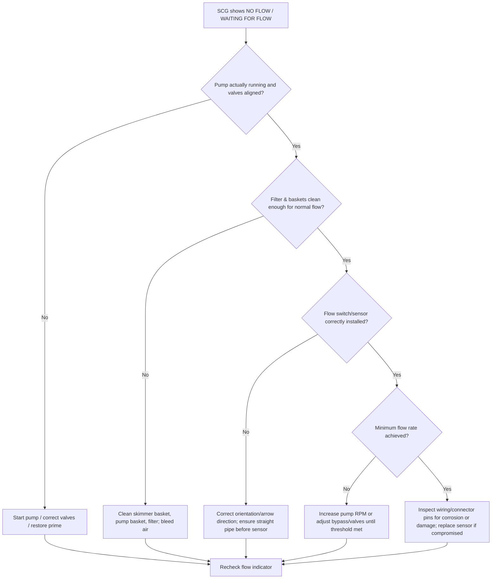

# Saltwater Pool Balancing and SCG Cell Care Workflow

## Executive summary

Saltwater pools are still chlorine pools—your salt chlorine generator (SCG) is simply an on-site chlorine dosing system driven by electrolysis, and water balance is the dominant control knob for both sanitation performance and cell life. citeturn13view6turn13view0turn24view0

Across major manufacturers, the recurring pattern is consistent: keep pH and calcium/alkalinity balance in range to prevent scale, maintain an appropriate stabilizer (cyanuric acid, CYA) level for outdoor UV protection, verify salinity with a reliable independent test, and only acid-clean the cell when scale is actually present. Over-cleaning and aggressive tools shorten cell life. citeturn13view10turn13view11turn13view4turn13view22turn13view0

A practical “high-reliability” operating posture is:

- **Run the pool based on measured FC and pH, not on SCG % output alone.** SCGs typically do **not** measure/maintain free chlorine for you; they can show status/salt/temperature/flow, but the owner/tech is responsible for water chemistry verification. citeturn13view6turn13view10turn13view12  
- **Manage scale risk with a saturation index (LSI/CSI)** and maintain water near balanced/slightly non-scaling. Hayward publishes a “Saturation Index (Si)” approach; Pentair publishes a Langelier Saturation Index (LSI) approach with an acceptable band. citeturn13view0turn13view8turn13view15  
- **Cell cleaning is a controlled maintenance event**: power off at breaker, relieve pressure, remove cell, hose-rinse, then (if needed) use a **diluted** acid wash—commonly **4:1 water-to-acid**—for a limited time (often **≤30 minutes**), followed by thorough rinsing. Do not pressure-wash or scrape with metal tools; do not submerge electronics/housings; do not use undiluted acid. citeturn13view11turn13view10turn13view4turn13view22turn13view28  
- **Expect lifecycle realities**: one major manufacturer documents **~10,000 hours** of cell operation as a design-life benchmark (roughly **~5 years** of average use) and provides an hours meter; many products are marketed around similar order-of-magnitude “cell life hours.” citeturn13view16turn22view0  

## Parameters, targets, and rationale for SCG pools

### What to monitor and why it matters

**pH** drives (a) swimmer comfort and (b) chlorine speciation. Hypochlorous acid (HOCl) is the more potent disinfecting form; pH and (critically) CYA influence how much HOCl is actually present. pH is therefore both a health/performance control and a scale/corrosion control. citeturn13view30turn14view2turn11view1  

**Total alkalinity (TA)** buffers pH change, but higher TA can increase scaling tendency and can contribute to persistent upward pH drift in many pools (especially when aeration/CO₂ outgassing is present). Industry codes and manufacturer tables commonly place TA in a broad acceptable band, with a narrower “typical” operational target. citeturn13view31turn13view15turn13view0  

**Free chlorine (FC) / combined chlorine (CC)**: FC is the active residual you need to maintain sanitation; CC (chloramines) is a signal of combined byproducts and/or oxidation deficit. The Model Aquatic Health Code (MAHC) triggers corrective action when CC exceeds 0.4 ppm, and manufacturers generally recommend “super chlorination/shocking” to clear combined chlorine. citeturn13view31turn13view16turn13view19turn13view31  

**Cyanuric acid (CYA, stabilizer)** reduces UV degradation of chlorine outdoors—but it also binds chlorine into chlorinated cyanurates, reducing instantaneous HOCl and slowing disinfection kinetics at the same “FC reading.” This is why FC targets are inseparable from CYA in a rigorous system. citeturn11view1turn14view2turn14view3  

**Salt (salinity, ppm or g/L)** is primarily an equipment-operating parameter: too low reduces efficiency and can shut the system down; too high can also shut down and (per some manuals) may damage equipment. Many manufacturers advise verifying with an independent salt test before adding large quantities. citeturn13view1turn13view12turn13view25turn13view2  

**Temperature** matters because chlorine demand rises with temperature, SCG output is temperature dependent, and most SCGs enforce a **low-temperature cutoff** to protect the cell and because chlorine production needs are typically lower in cold water. citeturn13view3turn13view18turn13view26turn1search3  

**ORP (oxidation–reduction potential)** is useful mainly in automatically-controlled commercial contexts. In stabilized (CYA-containing) pools, ORP often trends lower even when FC looks “fine,” because CYA reduces the active oxidizer potential experienced by the electrode. A field study found ORP decreases with increasing CYA (and increasing pH, and decreasing FC). Treat ORP as supplementary unless your system is designed/calibrated for your chemistry regime. citeturn14view0turn1search25turn14view2  

**Strongly recommended (even if not in your short list): calcium hardness (CH) and a saturation index (CSI/LSI).** Scale on SCG plates is commonly calcium carbonate; both Hayward and Pentair provide saturation-index guidance to reduce scaling/corrosion risk. citeturn13view0turn13view8turn13view11  

### Target ranges (manufacturer + code-informed) with rationale

The table below consolidates common manufacturer recommendations from major SCG manuals and code/industry guidance. Where values differ by brand, the table shows the **range of “typical acceptable”** and calls out notable manufacturer-specific variance.

| Parameter | Typical operating target for SCG pools | Common “do not cross” boundaries | Why this target exists (rigorous rationale) |
|---|---:|---:|---|
| pH | **7.2–7.8** (many manuals prefer **7.4–7.6**) | Avoid sustained **>7.8** or **<7.2** | Comfort + material protection; pH affects HOCl/OCl⁻ balance and scaling tendency; MAHC requires 7.0–7.8. citeturn13view31turn13view19turn13view15turn14view2 |
| TA (ppm as CaCO₃) | Often **80–120 ppm**; broader code band **60–180 ppm** | Persistent extremes can destabilize pH or drive scaling | Buffer for pH; interacts with CO₂ outgassing and saturation index. citeturn13view31turn13view15turn13view0 |
| FC (ppm) | Commonly **1–3 ppm** (some manuals) or **2–4 ppm** (some manuals) | MAHC minimum **2.0 ppm when CYA is used**; minimum **1.0 ppm without CYA** | FC is the disinfectant residual; practical target depends on CYA because CYA reduces active HOCl at a given FC. citeturn13view29turn13view19turn13view15turn14view2 |
| CC (ppm) | As low as possible; investigate when elevated | Take action when **>0.4 ppm** | CC/chloramines indicate combined byproducts and potential irritation; MAHC triggers corrective action above 0.4 ppm. citeturn13view31turn13view25turn13view16 |
| CYA (ppm) | Common manufacturer guidance: **30–50 ppm** (some systems); some manuals recommend **~50–75 ppm** | Avoid very high CYA (dilution often required to correct) | CYA reduces UV chlorine loss but binds chlorine and reduces active HOCl/ORP; FC targets must be evaluated alongside CYA. citeturn13view0turn13view15turn13view19turn11view1turn14view2 |
| Salt (ppm or g/L) | Brand-dependent: **~2700–3400 ppm** (some), **~3000–3500 ppm** (some), **~3600 ppm ideal** (some) | Low salt → low output/shutdown; high salt → shutdown; some manuals warn of damage at high salinity | Salt level primarily affects SCG efficiency and sensor logic, not sanitation by itself. Verify with independent testing before large additions. citeturn13view1turn13view12turn13view20turn13view25turn13view24 |
| Water temperature | Operate above low-temp cutoff; adjust output with seasons | Common cutoffs: **~50°F** or **~52°F** (varies by unit) | SCGs may stop producing chlorine below cutoff to extend cell life; chlorine demand rises with temperature. citeturn13view3turn13view18turn13view26turn1search3 |
| ORP (mV), if used | Often controlled in a **~650–750 mV** band (example jurisdiction) | Example maximum **900 mV** | ORP is highly chemistry-dependent; CYA and pH depress ORP; ORP should be interpreted with concurrent DPD testing. citeturn14view0turn13view33turn1search25 |
| Saturation index (LSI/CSI) | Keep near balanced: e.g., **-0.3 to +0.3** (Pentair) or **±0.2** (Hayward Si guidance) | Sustained positive index promotes scale; sustained negative index promotes corrosion | Scale on plates is commonly CaCO₃; saturation indices integrate pH, temperature, CH, TA, and TDS to estimate scaling/corrosion tendency. citeturn13view0turn13view8turn13view15 |

## Balancing and operations workflows

This workflow section is written to be model-agnostic (no pool volume assumptions) while aligning cadence and steps to manufacturer manuals and public-health code logic.

### Daily and weekly rhythm (owner-operator practical)

**Daily (or each day the pool is used):**

1. Test **FC** and **pH** with a reliable kit; confirm you are inside your target band. Manufacturer daily routines explicitly call for chlorine and pH checks, and MAHC’s operational logic ties daily testing to core safety parameters. citeturn13view21turn13view32turn13view6  
2. Look at SCG panel status for **flow, salt, temperature, and warning indicators**, and confirm the pump is actually running during scheduled chlorination windows. citeturn13view2turn13view7turn13view12  
3. If FC is trending low, adjust **either** pump runtime **or** SCG output percentage—then wait long enough (often ~24 hours) to evaluate the change, because the system responds over filtration cycles. citeturn13view3turn13view18turn13view9  

**Weekly:**

1. Test **TA** and (strongly recommended) **CH**, then evaluate whether your saturation index is drifting toward scaling. Both manufacturers and MAHC-style guidance treat TA/CH as routine balance parameters. citeturn13view31turn13view8turn13view0  
2. Inspect the waterline and returns for early signs of scale. Early correction via balance is cheaper than repeated acid cleaning. citeturn13view11turn13view4turn13view22  
3. If CC is elevated or odor/irritation appears, plan a breakpoint-style oxidation event (manufacturer “super chlorinate/shock” guidance) rather than just increasing SCG output indefinitely. citeturn13view2turn13view18turn13view24turn13view31  

### Monthly and seasonal rhythm (maintenance-grade)

**Monthly (or at least once per month in peak season):**

1. Test or verify **salt** with an independent method, and reconcile it with SCG readings. Some manuals and troubleshooting tables explicitly warn that strips can have large variance and advise meter/titration confirmation. citeturn13view1turn13view24turn13view12  
2. Test **CYA** (and retest ~24 hours after adding stabilizer if you add any). citeturn13view32turn13view29turn13view9  
3. Review the SCG cell inspection cadence (varies by manufacturer):  
   - Some systems prompt a visual inspection after ~500 hours and recommend checking every ~3 months. citeturn13view4turn13view3  
   - Some systems recommend removal/inspection every two months when scaling is a tendency, then spacing out if clean. citeturn13view22turn13view17turn13view21  

**Seasonal startup (spring / reopening):**

1. Restore circulation/filtration first; ensure water is clear and mechanically stable. (Chlorination assumes flow and filtration are functional.) citeturn13view2turn24view0  
2. Bring balance parameters into target **before** turning the SCG on; at least one manual explicitly warns against energizing before chemistry is corrected. citeturn13view4  
3. Add salt correctly: distribute, brush to prevent piles, and circulate long enough for full dissolution before trusting salt readings (often ~24 hours). citeturn13view1turn13view9  
4. Establish baseline sanitation using a manual oxidation step if needed, because an SCG can take hours to days to catch up from a “dirty start.” citeturn13view18turn13view6turn13view21  

**Seasonal wind-down / winter operation:**

1. Most SCGs reduce/stop production below low temperatures (commonly ~50–52°F), so maintain FC manually if needed when the unit is in cold-water cutoff. citeturn13view3turn13view18turn1search3  
2. Where freezing is a risk, winterize plumbing and protect/remove the cell per manual guidance; some manuals advise removing, cleaning, and storing the cell to prevent freeze damage. citeturn13view4turn13view17  

## SCG cell care, cleaning, replacement, and lifecycle

### Cell anatomy and failure-relevant concepts

An SCG cell is effectively a short electrolytic reactor: water passes between coated metal plates (“blades”), and the control system manages polarity/drive so the cell produces chlorine chemistry from dissolved salt. Manuals describe this as electrolysis producing hypochlorite/hypochlorous acid species. citeturn13view6turn13view1turn13view0  

The dominant “enemy” of SCG performance is typically **scale**, commonly calcium carbonate deposited on plates in hard or out-of-balance water. Multiple manuals define scale as a white crusty deposit and link it to hard water / scaling conditions. citeturn13view10turn13view17turn13view21turn13view4  

image_group{"layout":"carousel","aspect_ratio":"16:9","query":["salt chlorine generator cell plates scale buildup photo","Hayward TurboCell T-Cell salt cell calcium scale","Pentair IntelliChlor cell blades scale buildup","Jandy AquaPure salt cell tri-sensor flow temperature salinity"] ,"num_per_query":1}

### Inspection cadence (evidence from manuals)

A conservative schedule that matches multiple manufacturers is:

- **Inspect the cell visually every ~2–3 months** (or more often in hard water / scaling regions). Hayward explicitly recommends opening/visually inspecting on a ~3-month cadence and uses an “Inspect Cell” reminder after ~500 hours. citeturn13view4turn13view2  
- **If the cell tends to scale**, some manuals recommend **every two months** remove-and-inspect, then relax frequency if repeated inspections are clean. citeturn13view22turn13view17turn13view25  

### Step-by-step: inspection and cleaning workflow (manufacturer-aligned)

This workflow is intentionally strict about safety controls and “stop conditions,” because most cell damage comes from (a) unsafe disassembly under pressure, (b) aggressive tools, or (c) overly strong/long acid exposure.

**Tools and consumables (typical):** garden hose with spray nozzle, cell stand/cap (manufacturer kit if available), plastic bucket, measuring container, non-metallic/soft tool if absolutely needed, replacement O-rings as needed, and diluted muriatic acid solution when scale is confirmed. Manuals also reference dedicated acid cleaning stands/caps. citeturn13view11turn13view28turn13view22turn13view4  

**Procedure**

1. **Shut down safely.** Turn power off at the breaker and ensure the SCG is not energized without pump flow; some manuals warn of hazardous gas buildup if powered without circulation. citeturn24view0turn13view10turn13view27  
2. **Relieve system pressure.** Turn pump off and open the filter air relief until pressure is released; manufacturer warnings emphasize servicing under pressure can cause injury/system damage. citeturn13view22turn13view10turn13view27  
3. **Remove the cell** by loosening unions and extracting from plumbing. citeturn13view10turn13view4turn13view22  
4. **Visual inspection.** Look for scale (white crusty/flaky deposits) on plates and debris lodged between plates. citeturn13view4turn13view10turn13view22  
5. **First-line cleaning: hose flush.** Use a high-pressure jet from a garden hose to flush deposits. Some manuals state to try this first before acid cleaning. citeturn13view4turn13view10turn13view22  
6. **Avoid prohibited methods.** Do **not** use a pressure washer or mechanical tools (screwdrivers/brushes) on cell blades where manuals prohibit it; do **not** submerge the cell electronics/housing in acid where manuals warn it can permanently damage the cell and void warranty. citeturn13view10turn13view11turn13view21  
7. **Acid cleaning only if scale remains.** Prepare a **diluted** acid wash, commonly **4:1 water-to-muriatic-acid** (always *add acid to water*). Manufacturers repeatedly emphasize this mixing direction and PPE. citeturn13view4turn13view11turn13view22turn13view28  
8. **Apply acid solution correctly (inside the cell, controlled fill).** Use the cleaning stand/cap if provided so the plates are submerged without submerging electronics. citeturn13view11turn13view28turn13view4  
9. **Observe reaction and limit exposure time.** Bubbling/foaming indicates scale dissolution. Multiple manuals instruct stopping if no reaction occurs (suggesting cleaning may not be needed) and limiting soak time (commonly **≤30 minutes** / **≤1/2 hour**). citeturn13view22turn13view11turn13view17  
10. **Rinse thoroughly** (inside and out), re-inspect, and repeat only if needed. citeturn13view17turn13view22turn13view4  
11. **Reinstall** the cell, restore flow, and check for leaks at unions/O-rings. citeturn13view10turn13view22  
12. **Reset the inspection timer/indicator (if applicable).** Some systems flash an inspection light after a defined runtime and require a manual reset after inspection/cleaning. citeturn13view4turn13view2  

### Replacement workflow and lifecycle estimates

**When to replace (decision triggers):**

- If a system’s “inspect/clean cell” indicator remains after thorough cleaning, one manual states the cell may be worn and require replacement. citeturn13view4  
- Some systems provide a **runtime/hours meter** to estimate end-of-life; one manual specifies ~10,000 hours before replacement is needed and calls that roughly ~5 years of average use. citeturn13view16turn13view10  
- Manufacturer diagnostic codes/messages that persist after cleaning (e.g., “cell current too low,” or “cell dirty or needs replacement” conditions) are typical replacement prompts. citeturn13view25turn13view26turn13view12  

**Why cells die (typical failure modes):**

1. **Scale-driven electrical stress** (high resistance across plates → reduced current → low production, “dirty cell” codes). citeturn13view22turn13view25turn13view11  
2. **Coating wear from repeated acid cleaning or abrasion**, which reduces catalytic efficiency; manuals explicitly warn excessive acid washing damages blades. citeturn13view17turn13view22turn13view11  
3. **Sensor or cable issues** (corrosion, water intrusion, damaged connectors) presenting as flow/sensor errors or unstable salinity readings. citeturn13view24turn13view12turn16view1  
4. **Low-flow operation** (loss of prime, dirty filter, closed valves) causing “no flow” faults and no chlorine production. citeturn16view0turn13view2turn13view12  
5. **Off-spec salinity** (too low or too high) causing shutdown. citeturn13view2turn13view12turn13view25  
6. **Cold-water cutoff** leading to “no chlorine” complaints in shoulder seasons even when the unit is behaving normally. citeturn13view3turn13view12turn13view18turn1search3  

**Lifecycle and cost context (illustrative, US retail as of early 2026):** Replacement cells are typically the dominant maintenance cost item. Examples of listed prices: Hayward W3T-CELL-15 commonly listed near ~$999; Pentair IC40 replacement commonly listed ~$1,619 (with newer Plus40 cells listed higher at ~$1,819); Jandy PLC1400 listings commonly cluster around ~$1,079–$1,100. citeturn20search16turn20search5turn18view1turn18view2turn17search8  

## Troubleshooting and diagnostics with mermaid flowcharts

### A diagnostic mindset that avoids false positives

The most common “SCG not working” cases are not SCG failures—they are **flow**, **temperature**, **salinity**, **scale**, or **chemistry demand** problems. Manufacturer tables consistently route troubleshooting through these checks in that order. citeturn16view0turn13view12turn13view25turn13view2  

A second frequent pitfall is **over-trusting a single measurement**:

- ORP can look “low” in a stabilized pool because CYA depresses ORP even when FC readings look acceptable; field data supports this relationship. citeturn1search25turn14view0turn14view2  
- “Free chlorine” tests measure a pool-operator FC concept that includes cyanurate-bound chlorine under typical methods; the disinfecting fraction is a much smaller HOCl component, which is why FC must be interpreted with CYA. citeturn14view2turn11view1turn13view29  

### Flowchart: low chlorine / no chlorine output (cross-brand)

```mermaid
flowchart TD
  A[Measured FC low OR algae/CC symptoms] --> B{Pump running & circulation normal?}
  B -- No --> B1[Restore prime / open valves / clean baskets & filter] --> Z[Retest FC & SCG status after 1 cycle]
  B -- Yes --> C{SCG indicates FLOW OK?}
  C -- No --> C1[Diagnose flow switch/sensor: orientation, straight pipe, min flow, wiring] --> Z
  C -- Yes --> D{Water temp above SCG cutoff?}
  D -- No --> D1[Cold-water cutoff: maintain FC manually; resume SCG when water warms] --> Z
  D -- Yes --> E{Salinity in-range by independent test?}
  E -- No --> E1[Correct salt via controlled additions or dilution; avoid large unverified additions] --> Z
  E -- Yes --> F{Cell scaled or debris present?}
  F -- Yes --> F1[Remove & inspect; hose-clean; acid-clean only if needed and time-limited] --> Z
  F -- No --> G{Output % and pump runtime adequate for demand?}
  G -- No --> G1[Increase runtime or output; wait ~24h then retest FC] --> Z
  G -- Yes --> H{High demand (recent party, rain, organics, nitrates/phosphates)?}
  H -- Yes --> H1[Superchlorinate/shock per guidance; investigate demand drivers] --> Z
  H -- No --> I[Suspect cell end-of-life or control fault: check diagnostics, service codes, hours meter; replace if indicated] --> Z
```

This structure reflects common manufacturer troubleshooting logic: restore circulation, verify flow indication, confirm temperature is above cutoff, validate salinity independently, check for scale, then adjust runtime/output, and only then suspect component end-of-life. citeturn16view0turn13view12turn13view18turn13view4turn13view25  

### Error codes / indicators (quick mapping from primary manuals)

**Hayward-style panel indicators (LEDs):** The system uses “No Flow,” “Check Salt,” “High Salt,” and “Inspect Cell” indicators, including differentiated flashing/steady meanings. The manual describes “No Flow” stopping generation, “Check Salt” flashing for low efficiency and steady for shutdown, “High Salt” for shutdown, and “Inspect Cell” for reduced efficiency or scheduled inspection/cleaning. citeturn13view2turn13view4  

**Jandy-style service codes:** Service conditions produce a 3-digit code and may include an audible alarm; the manual provides a service code table such as 120/121 (low current), 125 (cell needs cleaning), 144/145 (salinity low/high), 172 (flow sensor service), 175 (air lock/very low salinity), and others (including temperature too high). citeturn13view20turn13view25turn13view26turn13view24  

**Pentair IntelliChlor Plus/LT-style messages:** The manual provides explicit two-line messages (e.g., “WAITING FOR FLOW,” “ADD SALT,” “SYS OFF LOW TEMP,” “CHK CELL / INSPECT,” “SYS OFF OVERLOAD,” etc.) with salinity thresholds and flow thresholds (e.g., <25 GPM), and it documents that low-temp cutoff is ~52°F. citeturn13view12turn13view7turn13view6  

### Flowchart: “No Flow” diagnostics (example of a manufacturer-structured path)



This pattern is consistent with manufacturer troubleshooting content that calls out minimum flow thresholds, orientation arrows, and “straight pipe” recommendations. citeturn16view0turn16view1turn13view12turn13view14  

## Safety, chemicals, PPE, and disposal

### Hazard controls (electrical, pressure, and chemical)

**Electrical lockout is non-negotiable.** Manufacturer instructions for servicing and acid cleaning direct you to disconnect power at the main breaker. citeturn13view27turn13view10turn13view24  

**Never energize the SCG without pump flow.** A major manufacturer warning states that chlorine gas buildup can occur with improper wiring that allows the SCG to be powered when the pump is off, and also warns against operating without proper flow/circulation due to hazardous gas buildup. citeturn24view0  

**Depressurize before opening unions.** Manuals warn that pump/filter systems operate under pressure and must be relieved (air relief valve open) to avoid injury and damage before removing components from plumbing. citeturn13view22turn13view10turn13view27  

### Acid handling (PPE, mixing, and time limits)

Manufacturer manuals and the acid-cleaning kit instructions are aligned on the critical points:

- **PPE**: rubber gloves and eye protection; work in a well-ventilated area. citeturn13view11turn13view28turn13view4turn13view22  
- **Mixing rule**: *ALWAYS add acid to water; NEVER add water to acid.* citeturn13view11turn13view28turn13view4turn13view22  
- **No undiluted acid** (explicitly warned). citeturn13view11turn13view28  
- **Exposure limit**: do not leave acid in the cell beyond the stated limit (commonly ≤30 minutes / ≤1/2 hour), because excessive acid washing damages blades/cell components. citeturn13view17turn13view22turn13view11  

### Storage and disposal guidance (general, non-localized)

Because local rules vary, rigor means anchoring disposal behavior to documented safety guidance:

- An SDS for muriatic acid indicates protective clothing (goggles/old clothing/rubber gloves) and provides handling/storage/disposal instructions such as storing upright and rinsing empty containers prior to discarding; it also describes neutralization actions for spills (e.g., soda ash/sodium carbonate) and the need to avoid releases to drains/waterways. citeturn14view1  
- For pool water disposal (including drained water used to reduce salt or winterize), MAHC language and similar public guidance emphasize disposal in accordance with applicable laws; in practice, this means consulting local wastewater/stormwater rules before discharging high-salt water. citeturn13view32turn13view1  

## Quick-reference checklists and comparison tables

### Cleaning methods comparison table (including concentrations, time limits, and cost model)

Costs below use “materials-only” examples; they exclude labor and assume you mix only what you need. A common retail benchmark is ~$16.98 for a 2-pack of 1-gallon pool muriatic acid (~$8.49/gal). citeturn18view3  

| Method | Typical concentration / ratio | Typical contact time | Pros | Cons / risks | “Back-of-envelope” materials cost |
|---|---|---|---|---|---|
| Visual inspection only | N/A | 2–5 min | Prevents unnecessary cleaning; catches early scale | Requires access and basic comfort with unions | ~$0 |
| High-pressure hose flush | Water only | 2–10 min | First-line, low risk; recommended before acid by several manuals | Won’t remove hard CaCO₃ scale like acid does | ~$0 |
| Diluted acid wash **inside cell** using stand/cap | Often **4:1 water:acid** | Until bubbling stops; commonly **≤30 min** / **≤1/2 hr** | Removes CaCO₃ scale effectively; manufacturer-supported | PPE required; overuse damages blades; spill risk | If you use ~1 quart acid per cleaning: ~$2.12 (based on ~$8.49/gal) |
| Submerging entire cell in acid | Not permitted in some manuals | N/A | None (avoid) | Can permanently damage cell / void warranty (explicit warning) | Not applicable |
| Pressure washer / metal scraping | Not permitted in some manuals | N/A | None (avoid) | Can damage blade coating; shortens life (explicit warning) | Not applicable |

The ratio/time limits and “do not pressure-wash / do not submerge / limit acid exposure” constraints are directly stated in major manufacturer documentation. citeturn13view10turn13view11turn13view22turn13view17turn13view4  

### Quick checklist for pool owners (owner-operator)

- Check FC and pH and look at SCG status indicators (flow/salt/temp/warnings). citeturn13view21turn13view7turn13view2  
- If you see persistent “low output” symptoms, diagnose in this order: **flow → temperature cutoff → salinity (verified) → cell scale → runtime/output settings → unusual demand**. citeturn16view0turn13view12turn13view18turn13view17  
- Keep CYA and FC aligned: CYA protects chlorine from UV but reduces active HOCl; don’t run CYA high while chasing minimum FC numbers. citeturn11view1turn14view2turn13view29  
- Prevent scale by controlling pH/TA/CH and staying near a balanced saturation index. citeturn13view0turn13view8turn13view15  
- Clean the cell **only when deposits are visible** and follow the dilution/time rules. citeturn13view4turn13view11turn13view22  

### Quick checklist for professional technicians (service-grade)

- Verify electrical interlocks: SCG must be powered only when pump is on (chlorine gas hazard if miswired). citeturn24view0  
- Confirm hydraulics: straight-pipe requirements/orientation for flow sensing, minimum flow thresholds, filter status, valves, and air leaks. citeturn16view0turn13view14turn13view12  
- Calibrate decisions with independent testing: salinity confirmation before major salt additions; recognize test-strip variance noted in manufacturer troubleshooting. citeturn13view24turn13view1turn13view12  
- Interpret codes/messages using model-specific tables (e.g., Jandy service codes; Pentair message table; Hayward LED meanings), then validate with physical inspection before replacing parts. citeturn13view2turn13view12turn13view25  
- If repeated scale forms, treat the cause (saturation index drivers) rather than repeatedly acid-washing the same cell; repeated acid exposures are explicitly warned against. citeturn13view17turn13view11turn13view0  

### Prioritized primary sources used in this report

Primary manufacturer manuals and support materials formed the workflow backbone: AquaRite chemistry/operation/maintenance (including salt range, inspection cadence, and acid-wash method), IntelliChlor (classic) and IntelliChlor Plus/LT manuals (including flow thresholds, temperature cutoff, chemistry targets, cleaning limitations, and runtime/life meter), and AquaPure/PureLink manual (including water-balance targets, cleaning procedure, and service code tables). citeturn13view0turn13view4turn13view15turn13view16turn13view12turn13view25turn13view22turn13view11turn24view0  

Industry standards and peer-reviewed/technical chemistry sources were used to justify rationale around pH/CYA/HOCl/ORP and operational testing frequency: MAHC code language for minimum FC with/without CYA, pH range, CC action threshold, and testing cadence; peer-reviewed and journal sources on chlorinated cyanurates and ORP behavior in real pools. citeturn13view29turn13view30turn13view31turn13view32turn11view1turn14view2turn1search25turn14view0