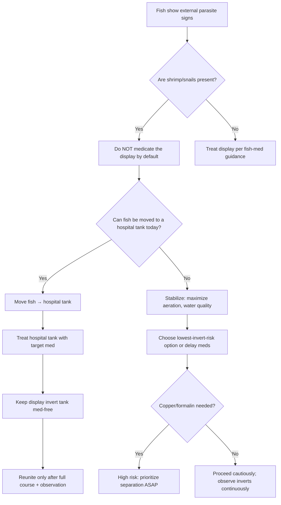
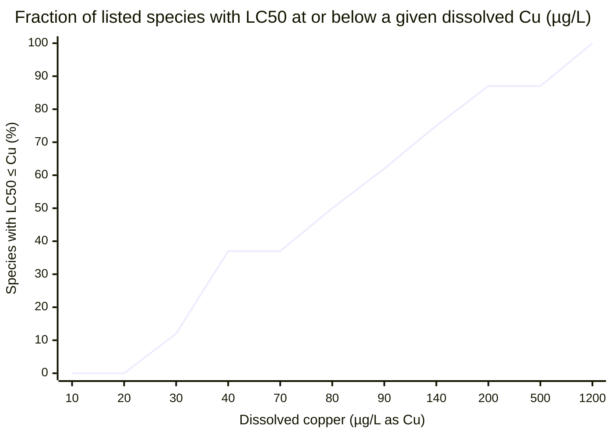

# Shrimp and Freshwater Aquarium Snail Safety Profiles for Copper Exposure and Medication Sensitivity

## Executive Summary

Copper is one of the highest-risk contaminants and medication actives for freshwater aquarium invertebrates because toxicity is strongly driven by the bioavailable fraction (often free cupric ion, Cu²⁺), and adverse effects appear at extremely low concentrations for some snails. citeturn37view0turn39view0turn26view0 Acute LC50 values (lethal concentrations killing 50% of animals over short exposures) for common freshwater snails and shrimp span roughly **tens of µg/L to low mg/L**, but “safe” chronic thresholds can be **orders of magnitude lower** (single-digit µg/L and, for some endpoints, ~1–2 µg/L). citeturn26view0turn38view4turn27view0turn46view2turn37view1turn37view2turn37view3

A major practical implication is that **fish therapeutic copper levels** (commonly **0.15–0.20 mg/L free Cu²⁺**, i.e., 150–200 µg/L) are **well within or above lethal ranges** for multiple snail/shrimp taxa and far above some chronic-effect thresholds. citeturn38view2turn26view0turn38view4turn27view0turn37view1turn46view2turn37view3 Copper risk is also highly chemistry-dependent (pH, dissolved organic carbon, major ions/hardness/alkalinity, suspended solids, temperature), so “one-number” rules are unreliable. citeturn37view0turn39view0turn7view0

Medication sensitivity is heterogeneous by active ingredient class. Copper-based treatments are the most consistently incompatible with shrimp/snails. citeturn38view2turn37view1turn26view0turn27view0turn46view2turn37view3 Formalin/malachite-green combinations used for ectoparasites (e.g., ich) can also be hazardous: a classic hatchery study reports invertebrate 96-h LC50 values for formalin (as formulated product) ranging from **~1.05 µL/L to 835 µL/L**, overlapping the “use-pattern” concentrations often applied in aquaculture. citeturn37view4turn32view1 For praziquantel and metronidazole, direct shrimp/snail dose–response data are comparatively sparse in open literature; the best-supported stance is cautious use in **separate treatment tanks** whenever invertebrates are present. citeturn31search13turn32view0

The most robust, low-risk protocol is operational rather than pharmacological: **move fish to a hospital/quarantine tank for treatment** and keep the invertebrate tank medication-free, then use aggressive mitigation (water changes + copper-specific media) if contamination occurs. citeturn38view0turn38view2turn37view4

## Species Scope

This report assumes **a typical mixed freshwater hobby context** (community tanks, planted tanks, shrimp/snail display tanks). You did not specify your exact species mix or water chemistry; where species-specific toxicology is unavailable, I flag uncertainty and use closely related taxa or commonly studied surrogates.

Common aquarium shrimp in scope (examples, not exhaustive):

- **Neocaridina davidi** (cherry shrimp and color morphs; closely related “Neocaridina” shrimp are widely used in ecotox, but copper LC50 data are not consistently available in open sources for *N. davidi* specifically).
- **Caridina cf. cantonensis / Caridina cantonensis complex** (bee, crystal, tiger lineages; again, direct copper LC50 data are uneven in open literature; “Caridina sp.” toxicology often serves as a proxy with caveats). citeturn37view1
- **Amano shrimp** (**Caridina multidentata**, formerly *C. japonica*): has a published copper LC50 and behavioral sublethal effects. citeturn37view2
- Other shrimp commonly kept (often lacking rigorous copper/med sensitivity datasets in open sources): **ghost shrimp** (*Palaemonetes* spp.), **bamboo shrimp** (*Atyopsis moluccensis*), **vampire shrimp** (*Atya gabonensis*).

Common freshwater aquarium snails in scope:

- **Nerite snails** (family Neritidae; often brackish-to-fresh tolerance; primary copper/med datasets are limited/variable in open literature, so risk is inferred from broader gastropod sensitivity patterns).
- **Mystery/Apple snails** (Ampullariidae; aquarium “mystery snail” is often *Pomacea diffusa*; robust toxicology exists for related **Pomacea paludosa** and other ampullariids and is used here as a proxy with clear caveats). citeturn37view3turn9view1turn7view0
- **Ramshorn snails** (Planorbidae; a well-characterized lab/hatchery-relevant example is **Planorbella**). citeturn27view0
- **Malaysian trumpet snails** (**Melanoides tuberculata**): has acute copper LC50 data and bioconcentration information. citeturn46view2turn46view1
- Additional common hobby snails with useful ecotox analogs: **Physa/Bladder snails** (e.g., **Physa acuta**) and **Lymnaea** spp. (often not “hobby snails,” but excellent sensitivity indicators for pulmonate snails). citeturn38view4turn26view0

image_group{"layout":"carousel","aspect_ratio":"1:1","query":["Neocaridina davidi cherry shrimp aquarium","Caridina multidentata amano shrimp aquarium","Caridina cantonensis crystal red shrimp aquarium","nerite snail aquarium","mystery snail Pomacea diffusa aquarium","ramshorn snail aquarium","Malaysian trumpet snail Melanoides tuberculata aquarium"],"num_per_query":1}

## Copper Toxicity in Shrimp and Snails

### What “copper concentration” means in toxicology vs aquariums

Copper in water does not exist as a single “thing.” In oxygenated freshwater, **free Cu(II) (Cu²⁺ weakly hydrated) is usually a small fraction of total copper**, while much is complexed with dissolved organic matter, carbonates, hydroxides, and other ligands, and additional copper can adsorb to suspended particles. citeturn37view0 Because uptake rates differ by copper species, changes in speciation can sharply change toxicity at the same total copper concentration. citeturn37view0

The **Biotic Ligand Model (BLM)** approach formalizes this by predicting toxicity from water chemistry inputs such as **temperature, pH, dissolved organic carbon (DOC), major cations (Ca, Mg, Na, K), major anions (sulfate, chloride), alkalinity, and sulfide**. citeturn39view0 The EPA copper criteria document also emphasizes strong effects of **temperature, DOC, suspended particles, pH, and inorganic ions/hardness and alkalinity** on copper toxicity. citeturn37view0

### Acute and chronic copper effect ranges by invertebrate taxon

Key point: **LC50 is not a “safe level.”** Chronic and sublethal endpoints (growth, reproduction, behavior, physiology) often shift to much lower concentrations than short-term lethality.

- **Freshwater pulmonate snails can show chronic growth effects near ~1–2 µg/L Cu** in controlled tests (EC20 for growth), far below many hobby test resolution and far below many fish-treatment copper targets. citeturn26view0
- **Shrimp LC50 values vary widely by species and chemistry**, but published values for “Caridina sp.” in moderately soft water (hardness ~50 ppm as reported) indicate acute LC50 on the order of **~0.07 mg/L as Cu** (after converting from copper sulfate pentahydrate dosing). citeturn37view1
- **Some snails (e.g., Melanoides tuberculata)** show 96-h LC50 values around **0.14 mg/L Cu** in soft water conditions in lab studies. citeturn46view2
- **Apple snail (Pomacea) life stage matters strongly**, with very young snails ~5× more sensitive than older juveniles/adults in reported tests. citeturn9view1turn7view0

### Copper bioavailability drivers that matter in real aquariums

The following drivers repeatedly appear in aquatic copper criteria/toxicology and are directly relevant to aquaria:

- **pH:** Copper toxicity can shift with pH because speciation changes; specific evidence in apple snail work reports LC50 increasing at higher pH, and additional hatchery work on formalin indicates pH dependence for that chemical as well. citeturn7view0turn37view4 The EPA copper criteria also lists pH as a major modifier. citeturn37view0  
- **Hardness and major ions (Ca²⁺, Mg²⁺):** Often protective in metal toxicology via competition at uptake sites, but not universally; apple snail results report hardness had no effect under tested conditions, illustrating species- and context-specificity. citeturn7view0 The EPA copper criteria document treats hardness/alkalinity/major ions as important but not sufficient alone (hence BLM). citeturn37view0turn39view0  
- **Dissolved organic carbon / humic substances:** DOC can complex copper and reduce bioavailable Cu²⁺; apple snail studies report DOC lowering copper toxicity, and shrimp work in mixed-metal acidic waters reports humic acid additions reducing dissolved metal concentrations and improving shrimp survival (mechanistically consistent with complexation/precipitation and physiological mediation). citeturn7view0turn43view0  
- **Suspended solids / adsorption:** Particulate binding can reduce immediate dissolved bioavailability but also create longer-term reservoir dynamics; the EPA criteria document explicitly includes suspended particles as a toxicity modifier. citeturn37view0  
- **Temperature:** The EPA criteria document lists temperature as a key physicochemical driver of copper toxicity. citeturn37view0  
- **Route of exposure (water vs diet/sediment):** For apple snails, diet/periphyton and sediment contact are emphasized as meaningful routes; bioaccumulation studies show accumulation in soft tissues, and chronic reproduction effects at low water concentrations imply meaningful internal exposure even at “low” dissolved Cu. citeturn9view1turn37view3

### Uptake, accumulation, and depuration kinetics

While shrimp-specific copper toxicokinetic constants are not consistently available in open sources for the exact aquarium dwarf species, multiple snail datasets show important kinetic patterns:

- In **Pomacea paludosa**, microcosm/lab synthesis reports: juvenile bioconcentration factor (BCF) ~**1493**, with **depuration half-life <2 weeks**, and the greatest bioaccumulation from dietary uptake in some experiments. citeturn9view1 Chronic exposure over months produced high accumulation across tissues and reduced clutch production/egg hatching at **8–16 µg/L Cu**, with poor survival at **24 µg/L** in a long-term exposure. citeturn37view3turn9view1  
- In **Melanoides tuberculata**, acute-metal work reports copper as the most toxic of several metals tested and shows strong bioconcentration, with a copper “concentration factor” reported near **988** in soft tissues under the study’s conditions after short exposure. citeturn46view2turn46view1  
- In **Lymnaea stagnalis**, mechanistic physiology work links copper exposure to large reductions in net Ca²⁺ uptake at higher exposures (important because Ca²⁺ uptake relates to shell deposition and growth), consistent with growth being an especially sensitive chronic endpoint. citeturn26view0

## Medication Sensitivity Across Common Aquarium Treatments

This section focuses on active ingredients commonly encountered in the hobby for parasites and infections. For several drug classes (notably praziquantel, metronidazole, many antibiotics), **species-specific shrimp/snail LC50/NOEC datasets are limited in open sources**, so the report uses a risk-ranking approach: (a) compare typical fish-treatment concentrations where well documented, (b) identify known toxicological red flags (solvents, oxidizers, reducing agents, oxygen depletion), and (c) default to quarantine/hospital-tank protocols when invertebrates are present.

### Copper-based medications

Copper medications (ionic copper, copper sulfate, chelated copper products) are high-risk for invertebrates for two reasons:

1) fish therapeutic copper targets overlap lethal ranges of many invertebrates, and  
2) copper speciation/bioavailability is chemistry-sensitive and can change during treatment, especially with interacting products.

A marine/aquaculture extension source describes parasite treatment dosing as **0.15–0.20 mg/L free Cu²⁺**, and also notes that at **0.3 mg/L Cu²⁺** copper sulfate can inhibit nitrifying bacteria activity (ammonia and nitrite oxidation), increasing system instability during treatment. citeturn38view2 Even ignoring chronic endpoints, multiple freshwater invertebrate LC50 values and chronic effect concentrations are below or within those fish-treatment targets. citeturn26view0turn38view4turn27view0turn46view2turn37view1turn37view3

**Sublethal shrimp endpoints**: a behavioral shrimp study reports that sublethal copper pre-exposure impaired food-odor detection in *Caridina multidentata*, showing that non-lethal concentrations can still affect survival-relevant behavior. citeturn37view2

### Formalin and malachite green (often combined for ich/ectoparasites)

A widely used ich medication label provides a concrete reference point: dosing produces **0.05 mg/L malachite green + 15 mg/L formalin**. citeturn32view0 The same label explicitly warns **not to use with other drugs/treatments (including salt)** and recommends close observation; it states invertebrates may be used but should be removed if adverse reactions occur. citeturn32view0

However, formalin sensitivity among aquatic invertebrates can be extreme. A classic hatchery investigation reports that invertebrate 96-h LC50 values for formalin ranged from **~1.05 µL/L (seed shrimp) to 835 µL/L (backswimmers)**, and explicitly notes that formalin is frequently used at **15–25 µL/L** for parasite control in ponds—overlapping the lower end of invertebrate lethal ranges. citeturn37view4turn32view1 The same report also concludes that **activated carbon filtration did not significantly reduce toxicity** of formalin solutions and formalin toxicity persisted under tested conditions, so “carbon fixes formalin” is not a reliable emergency assumption. citeturn32view1

For malachite green alone, regulatory toxicology synthesis indicates wide variation by organism and conditions; a toxicology report summarizing aquaculture studies notes that (a) toxicity tends to increase with longer exposure and may increase with temperature for some species, and (b) at least one invertebrate case (lobster larvae) showed reduced survival at exposures >8 ppm and molting delay at 20 ppm under repeated short treatments. citeturn33view0 This suggests malachite green may not be universally lethal to invertebrates at typical ich doses, but combination products—and especially their formalin component—can create a narrow safety margin in mixed tanks. citeturn32view0turn32view1turn33view0

### Praziquantel, metronidazole, antibiotics, and other antiparasitics

For praziquantel, open aquatic toxicity data often show relatively low acute toxicity to standard lab invertebrates (e.g., a Daphnia mobility inhibition EC50 in the **tens of mg/L** range), consistent with a generally wider margin of safety than copper/formalin for many systems—yet this does not guarantee safety for all snails/shrimp species, life stages, or formulation solvents. citeturn31search13

For metronidazole and common aquarium antibiotics, robust shrimp/snail LC50/NOEC datasets are not consistently available in open sources for the exact hobby species named; the highest-confidence risk is indirect: **biofilter disruption**, oxygen dynamics, and formulation ingredients. This is one reason why established product labels and veterinary/aquaculture guidance repeatedly emphasize careful observation and the avoidance of drug “cocktails” in mixed systems. citeturn32view0turn38view2

## Interactions Between Copper, Medications, and Water Chemistry

### Copper + reducing agents (formalin/aldehydes, some dechlorinators) can spike toxicity

A crucial interaction documented by entity["company","Seachem","aquarium products company, us"] is: **do not mix formalin with certain copper medications**, because formalin can reduce Cu²⁺ to **Cu⁺ (cuprous copper)**, which is described as highly toxic even at small doses. citeturn38view1turn35search10 This is not merely a “don’t mix meds” rule of thumb; it is a specific chemical interaction that can change copper speciation and acute hazard.

Related manufacturer guidance also warns that adding other reducing agents (e.g., some dechlorinators/ammonia reducers) during certain copper treatments can cause major toxicity shifts via reduction of Cu²⁺ to Cu⁺. citeturn35search18turn38view1

### Copper effects are water-chemistry dependent; predictive models use multiple inputs

The entity["organization","U.S. Environmental Protection Agency","federal agency, us"] copper criteria and BLM framework emphasize that copper toxicity varies substantially with water chemistry, and that toxicity-relevant inputs include **pH, DOC, major ions, alkalinity, temperature, and sulfide**, among others. citeturn37view0turn39view0 Apple snail data specifically support an important practical point: even within one amphullariid species, copper LC50 varies with age; it can increase with pH and decrease with higher DOC; and hardness effects may not behave as expected in all taxa. citeturn7view0turn9view1

### Formalin and combination products also depend on system conditions and cannot be “carbon-filtered away” reliably

The entity["organization","U.S. Geological Survey","science agency, us"] hatchery investigation highlights that formalin toxicity is not necessarily mitigated by methods hobbyists often reach for first (activated carbon, aeration, oxidation/reduction attempts), and that formalin solutions can remain toxic after aging. citeturn32view1 This matters because many “ich cures” include formalin, and emergency response needs to be reality-based rather than folklore-based. citeturn32view0turn32view1

## Safe Treatment Protocols and Alternatives for Fish Parasites in Invertebrate Tanks

### Core principle

If shrimp/snails matter, the safest parasite treatment strategy is almost always **separation**: treat fish in a hospital tank and keep the invertebrate system medication-free. Copper criteria work, snail chronic-effect studies, and hatchery formalin toxicity ranges collectively show that “mild” fish treatments can still be severe invertebrate exposures—especially over multiple days. citeturn26view0turn37view1turn37view3turn32view1turn38view2

### Practical protocol options

**Hospital-tank approach (preferred):**

1. Move fish to a bare-bottom hospital tank with established biofiltration as feasible (or frequent water changes with close ammonia monitoring).
2. Treat fish with the needed medication (copper, formalin/malachite green, praziquantel, etc.) according to authoritative dosing guidance and with appropriate test methods for that formulation.
3. Leave shrimp/snails in the display tank and manage the display with non-pharmacologic controls (excellent water quality, stable temperature) while the parasite life cycle clears in the absence of fish when applicable.
4. Only reunite after completing the fish treatment course and ensuring the fish are parasite-free.

This aligns with recurring guidance that invertebrates should be removed prior to copper treatment and that copper levels must be actively monitored during treatment. citeturn38view2turn39view0

**If a tank with invertebrates has already been exposed to copper (spill, medication mistake, contaminated water):**

- Immediate steps:
  - Stop dosing and remove any copper source.
  - Perform large water changes.
  - Deploy copper-specific removal media. citeturn38view0
- Copper removal media and monitoring:
  - entity["company","Seachem","aquarium products company, us"] describes a copper-specific chelating resin that removes chelated and non-chelated copper and is intended for emergency copper removal; it also advises continued use to address substrate leaching even after tests read “no copper.” citeturn38view0  
  - An aquaculture extension source describes activated carbon as effective for removing **dissolved free copper** and warns that if chelated copper was used, **water changes may be necessary**; it also stresses monitoring for copper release from bound substrates over subsequent weeks. citeturn38view2

**If formalin-containing products were used in a mixed tank (not recommended):**

- Prioritize dilution (water changes) and removal of animals showing stress.  
- Do not assume activated carbon will detoxify the formalin risk: hatchery data indicate carbon filtration did not significantly reduce toxicity in their experiments. citeturn32view1

### Mermaid decision flowchart for hobbyists



## Evidence Tables and Visuals

### Copper sensitivity comparison table (lethal and sublethal where available)

Values are reported as given in sources; when a study dosed copper sulfate pentahydrate (CuSO₄·5H₂O), the table converts to approximate “as Cu” equivalents for cross-comparison.

| Taxon | Species (representative) | Endpoint | Concentration | Notes on conditions / interpretation |
|---|---|---:|---:|---|
| Shrimp | *Caridina* sp. | 48-h LC50 | 0.281 mg/L CuSO₄·5H₂O ≈ **0.0716 mg/L Cu** | Test water reported pH ~7.3, hardness ~50 ppm; chronic 6–8 day exposures at 50–100 µg/L CuSO₄·5H₂O caused severe gill histopathology. citeturn37view1 |
| Shrimp | *Caridina multidentata* (Amano) | LC50 (duration as in study abstract) | **1.15 mg/L Cu** | Sublethal pre-exposure impaired food-odor detection (behavioral endpoint). citeturn37view2 |
| Snail | *Physa acuta* (bladder snail analog) | 96-h LC50 | **23.8 µg/L Cu** | Copper suppressed movement at low concentrations and triggered escape responses at higher concentrations. citeturn38view4 |
| Snail | *Lymnaea stagnalis* (pulmonate snail analog) | 96-h LC50 | **31 µg/L Cu** | 30-day juvenile chronic exposure: growth EC20 **1.8 µg/L Cu**; physiological disruption at higher exposures. citeturn26view0 |
| Snail | *Planorbella pilsbryi* (ramshorn analog) | Adult LC50 | **89 µg/L Cu** | Adults exposed sublethally (~9–39 µg/L measured) produced offspring with altered copper sensitivity; juvenile LC50s ranged roughly ~19–67 µg/L across cohorts. citeturn27view0 |
| Snail | *Melanoides tuberculata* (Malaysian trumpet snail) | 96-h LC50 | **0.14 mg/L Cu (140 µg/L)** | Soft water (hardness reported ~18.7 mg/L CaCO₃); study reports strong copper bioconcentration and copper as most toxic metal tested. citeturn46view2turn46view1 |
| Snail | *Pomacea paludosa* (apple/mystery snail proxy) | 9-month chronic | **8–16 µg/L Cu** caused reduced clutch production; **16 µg/L** reduced egg hatching | **24 µg/L** produced low survival (treatment terminated). citeturn37view3 |
| Snail | *Pomacea paludosa* | 96-h LC50 (age-dependent) | **34 µg/L** (2-day-old) to **182 µg/L** (120-day-old) | Review synthesis also reports juvenile BCF ~1493 and depuration half-life <2 weeks. citeturn9view1turn7view0 |

### Medication risk matrix for shrimp/snail tanks (evidence-weighted)

| Medication class / active | Shrimp risk | Snail risk | Evidence basis (high-level) |
|---|---|---|---|
| Copper-based parasite meds | **Avoid** | **Avoid** | Fish therapeutic copper targets (0.15–0.20 mg/L free Cu²⁺) overlap/ exceed multiple invertebrate LC50s and chronic-effect ranges. citeturn38view2turn26view0turn38view4turn27view0turn46view2turn37view1turn37view3 |
| Formalin-containing meds | **High caution / avoid in-display** | **High caution / avoid in-display** | Formalin invertebrate LC50 range can overlap use-pattern exposures; carbon may not detoxify. citeturn37view4turn32view1turn32view0 |
| Malachite green (alone or w/ formalin) | **Caution** | **Caution** | Species sensitivity varies; some invertebrates tolerate very high concentrations, while others (e.g., lobster larvae) show decreased survival at repeated exposures >8 ppm; combination with formalin raises overall risk. citeturn33view0turn32view0 |
| Praziquantel | **Likely lower risk but data gaps** | **Likely lower risk but data gaps** | Standard aquatic invertebrate endpoints (e.g., Daphnia EC50) are in the tens-of-mg/L range; shrimp/snail-specific datasets remain limited in open sources. citeturn31search13 |
| “Do not mix meds” rule | Applies | Applies | Product labeling explicitly warns against combining certain meds; copper + formalin can be especially hazardous via speciation change. citeturn32view0turn38view1turn35search10 |

### Copper “dose–response” visualization as a cross-species lethality curve

This chart is an empirical **cross-species cumulative lethality view** based on the LC50 values listed in the copper table (mixed durations/conditions; interpret as a comparative visualization, not a predictive guarantee).



Interpretation: within this limited set of commonly referenced freshwater shrimp/snail analogs, a sustained dissolved copper concentration near **~80–100 µg/L** is already at or above the LC50 for roughly half the included taxa, and concentrations near **~200 µg/L** approach LC50 coverage for most of them. citeturn37view1turn38view4turn26view0turn27view0turn46view2turn9view1turn37view2 This visualization understates chronic risk because multiple chronic endpoints occur far below LC50 (e.g., snail growth/reproduction in the 1–16 µg/L range). citeturn26view0turn37view3

## Key Sources and URLs

```text
EPA Aquatic Life Ambient Freshwater Quality Criteria – Copper (2007 Revision)
https://www.epa.gov/sites/default/files/2019-02/documents/al-freshwater-copper-2007-revision.pdf

EPA Copper Biotic Ligand Model (BLM) overview + required inputs
https://www.epa.gov/wqs-tech/copper-biotic-ligand-model

Ghate & Mulherkar (1979) copper sulfate toxicity to Macrobrachium and Caridina (PDF)
https://www.researchgate.net/profile/Hemant-Ghate/publication/255728734_Histological_changes_in_the_gills_of_two_freshwater_prawn_species_exposed_to_copper_sulphate/links/57610f6708ae2b8d20eb6dd6/Histological-changes-in-the-gills-of-two-freshwater-prawn-species-exposed-to-copper-sulphate.pdf

Ravaux et al. (2025) Caridina multidentata copper LC50 + sublethal behavioral impairment (abstract)
https://academic.oup.com/jcb/article-abstract/45/2/ruaf020/8127312

Brix et al. (2011) Lymnaea stagnalis acute LC50 and chronic EC20 for growth (PubMed)
https://pubmed.ncbi.nlm.nih.gov/21723419/

Parental exposure of Planorbella pilsbryi to copper causing transgenerational effects (PMC full text)
https://pmc.ncbi.nlm.nih.gov/articles/PMC11816282/

Toxicity of metals (including copper) to Melanoides tuberculata (PMC full text)
https://pmc.ncbi.nlm.nih.gov/articles/PMC3366189/

Rogevich et al. (2008) chronic copper exposure impacts Pomacea paludosa reproduction (ResearchGate full text)
https://www.researchgate.net/publication/23310599_Effects_of_Sublethal_Chronic_Copper_Exposure_on_the_Growth_and_Reproductive_Success_of_the_Florida_Apple_Snail_Pomacea_paludosa

Hoang et al. (2011) microcosm synthesis with Pomacea paludosa LC50 by age + BCF and depuration notes (ScienceDirect abstract)
https://www.sciencedirect.com/science/article/abs/pii/S0147651311000169

Ich-X label (dose = 0.05 mg/L malachite green + 15 mg/L formalin) (PDF)
https://www.hikariusa.com/img/pds/PDS_IchX.pdf

USGS “Investigations in Fish Control 73” formalin toxicity to nontarget organisms + carbon not effective (PDF)
https://pubs.usgs.gov/ifc/073/report.pdf

Seachem CupriSorb (copper-specific chelating resin; removes chelated copper; emergency copper removal)
https://www.seachem.com/cuprisorb.php

Seachem knowledge base: formalin + Cupramine interaction (Cu2+ → Cu+)
https://seachem.zendesk.com/hc/en-us/articles/115000980054-FAQ-Is-there-is-any-problem-with-using-Formalin-with-Seachem-Cupramine

UF/IFAS extension: copper dosing targets and removal guidance
https://ask.ifas.ufl.edu/publication/FA165

EPA Lead and Copper Rule overview (human drinking-water action level for copper = 1.3 mg/L)
https://www.epa.gov/dwreginfo/lead-and-copper-rule

WHO table: copper guideline value = 2 mg/L and drinking-water occurrence range
https://www.ncbi.nlm.nih.gov/books/NBK579460/table/ch12.tab38/?report=objectonly
```