# Spa Bromine and Chlorine Management Workflow

## Executive summary

Public spa (hot tub) water management is a high-risk, high-variability control problem: small water volume, high temperature, aeration, and heavy bather load can drive rapid sanitizer decay and create conditions conducive to biofilm growth and pathogen amplification (notably **Legionella** and **Pseudomonas**) if residuals are not continuously maintained. citeturn16view2turn16view3turn16view4

A defensible operational program in the entity["country","United States","country"] context typically rests on four pillars: (1) **follow the label** for EPA-registered sanitizers, (2) meet or exceed the **CDC Model Aquatic Health Code** operational minimums and testing frequency, (3) maintain **tight control limits** for sanitizer residual and pH while managing alkalinity and hardness to prevent corrosion/scale, and (4) implement a practiced **incident response** playbook (fecal/vomit events, suspected Legionella, equipment failures). citeturn29view0turn29view2turn29view5turn29view8turn29view9

For **spas open to bathers**, a widely used baseline set of control limits (largely aligned with the 2024 MAHC and CDC public hot tub guidance) is:  
- **Free chlorine (DPD-FC)**: minimum **3.0 ppm**; **close/evacuate** if above **10 ppm** while bathers are present citeturn29view0turn29view6turn16view1  
- **Total bromine (TB)**: minimum **4.0 ppm**; maximum **8.0 ppm** while open citeturn29view0turn16view1  
- **pH**: operate **7.0–7.8**; **close** for imminent hazard if **<6.5** or **>8.0** citeturn29view7turn29view6turn16view1  
- **Combined chlorine (chloramines)**: take corrective action if **>0.4 ppm** citeturn29view1  
- **Total alkalinity**: maintain **60–180 ppm** citeturn29view1  
- **Cyanuric acid (CYA)**: for public spas under MAHC, **do not use** for new construction/major alterations (phase-out required after adoption) citeturn29view0  

Testing frequency should be operationally driven but code-informed: the MAHC minimum is **before opening** and then **every 2 hours** (manual feed) or **every 4 hours** (automated feed) for disinfectant and pH; CDC emphasizes at least **twice daily**, and as often as **hourly in heavy use**. citeturn29view2turn16view0turn16view2

DBP risk management should treat **combined chlorine** (and air quality complaints in indoor settings) as actionable leading indicators; peer-reviewed evidence shows indoor pool/spa environments can accumulate irritant chloramines and multiple classes of disinfection by-products (THMs, HAAs, nitrogenous DBPs, nitrosamines), influenced strongly by bather-derived organic/nitrogen load, temperature, and ventilation. citeturn1search1turn24search2turn24search30turn24search9

## Scope, assumptions, and governing guidance

This report assumes: jurisdiction unspecified; spa size/type unspecified; recirculating public spa operation with typical temperatures up to 104°F; sanitizer system is either chlorine-based (hypochlorite) or bromine-based (bromide reserve with oxidizer and/or bromine tablets). Where jurisdictional requirements vary, this report defaults to MAHC/CDC as the most broadly used U.S. “model” baseline and flags examples of stricter local code provisions. citeturn29view2turn16view2

Regulatory and “primary/official” anchors used here include:  
- entity["organization","Centers for Disease Control and Prevention","us public health agency"] (CDC) Healthy Swimming guidance for public hot tubs/spas and Legionella control citeturn16view0turn16view1turn16view2turn16view3  
- CDC **Model Aquatic Health Code (MAHC), 2024 (5th edition)** for operational residuals, testing frequency, sampling, chemical handling, and incident response citeturn29view0turn29view1turn29view2turn29view5turn29view6turn29view7  
- entity["organization","U.S. Environmental Protection Agency","us environmental regulator"] (EPA) pesticide framework (FIFRA) and disinfectant safety/regulatory background, including hypochlorite disinfectants used in pools/spas citeturn29view0turn25view2turn29view11  
- entity["organization","Occupational Safety and Health Administration","us workplace safety regulator"] (OSHA) exposure limits and sampling methods relevant to chlorine gas exposures and chemical handling environments citeturn31search0turn31search2turn31search5  
- Local code example: entity["place","Montgomery County","Maryland, US"] public spa chemistry limits (illustrative of AHJ variation) citeturn21search16  

A core compliance principle in the U.S.: pool/spa sanitizers that claim to kill/control microorganisms are regulated as antimicrobial pesticides and require EPA registration; labels are the enforceable directions for use, and operators should confirm the EPA registration and follow label constraints. citeturn29view10turn29view0

## Sanitizer chemistry and primary sources

### Functional chemical definitions that matter operationally

**Free chlorine** (DPD-FC / FAC) is primarily hypochlorous acid (HOCl) plus hypochlorite (OCl⁻); disinfecting power depends strongly on pH because HOCl is the more effective biocide and dominates at lower pH. citeturn6view0turn20search0

**Bromine residual in spas is typically managed as “total bromine (TB)”** because common field kits cannot distinguish free bromine species (Br₂/HOBr/OBr⁻) from bromamines; therefore the operational “bromine” reading is TB. citeturn18view0turn29view2

Bromine’s active form (HOBr) dissociates at higher pH than HOCl (pKₐ ~8.7 vs ~7.6), so bromine systems are generally **less sensitive to upward pH drift** (common in aerated hot tubs) than chlorine systems. citeturn20search0turn16view2

### Primary sanitizer sources used in spas

**Chlorine-based primary disinfectants** commonly used in pools/spas include sodium hypochlorite solutions (“liquid chlorine/bleach”) and calcium hypochlorite solids; EPA explicitly recognizes these hypochlorite salts as disinfectants used in swimming pools and other water systems, and documents their acute corrosivity hazards. citeturn25view2turn29view11

**Bromine-based primary disinfectants** in public aquatic venues/spas (per MAHC) may be delivered via organic bromine compounds such as **DBDMH** or **BCDMH** (common “bromine tabs”). citeturn29view0

A second, common spa practice (especially in residential and some commercial contexts) is establishing a **bromide reserve** using sodium bromide and then maintaining an active bromine residual using bromine tablets and/or periodic oxidation; manufacturer guidance for sodium bromide products frequently states it is **not a disinfectant** and is used to establish the bromide reserve. citeturn32view0

Because bromine test reporting and chlorine test reporting use different equivalent weights, many testing systems use a conversion factor: a chlorine-equivalent reading multiplied by **2.25** approximates bromine as Br₂ (molecular weight ratio basis). citeturn19search3turn19search8turn19search23

### CYA in spas

For public spas under the MAHC framework, **cyanuric acid (CYA) / stabilized chlorine products are not to be used** in spas for new construction/substantial alteration and are scheduled for phase-out after adoption. This reflects both operational control concerns and incident-response practicality. citeturn29view0turn29view4

CYA also complicates measurement/control because it depresses oxidation-reduction potential (ORP) and changes the relationship between free chlorine concentration and effective disinfecting strength. citeturn17search3turn29view6

## Scientific evidence on efficacy, DBPs, and health risks

Hot tubs/spas are repeatedly implicated in outbreaks and exposures because they combine (i) **Legionella-favorable temperatures**, (ii) aerosol generation by jets, and (iii) the possibility of inadequate disinfectant residual and biofilm/sediment. citeturn16view3turn16view4turn16view2

CDC explicitly notes that low water volume plus high temperature and heavy bather loads can rapidly produce **low disinfectant levels**, enabling growth/spread of germs such as *Pseudomonas* (hot tub rash) and *Legionella* (Legionnaires’ disease). citeturn16view2turn16view0

For fecal contamination control, the public health “hard case” is **Cryptosporidium**, which is highly chlorine tolerant; CDC fecal-incident materials use a CT inactivation value of **15,300** (free chlorine ppm × minutes, under specified conditions) as a benchmark for inactivation after diarrheal incidents, and the MAHC embeds equivalent CT-based guidance with operational tables. citeturn29view8turn29view4

For small-volume venues (including many hot tubs/spas), CDC notes it may be more efficient to **drain as much water as possible, scrub/clean accessible surfaces and plumbing contact surfaces, replace/clean filter media where appropriate, and refill** rather than execute long hyperchlorination periods. citeturn29view9

Disinfection by-products (DBPs) in pool/spa environments are well documented in peer-reviewed reviews and studies, including trihalomethanes (THMs), haloacetic acids (HAAs), chloramines/bromamines, and nitrogenous DBPs (some with higher toxic potency). Formation is driven by disinfectant chemistry interacting with organic/nitrogen precursors (often bather-derived) and operational factors such as temperature, recirculation, and ventilation. citeturn1search1turn24search23turn24search11

Bromine-disinfected pools/spas can shift DBP profiles toward brominated THMs (e.g., bromoform dominance has been reported in bromine-agent facilities), and swimmer intake can occur via inhalation and dermal absorption as well as incidental ingestion. citeturn24search9turn24search3

Health evidence relevant to operators is strongest for (a) **acute irritation** (eyes/upper airway) linked to chloramine species in indoor aquatic air, and (b) longer-term epidemiology linking DBP exposure (particularly THMs) to bladder cancer risk in drinking-water contexts with plausible inhalation/dermal routes also considered. CDC notes trichloramine as a strong mucous membrane irritant with associations to eye/respiratory irritation and asthma, and controlled exposure studies show measurable lung function changes after exposure to commonly occurring pool-air trichloramine levels. citeturn24search24turn24search2turn24search3

## Operational workflow for spa operators

### Target ranges and action thresholds

The table below consolidates a **practical control chart** for public spas, prioritizing MAHC/CDC baseline limits and adding equipment-protection targets (alkalinity/hardness) from heater/manufacturer guidance.

| Parameter | Target while open | Action threshold | Close/evacuate threshold | Primary basis |
|---|---:|---:|---:|---|
| Free chlorine (DPD-FC) | 3–6 ppm (operate near low end if stable) | <3.0 ppm → immediate correction | >10 ppm with bathers present | MAHC minimum 3.0; “imminent hazard” if >10 with bathers citeturn29view0turn29view6 |
| Total bromine (TB) | 4–6 ppm (many operators run 4–6 for comfort) | <4.0 ppm → immediate correction | >8.0 ppm while open | MAHC min 4.0 / max 8.0 citeturn29view0turn29view6 |
| pH | 7.2–7.6 “tight band” | drift outside 7.0–7.8 → correct promptly | <6.5 or >8.0 | MAHC range 7.0–7.8; imminent hazard triggers at 6.5/8.0 citeturn29view7turn29view6 |
| Combined chlorine (CC) | As low as possible | >0.4 ppm → action plan (oxidation/water exchange/hygiene) | (jurisdiction dependent) | MAHC action requirement at >0.4 citeturn29view1 |
| Total alkalinity (TA) | 60–180 ppm (often operate 80–120 for stability) | rapid pH bounce → adjust TA | — | MAHC TA range citeturn29view1 |
| Calcium hardness (CH) | 150–250 ppm typical for spas (surface dependent) | scaling/corrosion trend → adjust | (jurisdiction dependent) | MAHC upper bound; heater/OEM target ranges citeturn29view1turn22view0turn22view3 |
| CYA | 0 ppm preferred; if present, keep as low as allowed | CYA:FC ratio >45:1 is imminent hazard trigger | CYA prohibited for spas under MAHC phase-out | MAHC spa restriction; imminent hazard ratio trigger citeturn29view0turn29view6 |
| Temperature | 100–104°F typical | drifting above setpoint → correct | >104°F | MAHC max 104°F; CDC guidance citeturn29view1turn16view1 |

### Sampling points and measurement cadence

**Where to sample (bulk water):** MAHC specifies bulk sampling at least **18 inches below the surface**, ideally where depth is 3–4 feet when available, and between water inlets; rotate sampling locations. In-line sample ports can be used routinely, but bulk water comparison sampling is required at least daily when relying on ports. citeturn29view1turn12view3

**How often to test (minimum cadence):**  
- Before opening: disinfectant residual (DPD-FC or TB) and pH. citeturn29view2turn16view2  
- While open:  
  - Manual feed without automated controller: test residual + pH **every 2 hours**. citeturn29view2  
  - Automated feed systems: test residual + pH **every 4 hours**. citeturn29view2  
- Weekly: TA. Monthly: CH (and CYA if used), saturation index; quarterly: TDS. citeturn29view2  
CDC’s Legionella hot tub toolkit recommends at least twice daily testing (and as often as hourly when in heavy use), which many operators treat as an operational best-practice “floor” in peak periods even if local code is less explicit. citeturn16view0turn16view2

### Stepwise workflow

```mermaid
flowchart TD
  A[Start of shift / pre-opening] --> B[Verify recirculation, filtration, feeder status, covers removed, water clarity]
  B --> C[Collect sample: in-line port if present + bulk sample]
  C --> D[Test: sanitizer residual + pH (and CC if chlorine)]
  D --> E{Within operating limits?}
  E -- Yes --> F[Open spa]
  E -- No --> G[Corrective action loop]
  G --> H[Adjust pH first if far out of range]
  H --> I[Raise sanitizer to target; verify feeder/output]
  I --> J[Retest after mixing/turnover]
  J --> E

  F --> K[While open: test & log on required cadence (2h manual / 4h automated; more often when heavy use)]
  K --> L{Any imminent hazard? (low residual, high residual, pH <6.5 or >8.0, equipment failure)}
  L -- No --> K
  L -- Yes --> M[Close / evacuate; stabilize; document; notify AHJ if required]
  M --> N[Reopen only when parameters and equipment are stable]

  F --> O[End-of-day / daily service window]
  O --> P[Optional: elevated residual oxidation cycle (e.g., 10 ppm FC or 10×CC for 1–4h)]
  P --> Q[Clean surfaces, inspect for slime/biofilm; filter care as scheduled]
  Q --> R[Log completion; plan water replacement cadence]
```

This workflow implements MAHC closure/imminent hazard triggers and CDC-recognized need for heightened vigilance during heavy bather load. citeturn29view6turn16view0turn16view2

### Dosing and adjustment logic

**Rule priority (practical):** (1) bather safety closures, (2) sanitizer residual, (3) pH, (4) oxidation/CC control, (5) alkalinity/hardness balance.

**Critical safety note for chemical feed systems:** MAHC requires interlocks and safety features; if flow is interrupted or interlock is activated, operators must prevent bather exposure until the cause is understood and corrected. citeturn29view7

**Equipment-protection note:** heater manufacturers frequently warn that excessive chlorine and improper chemical introduction (e.g., tablets in skimmers or upstream of heaters) can damage heat exchangers; downstream placement, check valves, and full dilution before circulation are commonly required. citeturn22view0turn29view12

### Bromine setup options and activation

**Pathway A: Bromine tablet system (BCDMH/DBDMH feeder).**  
- Maintain TB 4–6 ppm (never <4; never >8 while open) and pH 7.0–7.8. citeturn29view0turn16view1  
- Use oxidation/shock (chlorine or non-chlorine oxidizer) to manage organic load and maintain clarity; adjust based on CC/odor/usage trends. citeturn16view0turn29view1  

**Pathway B: Bromide reserve + oxidizer (“bromide bank”).**  
- Add sodium bromide to establish a bromide reserve (example product guidance: **0.5 oz per 100 gallons** to establish a **30 ppm** bromide reserve; repeat after drain/refill). citeturn32view0  
- Recognize sodium bromide itself is **not** a disinfectant; it must be paired with an active sanitizer system. citeturn32view0  
- Oxidize bromide to active bromine using an oxidizer; operationally, chlorine-equivalent dosing can be related to bromine residual using the **2.25 conversion factor** (for measurement equivalence). citeturn19search3turn19search8  

### Shock/oxidation procedures

Operational “shock” is not one universal number; it is used for distinct objectives:

**Objective: reduce combined chlorine and organic load (routine oxidation).**  
CDC’s Legionella hot tub guidance notes removing hot tubs from service daily to disinfect with a higher-than-normal residual is common practice; an example is **10 mg/L free chlorine** or **10× combined chlorine** for **1–4 hours**. citeturn16view0turn29view1  

**Objective: respond to chloramine accumulation (CC control).**  
MAHC requires action when combined chlorine exceeds **0.4 ppm**, with examples including superchlorination and water exchange. citeturn29view1turn29view2  

**Objective: contamination response (fecal/vomit).**  
For diarrheal incidents (Crypto risk), MAHC/CDC CT-based hyperchlorination approaches are specified; for stabilized chlorine water, MAHC requires reducing CYA to **≤15 ppm** or draining. citeturn29view4turn29view8turn29view9  

### Startup and reopening after contamination

**Normal startup (after fill/refill):**  
1) Confirm source water acceptability and circulation/filtration readiness; operate systems continuously as designed. citeturn29view1turn16view0  
2) Balance pH into 7.0–7.8 and TA into 60–180 ppm before aggressively raising sanitizer; this reduces corrosion/scale risk and improves control stability. citeturn29view7turn29view1turn22view0  
3) Establish sanitizer residual to the spa minimum (FC ≥3.0 ppm or TB ≥4.0 ppm) and verify stability over at least one mixing/turnover period before opening. citeturn29view0turn29view2  
4) For bromine with bromide reserve: establish bromide reserve and then establish TB via the bromine system. citeturn32view0turn29view0  

**Reopening after fecal or vomit contamination:**  
Use MAHC fecal/vomit response logic (CT-based) and document the incident and the restoration steps; CDC notes that for small-volume hot tubs/spas, draining/scrub/refill can be the most efficient practical method in many cases. citeturn29view8turn29view9turn29view4  

**Reopening after suspected Legionella contamination:**  
MAHC provides a detailed remediation protocol including immediate closure, coordinated sampling, draining after sampling, scrubbing to remove biofilm, filter replacement, and **20 ppm free chlorine hyperchlorination maintained through circulation and jets for 10 hours**, followed by flushing. citeturn29view5

### Routine maintenance timeline

```mermaid
gantt
  title Spa routine control timeline
  dateFormat  HH:mm
  axisFormat  %H:%M

  section Daily
  Pre-opening equipment check & test/log :a1, 06:00, 0.25h
  While open: test/log (manual feed q2h) :a2, 08:00, 12h
  End-of-day cleaning & inspection        :a3, 20:30, 0.5h
  Optional oxidation window (closed)      :a4, 21:00, 2h

  section Weekly
  Test & adjust total alkalinity (TA)     :b1, 07:00, 0.25h
  Partial drain/refill if trending poor   :b2, 07:30, 0.5h

  section Monthly
  Test calcium hardness (CH) and saturation index :c1, 07:00, 0.5h
  Deep clean / filter media service as needed     :c2, 07:30, 1h
```



This timeline reflects MAHC minimum testing cadence and CDC emphasis on routine maintenance and record review to prevent Legionella growth. citeturn29view2turn16view0turn16view2

### Practical dosing examples for 1,000 gallons and 500 gallons

All ppm values below follow the MAHC convention “ppm (mg/L)” for aquatic water chemistry. citeturn29view0turn29view1

**Conversion used (dilute water approximation):** to raise **free chlorine** by 1 ppm in **V gallons**, the required “as Cl₂” mass is:  
\[
m_{Cl_2}(\text{g}) = 0.003785 \times V(\text{gal}) \times \Delta\text{ppm}
\]  
This is directly consistent with MAHC expressing residuals in ppm (mg/L). citeturn29view0

#### Example chlorine dosing with 65% calcium hypochlorite

Assume calcium hypochlorite is **65% available chlorine (as Cl₂)** (a common EPA-recognized pool disinfectant concentration range). citeturn25view2

**Goal:** raise free chlorine by **+5 ppm** (e.g., from 2 → 7 ppm before opening or during a closed oxidation window).

- **1,000-gallon spa**  
  - Required Cl₂ mass: 0.003785×1000×5 = **18.9 g as Cl₂**  
  - Product mass: 18.9 / 0.65 = **29.1 g cal-hypo** (≈ **1.03 oz by weight**) citeturn25view2  

- **500-gallon spa**  
  - Required Cl₂ mass: 0.003785×500×5 = **9.46 g as Cl₂**  
  - Product mass: 9.46 / 0.65 = **14.6 g cal-hypo** (≈ **0.51 oz by weight**) citeturn25view2  

**Operational notes:** cal-hypo adds calcium (CH management impact) and must be fully dissolved and distributed; avoid localized high concentrations contacting heaters and metal components. citeturn22view0turn29view12turn29view1

#### Example “shock” oxidation to 10 ppm free chlorine

Use CDC’s example “10 mg/L free residual for 1–4 hours” as a reference oxidation window performed while the spa is out of service (verify local code and label). citeturn16view0turn29view6

**Goal:** raise to **10 ppm FC** from ~0 ppm (worst case after drain/refill).

- **1,000 gallons:**  
  - Cl₂ mass: 0.003785×1000×10 = **37.9 g as Cl₂**  
  - 65% cal-hypo: 37.9/0.65 = **58.3 g** (≈ **2.06 oz by weight**) citeturn16view0turn25view2  

- **500 gallons:**  
  - Cl₂ mass: **18.9 g as Cl₂**  
  - 65% cal-hypo: **29.1 g** (≈ **1.03 oz by weight**) citeturn16view0turn25view2  

#### Example bromine startup with a 30 ppm bromide reserve

Use manufacturer sodium bromide startup guidance: **0.5 oz per 100 gallons** to establish **30 ppm bromide reserve**, repeated after drain/refill; sodium bromide is explicitly **not** a disinfectant. citeturn32view0

- **1,000 gallons:** 0.5 oz/100 gal × 10 = **5.0 oz by weight** sodium bromide  
- **500 gallons:** 0.5 oz/100 gal × 5 = **2.5 oz by weight** sodium bromide citeturn32view0  

To then establish an active bromine residual, add bromine tablets or activate with an oxidizer per the bromine system design (and verify TB stabilizes at ≥4.0 ppm before opening). citeturn29view0turn32view0  

#### Example bromine oxidation equivalence using the 2.25 factor

If using a chlorine-equivalent test or dosing logic for bromine, a common equivalence is: TB (as Br₂) ≈ chlorine-equivalent × 2.25, based on molecular weight ratio. citeturn19search3turn19search8

**Goal:** raise TB by **+6 ppm** (e.g., 2 → 8 ppm TB, performed closed if approaching max).  
- Chlorine-equivalent needed (idealized): 6 / 2.25 = **2.67 ppm as Cl₂** citeturn19search3  
- Mass of Cl₂ equivalent:  
  - 1,000 gal: 0.003785×1000×2.67 = **10.1 g as Cl₂**  
  - 500 gal: **5.05 g as Cl₂**  

In reality, oxidation demand from bather waste can be substantial in spas; operators should dose conservatively, mix thoroughly, retest, and avoid exceeding TB 8.0 ppm while open. citeturn16view2turn29view6turn29view1

### Quick-reference dosing table

| Task | 1,000 gal | 500 gal | Notes / basis |
|---|---:|---:|---|
| Add **+1 ppm FC** (as Cl₂) | 3.785 g Cl₂ eq | 1.892 g Cl₂ eq | MAHC expresses ppm as mg/L; conversion based on volume citeturn29view0 |
| Add **+10 ppm FC** using **65% cal-hypo** | 58.3 g (~2.06 oz wt) | 29.1 g (~1.03 oz wt) | cal-hypo range recognized by EPA; perform closed if needed citeturn16view0turn25view2 |
| Establish **30 ppm bromide reserve** | 5.0 oz wt NaBr | 2.5 oz wt NaBr | Sodium bromide startup guidance; not a disinfectant citeturn32view0 |

## Testing methods, sampling, QA/QC, and recordkeeping

### Recommended test methods

**Free and total chlorine (and combined chlorine):** DPD colorimetric methods (including Standard Methods 4500-Cl G) are widely used for free chlorine residual measurement and can separate combined fractions by procedure. citeturn17search0turn17search10

**High-resolution operational control:** FAS-DPD titration methods are commonly used in field kits for more precise free and combined chlorine measurement (especially useful when CC control thresholds are tight and when high residuals are used during incident response). citeturn17search1turn19search28

**Total bromine:** DPD-based bromine methods report bromine as mg/L Br₂ and require immediate analysis; many kits and photometers are directly calibrated in bromine units, while conversion-factor workflows exist when using chlorine-calibrated methods. citeturn19search20turn18view0turn19search3

**ORP (oxidation-reduction potential):** Use ORP as a **supplementary indicator** and trending tool, not as the sole compliance measure. ORP decreases with increasing pH and increasing cyanuric acid even when free chlorine is present, reducing interpretability unless carefully correlated to manual residual tests. citeturn17search3turn29view2

### Sampling points and handling

MAHC requires routine access to testing devices and specifies bulk sampling method attributes and rotation; it also requires comparing bulk water samples to in-line port samples to detect variability. citeturn29view1turn12view3

### QA/QC expectations for credible data

MAHC requires that reagent-based test devices be checked for expiration at every use (and recorded), stored per manufacturer instructions, maintained within specified temperature ranges, and calibrated with calibration dates recorded. citeturn23view4turn29view3

When using high-oxidation shocks or monopersulfate oxidizers, operators should be aware of known interferences in some colorimetric workflows and use manufacturer-approved interference controls where needed. citeturn19search17turn19search20

### Recordkeeping and operational documentation

MAHC requires an operations manual (including fecal/vomit/blood response plans and preventive maintenance) and daily monitoring/testing records that include disinfectant residuals, pH, combined chlorine, equipment pressures/flows, alkalinity, hardness, saturation index, temperature (when heated), equipment calibration, and more. citeturn23view3turn23view2turn29view3

A chemical inventory log (including testing reagent expiration dates) also supports both safety and troubleshooting (e.g., identifying incompatible combinations or degraded reagents). citeturn29view3turn23view4

## Emergency response and decision tools

### Immediate closure triggers and response actions

MAHC enumerates “imminent health hazard” violations requiring immediate correction or closure, including: failure to meet minimum residuals, residuals above maximum while bathers are present (FC >10 ppm; bromine >8 ppm), pH <6.5 or >8.0, excessive CYA:FC ratio, and filtration/disinfection system failures. citeturn29view6turn29view7

### Decision tree table

| Observation | Likely drivers | Immediate action | Stabilization actions | Reopen criteria |
|---|---|---|---|---|
| FC <3 ppm or TB <4 ppm | High demand (bather load), feeder failure, poor mixing | Close if residual can’t be restored promptly; correct dosing | Verify recirculation/feeder function; dose sanitizer; retest after mixing; increase test frequency in peak use | Residual meets min and is stable; pH in range; equipment operating citeturn29view6turn29view2turn16view2 |
| FC >10 ppm or TB >8 ppm while open | Overfeed, automation tuning error, manual overdose | Evacuate/close | Stop feed; allow decay or dilute via water exchange; verify controller calibration | Residual back within allowed range before bathers return citeturn29view6turn16view1 |
| pH <6.5 or >8.0 | Chemical overcorrection; TA instability; aeration-driven pH rise | Close for imminent hazard | Adjust pH with approved chemicals; correct TA as needed | pH stable in 7.0–7.8 and trending controlled citeturn29view6turn29view7turn29view1 |
| CC >0.4 ppm; “chlorine smell,” irritation complaints | Nitrogenous bather waste; insufficient oxidation; ventilation issues (indoor) | Consider taking spa out of service for oxidation window | Superchlorinate and/or water exchange; enforce pre-shower hygiene and bather limits; verify ventilation | CC reduced; water clarity acceptable; no overwhelming odor citeturn29view1turn16view0turn24search24 |
| Visible slime/biofilm indicators, recurrent low residual, suspected Legionella risk | Biofilm harboring, poor cleaning, inadequate residual history | Close; initiate investigation | Follow MAHC Legionella remediation if suspected; scrub, filter replacement, hyperchlorination protocol; review logs | Reopen per MAHC/public health instructions; stable residual and maintenance controls citeturn29view5turn16view0turn16view3 |
| Fecal/vomit contamination event | Pathogen introduction; Crypto risk if diarrheal | Close and follow incident protocol | CT-based hyperchlorination or drain/scrub/refill for small-volume spas; document | Criteria met per MAHC/CDC; parameters returned to operating limits citeturn29view8turn29view9turn29view4 |

## Chlorine vs bromine comparison for spa operations

### Operational advantages and drawbacks

| Dimension | Chlorine systems | Bromine systems | Evidence basis |
|---|---|---|---|
| pH sensitivity | Stronger: HOCl fraction decreases as pH rises | Lower: HOBr remains dominant at higher pH than HOCl | Hypohalous acid pKₐ differences citeturn20search0turn6view0 |
| Residual measurement | Free vs combined measurable; CC is a key operational indicator | Field kits generally report total bromine (TB) without separating bromamines | MAHC TB definition and testing frequency citeturn18view0turn29view2 |
| Odor/irritation risk in indoor air | Chloramines (esp. trichloramine) are strongly linked to irritation; ventilation critical | Bromamines behave differently, but DBPs (including brominated DBPs) remain a concern | CDC irritation guidance; DBP literature citeturn24search24turn1search1turn24search9 |
| DBP profile | Chlorinated DBPs common; nitrogenous DBPs possible | Brominated DBPs often increase when bromine/bromide present; bromoform can dominate | THM studies and reviews citeturn24search9turn24search30turn1search1 |
| Availability and dosing infrastructure | Widely used with automated feed; hypochlorite recognized across many uses | Often used in spas via BCDMH/DBDMH tabs and/or bromide reserve + oxidizer | MAHC disinfectant listing citeturn29view0turn25view2 |
| Material compatibility and heaters | High oxidizer and low pH can corrode metals; improper tablet placement can damage heaters | Similar oxidizer/corrosion risk; tablet feeders can create localized extremes | Heater/OEM guidance on chlorine limits and feeder placement citeturn22view0turn29view12 |
| Cost drivers | Chemical price per “available chlorine,” demand, water replacement | Tablet and bromide reserve costs; higher numeric ppm readings (2.25× factor) can mislead cost-per-ppm comparisons | Conversion factor basis; operational demand in hot tubs citeturn19search3turn16view2turn24search11 |

### Practical material and equipment compatibility notes

Heater manufacturers commonly specify that **free chlorine should not exceed certain limits** for warranty protection and emphasize that dosing devices must be installed to prevent concentrated chemical backflow into heaters (check valves, downstream feed) and that tablets should not be placed in skimmers where stagnant, concentrated solutions can form when pumps are off. citeturn22view0turn29view12turn22view3

Filter and recirculation maintenance is not optional: CDC specifically calls out steady 24/7 water flow across the filter, routine backwashing or cartridge replacement, and regular drain/scrub/clean/fill cycles as key Legionella prevention measures. citeturn16view0turn16view2